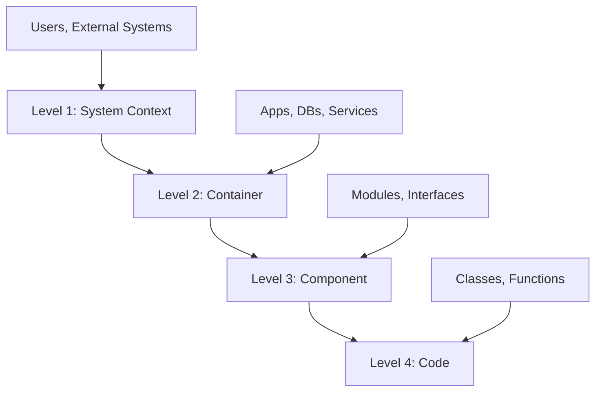

# Architecture Design Prompts

> AI prompts for drafting software architecture documentation that must be checked against code, configuration, and runtime evidence

## Prompt safety and evidence contract

- AI output is a proposal, not evidence that a component, dependency, control, or data flow exists.
- Supply repository paths, deployment topology, constraints, quality attributes, threat model, and known unknowns. Require the response to label fact, inference, option, and unresolved question.
- Do not ask for every C4 level by default. Select the smallest views needed by the decision and name the audience and maintenance owner.
- A draft is complete only after identifiers, boundaries, failure paths and operational claims are traced to source/config/runtime evidence and unsupported claims are removed.

---

## Overview

This document provides structured prompts for drafting architecture views with AI assistants. The prompts organize investigation; they do not replace repository exploration or design review.

---

## Core Principles

### C4 Model Levels



### Diátaxis Framework

| Quadrant | Purpose | Focus |
|----------|---------|-------|
| **Tutorial** | Learning | Step-by-step guide |
| **How-to** | Problem solving | Goal-oriented |
| **Reference** | Information lookup | Complete, accurate |
| **Explanation** | Understanding | Context, reasoning |

---

## Master Prompt Template

### AI Persona Definition

```markdown
You are a **Senior Software Architect and Technical Writer AI**. 
Your mission is to generate clear, comprehensive, accurate, and 
developer-friendly documentation based on provided information.

Key responsibilities:
- Follow software documentation best practices
- Maintain consistent terminology
- Use appropriate detail level for target audience
- Structure information logically
```

### Task Sequence

#### Task 1: Project Context (C4 Level 1)

```markdown
Document the following about the software system:

1. System name and primary purpose
2. Main problem solved / business requirements met
3. Primary users/actors interacting with the system
4. External systems and interaction nature
5. System context diagram description
```

#### Task 2: Container Architecture (C4 Level 2)

```markdown
For each major 'container', document:

1. Name and brief description
2. Technology choices (e.g., Spring Boot, React, PostgreSQL)
3. Main responsibilities
4. Interactions with other containers/external systems
5. Container diagram description
```

#### Task 3: Component Details (C4 Level 3)

```markdown
For each significant container, describe internal 'components':

1. Name and brief description
2. Main responsibilities/functions
3. Key interfaces exposed/consumed
4. Direct interactions with other components
5. Component diagram description (if applicable)
```

#### Task 4: Workflow Documentation

```markdown
For each critical workflow/user story:

1. Trigger/starting point
2. Sequence of steps
3. Containers and components involved
4. Data flow and transformations
5. Critical dependencies and failure points
6. Sequence/activity diagram description
```

#### Task 5: API Specification

```markdown
For each service/API, document:

**Basic Structure:**
- Base URL/endpoint structure
- Authentication mechanism (OAuth 2.0, API keys, etc.)

**For each endpoint:**
- HTTP method
- Purpose/description
- Request parameters (path, query, header, body)
- Sample request body
- Response structure (success and error)
- Error codes and meanings
```

---

## Output Quality Guidelines

### Do's

- Use clear, unambiguous language
- Maintain consistent terminology
- Structure information logically
- Be comprehensive yet concise
- Provide practical examples

### Don'ts

- Use undefined jargon
- Make assumptions about missing information
- Be overly verbose or redundant
- Include unverified information
- Skip important edge cases

---

## Example: API Documentation Format

```markdown
**POST /api/v1/users**
*Description:* Creates a new user account.

*Request Body (application/json):*
```json
{
  "username": "string (required, 3-20 chars)",
  "email": "string (email format, required)",
  "password": "string (min 8 chars, required)"
}
```

*Success Response (201 Created):*
```json
{
  "userId": "uuid",
  "username": "string",
  "createdAt": "timestamp"
}
```

*Error Responses:*
- 400 Bad Request: Invalid input data
- 409 Conflict: Username/email already exists
```

---

## Clarification Request Format

When information is missing or ambiguous:

```markdown
[CLARIFICATION_NEEDED:
- Specific database schema details
- Authentication method for external API
- Error handling strategy for failed transactions
]
```

---

## References

- [C4 Model](https://c4model.com/)
- [Diátaxis Framework](https://diataxis.fr/)
- [Arc42 Template](https://arc42.org/)
