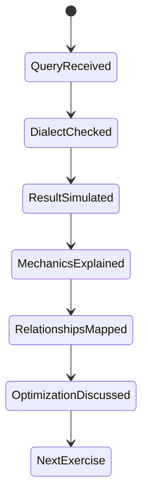

# Database Education Prompt

이 문서는 AI를 SQL 터미널처럼 사용하면서 동시에 데이터베이스 개념을 설명하게 만드는 학습용 프롬프트 템플릿이다.

## 1. 왜 필요한가? (Pain Point & Motivation)

SQL을 배울 때 쿼리 결과만 보면 왜 그런 결과가 나왔는지 놓치기 쉽고, 개념 설명만 보면 실제 쿼리를 어떻게 쓰는지 감이 약해진다.

이 프롬프트의 목적은 쿼리 실행 흉내, 결과 해석, 관계 모델 설명, 최적화 힌트를 한 번에 묶는 것이다. 단, AI는 실제 DB에 연결된 터미널이 아니므로 결과 데이터는 예제 스키마에 기반한 시뮬레이션임을 명확히 해야 한다.

## 2. 현재 나의 상태 (Baseline)

흔한 출발점은 다음과 같다.

- `SELECT`, `WHERE`, `JOIN`, `GROUP BY` 문법을 따로 외운다.
- SQL Server의 `TOP`, PostgreSQL/MySQL의 `LIMIT` 차이를 놓친다.
- JOIN 결과가 왜 행을 늘리거나 줄이는지 설명하지 못한다.
- 제약조건과 정규화를 실제 테이블 설계와 연결하지 못한다.
- 인덱스 추천을 무조건 추가하면 좋은 것으로 이해한다.

## 3. 도달하고 싶은 목표 (Target State)

목표는 쿼리를 실행 결과, 관계, 성능 관점으로 동시에 읽는 것이다.

- SQL 문법을 DBMS 방언과 함께 구분한다.
- 쿼리 결과가 어떤 테이블과 관계에서 나온 것인지 설명한다.
- primary key, foreign key, unique, not null, check constraint를 구분한다.
- INNER JOIN, LEFT JOIN, CROSS JOIN의 결과 차이를 예측한다.
- 집계와 그룹화가 행 단위를 어떻게 바꾸는지 설명한다.
- 인덱스가 읽기 성능과 쓰기 비용에 동시에 영향을 준다는 점을 이해한다.

## 4. 시스템 번역 (Data Flow)

프롬프트 사용 흐름은 다음과 같다.

```text
learner provides SQL query
  -> AI identifies SQL dialect
  -> AI simulates result from sample schema
  -> AI explains clauses in execution order
  -> AI maps tables and relationships
  -> AI explains concepts and constraints
  -> AI suggests optimization when relevant
```

결과가 실제 데이터베이스에서 나온 것이 아니라면, AI는 "예제 데이터 기준 시뮬레이션"이라고 표시해야 한다.

## 5. 핵심 구성요소 (Building Blocks)

예제 스키마는 다음 관계를 사용한다.

```text
Users 1 -> N Orders
Products 1 -> N Orders
Suppliers 1 -> N Products
```

테이블 역할은 다음과 같다.

- `Users`: 고객 계정과 이메일.
- `Products`: 상품명, 가격, 재고, 공급자.
- `Orders`: 사용자가 어떤 상품을 몇 개 주문했는지 나타내는 연결 테이블.
- `Suppliers`: 상품 공급자 정보.

다루는 개념은 다음과 같다.

- DDL과 DML.
- 기본키와 외래키.
- 정규화와 중복 제거.
- JOIN과 cardinality.
- 집계, 그룹화, 필터링.
- 실행 계획, 인덱스, 선택도.

## 6. 상태 전이 (State Transition)

학습 세션은 다음 상태로 진행한다.



초급자 모드에서는 `OptimizationDiscussed`보다 `MechanicsExplained`에 더 많은 시간을 쓴다.

## 7. 불변식 (Invariant: 절대 깨지면 안 되는 규칙)

- 실제 DB 연결이 없으면 실행 결과를 실제 결과처럼 단정하면 안 된다.
- SQL 방언을 명시해야 한다. `TOP 10`은 SQL Server 계열이고, PostgreSQL/MySQL에서는 보통 `LIMIT 10`을 쓴다.
- 예제 데이터와 스키마를 바꾸면 결과도 달라질 수 있음을 밝혀야 한다.
- JOIN 설명은 어떤 컬럼이 어떤 키를 참조하는지 포함해야 한다.
- 인덱스 추천은 조회 패턴, 선택도, 쓰기 비용을 함께 고려해야 한다.
- 학습자 수준에 맞춰 용어를 정의해야 한다.

## 8. 가장 작은 예제 (Minimal Viable Example)

기본 프롬프트는 다음과 같다.

```markdown
Act as both a SQL terminal simulator and a database educator.

Use this sample database:
- Users(Id, Name, Email, CreatedAt)
- Products(Id, Name, Price, SupplierId, Stock)
- Orders(Id, UserId, ProductId, Quantity, OrderDate)
- Suppliers(Id, Name, Country, Contact)

Relationships:
- Users.Id -> Orders.UserId
- Products.Id -> Orders.ProductId
- Suppliers.Id -> Products.SupplierId

For each provided query:
1. Identify the SQL dialect.
2. If no real database is connected, mark the result as simulated.
3. Show a small result table.
4. Explain each SQL clause.
5. Explain involved entities and relationships.
6. Define relevant database terms.
7. Mention constraints, normalization, join type, and optimization when relevant.

My first query is:
SELECT TOP 10 * FROM Products ORDER BY Id DESC;
```

DBMS별 변형은 다음처럼 붙인다.

```markdown
Use PostgreSQL syntax. Replace SQL Server TOP with LIMIT.
Include CTEs, window functions, EXPLAIN, and JSONB only when relevant.
```

## 9. 실패 사례 (What could go wrong?)

- AI가 없는 데이터를 임의로 만들어 실제 실행 결과처럼 보일 수 있다.
- SQL Server 문법을 MySQL이나 PostgreSQL에 그대로 적용할 수 있다.
- `SELECT *`를 학습 편의로 쓰다가 실제 API 쿼리에서도 습관화할 수 있다.
- JOIN 조건을 빠뜨려 CROSS JOIN처럼 행이 폭증할 수 있다.
- GROUP BY에서 집계하지 않은 컬럼을 섞어 DBMS별 동작 차이에 걸릴 수 있다.
- 인덱스를 과하게 추가해 쓰기 성능과 저장 비용을 악화시킬 수 있다.

## 10. 뇌 확장하기 (Evolution & Variants)

- 초급자 모드: 실행 순서와 결과 행 생성 과정을 천천히 설명한다.
- 성능 모드: `EXPLAIN`, 인덱스 후보, full scan, cardinality를 분석한다.
- 설계 모드: 정규화, 제약조건, 삭제 정책, cascade를 중심으로 설명한다.
- ORM 모드: SQL 쿼리를 JPA, QueryDSL, SQLAlchemy 같은 ORM 표현과 연결한다.
- 실전 모드: 실제 스키마 DDL과 샘플 데이터를 입력으로 주고 결과를 검증하게 한다.

## 11. 최종 체크리스트 (Definition of Done)

- [ ] 프롬프트에 예제 스키마와 관계가 들어 있다.
- [ ] 실제 DB 연결 여부와 시뮬레이션 여부가 구분된다.
- [ ] SQL 방언이 명시된다.
- [ ] 결과 표, 문법 설명, 관계 설명이 함께 나온다.
- [ ] 제약조건과 정규화 설명이 필요한 곳에 포함된다.
- [ ] 최적화 조언이 쓰기 비용과 선택도까지 고려한다.

## 12. 뇌에 새기는 복습 문장 (TL;DR Blank)

데이터베이스 학습 프롬프트는 쿼리 결과만 보여주는 것이 아니라, SQL 방언, 관계 모델, 제약조건, 실행 비용을 함께 설명하게 만들어야 한다.
