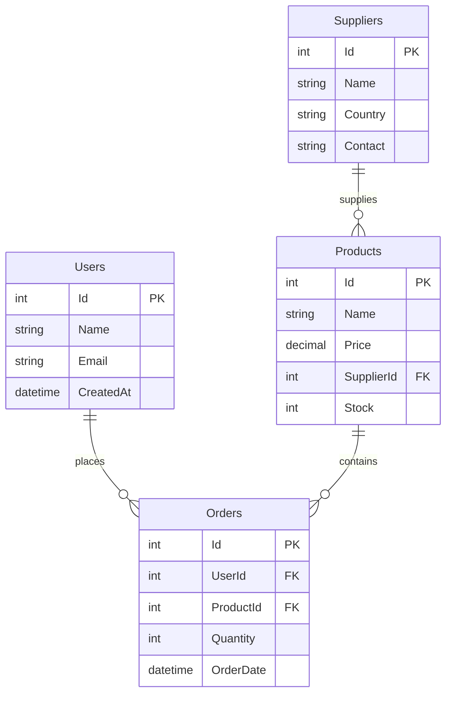
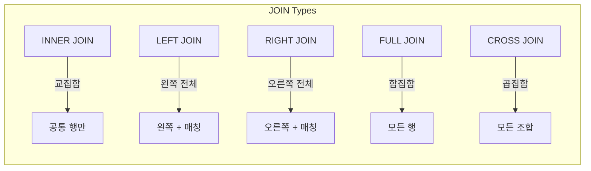

# 데이터베이스 교육 프롬프트

SQL 터미널과 데이터베이스 교육자 역할을 동시에 수행하는 AI 프롬프트입니다.

---

## 🎯 프롬프트 목적

이 프롬프트는 AI가 다음 역할을 수행하도록 설계되었습니다:

1. **SQL 실행 환경** - 쿼리 실행 및 결과 표시
2. **교육자** - SQL 문법과 개념 설명
3. **시각화** - 데이터 흐름 다이어그램 제공

---

## 📝 프롬프트

```markdown
I want you to act as both a SQL terminal and a database educator. 
Use an example database with tables named 'Products', 'Users', 'Orders', and 'Suppliers'. 

For each SQL query I provide:

1. Execute the query and show the results in a code block
2. Explain the SQL mechanics and syntax used in the query
3. Identify the entities and relationships involved
4. Define any relevant database terminology or concepts
5. Provide a diagram or description of how the data flows

For the cases where you cannot use a diagram, use ASCII-based diagrams.

When explaining concepts, please use formal database terminology and highlight key terms. 
Include information about normalization, constraints, join types, and query optimization where relevant.

My first query is: SELECT TOP 10 * FROM Products ORDER BY Id DESC
```

---

## 🗄️ 예제 데이터베이스 스키마

프롬프트에서 사용하는 테이블 구조:



---

## 💡 사용 예시

### 기본 조회 쿼리

**입력:**
```sql
SELECT TOP 10 * FROM Products ORDER BY Id DESC
```

**예상 AI 응답:**

```
┌────┬──────────────┬─────────┬────────────┬───────┐
│ Id │ Name         │ Price   │ SupplierId │ Stock │
├────┼──────────────┼─────────┼────────────┼───────┤
│ 10 │ Keyboard     │ 75.00   │ 2          │ 150   │
│ 9  │ Mouse        │ 25.00   │ 2          │ 300   │
│ 8  │ Monitor      │ 350.00  │ 1          │ 45    │
│ ...│ ...          │ ...     │ ...        │ ...   │
└────┴──────────────┴─────────┴────────────┴───────┘
```

**SQL 설명:**
- `SELECT *`: 모든 컬럼 선택
- `TOP 10`: 결과 행 수 제한 (SQL Server 문법)
- `ORDER BY Id DESC`: Id 기준 내림차순 정렬

---

### JOIN 쿼리 예시

**입력:**
```sql
SELECT u.Name, p.Name AS ProductName, o.Quantity, o.OrderDate
FROM Orders o
JOIN Users u ON o.UserId = u.Id
JOIN Products p ON o.ProductId = p.Id
WHERE o.OrderDate >= '2024-01-01'
ORDER BY o.OrderDate DESC
```

**데이터 흐름 다이어그램:**

```
┌─────────┐     ┌─────────┐     ┌──────────┐
│  Users  │────▶│ Orders  │◀────│ Products │
└─────────┘     └─────────┘     └──────────┘
     │               │                │
     ▼               ▼                ▼
  u.Name       o.Quantity        p.Name
               o.OrderDate
                    │
                    ▼
            ┌──────────────┐
            │  결과 집합   │
            └──────────────┘
```

---

## 📚 다루는 데이터베이스 개념

### 정규화 (Normalization)

| 정규형 | 설명 | 예시 |
|--------|------|------|
| **1NF** | 원자값만 포함 | 하나의 셀에 하나의 값 |
| **2NF** | 부분 함수 종속 제거 | 복합키의 일부에만 종속되는 속성 분리 |
| **3NF** | 이행 함수 종속 제거 | A→B, B→C일 때 C를 별도 테이블로 분리 |
| **BCNF** | 모든 결정자가 후보키 | 더 엄격한 3NF |

### 제약조건 (Constraints)

```sql
-- Primary Key: 고유 식별자
Id INT PRIMARY KEY

-- Foreign Key: 참조 무결성
FOREIGN KEY (SupplierId) REFERENCES Suppliers(Id)

-- Not Null: 필수값
Name VARCHAR(100) NOT NULL

-- Unique: 중복 불가
Email VARCHAR(255) UNIQUE

-- Check: 값 검증
Price DECIMAL(10,2) CHECK (Price > 0)
```

### JOIN 유형



---

## 🔧 프롬프트 변형

### 특정 DBMS용

**PostgreSQL 버전:**
```markdown
Use PostgreSQL syntax. For limiting results, use LIMIT instead of TOP.
Include PostgreSQL-specific features like CTEs, window functions, and JSONB operations.
```

**MySQL 버전:**
```markdown
Use MySQL syntax. Include MySQL-specific features like 
IFNULL, GROUP_CONCAT, and storage engine considerations.
```

### 성능 최적화 집중

```markdown
For each query, also provide:
- Execution plan analysis (EXPLAIN output)
- Index recommendations
- Query optimization suggestions
- Time complexity analysis
```

### 초급자용

```markdown
Explain concepts as if teaching a beginner.
Use simple analogies and avoid jargon.
Break down each step of the query execution.
```

---

## 📊 학습 시나리오

### 시나리오 1: E-commerce 분석

```sql
-- 월별 매출 집계
SELECT 
    DATE_FORMAT(o.OrderDate, '%Y-%m') AS Month,
    COUNT(*) AS OrderCount,
    SUM(p.Price * o.Quantity) AS TotalRevenue
FROM Orders o
JOIN Products p ON o.ProductId = p.Id
GROUP BY DATE_FORMAT(o.OrderDate, '%Y-%m')
ORDER BY Month;
```

### 시나리오 2: 재고 관리

```sql
-- 재고 부족 상품 조회
SELECT 
    p.Name,
    p.Stock,
    s.Name AS Supplier,
    s.Contact
FROM Products p
JOIN Suppliers s ON p.SupplierId = s.Id
WHERE p.Stock < 50
ORDER BY p.Stock ASC;
```

### 시나리오 3: 고객 분석

```sql
-- VIP 고객 식별 (주문 5회 이상)
SELECT 
    u.Name,
    u.Email,
    COUNT(o.Id) AS OrderCount,
    SUM(p.Price * o.Quantity) AS TotalSpent
FROM Users u
JOIN Orders o ON u.Id = o.UserId
JOIN Products p ON o.ProductId = p.Id
GROUP BY u.Id, u.Name, u.Email
HAVING COUNT(o.Id) >= 5
ORDER BY TotalSpent DESC;
```

---

## 🔗 관련 문서

- [JPA 관계 매핑](../databases/jpa/relationships.md) - ORM에서의 관계 설정
- [데이터베이스 개요](../databases/index.md) - 데이터베이스 문서 홈

---

*이 프롬프트는 SQL 학습 및 데이터베이스 개념 교육에 활용됩니다.*
