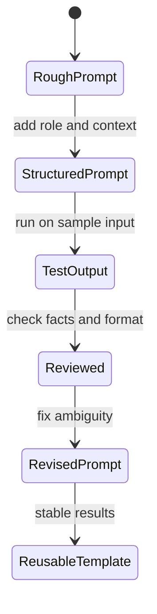

# Prompts

이 영역은 AI에게 문서 작성, 아키텍처 정리, 데이터베이스 학습 같은 작업을 맡길 때 사용하는 프롬프트와 검증 기준을 모은다.

## 1. 왜 필요한가? (Pain Point & Motivation)

AI 프롬프트는 짧게 쓸수록 빠르지만, 결과가 추측과 일반론으로 채워질 위험이 커진다. 특히 기술 문서, 아키텍처, 데이터베이스 설명은 실제 근거와 누락 정보 처리가 중요하다.

프롬프트 문서의 목적은 "좋은 답변을 유도하는 문장"보다 "검증 가능한 작업 계약"을 만드는 것이다.

## 2. 현재 나의 상태 (Baseline)

현재 프롬프트 문서는 다음 파일로 구성된다.

- [Documentation Editor](docs-editor.md): 기술 문서를 작성하고 유지보수할 때의 편집 기준.
- [Architecture Design Prompts](architecture.md): C4 수준, workflow, API, 실패 지점을 문서화하는 프롬프트.
- [Database Education Prompt](database.md): SQL 터미널 시뮬레이션과 DB 개념 설명을 결합한 학습 프롬프트.

## 3. 도달하고 싶은 목표 (Target State)

좋은 프롬프트는 다음 조건을 만족해야 한다.

- 역할, 입력, 제약, 출력 형식을 분명히 한다.
- 확인된 사실과 추정을 분리하게 한다.
- 누락된 정보는 질문으로 돌려받게 한다.
- 출력이 바로 검토 가능한 구조를 가진다.
- 실패 사례와 edge case를 포함하게 한다.
- 같은 작업에 반복해서 재사용할 수 있다.

## 4. 시스템 번역 (Data Flow)

프롬프트 사용 흐름은 다음과 같다.

```text
define task
  -> collect facts and constraints
  -> choose prompt template
  -> fill context and output format
  -> generate draft
  -> verify against source material
  -> revise prompt or output
```

AI 출력은 초안이다. 최종 문서로 쓰기 전에는 실제 코드, 설정, 데이터, 공식 문서와 맞는지 검토해야 한다.

## 5. 핵심 구성요소 (Building Blocks)

- Role: AI가 어떤 관점으로 답해야 하는지.
- Context: 시스템, 독자, 현재 상태, 입력 자료.
- Task: 이번 요청에서 실제로 해야 하는 일.
- Constraints: 사용하면 안 되는 가정, 형식, 범위, 보안 제한.
- Output format: 제목, 표, 체크리스트, 코드 블록, 다이어그램 등 산출물 모양.
- Evidence policy: 확인된 사실과 추정을 구분하는 규칙.
- Clarification policy: 모르는 정보를 질문으로 남기는 규칙.
- Review loop: 결과를 검증하고 다시 요청하는 반복 절차.

## 6. 상태 전이 (State Transition)

프롬프트는 한 번에 완성되는 문장이 아니라 반복적으로 개선되는 도구다.



결과가 기대와 다르면 AI 답변만 고치기보다 프롬프트의 입력, 제약, 출력 형식을 함께 수정한다.

## 7. 불변식 (Invariant: 절대 깨지면 안 되는 규칙)

- AI에게 없는 사실을 만들라고 유도하면 안 된다.
- 소스가 필요한 작업은 출처나 입력 자료를 명시해야 한다.
- 민감 정보, 비밀키, 개인정보를 프롬프트에 그대로 넣으면 안 된다.
- 출력 형식은 검토자가 빠르게 확인할 수 있어야 한다.
- 기술 문서는 모르는 내용을 단정하지 않게 해야 한다.
- 프롬프트 자체도 실제 사용 후 개선되어야 한다.

## 8. 가장 작은 예제 (Minimal Viable Example)

기본 구조는 다음과 같다.

```markdown
Role:
Precise technical documentation assistant.

Context:
Use only the facts below.

Task:
Rewrite the provided notes into a concise technical document.

Constraints:
- Do not invent missing details.
- Mark unknowns as [CLARIFICATION_NEEDED].
- Preserve verified commands and paths.

Output Format:
- Summary
- Data flow
- Failure cases
- Checklist
```

이 구조만 있어도 역할, 근거, 범위, 산출물 형식이 생긴다.

## 9. 실패 사례 (What could go wrong?)

- 프롬프트가 역할만 있고 입력 근거가 없으면 일반론이 나온다.
- 출력 형식을 지정하지 않으면 매번 다른 모양의 문서가 나온다.
- 모르는 정보 처리 규칙이 없으면 AI가 추측으로 빈칸을 채운다.
- 예시가 너무 강하면 실제 입력보다 예시 형식을 과하게 따라간다.
- 프롬프트에 민감 정보를 넣으면 이후 로그나 기록에 남을 수 있다.
- 검증 루프가 없으면 틀린 결과가 문서로 고정된다.

## 10. 뇌 확장하기 (Evolution & Variants)

- 문서 작성 프롬프트와 코드 리뷰 프롬프트를 분리한다.
- 아키텍처 문서는 C4, ADR, threat model, production readiness로 나눠 요청한다.
- 데이터베이스 프롬프트는 학습용, 설계용, 성능 분석용으로 나눈다.
- 반복 사용되는 프롬프트에는 입력 예시와 나쁜 출력 예시를 함께 둔다.
- 팀에서 쓰는 프롬프트는 버전과 변경 이유를 기록한다.

## 11. 최종 체크리스트 (Definition of Done)

- [ ] 역할, 맥락, 작업, 제약, 출력 형식이 들어 있다.
- [ ] 확인된 사실과 추정을 분리하게 되어 있다.
- [ ] 누락 정보 처리 방식이 명시되어 있다.
- [ ] 민감 정보 입력 금지 원칙이 있다.
- [ ] 예시와 실제 작업 범위가 충돌하지 않는다.
- [ ] 결과를 검증하고 프롬프트를 개선하는 루프가 있다.

## 12. 뇌에 새기는 복습 문장 (TL;DR Blank)

좋은 프롬프트는 AI에게 답변을 부탁하는 문장이 아니라, 입력 근거와 제약과 검증 가능한 출력 형식을 정한 작업 계약이다.
