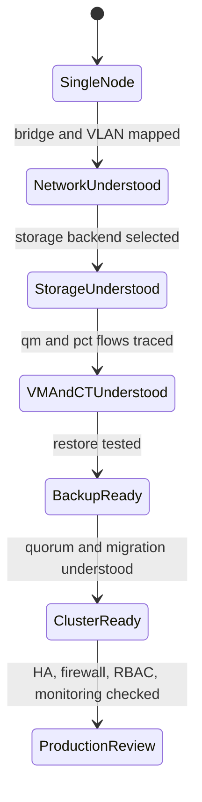

# Proxmox VE Guide

이 문서 모음은 Proxmox VE를 단순한 관리 화면이 아니라 클러스터 파일시스템, 네트워크, 스토리지, 가상화, HA, 백업, 권한, Ceph로 구성된 운영 플랫폼으로 이해하기 위한 학습 지도다.

## 1. 왜 필요한가? (Pain Point & Motivation)

Proxmox VE는 Web UI만으로도 VM과 컨테이너를 만들 수 있지만, 운영 중 문제가 생기면 GUI 버튼 이름만으로는 원인을 찾기 어렵다. 네트워크 설정은 Linux bridge와 VLAN을 거치고, VM 설정은 `/etc/pve`와 pmxcfs를 거치며, 스토리지는 `pvesm`과 백엔드 도구가 함께 움직인다.

이 인덱스의 목적은 각 모듈이 어떤 운영 문제를 설명하는지 연결해 주는 것이다. 먼저 구조를 잡고, 그 다음 명령어를 익히는 순서가 안전하다.

## 2. 현재 나의 상태 (Baseline)

흔한 출발점은 다음과 같다.

- VM 생성과 시작은 할 수 있지만 내부에서 어떤 QEMU 프로세스가 뜨는지 모른다.
- `/etc/pve`가 일반 디렉터리라고 생각한다.
- `vmbr`, VLAN tag, bond, SDN zone의 관계가 헷갈린다.
- `local`, `local-lvm`, ZFS, NFS, Ceph RBD의 차이를 이름으로만 안다.
- 스냅샷, 백업, 템플릿을 같은 되돌리기 기능으로 본다.
- HA를 설정하면 자동으로 모든 장애가 해결된다고 기대한다.

## 3. 도달하고 싶은 목표 (Target State)

목표는 Proxmox VE를 운영 경계별로 설명하는 것이다.

- pmxcfs, Corosync, quorum, `/etc/pve`의 관계를 설명한다.
- Linux bridge, VLAN, bond, SDN의 데이터 흐름을 추적한다.
- Directory, LVM-thin, ZFS, NFS, Ceph RBD의 선택 기준을 말한다.
- QEMU/KVM VM과 LXC 컨테이너의 격리 경계를 구분한다.
- 백업과 스냅샷의 목적과 실패 조건을 구분한다.
- 권한, 방화벽, HA, Ceph 같은 운영 기능을 안전 조건과 함께 검토한다.

## 4. 시스템 번역 (Data Flow)

Proxmox VE의 기본 운영 흐름은 다음과 같다.

```text
admin action in Web UI or CLI
  -> REST API or command wrapper
  -> permission check
  -> config write under /etc/pve
  -> pmxcfs replicates config through cluster
  -> daemon applies change
  -> Linux, QEMU, LXC, storage, or network backend changes runtime state
```

문제를 분석할 때는 "GUI에서 무엇을 눌렀는가"보다 "어떤 설정 파일과 어떤 데몬, 어떤 커널 기능이 바뀌었는가"를 따라간다.

## 5. 핵심 구성요소 (Building Blocks)

학습 모듈은 다음 순서로 읽는다.

- [Module 1: Core Architecture](module1-core-architecture.md): pmxcfs, Corosync, quorum, 주요 데몬, API 구조.
- [Module 2: Network and SDN](module2-network-sdn.md): Linux bridge, VLAN, bonding, SDN zone과 VNet.
- [Module 3: Storage Subsystem](module3-storage-subsystem.md): Directory, LVM-thin, ZFS, NFS, Ceph RBD, `pvesm`.
- [Module 4: Compute Virtualization](module4-compute-virtualization.md): QEMU/KVM, VirtIO, `qm`, LXC, `pct`.
- [Module 5: High Availability](module5-high-availability.md): quorum, fencing, HA group, failover.
- [Module 6: Backup and Restore](module6-backup-restore.md): `vzdump`, Proxmox Backup Server, restore, retention.
- [Module 7: Firewall](module7-firewall.md): Datacenter, host, VM/CT 방화벽 계층.
- [Module 8: User Management](module8-user-management.md): realm, RBAC, ACL, TFA, API token.
- [Module 9: Ceph Cluster](module9-ceph-cluster.md): MON, MGR, OSD, Pool, CRUSH, CephFS, RBD.
- [PVE Labs](pve-labs.md): 실습 흐름과 검증 체크리스트.
- [Troubleshooting](pve-troubleshooting.md): 장애 분석 루틴.
- [Cheatsheet](pve-cheatsheet.md): 자주 쓰는 명령어 빠른 참조.

## 6. 상태 전이 (State Transition)

운영 학습은 다음 단계로 진행한다.



실제 운영에서는 `BackupReady`를 `ClusterReady`보다 먼저 통과하는 것이 안전하다. 클러스터가 있어도 복원 테스트가 없으면 장애 대응 능력이 부족하다.

## 7. 불변식 (Invariant: 절대 깨지면 안 되는 규칙)

- `/etc/pve`는 클러스터 설정 저장소이므로 임의 편집 전에 quorum 상태와 백업을 확인해야 한다.
- 네트워크 변경은 관리 접속을 끊을 수 있으므로 out-of-band 접근 경로를 준비해야 한다.
- 스토리지 삭제, ZFS pool destroy, VM 디스크 unlink 같은 작업은 되돌릴 수 없을 수 있다.
- 스냅샷은 백업이 아니며 원본 스토리지 장애를 대신하지 못한다.
- HA는 공유 스토리지, quorum, fencing 조건 없이 기대한 대로 동작하지 않는다.
- 권한과 API token은 최소 권한 원칙으로 분리해야 한다.

## 8. 가장 작은 예제 (Minimal Viable Example)

최소 학습 루프는 다음과 같다.

```text
create a VM
  -> check generated config in /etc/pve
  -> inspect qm config
  -> confirm disk volume through pvesm
  -> confirm network bridge and tap interface
  -> install guest agent
  -> take a backup
  -> restore to a new VMID
```

이 루프를 한 번 통과하면 compute, storage, network, config, backup의 기본 연결을 모두 확인할 수 있다.

## 9. 실패 사례 (What could go wrong?)

- 네트워크 설정을 잘못 적용해 Web UI와 SSH 접속을 동시에 잃을 수 있다.
- 두 노드 클러스터에서 quorum을 오해하면 한 노드 장애 시 쓰기가 막힐 수 있다.
- 스냅샷을 장기 보관해 성능과 스토리지 사용량이 악화될 수 있다.
- VM과 CT를 같은 보안 경계로 보고 privileged container를 남용할 수 있다.
- 백업 파일은 있지만 복원 테스트가 없어 실제 장애 때 복구가 실패할 수 있다.
- Ceph나 HA를 기능만 보고 도입하면 네트워크와 quorum 설계 부족으로 더 큰 장애면이 생긴다.

## 10. 뇌 확장하기 (Evolution & Variants)

- 단일 노드 홈랩과 다중 노드 운영 클러스터의 요구사항을 분리한다.
- PBS를 연결해 증분 백업, 보존 정책, 복원 테스트를 운영 루틴으로 만든다.
- 관리망, 스토리지망, VM 서비스망, 클러스터망을 물리/논리적으로 분리한다.
- Ceph 도입 전 replica 수, failure domain, 네트워크 대역폭, OSD 장애 복구 시간을 계산한다.
- API token과 Terraform, Ansible 같은 자동화 도구를 최소 권한으로 연결한다.

## 11. 최종 체크리스트 (Definition of Done)

- [ ] `/etc/pve`, pmxcfs, quorum 관계를 설명할 수 있다.
- [ ] VM 생성 후 설정 파일, 디스크 볼륨, 네트워크 인터페이스를 확인할 수 있다.
- [ ] 스토리지 타입별로 snapshot, backup, shared 여부를 구분할 수 있다.
- [ ] 백업을 새 VMID로 복원해 본 적이 있다.
- [ ] 네트워크 변경 전 복구 접속 경로를 확보한다.
- [ ] HA, 방화벽, 권한, API token은 운영 전 별도 검토한다.

## 12. 뇌에 새기는 복습 문장 (TL;DR Blank)

Proxmox VE 운영은 GUI 조작을 외우는 일이 아니라, `/etc/pve` 설정과 Linux/QEMU/LXC/스토리지/네트워크 백엔드가 어떻게 연결되는지 추적하는 일이다.
