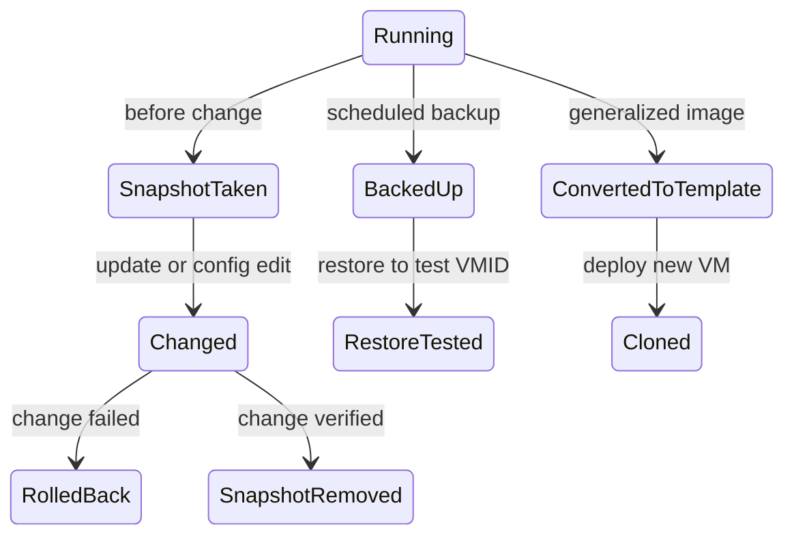

# Proxmox Snapshots, Backups, and Templates

Proxmox VE에서 스냅샷, 백업, 템플릿은 모두 "이전 상태를 활용한다"는 점에서 비슷해 보이지만 목적과 실패 조건이 다르다.

## 1. 왜 필요한가? (Pain Point & Motivation)

운영 중에는 되돌리고 싶은 순간이 자주 생긴다. 패키지 업데이트, 방화벽 변경, 애플리케이션 배포, 커널 설정 실험처럼 작은 작업도 VM이나 컨테이너를 망가뜨릴 수 있다.

하지만 모든 되돌리기 도구를 백업처럼 생각하면 위험하다. 스냅샷은 빠른 롤백 지점이고, 백업은 원본 장애에 대비한 복구 자산이며, 템플릿은 반복 배포를 줄이는 원본 이미지다.

## 2. 현재 나의 상태 (Baseline)

흔한 출발점은 다음과 같다.

- 스냅샷이 있으니 백업이 필요 없다고 생각한다.
- 백업 파일을 원본 VM과 같은 디스크에만 보관한다.
- 템플릿을 켜서 수정하려고 한다.
- linked clone과 full clone의 차이를 모르고 선택한다.
- 복원 테스트 없이 백업 작업 성공만 확인한다.

## 3. 도달하고 싶은 목표 (Target State)

목표는 세 도구를 상황에 맞게 구분해서 쓰는 것이다.

- 설정 변경 전에는 짧은 수명의 스냅샷을 만든다.
- 하드웨어 장애와 랜섬웨어에 대비해 별도 저장소에 백업한다.
- 반복 배포할 기본 OS와 패키지 상태는 템플릿으로 만든다.
- linked clone은 속도와 공간 절약, full clone은 독립성을 기준으로 선택한다.
- 백업은 정기적으로 복원 테스트를 한다.
- 스냅샷과 백업의 보존 정책을 분리한다.

## 4. 시스템 번역 (Data Flow)

스냅샷 흐름은 다음과 같다.

```text
before risky change
  -> create snapshot
  -> perform change
  -> verify service
  -> if failed, rollback
  -> if successful, remove snapshot
```

백업 흐름은 다음과 같다.

```text
scheduled backup
  -> create consistent archive or PBS snapshot
  -> store on separate backup storage
  -> apply retention policy
  -> periodically restore to test VMID
```

템플릿 흐름은 다음과 같다.

```text
install clean VM
  -> apply baseline packages and cloud-init
  -> remove machine-specific state
  -> convert to template
  -> clone when a new VM is needed
```

## 5. 핵심 구성요소 (Building Blocks)

- Snapshot: 특정 시점으로 되돌릴 수 있는 빠른 상태 지점. 원본 스토리지에 의존한다.
- Backup: 원본과 분리해 보관하는 복구 단위. 장애, 삭제, 손상에 대비한다.
- Template: 직접 실행하기보다 clone의 원본으로 쓰는 기준 이미지.
- Linked clone: 템플릿과 기반 데이터를 공유해 빠르게 생성되는 복제본.
- Full clone: 원본과 독립된 전체 복제본.
- Retention: 백업과 스냅샷을 얼마나 오래, 몇 개나 남길지 정하는 정책.
- Restore test: 백업이 실제로 복구 가능한지 확인하는 절차.

## 6. 상태 전이 (State Transition)

VM 보호 상태는 다음처럼 볼 수 있다.



스냅샷은 `SnapshotRemoved`까지 가는 임시 상태이고, 백업은 `RestoreTested`까지 가야 신뢰할 수 있다.

## 7. 불변식 (Invariant: 절대 깨지면 안 되는 규칙)

- 스냅샷은 백업이 아니다.
- 백업은 원본 스토리지와 같은 장애 도메인에만 있으면 안 된다.
- 백업은 복원 테스트 전까지 완성된 보호책으로 보지 않는다.
- 템플릿에는 호스트 고유 SSH key, machine-id, 임시 토큰 같은 식별 정보가 남으면 안 된다.
- linked clone은 템플릿과 기반 스토리지 의존성을 가진다.
- 스냅샷은 장기간 누적하지 말고 변경 검증 후 정리해야 한다.

## 8. 가장 작은 예제 (Minimal Viable Example)

패키지 업데이트 전 안전 루틴은 다음과 같다.

```text
create snapshot named before-upgrade
run package upgrade
reboot if required
check application health
if healthy, delete snapshot
if broken, rollback snapshot
```

백업 루틴은 별도로 둔다.

```text
nightly backup to PBS or external storage
keep daily and weekly retention
monthly restore test to a new VMID
document restore time and missing steps
```

## 9. 실패 사례 (What could go wrong?)

- 원본 디스크가 고장 나면 같은 스토리지의 스냅샷도 함께 사라진다.
- 스냅샷을 오래 유지하면 변경 추적과 스토리지 사용량 때문에 성능이 나빠질 수 있다.
- 백업이 성공했다고 표시되어도 복원 중 드라이버, 네트워크, 권한 문제가 드러날 수 있다.
- 백업 저장소가 항상 온라인이고 같은 인증 경계에 있으면 랜섬웨어나 실수 삭제에 함께 노출된다.
- linked clone 기반 템플릿을 잘못 삭제하거나 이동하면 복제본에 영향이 갈 수 있다.
- 템플릿 일반화가 부족하면 여러 VM이 같은 식별자나 SSH key를 공유할 수 있다.

## 10. 뇌 확장하기 (Evolution & Variants)

- Proxmox Backup Server를 사용해 중복 제거, 증분 백업, 검증, prune 정책을 운영화한다.
- 애플리케이션 일관성이 필요한 VM은 guest agent, fsfreeze, 데이터베이스 dump와 함께 백업한다.
- 3-2-1 백업 원칙을 적용해 서로 다른 매체와 오프사이트 복사본을 둔다.
- IaC와 cloud-init으로 템플릿 생성 과정을 재현 가능하게 만든다.
- 스냅샷, 백업, 복제, 고가용성을 각각 RPO/RTO 관점으로 비교한다.

## 11. 최종 체크리스트 (Definition of Done)

- [ ] 설정 변경 전 임시 스냅샷을 만들고 작업 후 삭제한다.
- [ ] 백업은 원본과 다른 장애 도메인에 저장한다.
- [ ] 백업 보존 정책과 스냅샷 보존 정책을 분리한다.
- [ ] 정기적으로 새 VMID에 복원 테스트를 한다.
- [ ] 템플릿은 machine-specific state를 제거한 뒤 만든다.
- [ ] linked clone과 full clone의 의존성 차이를 알고 선택한다.

## 12. 뇌에 새기는 복습 문장 (TL;DR Blank)

스냅샷은 빠른 작업 취소, 백업은 장애 복구, 템플릿은 반복 배포를 위한 도구이며 세 가지는 서로 대체물이 아니다.
