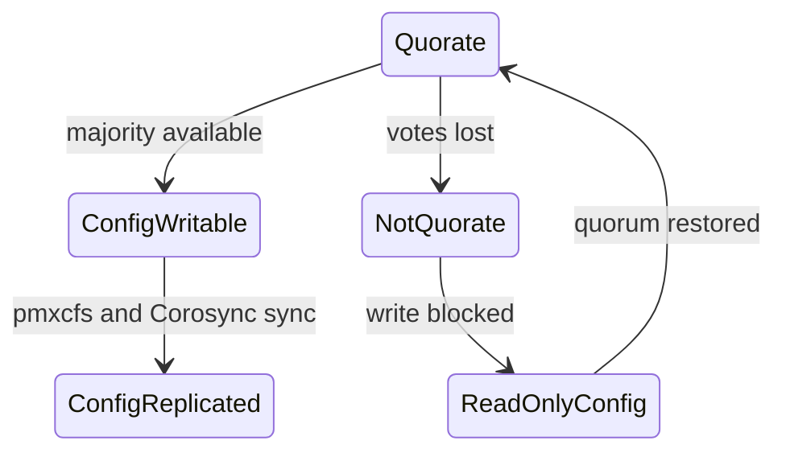

# Module 1: Proxmox VE Core Architecture

이 모듈은 Proxmox VE의 핵심 구조인 pmxcfs, Corosync, quorum, 주요 데몬, API 계층을 이해하기 위한 문서다.

## 1. 왜 필요한가? (Pain Point & Motivation)

Proxmox VE에서 VM 설정을 바꾸면 단순히 한 파일이 수정되는 것이 아니다. Web UI나 CLI 요청은 권한 검사를 거쳐 `/etc/pve` 아래 설정을 바꾸고, pmxcfs가 이 설정을 클러스터 전체에 복제하며, 관련 데몬이 런타임 상태를 반영한다.

이 구조를 모르면 `/etc/pve`가 읽기 전용이 되는 이유, 두 노드 클러스터에서 설정 변경이 막히는 이유, Web UI와 CLI가 같은 API 계층을 공유하는 이유를 설명하기 어렵다.

## 2. 현재 나의 상태 (Baseline)

흔한 출발점은 다음과 같다.

- `/etc/pve`를 일반 디렉터리로 생각한다.
- pmxcfs와 Corosync의 역할을 구분하지 못한다.
- quorum 손실이 왜 설정 쓰기를 막는지 모른다.
- `pveproxy`, `pvedaemon`, `pvestatd` 같은 데몬의 책임이 흐릿하다.
- GUI에서 한 작업이 어떤 API와 설정 파일을 바꾸는지 추적하지 못한다.

## 3. 도달하고 싶은 목표 (Target State)

목표는 Proxmox VE를 분산 설정 저장소를 가진 가상화 플랫폼으로 설명하는 것이다.

- pmxcfs가 `/etc/pve`를 제공하는 클러스터 파일시스템임을 설명한다.
- Corosync가 클러스터 멤버십과 통신을 담당한다는 점을 이해한다.
- quorum이 split-brain을 막기 위한 쓰기 안전 조건임을 설명한다.
- 주요 PVE 데몬의 역할을 구분한다.
- Web UI, CLI, REST API 요청이 설정 변경까지 이어지는 흐름을 추적한다.
- 단일 노드와 클러스터 운영의 위험 차이를 이해한다.

## 4. 시스템 번역 (Data Flow)

VM 설정 변경 흐름은 다음과 같다.

```text
Web UI or qm command
  -> pveproxy or CLI wrapper
  -> API permission check
  -> pvedaemon task
  -> write config under /etc/pve
  -> pmxcfs stores and replicates config
  -> affected daemon applies runtime change
```

클러스터 설정 복제 흐름은 다음과 같다.

```text
node writes /etc/pve config
  -> pmxcfs updates local database and memory cache
  -> Corosync distributes cluster change
  -> peer pmxcfs instances update their view
  -> all nodes see same config version
```

## 5. 핵심 구성요소 (Building Blocks)

- `/etc/pve`: Proxmox VE 클러스터 설정이 보이는 마운트 지점.
- pmxcfs: FUSE 기반 클러스터 파일시스템. 설정을 파일처럼 보이게 하며 클러스터에 복제한다.
- Corosync: 클러스터 통신, 멤버십, quorum 계산의 기반.
- Quorum: 클러스터가 안전하게 설정을 쓸 수 있는 최소 투표 조건.
- `pveproxy`: Web UI와 API 요청을 받는 프록시/API 진입점.
- `pvedaemon`: 권한 검증 후 실제 관리 작업을 실행하는 데몬.
- `pvestatd`: 노드, VM, 스토리지 상태를 주기적으로 수집한다.
- `pve-cluster`: pmxcfs를 제공하는 서비스.
- `pvesh`: REST API를 CLI에서 호출하는 도구.

## 6. 상태 전이 (State Transition)

클러스터 쓰기 가능 상태는 quorum에 따라 바뀐다.



`ReadOnlyConfig` 상태는 불편하지만 안전 장치다. 네트워크 분리 상황에서 양쪽 파티션이 동시에 설정을 쓰면 split-brain이 발생할 수 있다.

## 7. 불변식 (Invariant: 절대 깨지면 안 되는 규칙)

- `/etc/pve`의 설정은 quorum 없는 상태에서 임의로 강제 쓰기하면 안 된다.
- 클러스터 노드의 시간, 이름 해석, 네트워크 통신은 안정적으로 유지되어야 한다.
- 같은 VMID가 여러 노드에서 충돌하면 안 된다.
- `/etc/pve/priv` 아래 민감 파일은 root 권한으로만 보호되어야 한다.
- API 작업은 인증과 권한 검증을 통과해야 한다.
- Corosync 네트워크는 지연과 손실이 큰 일반 트래픽에 휘둘리지 않게 설계해야 한다.

## 8. 가장 작은 예제 (Minimal Viable Example)

VM 100의 CPU core 수를 변경한다고 가정한다.

```text
qm set 100 --cores 4
  -> API task is created
  -> /etc/pve/nodes/<node>/qemu-server/100.conf is locked and updated
  -> pmxcfs stores the new config
  -> other nodes see the same config through cluster replication
```

상태 확인은 다음 명령으로 시작할 수 있다.

```bash
pvecm status
systemctl status pve-cluster
ls -la /etc/pve
pvesh get /cluster/status
```

## 9. 실패 사례 (What could go wrong?)

- Corosync 네트워크가 불안정하면 quorum이 흔들리고 `/etc/pve` 쓰기가 막힌다.
- 두 노드 클러스터에서 QDevice 없이 한 노드가 사라지면 남은 노드가 quorum을 잃을 수 있다.
- `/etc/pve` 파일을 일반 로컬 파일처럼 복사하거나 강제 수정하면 클러스터 상태와 충돌할 수 있다.
- pveproxy는 살아 있지만 pvedaemon이나 pve-cluster가 비정상이면 UI 작업이 실패할 수 있다.
- API token에 과도한 권한을 주면 자동화 계정이 전체 클러스터를 변경할 수 있다.
- 노드 이름이나 인증서 상태가 꼬이면 Web UI와 클러스터 통신 문제가 함께 나타날 수 있다.

## 10. 뇌 확장하기 (Evolution & Variants)

- `pvesh`로 Web UI 작업과 같은 API 경로를 호출해 본다.
- `/etc/pve/.members`, `.vmlist`, `storage.cfg`, `user.cfg`를 읽어 설정 모델을 확인한다.
- 단일 노드, 2노드+QDevice, 3노드 클러스터의 quorum 조건을 비교한다.
- Corosync ring 분리와 관리망/스토리지망 분리 전략을 함께 검토한다.
- HA module을 읽기 전에 quorum과 fencing 조건을 먼저 확인한다.

## 11. 최종 체크리스트 (Definition of Done)

- [ ] `/etc/pve`가 pmxcfs로 제공된다는 점을 설명할 수 있다.
- [ ] pmxcfs와 Corosync의 역할을 구분할 수 있다.
- [ ] quorum 손실 시 설정 쓰기가 막히는 이유를 설명할 수 있다.
- [ ] `pveproxy`, `pvedaemon`, `pvestatd`, `pve-cluster` 역할을 말할 수 있다.
- [ ] `qm set` 같은 명령이 설정 파일 변경으로 이어지는 흐름을 추적할 수 있다.
- [ ] 클러스터 운영 전 Corosync 네트워크와 QDevice 필요성을 검토할 수 있다.

## 12. 뇌에 새기는 복습 문장 (TL;DR Blank)

Proxmox VE의 핵심은 `/etc/pve`를 pmxcfs로 클러스터에 복제하고, quorum으로 안전한 설정 쓰기 조건을 지키는 분산 가상화 관리 구조다.
