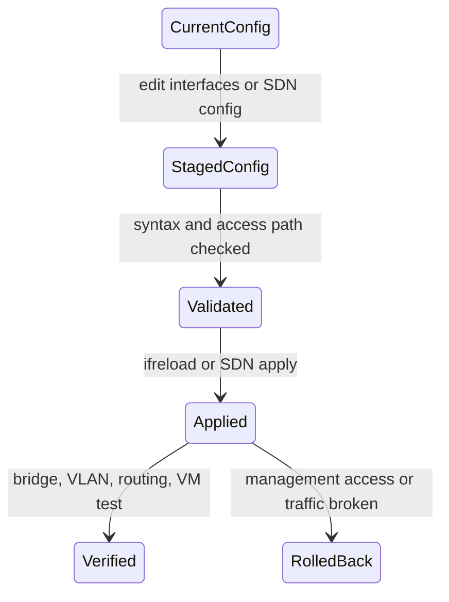

# Module 2: Proxmox VE Network and SDN

이 모듈은 Proxmox VE에서 VM/CT 트래픽이 Linux bridge, VLAN, bond, SDN 계층을 거쳐 물리 네트워크로 나가는 과정을 설명한다.

## 1. 왜 필요한가? (Pain Point & Motivation)

Proxmox VE 네트워크 문제는 VM 내부 IP 설정만 봐서는 해결되지 않는다. VM의 `net0`은 tap 또는 veth 인터페이스로 이어지고, 이 인터페이스는 `vmbr`에 붙으며, bridge는 물리 NIC, bond, VLAN, SDN VNet과 연결된다.

네트워크 변경은 관리 접속을 끊을 수 있는 고위험 작업이다. 따라서 구조, 적용 순서, 롤백 경로를 이해한 뒤 변경해야 한다.

## 2. 현재 나의 상태 (Baseline)

흔한 출발점은 다음과 같다.

- `vmbr0`를 물리 NIC라고 생각한다.
- VLAN tag를 Proxmox VM 설정과 스위치 포트 설정 중 어디에 넣어야 하는지 헷갈린다.
- bond가 항상 대역폭을 더해 준다고 생각한다.
- SDN의 Zone, VNet, Subnet, Controller 역할을 구분하지 못한다.
- 네트워크 설정 적용 전 관리 접속 복구 경로를 준비하지 않는다.

## 3. 도달하고 싶은 목표 (Target State)

목표는 Proxmox 네트워크를 계층별로 추적하는 것이다.

- VM tap/veth, Linux bridge, physical NIC의 연결을 설명한다.
- VLAN-aware bridge와 전용 VLAN interface 방식을 구분한다.
- bond mode별 목적과 스위치 요구사항을 설명한다.
- routed, bridged, NAT 모델의 차이를 말한다.
- SDN Zone과 VNet의 관계를 이해한다.
- 변경 전후에 `ip`, `bridge`, `ifreload`, `pvesh`로 상태를 확인할 수 있다.

## 4. 시스템 번역 (Data Flow)

기본 bridged VM 트래픽 흐름은 다음과 같다.

```text
guest eth0
  -> virtio-net device
  -> host tap interface
  -> vmbr0 Linux bridge
  -> physical NIC or bond
  -> physical switch
  -> network gateway or peer host
```

VLAN tag가 있는 VM은 다음 흐름을 따른다.

```text
VM net0 tag=10
  -> tap interface carries guest traffic
  -> vlan-aware bridge applies VLAN 10
  -> uplink sends tagged frame
  -> switch trunk allows VLAN 10
```

## 5. 핵심 구성요소 (Building Blocks)

- `vmbr`: Linux bridge. VM/CT와 물리 네트워크를 연결하는 L2 스위치 역할.
- tap interface: QEMU VM NIC가 호스트에 노출되는 인터페이스.
- veth pair: LXC 컨테이너와 호스트 네트워크 namespace를 연결하는 인터페이스.
- physical NIC: `eno1`, `enp3s0` 같은 실제 네트워크 장치.
- bond: 여러 NIC를 하나의 논리 인터페이스로 묶는 기능.
- VLAN-aware bridge: 하나의 bridge에서 여러 VLAN tag를 처리하는 방식.
- SDN Zone: SDN 네트워크의 기술적 도메인. Simple, VLAN, QinQ, VXLAN, EVPN 등이 있다.
- VNet: VM/CT가 붙는 SDN 가상 네트워크.
- Subnet: VNet 안에서 IP 대역과 gateway 같은 L3 정보를 표현한다.
- Controller: EVPN 같은 SDN 기능에서 제어 평면을 담당한다.

## 6. 상태 전이 (State Transition)

네트워크 변경은 다음 상태로 다룬다.



운영 환경에서는 `Validated` 전에 콘솔, IPMI, iDRAC, 로컬 접근 같은 복구 경로가 있어야 한다.

## 7. 불변식 (Invariant: 절대 깨지면 안 되는 규칙)

- Proxmox 호스트 관리 IP가 있는 bridge를 변경할 때는 out-of-band 접근 경로가 필요하다.
- VLAN-aware bridge를 쓸 때 물리 스위치 trunk는 필요한 VLAN을 허용해야 한다.
- LACP bond는 스위치 쪽 LACP 설정과 일치해야 한다.
- active-backup bond는 대역폭 증가보다 장애 복구 목적임을 구분해야 한다.
- bridge에 물리 NIC를 넣는 경우 보통 물리 NIC 자체에는 IP를 두지 않고 bridge에 IP를 둔다.
- firewall, SDN, VLAN 변경은 VM/CT 통신과 관리망을 각각 검증해야 한다.

## 8. 가장 작은 예제 (Minimal Viable Example)

가장 기본적인 bridged 설정은 다음처럼 생각한다.

```text
eno1 has no IP
vmbr0 has host management IP
vmbr0 bridge-ports eno1
VM net0 bridge=vmbr0
```

확인 명령은 다음과 같다.

```bash
ip link show
ip addr show vmbr0
bridge link show
bridge fdb show br vmbr0
qm config 100
```

VLAN-aware bridge에서는 VM 설정에 `tag=10` 같은 VLAN tag를 주고, 스위치 uplink는 trunk로 맞춘다.

## 9. 실패 사례 (What could go wrong?)

- 호스트 관리 IP를 물리 NIC와 bridge 양쪽에 동시에 두면 라우팅과 ARP가 꼬일 수 있다.
- VLAN tag를 VM과 OPNsense guest 내부 양쪽에 동시에 적용하면 의도와 다른 이중 태깅이 된다.
- 스위치 trunk에 VLAN을 허용하지 않으면 Proxmox 설정은 맞아도 트래픽이 통과하지 않는다.
- LACP 설정이 한쪽에만 있으면 링크가 up처럼 보여도 패킷 손실이 난다.
- `systemctl restart networking` 같은 거친 재시작은 원격 관리 접속을 끊을 수 있다.
- SDN 적용 후 local interface와 cluster config의 실제 상태를 확인하지 않으면 설정 drift를 놓친다.

## 10. 뇌 확장하기 (Evolution & Variants)

- management, VM service, storage, migration, Corosync 네트워크를 분리한다.
- 단일 uplink VLAN trunk와 여러 물리 NIC 분리 모델을 비교한다.
- VXLAN/EVPN은 단순 VLAN이 여러 호스트나 L3 경계를 넘어야 할 때 검토한다.
- Proxmox firewall과 Linux bridge filtering의 관계를 함께 확인한다.
- 패킷 캡처를 guest, tap, bridge, physical NIC 단계별로 수행해 트래픽 위치를 찾는다.

## 11. 최종 체크리스트 (Definition of Done)

- [ ] VM NIC에서 물리 스위치까지의 트래픽 경로를 설명할 수 있다.
- [ ] `vmbr`, tap, veth, bond, physical NIC의 역할을 구분할 수 있다.
- [ ] VLAN-aware bridge 설정과 스위치 trunk 요구사항을 설명할 수 있다.
- [ ] bond mode별 목적과 스위치 요구사항을 구분할 수 있다.
- [ ] 네트워크 변경 전 복구 접속 경로를 확보한다.
- [ ] 변경 후 bridge, VLAN, routing, VM 통신을 각각 검증한다.

## 12. 뇌에 새기는 복습 문장 (TL;DR Blank)

Proxmox 네트워크는 VM/CT 인터페이스가 Linux bridge와 VLAN/bond/SDN 계층을 거쳐 물리 스위치로 나가는 경로를 정확히 추적해야 안전하게 운영할 수 있다.
