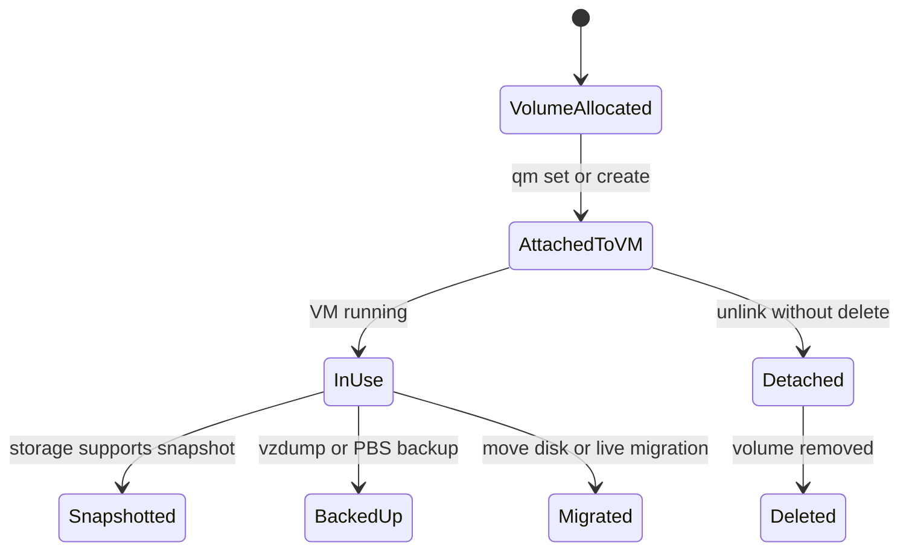

# Module 3: Proxmox VE Storage Subsystem

이 모듈은 Proxmox VE에서 VM/CT 디스크, ISO, 백업, 템플릿이 어떤 스토리지 백엔드에 저장되고 어떤 명령으로 관리되는지 설명한다.

## 1. 왜 필요한가? (Pain Point & Motivation)

가상화 환경의 성능과 복구 능력은 스토리지 선택에 크게 좌우된다. 같은 VM 디스크라도 Directory의 이미지 파일, LVM-thin의 thin volume, ZFS zvol, Ceph RBD는 성능, 스냅샷, 공유성, 복구 방식이 다르다.

스토리지를 이름만 보고 선택하면 나중에 live migration, snapshot, backup, thin provisioning, failure domain 요구사항과 충돌한다. 먼저 백엔드 특성을 이해하고 `pvesm`과 실제 백엔드 도구를 함께 관찰해야 한다.

## 2. 현재 나의 상태 (Baseline)

흔한 출발점은 다음과 같다.

- `local`과 `local-lvm`의 차이를 모른다.
- raw와 qcow2를 단순히 파일 확장자로만 이해한다.
- thin provisioning을 실제 공간이 무한한 것처럼 생각한다.
- ZFS snapshot과 Proxmox backup을 같은 보호 수단으로 본다.
- 공유 스토리지 없이 live migration을 기대한다.
- `pvesm status`와 `zfs list`, `lvs`, `rbd ls` 결과를 연결하지 못한다.

## 3. 도달하고 싶은 목표 (Target State)

목표는 워크로드 요구사항에 맞는 스토리지 백엔드를 고르는 것이다.

- Proxmox storage content type을 구분한다.
- Directory, LVM, LVM-thin, ZFS, NFS, iSCSI, Ceph RBD의 장단점을 설명한다.
- file-level과 block-level 스토리지 차이를 이해한다.
- snapshot, backup, replication, live migration 가능 조건을 구분한다.
- ZFS ARC, ZIL/SLOG, pool, dataset, zvol의 역할을 말한다.
- thin pool과 ZFS pool의 사용률을 정기적으로 관찰한다.

## 4. 시스템 번역 (Data Flow)

VM 디스크 I/O 흐름은 다음과 같다.

```text
guest application write
  -> guest filesystem
  -> virtual block device
  -> VirtIO or emulated controller
  -> QEMU storage layer
  -> image format or block volume
  -> Proxmox storage backend
  -> physical disk, network storage, or distributed storage
```

스토리지 관리 흐름은 다음과 같다.

```text
pvesm command or API
  -> read /etc/pve/storage.cfg
  -> call storage plugin
  -> operate backend volume or file
  -> report status, content, and volume ID
```

## 5. 핵심 구성요소 (Building Blocks)

- `storage.cfg`: Proxmox 스토리지 정의 파일.
- `pvesm`: Proxmox 스토리지 관리 CLI.
- Content type: `images`, `rootdir`, `iso`, `vztmpl`, `backup`, `snippets` 등.
- Directory storage: 파일 기반 저장소. ISO, backup, qcow2/raw 이미지에 적합하다.
- LVM: block-level logical volume. thick provisioning 성격이 강하다.
- LVM-thin: thin provisioning과 snapshot/clone에 유리한 block storage.
- ZFS: pool, dataset, zvol, snapshot, compression, replication을 제공하는 스토리지/파일시스템.
- NFS/CIFS: 공유 파일 스토리지. 단순하지만 네트워크와 서버 의존성이 있다.
- iSCSI: block storage를 네트워크로 제공한다.
- Ceph RBD: 분산 block storage. 클러스터 설계와 네트워크 품질이 중요하다.
- PBS: Proxmox Backup Server. 백업 저장과 보존/검증에 특화된다.

## 6. 상태 전이 (State Transition)

VM 디스크의 운영 상태는 다음처럼 흐른다.



`Detached`와 `Deleted`는 다르다. VM 설정에서 unlink만 된 디스크와 실제 스토리지에서 삭제된 볼륨을 구분해야 한다.

## 7. 불변식 (Invariant: 절대 깨지면 안 되는 규칙)

- 스토리지 사용률과 metadata 사용률은 모두 감시해야 한다.
- thin provisioning은 실제 물리 공간 고갈을 막아 주지 않는다.
- VM 디스크를 삭제하기 전 연결 상태와 백업 존재를 확인해야 한다.
- 공유 스토리지는 네트워크와 서버 장애 도메인을 함께 고려해야 한다.
- ZFS pool은 디스크 장애, scrub, SMART, ARC 메모리 사용량을 함께 관리해야 한다.
- 백업 저장소와 운영 디스크 저장소는 가능한 한 장애 도메인을 분리해야 한다.

## 8. 가장 작은 예제 (Minimal Viable Example)

스토리지 상태 확인의 최소 루틴은 다음과 같다.

```bash
pvesm status
pvesm list local
pvesm list local-lvm
cat /etc/pve/storage.cfg
```

백엔드별 교차 확인은 다음처럼 한다.

```bash
zpool status
zfs list
lvs -o+data_percent,metadata_percent
df -h
```

VM 100의 디스크가 어디에 있는지 확인할 때는 `qm config 100`의 volume id와 `pvesm path <volid>` 결과를 함께 본다.

## 9. 실패 사례 (What could go wrong?)

- thin pool이 가득 차면 여러 VM 디스크가 동시에 쓰기 실패를 겪을 수 있다.
- 백업 파일을 운영 VM과 같은 단일 디스크에만 두면 디스크 장애에 함께 사라진다.
- ZFS SLOG를 단일 저품질 장치로 추가하면 동기 쓰기 장애 위험이 커질 수 있다.
- NFS 스토리지 지연이 커지면 VM I/O latency가 급증한다.
- Ceph는 replica와 네트워크 설계가 부족하면 단순 로컬 스토리지보다 불안정할 수 있다.
- `qm unlink --delete` 같은 삭제 작업은 되돌릴 수 없는 데이터 손실을 만들 수 있다.

## 10. 뇌 확장하기 (Evolution & Variants)

- 동일 VM을 Directory, LVM-thin, ZFS에 놓고 snapshot, clone, backup 동작을 비교한다.
- PBS를 붙여 증분 백업, verify, prune 정책을 실습한다.
- ZFS pool 설계에서 mirror, raidz, recordsize, compression, sync 설정의 영향을 확인한다.
- Ceph RBD 도입 전 MON/OSD 네트워크와 failure domain을 설계한다.
- 스토리지 마이그레이션과 live migration의 조건을 별도로 문서화한다.

## 11. 최종 체크리스트 (Definition of Done)

- [ ] `local`과 `local-lvm`의 차이를 설명할 수 있다.
- [ ] content type별 저장 가능한 항목을 구분할 수 있다.
- [ ] Directory, LVM-thin, ZFS, NFS, Ceph RBD 선택 기준을 말할 수 있다.
- [ ] thin pool과 ZFS pool 사용률을 확인할 수 있다.
- [ ] VM 디스크 volume id와 실제 경로를 추적할 수 있다.
- [ ] 백업과 운영 스토리지의 장애 도메인을 분리할 수 있다.

## 12. 뇌에 새기는 복습 문장 (TL;DR Blank)

Proxmox 스토리지는 `pvesm`의 추상화와 실제 백엔드의 특성을 함께 봐야 하며, 성능보다 먼저 snapshot, backup, migration, 장애 도메인 조건을 확인해야 한다.
