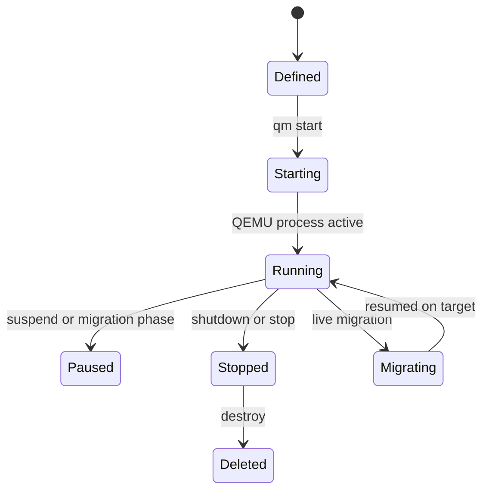

# Module 4: Proxmox VE Compute Virtualization

이 모듈은 Proxmox VE에서 VM은 QEMU/KVM 프로세스로, 컨테이너는 LXC와 Linux namespace/cgroup으로 실행된다는 점을 기준으로 컴퓨트 계층을 설명한다.

## 1. 왜 필요한가? (Pain Point & Motivation)

Proxmox VE에서 VM과 CT는 모두 "게스트"처럼 보이지만 격리 방식이 다르다. VM은 별도 커널을 가진 QEMU/KVM 가상 머신이고, CT는 호스트 커널을 공유하는 LXC 컨테이너다.

이 차이를 모르면 보안 경계, 성능, 드라이버, 백업, 마이그레이션, bind mount, privileged/unprivileged 설정을 잘못 선택하게 된다.

## 2. 현재 나의 상태 (Baseline)

흔한 출발점은 다음과 같다.

- VM과 CT를 가벼운 정도만 다른 같은 기술로 본다.
- QEMU와 KVM의 역할을 구분하지 못한다.
- VM이 호스트에서 하나의 프로세스로 보인다는 점을 모른다.
- VirtIO 드라이버가 왜 중요한지 모른다.
- privileged CT와 unprivileged CT의 보안 차이를 가볍게 본다.
- `qm config`, `pct config`, `/proc/<pid>` 관찰을 하지 않는다.

## 3. 도달하고 싶은 목표 (Target State)

목표는 워크로드에 맞는 compute 격리 방식을 선택하는 것이다.

- QEMU가 장치 에뮬레이션과 VM 프로세스를 담당하고, KVM이 하드웨어 가상화를 제공함을 설명한다.
- VirtIO가 디스크와 네트워크 I/O 성능에 중요한 이유를 이해한다.
- QEMU process, vCPU thread, QMP socket을 관찰할 수 있다.
- `qm` 명령이 VM 설정과 런타임에 어떤 영향을 주는지 추적한다.
- LXC의 namespace, cgroup, rootfs, bind mount를 구분한다.
- unprivileged CT를 기본 선택으로 삼아야 하는 이유를 설명한다.

## 4. 시스템 번역 (Data Flow)

VM 시작 흐름은 다음과 같다.

```text
qm start <vmid>
  -> read VM config from /etc/pve
  -> activate storage volumes
  -> create tap devices
  -> generate QEMU command line
  -> start /usr/bin/kvm process
  -> guest firmware and OS boot
```

LXC 컨테이너 시작 흐름은 다음과 같다.

```text
pct start <ctid>
  -> read CT config from /etc/pve
  -> prepare rootfs and mount points
  -> apply namespace and cgroup settings
  -> start init process inside container
  -> host kernel schedules container processes
```

## 5. 핵심 구성요소 (Building Blocks)

- QEMU: 사용자 공간에서 가상 장치와 VM 프로세스를 제공하는 에뮬레이터/가상화 런타임.
- KVM: Linux 커널의 하드웨어 가상화 인터페이스.
- `/dev/kvm`: QEMU가 KVM 기능을 사용하기 위해 여는 장치.
- vCPU thread: 게스트 CPU를 실행하는 QEMU 내부 스레드.
- QMP: QEMU Machine Protocol. VM 런타임 제어 인터페이스.
- VirtIO: 게스트와 호스트가 효율적으로 통신하는 paravirtualized device 계열.
- QEMU Guest Agent: 게스트 내부 상태 조회, IP 확인, clean shutdown, freeze 같은 기능을 제공한다.
- LXC: Linux container 런타임.
- Namespace: PID, mount, network, user 등 관찰 범위를 격리한다.
- Cgroup: CPU, 메모리, I/O 사용량을 제한하고 계측한다.
- Bind mount: 호스트 경로를 컨테이너 안으로 연결한다.

## 6. 상태 전이 (State Transition)

VM의 생명주기는 다음처럼 볼 수 있다.



컨테이너도 비슷하지만 별도 커널 부팅이 없고, 호스트 커널 위에서 init 프로세스와 namespace가 구성된다.

## 7. 불변식 (Invariant: 절대 깨지면 안 되는 규칙)

- VM과 CT의 보안 경계는 같지 않다.
- 컨테이너는 호스트 커널을 공유하므로 privileged CT와 device passthrough는 신중히 다뤄야 한다.
- VirtIO 장치를 쓰는 VM은 게스트 드라이버와 guest agent 상태를 확인해야 한다.
- VM 설정 파일과 런타임 QEMU 명령줄이 불일치할 수 있으므로 hotplug 여부를 구분해야 한다.
- bind mount는 호스트 파일 권한과 컨테이너 user namespace 매핑을 함께 고려해야 한다.
- stop, reset, destroy 명령은 게스트 내부 데이터 일관성에 영향을 줄 수 있다.

## 8. 가장 작은 예제 (Minimal Viable Example)

VM 관찰 루틴은 다음과 같다.

```bash
qm config 100
qm status 100
cat /var/run/qemu-server/100.pid
ps -fp "$(cat /var/run/qemu-server/100.pid)"
qm agent 100 ping
```

CT 관찰 루틴은 다음과 같다.

```bash
pct config 200
pct status 200
pct enter 200
pct exec 200 -- ps aux
```

VM은 QEMU process를 추적하고, CT는 호스트 프로세스와 namespace/cgroup 설정을 추적한다.

## 9. 실패 사례 (What could go wrong?)

- guest agent를 켜지 않으면 IP 조회, clean shutdown, filesystem freeze 같은 기능이 제한된다.
- Windows VM에 VirtIO 드라이버가 없으면 디스크나 네트워크 장치가 보이지 않을 수 있다.
- CPU type을 무리하게 `host`로 고정하면 다른 노드 live migration과 충돌할 수 있다.
- memory ballooning을 켰지만 guest driver가 없으면 기대한 회수가 일어나지 않을 수 있다.
- privileged CT에 host path를 bind mount하면 호스트 파일 시스템 위험이 커진다.
- CT 안에서 Docker를 쓰기 위해 nesting을 켜면 격리와 지원 범위를 다시 검토해야 한다.

## 10. 뇌 확장하기 (Evolution & Variants)

- VM의 `/proc/<pid>/task`를 확인해 vCPU thread가 실제 CPU에서 어떻게 스케줄링되는지 관찰한다.
- NUMA, CPU pinning, hugepage, IO thread가 성능에 주는 영향을 실험한다.
- live migration에서 shared storage, CPU compatibility, network bandwidth 조건을 확인한다.
- LXC의 user namespace id mapping과 unprivileged container 권한 모델을 살펴본다.
- VM과 CT의 백업/복원 결과 차이를 비교한다.

## 11. 최종 체크리스트 (Definition of Done)

- [ ] QEMU와 KVM의 역할 차이를 설명할 수 있다.
- [ ] VM이 호스트의 QEMU 프로세스로 보인다는 점을 확인할 수 있다.
- [ ] VirtIO와 guest agent의 역할을 설명할 수 있다.
- [ ] `qm config`와 런타임 상태를 함께 확인할 수 있다.
- [ ] LXC namespace와 cgroup의 역할을 구분할 수 있다.
- [ ] VM과 CT 중 어떤 격리 방식이 필요한지 워크로드 기준으로 선택할 수 있다.

## 12. 뇌에 새기는 복습 문장 (TL;DR Blank)

Proxmox VE에서 VM은 QEMU/KVM으로 실행되는 별도 커널 환경이고, CT는 호스트 커널을 공유하는 LXC 격리 환경이므로 보안 경계와 운영 방식이 다르다.
