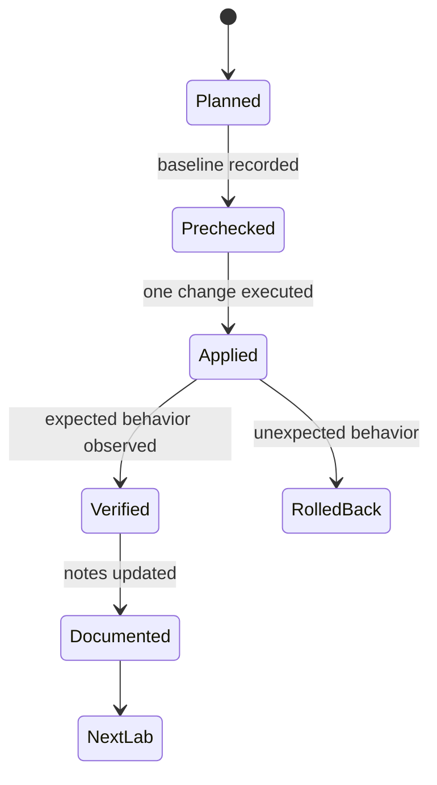

# Proxmox VE Labs

이 문서는 Proxmox VE를 실습할 때 VM, CT, 스토리지, 네트워크, 클러스터, HA, 백업, 방화벽, 권한, Cloud-Init을 어떤 순서로 검증할지 정리한 랩 가이드다.

## 1. 왜 필요한가? (Pain Point & Motivation)

Proxmox VE는 실습 없이 문서만 읽으면 구조가 손에 잡히지 않는다. 하지만 무작정 명령을 따라 하면 관리망이 끊기거나 디스크를 지우거나 HA 테스트 중 클러스터를 불안정하게 만들 수 있다.

랩의 목적은 기능을 한 번에 많이 켜는 것이 아니다. 각 실습마다 목표, 변경 대상, 검증 명령, 되돌리기 조건을 정하고 하나씩 확인하는 것이다.

## 2. 현재 나의 상태 (Baseline)

랩 시작 전 기준 상태는 다음과 같다.

- Proxmox VE 노드에 Web UI와 SSH로 접속할 수 있다.
- 테스트용 VMID/CTID 범위를 정했다.
- 실습용 스토리지와 운영 스토리지를 구분했다.
- 네트워크 변경 시 복구할 콘솔 접근 경로를 확보했다.
- 실습 중 삭제 가능한 디스크와 절대 건드리면 안 되는 디스크를 구분했다.
- 백업/복원 실습은 운영 VM이 아니라 테스트 VM으로 수행한다.

## 3. 도달하고 싶은 목표 (Target State)

랩을 마치면 다음을 할 수 있어야 한다.

- 첫 VM을 만들고 guest agent 상태를 확인한다.
- unprivileged LXC 컨테이너를 만들고 리소스 제한을 확인한다.
- 테스트 스토리지를 Proxmox storage로 등록하고 사용률을 확인한다.
- VLAN-aware bridge와 VM VLAN tag 흐름을 검증한다.
- 클러스터와 quorum 상태를 읽을 수 있다.
- 백업을 만들고 새 VMID로 복원할 수 있다.
- 방화벽과 ACL 변경을 검증한 뒤 되돌릴 수 있다.
- Cloud-Init 템플릿을 만들고 clone으로 배포할 수 있다.

## 4. 시스템 번역 (Data Flow)

랩 하나의 실행 흐름은 다음과 같다.

```text
choose one lab
  -> record current state
  -> apply one scoped change
  -> verify with CLI and Web UI
  -> document observed output
  -> rollback or keep intentionally
  -> move to next lab
```

모든 랩은 같은 원칙을 따른다.

```text
change only test resources
verify before and after
avoid destructive commands on unknown disks
restore management access first if network breaks
```

## 5. 핵심 구성요소 (Building Blocks)

추천 실습 순서는 다음과 같다.

- Lab 1: First VM. ISO 업로드, `qm create`, guest agent 확인.
- Lab 2: LXC. 템플릿 다운로드, unprivileged CT, resource limit, bind mount.
- Lab 3: Storage. 테스트용 디스크 또는 dataset, `pvesm add`, snapshot/rollback 관찰.
- Lab 4: Network. VLAN-aware bridge, VM VLAN tag, bridge 상태 확인.
- Lab 5: Cluster. `pvecm status`, node join, quorum 확인.
- Lab 6: HA. shared storage, HA group, failover 조건 확인.
- Lab 7: Backup and Restore. `vzdump` 또는 PBS backup, 새 VMID restore.
- Lab 8: Firewall. datacenter/host/VM rule, SSH allow rule, 로그 확인.
- Lab 9: User and ACL. group, role, ACL, API token 최소 권한 확인.
- Lab 10: Cloud-Init. cloud image, template, clone, SSH key injection.

## 6. 상태 전이 (State Transition)

랩 진행 상태는 다음처럼 관리한다.



`Verified` 없이 다음 랩으로 넘어가면 뒤에서 발생한 문제가 어떤 변경에서 왔는지 추적하기 어렵다.

## 7. 불변식 (Invariant: 절대 깨지면 안 되는 규칙)

- 운영 VM, 운영 CT, 운영 스토리지를 실습 대상으로 삼지 않는다.
- 네트워크 랩 전에는 로컬 콘솔이나 out-of-band 접근을 준비한다.
- 디스크를 초기화하거나 pool을 만드는 명령은 대상 디스크를 두 번 확인한 뒤 실행한다.
- 방화벽을 켜기 전 SSH와 Web UI 허용 규칙을 먼저 둔다.
- HA 랩은 quorum, shared storage, fencing/watchdog 조건을 먼저 확인한다.
- 백업 랩은 반드시 새 VMID로 복원 테스트까지 포함한다.

## 8. 가장 작은 예제 (Minimal Viable Example)

첫 VM 랩의 최소 명령 흐름은 다음과 같다.

```bash
qm create 100 --name lab-vm --memory 2048 --cores 2 --net0 virtio,bridge=vmbr0
qm set 100 --scsihw virtio-scsi-pci --scsi0 local-lvm:32
qm set 100 --ide2 local:iso/ubuntu.iso,media=cdrom
qm set 100 --boot order=ide2
qm start 100
qm status 100
qm config 100
```

설치 후 guest agent를 켰다면 호스트에서 다음을 확인한다.

```bash
qm agent 100 ping
qm agent 100 get-osinfo
```

이 작은 실습만으로 VM 설정, 스토리지 볼륨, 네트워크 bridge, guest agent를 함께 확인할 수 있다.

## 9. 실패 사례 (What could go wrong?)

- ISO나 cloud image 파일명을 문서 예시 그대로 쓰다가 실제 파일명이 달라 VM 부팅이 실패한다.
- 테스트용 디스크와 운영 디스크를 혼동해 데이터를 잃을 수 있다.
- VLAN 랩에서 스위치 trunk 설정을 빼먹어 Proxmox 설정은 맞는데 통신이 안 된다.
- 방화벽을 켠 뒤 SSH 허용 규칙이 없어 원격 접속이 끊긴다.
- HA failover를 강제로 테스트하면서 quorum이나 fencing 조건을 충족하지 못해 예상과 다르게 동작한다.
- API token 값을 문서나 로그에 그대로 남겨 자동화 계정이 노출된다.

## 10. 뇌 확장하기 (Evolution & Variants)

- 각 랩 결과를 `before`, `command`, `after`, `rollback` 형식으로 기록한다.
- 동일한 VM을 Directory, LVM-thin, ZFS 스토리지에 만들어 성능과 snapshot 차이를 비교한다.
- Cloud-Init 템플릿을 Ansible 또는 Terraform 배포 흐름과 연결한다.
- PBS를 붙여 full backup과 incremental backup, verify, prune을 비교한다.
- 네트워크 랩은 packet capture를 tap, bridge, physical NIC 단계별로 수행한다.

## 11. 최종 체크리스트 (Definition of Done)

- [ ] 각 랩은 한 번에 하나의 변경만 수행한다.
- [ ] 실행 전 현재 상태를 기록한다.
- [ ] 실행 후 CLI와 Web UI 양쪽에서 검증한다.
- [ ] 실패 시 되돌릴 수 있는 절차가 있다.
- [ ] 백업 랩은 복원 테스트까지 완료한다.
- [ ] 위험 명령은 테스트 리소스에서만 실행한다.

## 12. 뇌에 새기는 복습 문장 (TL;DR Blank)

Proxmox 실습은 기능을 한꺼번에 켜는 과정이 아니라, 하나의 변경을 적용하고 관찰하고 되돌릴 수 있음을 확인하는 반복 절차다.
