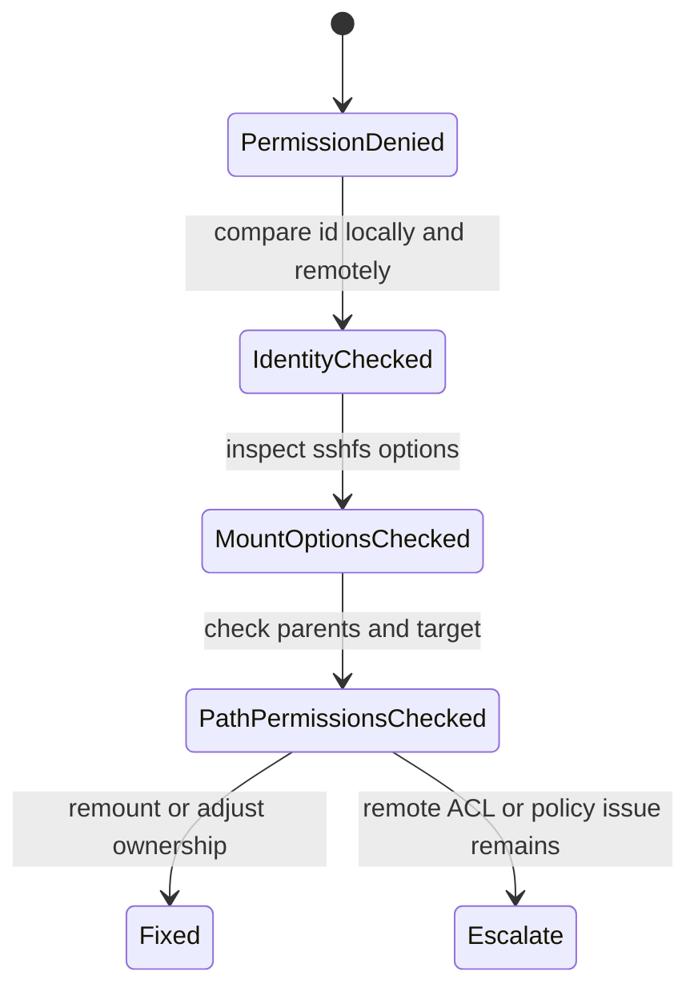

# Remote Access Permissions

이 문서는 SSHFS 같은 원격 파일 접근에서 사용자 이름은 같아도 권한이 거부되는 문제를 UID/GID, FUSE 옵션, 디렉터리 권한 관점으로 정리한다.

## 적용 범위와 권한 검증 기준

- **범위:** SSHFS·libfuse·kernel·SSH client/server 버전, mount 실행 사용자와 namespace, local/remote UID·GID·supplementary groups, remote filesystem ACL과 mount options를 기록합니다.
- **권한 전제:** remote SSH authorization, SSHFS의 attribute mapping, `default_permissions`의 local kernel check, parent directory execute 권한과 application access를 분리해 확인합니다.
- **사실과 추론:** 양쪽 `id`, path component 권한·ACL, mount table, SSHFS debug와 실제 open error는 근거이고, 동일 username이나 한 번의 permission denied만으로 UID mismatch를 원인으로 확정하지 않습니다.
- **실패·완료:** 다른 사용자 노출, 예상 밖 root credential, read/write 차이, stale mount, reconnect와 unmount 실패를 시험합니다. 최소 권한으로 필요한 operation만 성공하고 금지 사용자는 거부되며 reboot/reconnect 뒤에도 mapping이 유지될 때 완료입니다.

---

## 1. 왜 필요한가? (Pain Point & Motivation)

Linux 권한은 사용자 이름 문자열이 아니라 UID와 GID 숫자를 기준으로 평가된다. 로컬과 원격에 같은 `nodove` 사용자가 있어도 UID가 다르면 SSHFS 마운트 후 파일 소유권과 접근 권한이 예상과 다르게 보일 수 있다.

또한 SSHFS는 FUSE 기반 사용자 공간 마운트이므로 `sudo`로 실행했는지, `allow_other`를 썼는지, `default_permissions`를 켰는지에 따라 권한 평가 주체가 달라진다.

## 2. 현재 나의 상태 (Baseline)

흔한 출발점은 다음과 같다.

- 로컬과 원격 사용자 이름이 같으면 권한도 같다고 생각한다.
- `sudo sshfs`를 습관적으로 사용한다.
- 원격 홈 디렉터리 권한이 `700`인 상태에서 다른 로컬 사용자로 접근하려 한다.
- `idmap=user`, `uid`, `gid`, `allow_other`, `default_permissions` 의미를 구분하지 못한다.
- 마운트 대상 디렉터리의 부모 경로 권한을 확인하지 않는다.

## 3. 도달하고 싶은 목표 (Target State)

목표는 원격 파일 접근 권한 문제를 단계적으로 진단하는 것이다.

- 로컬 UID/GID와 원격 UID/GID를 비교한다.
- SSH 접속 사용자와 SSHFS 실행 사용자를 구분한다.
- 마운트 포인트 소유권과 권한을 확인한다.
- FUSE `allow_other` 사용 조건을 이해한다.
- SSHFS 옵션이 로컬 권한 평가에 주는 영향을 설명한다.
- 원격 경로의 모든 부모 디렉터리 execute 권한을 점검한다.

## 4. 시스템 번역 (Data Flow)

SSHFS 접근 흐름은 다음과 같다.

```text
local process accesses mount point
  -> local mount ownership/parent traversal and FUSE access rules
  -> optional default_permissions check using mapped file attributes
  -> sshfs sends the allowed filesystem request over its SSH session
  -> remote SFTP service checks that remote account's filesystem permissions
  -> application receives success or a local/remote error
```

권한 오류는 로컬 마운트 지점, FUSE 옵션, SSH 인증, 원격 파일 권한 중 어느 단계에서도 발생할 수 있다.

## 5. 핵심 구성요소 (Building Blocks)

- UID/GID: Linux 권한 평가에 쓰이는 숫자 ID.
- Username: UID를 사람이 읽기 쉽게 매핑한 이름.
- SSHFS: SSH/SFTP 위에서 원격 파일시스템을 로컬에 마운트하는 FUSE 도구.
- FUSE: 사용자 공간 파일시스템 프레임워크.
- `idmap=user`: 원격 접속 사용자와 로컬 실행 사용자를 매핑하는 SSHFS 옵션.
- `uid`, `gid`: 로컬에서 표시할 소유자 ID를 지정하는 옵션.
- `allow_other`: 마운트한 사용자 외 다른 로컬 사용자도 접근할 수 있게 하는 옵션.
- `default_permissions`: 커널이 로컬 권한 검사를 수행하게 하는 옵션.
- Execute bit on directory: 디렉터리 안으로 들어가려면 경로의 각 디렉터리에 실행 권한이 필요하다.

## 6. 상태 전이 (State Transition)

문제 해결 흐름은 다음 상태로 진행한다.



한 단계씩 확인해야 원인을 잘못 짚고 권한을 과하게 열지 않는다.

## 7. 불변식 (Invariant: 절대 깨지면 안 되는 규칙)

- 권한 문제를 해결하려고 원격 홈 디렉터리를 무조건 `777`로 바꾸면 안 된다.
- 개인 홈 디렉터리는 보통 `700` 또는 제한된 그룹 접근을 유지해야 한다.
- `allow_other`는 `/etc/fuse.conf`의 `user_allow_other`와 함께 의도적으로만 사용한다.
- `sudo sshfs`를 쓰면 SSH key 탐색 경로가 root 기준으로 바뀔 수 있음을 고려해야 한다.
- UID/GID를 바꾸기 전 해당 UID가 소유한 파일 범위를 확인해야 한다.
- 마운트 옵션은 `/etc/fstab`에 저장하기 전 수동으로 검증해야 한다.

## 8. 가장 작은 예제 (Minimal Viable Example)

먼저 UID/GID를 비교한다.

```bash
id
ssh user@example.com id
```

같은 사용자로 일반 마운트를 시도한다.

```bash
mkdir -p ~/remote
sshfs -o idmap=user user@example.com:/home/user ~/remote
```

다른 로컬 사용자도 접근해야 하는 경우에만 `allow_other`를 검토한다.

```bash
sshfs -o idmap=user,allow_other,default_permissions user@example.com:/srv/share /mnt/share
```

이때 `/etc/fuse.conf`의 `user_allow_other`, mount point와 상위 경로의 권한, mapped UID/GID와 ACL을 함께 확인한다. 모든 로컬 사용자의 원격 요청은 이 mount를 연 동일한 SSH 계정 권한으로 실행되며 `idmap=user`가 원격 계정을 바꾸지는 않는다. 허용 사용자와 거부 사용자 각각의 read/write를 검증한 뒤 공유한다.

## 9. 실패 사례 (What could go wrong?)

- UID/GID가 달라 로컬에서 파일이 예상과 다른 사용자 소유로 보인다.
- `sudo sshfs`로 마운트해 root의 SSH 키를 찾다가 인증에 실패한다.
- `allow_other` 없이 다른 로컬 사용자나 서비스가 마운트 경로에 접근하려 해 실패한다.
- 부모 디렉터리 중 하나에 execute 권한이 없어 하위 디렉터리 권한이 넓어도 접근할 수 없다.
- `default_permissions` 때문에 원격에서는 허용되지만 로컬 커널 검사에서 막힌다.
- root로 만든 마운트 포인트를 일반 사용자가 소유하지 않아 접근이 막힌다.

## 10. 뇌 확장하기 (Evolution & Variants)

- SSHFS 대신 NFS, SMB, SFTP-only 계정을 쓸 때 권한 모델을 비교한다.
- POSIX ACL(`getfacl`, `setfacl`)을 사용해 그룹 기반 접근을 세밀하게 조정한다.
- systemd automount와 `x-systemd.automount`로 필요할 때만 마운트하게 구성한다.
- 서비스 계정이 마운트를 사용할 경우 user unit과 system unit의 차이를 검토한다.
- 원격 파일 권한과 로컬 표시 권한이 다를 수 있음을 백업/동기화 도구와 함께 점검한다.

## 11. 최종 체크리스트 (Definition of Done)

- [ ] 로컬과 원격 UID/GID를 비교했다.
- [ ] SSHFS를 실행하는 로컬 사용자를 확인했다.
- [ ] 마운트 포인트 소유권과 권한을 확인했다.
- [ ] `idmap`, `uid`, `gid`, `allow_other`, `default_permissions` 사용 이유를 설명할 수 있다.
- [ ] 원격 경로의 부모 디렉터리 권한을 확인했다.
- [ ] 권한을 과하게 열지 않고 필요한 접근만 허용했다.

## 12. 뇌에 새기는 복습 문장 (TL;DR Blank)

SSHFS 권한 문제는 사용자 이름이 아니라 UID/GID, FUSE 옵션, 마운트 주체, 원격 경로 권한이 함께 결정한다.
