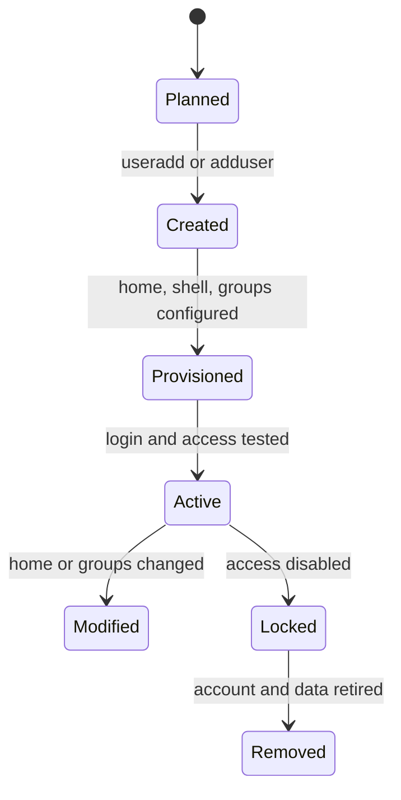

# User and ACL Management

이 문서는 Linux에서 사용자, 그룹, 홈 디렉터리, 기본 권한, POSIX ACL을 관리할 때 지켜야 할 기준을 정리한다.

## 1. 왜 필요한가? (Pain Point & Motivation)

Linux 접근 제어는 사용자 생성 명령 하나로 끝나지 않는다. 홈 디렉터리 위치, UID/GID, primary group, supplementary group, sudo 권한, 파일 모드, ACL이 함께 작동한다.

권한을 빠르게 해결하려고 `chmod 777`이나 넓은 sudo 권한을 주면 나중에 데이터 노출과 권한 상승 경로가 된다. 사용자와 ACL 문서는 "필요한 사람에게 필요한 경로만" 허용하는 기준을 제공해야 한다.

## 2. 현재 나의 상태 (Baseline)

흔한 출발점은 다음과 같다.

- 홈 디렉터리 경로만 바꾸면 권한도 자동으로 맞는다고 생각한다.
- 그룹 권한과 ACL 권한의 차이를 모른다.
- `/etc/passwd`를 직접 편집해도 된다고 생각한다.
- sudo 권한과 파일 접근 권한을 구분하지 못한다.
- 기본 `/etc/skel` 설정이 새 사용자 홈에 복사된다는 점을 모른다.
- UID/GID 충돌을 확인하지 않고 계정을 만든다.

## 3. 도달하고 싶은 목표 (Target State)

목표는 사용자 권한을 재현 가능하고 감사 가능하게 관리하는 것이다.

- 새 사용자 생성 시 홈 디렉터리, shell, group, UID 정책을 정한다.
- 기존 사용자 홈 이동 시 파일 이동과 소유권 변경을 함께 처리한다.
- 기본 파일 권한과 ACL을 구분해 적용한다.
- 공유 디렉터리는 그룹과 setgid bit 또는 ACL로 관리한다.
- sudo 권한은 별도 파일과 최소 권한으로 관리한다.
- 변경 후 실제 사용자로 접근 테스트를 수행한다.

## 4. 시스템 번역 (Data Flow)

사용자 생성 흐름은 다음과 같다.

```text
define account purpose
  -> choose username, UID/GID, home path, shell
  -> create user and group
  -> create or move home directory
  -> set ownership and permissions
  -> assign supplementary groups or ACL
  -> test login and file access
```

공유 디렉터리 권한 흐름은 다음과 같다.

```text
create group
  -> add allowed users
  -> set directory group ownership
  -> set mode or ACL
  -> set default ACL if new files must inherit permissions
```

## 5. 핵심 구성요소 (Building Blocks)

- User: UID를 가진 계정.
- Group: GID를 가진 권한 묶음.
- Home directory: 로그인 후 기본 작업 디렉터리.
- `/etc/passwd`: 사용자 기본 정보와 홈/shell 매핑.
- `/etc/group`: 그룹과 멤버십 정보.
- `/etc/skel`: 새 홈 디렉터리에 복사되는 기본 파일 템플릿.
- File mode: owner, group, other에 대한 read/write/execute 권한.
- POSIX ACL: 기본 파일 모드보다 세밀한 사용자/그룹별 권한.
- Default ACL: 새 파일과 디렉터리에 상속되는 ACL.
- sudo policy: 명령 실행 권한 상승 정책.

## 6. 상태 전이 (State Transition)

계정 생명주기는 다음처럼 관리한다.



계정 삭제는 데이터 보존 정책을 먼저 결정한 뒤 수행한다.

## 7. 불변식 (Invariant: 절대 깨지면 안 되는 규칙)

- 사용자 식별은 이름이 아니라 UID/GID 기준으로 일어난다.
- 홈 디렉터리 권한은 개인 계정이면 과하게 열지 않는다.
- 공유 권한은 개인 사용자 직접 지정보다 그룹 기반으로 설계한다.
- sudo 권한은 파일 접근 권한과 별개로 최소 명령만 허용한다.
- `/etc/passwd` 직접 편집이 필요하면 `vipw`처럼 lock을 사용하는 도구를 쓴다.
- ACL 변경 후에는 실제 대상 사용자로 읽기/쓰기/실행 테스트를 한다.

## 8. 가장 작은 예제 (Minimal Viable Example)

새 사용자와 홈 디렉터리 생성:

```bash
sudo useradd -m -d /home/alice -s /bin/bash alice
sudo passwd alice
sudo chmod 700 /home/alice
sudo chown -R alice:alice /home/alice
```

공유 디렉터리를 그룹으로 관리:

```bash
sudo groupadd project
sudo usermod -aG project alice
sudo mkdir -p /srv/project
sudo chown root:project /srv/project
sudo chmod 2770 /srv/project
```

새 파일까지 기본 권한을 유지해야 하면 ACL을 추가한다.

```bash
sudo setfacl -m g:project:rwx /srv/project
sudo setfacl -d -m g:project:rwx /srv/project
getfacl /srv/project
```

## 9. 실패 사례 (What could go wrong?)

- 홈 디렉터리만 바꾸고 기존 파일을 이동하지 않아 사용자가 빈 홈으로 로그인한다.
- 소유권을 바꾸지 않아 새 홈에 로그인해도 설정 파일을 읽지 못한다.
- 공유 디렉터리에 setgid나 default ACL이 없어 새 파일이 공유 그룹을 잃는다.
- `usermod -G`를 잘못 사용해 기존 supplementary group을 덮어쓴다.
- sudo 권한을 넓게 주어 파일 권한 제한을 우회한다.
- UID/GID를 변경하고 기존 파일 소유권을 정리하지 않아 고아 소유 파일이 남는다.

## 10. 뇌 확장하기 (Evolution & Variants)

- LDAP, Active Directory, SSSD 같은 중앙 계정 관리와 로컬 계정의 차이를 비교한다.
- `umask`와 default ACL이 새 파일 권한에 주는 영향을 실험한다.
- service account는 login shell, home, sudo, key 관리 정책을 일반 사용자와 분리한다.
- 계정 잠금, 만료, 삭제, 데이터 보존 절차를 offboarding 문서로 분리한다.
- auditd나 파일 접근 로그로 민감 디렉터리 접근을 관찰한다.

## 11. 최종 체크리스트 (Definition of Done)

- [ ] 사용자 목적과 권한 범위가 정의되어 있다.
- [ ] UID/GID, 홈 디렉터리, shell, 그룹이 확인되어 있다.
- [ ] 홈 디렉터리 소유권과 권한이 적절하다.
- [ ] 공유 디렉터리는 그룹 또는 ACL 기반으로 관리된다.
- [ ] sudo 권한은 별도 검토되었다.
- [ ] 실제 사용자로 접근 테스트를 완료했다.

## 12. 뇌에 새기는 복습 문장 (TL;DR Blank)

Linux 사용자 권한은 UID/GID, 그룹, 파일 모드, ACL, sudo 정책이 함께 만드는 결과이며, 변경 후 실제 사용자 관점으로 검증해야 한다.
