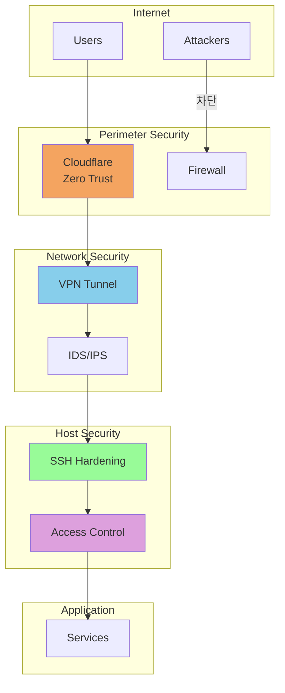
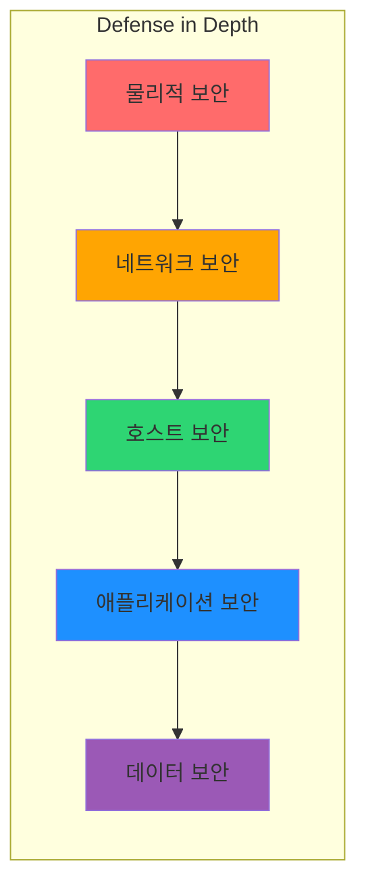
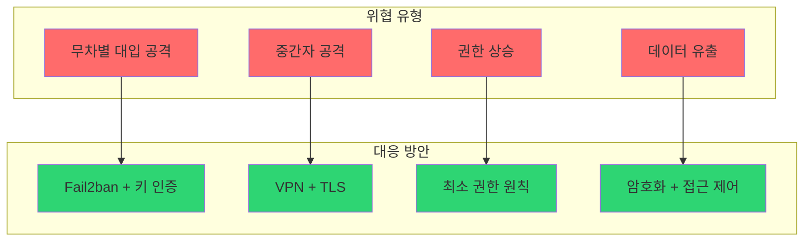

# 보안 문서


## 이 문서의 사용 기준

이 페이지는 보안 통제 후보를 찾기 위한 내비게이션이며 모든 환경에 동일하게 적용하는 기준선이 아닙니다. 자산, 위협 행위자, 관리 경로, 규제 요구사항과 가용성 목표를 먼저 정한 뒤 각 통제의 효과와 운영 비용을 평가합니다.

- **환경 전제**: Linux 배포판, OpenSSH와 방화벽 구현, VPN 및 Zero Trust 제품의 버전과 요금제에 따라 명령과 기능이 달라집니다.
- **변경 안전성**: 원격 호스트에서는 콘솔 또는 별도 관리자 세션을 유지하고, 현재 관리 포트와 허용 대역을 확인한 뒤 SSH와 방화벽을 단계적으로 적용합니다.
- **증거 상태**: 체크리스트와 빠른 시작은 예시입니다. 설정 파일, 유효 설정 출력, 방화벽 규칙, 인증 및 거부 로그로 실제 적용 여부를 입증해야 합니다.
- **실패 대응**: 구문 오류, 인증 실패, 네트워크 차단 시 즉시 이전 설정으로 복구할 백업과 명시적인 롤백 담당자를 준비합니다.
- **완료 조건**: 승인된 계정의 새 세션 성공, 비승인 접근 거부, 필요한 서비스의 도달성, 로그와 경보 수신, 복구 절차 리허설을 확인합니다.

패스워드 인증을 끄기 전에는 승인된 키 또는 MFA와 비상 접근 수단을 실제로 시험합니다. 아래 ADMIN_CIDR, SSH_PORT, 사용자 이름은 운영 환경 값으로 치환해야 하며 치환되지 않은 예시는 실행하지 않습니다.

시스템과 네트워크 보안을 위한 종합 가이드입니다.

<div class="compose-hero" markdown>
<span class="compose-kicker">Security</span>

## 접근 제어부터 VPN, Zero Trust까지 운영 보안 문서 모음

호스트 보안, 원격 접근 보호, 메시 VPN, Zero Trust 구성을 단계별로 찾아볼 수 있도록 정리했습니다.

<div class="landing-meta-list" markdown>
<span>SSH Hardening</span>
<span>Access Control</span>
<span>VPN</span>
<span>Zero Trust</span>
</div>

<div class="compose-actions" markdown>
[:octicons-arrow-right-24: SSH 설정](ssh/configuration.md){ .md-button .md-button--primary }
[:material-vpn: Tailscale](vpn/tailscale.md){ .md-button }
[:material-cloud-lock: Cloudflare Zero Trust](zerotrust/cloudflare.md){ .md-button }
</div>
</div>

## 핵심 보안 영역

<div class="grid cards" markdown>

-   :material-key:{ .lg .middle } **SSH 보안**

    ---

    SSH 서버 구성, 키 관리, 접근 제어

    [:octicons-arrow-right-24: SSH 설정](ssh/configuration.md)

-   :material-shield-lock:{ .lg .middle } **접근 제어**

    ---

    사용자 권한 관리, ACL 설정

    [:octicons-arrow-right-24: 권한 관리](access/user-acl.md)

-   :material-vpn:{ .lg .middle } **VPN**

    ---

    WireGuard, Tailscale 메시 VPN

    [:octicons-arrow-right-24: VPN 가이드](vpn/tailscale.md)

-   :material-cloud-lock:{ .lg .middle } **Zero Trust**

    ---

    Cloudflare Zero Trust 네트워크

    [:octicons-arrow-right-24: Zero Trust](zerotrust/cloudflare.md)

</div>

---

## 보안 아키텍처 개요



---

## 카테고리별 문서

### :material-key: SSH 보안

| 문서 | 설명 |
|------|------|
| [SSH 설정](ssh/configuration.md) | SSHD 보안 구성 및 강화 |
| [키 관리](ssh/key-management.md) | SSH 키 생성, 배포, 로테이션 |
| [Match 규칙](ssh/match-rules.md) | 조건부 SSH 설정 (사용자/IP별) |

### :material-account-lock: 접근 제어

| 문서 | 설명 |
|------|------|
| [사용자 ACL 관리](access/user-acl.md) | 사용자/그룹 권한 관리 |
| [원격 접근 권한](access/permissions.md) | 원격 접근 설정 및 제한 |

### :material-vpn: VPN

| 문서 | 설명 |
|------|------|
| [WireGuard](vpn/wireguard.md) | 고성능 현대적 VPN |
| [Tailscale](vpn/tailscale.md) | 제로 설정 메시 VPN |

### :material-cloud-lock: Zero Trust

| 문서 | 설명 |
|------|------|
| [Cloudflare Zero Trust](zerotrust/cloudflare.md) | ZTNA 구현 |

---

## 보안 레이어



| 레이어 | 구성 요소 | 관련 문서 |
|--------|-----------|-----------|
| **네트워크** | 방화벽, VPN, IDS | [Tailscale](vpn/tailscale.md), [WireGuard](vpn/wireguard.md) |
| **호스트** | SSH 강화, ACL | [SSH 설정](ssh/configuration.md), [ACL](access/user-acl.md) |
| **접근** | Zero Trust, MFA | [Cloudflare ZT](zerotrust/cloudflare.md) |

---

## 보안 체크리스트

### :material-checkbox-marked: 위협 모델별 기준선 후보

- [ ] **SSH 키 기반 인증** 활성화
- [ ] **패스워드 인증 비활성화**
- [ ] **Root 로그인 비활성화**
- [ ] 방화벽 규칙 설정 (UFW/iptables)
- [ ] Fail2ban 설치 및 구성

### :material-checkbox-marked-outline: 권장 설정

- [ ] VPN 터널 구성
- [ ] Zero Trust 접근 정책
- [ ] 2FA/MFA 활성화
- [ ] 접근 로그 모니터링
- [ ] 정기적 보안 감사

### :material-checkbox-blank-outline: 고급 설정

- [ ] IDS/IPS 구축
- [ ] SIEM 통합
- [ ] 자동화된 취약점 스캔
- [ ] 보안 이벤트 알림

---

## 빠른 시작

### SSH 보안 강화

```bash
# /etc/ssh/sshd_config
PermitRootLogin no
PasswordAuthentication no
PubkeyAuthentication yes
MaxAuthTries 3
AllowUsers admin deploy
```

### UFW 방화벽 기본 설정

```bash
sudo ufw default deny incoming
sudo ufw default allow outgoing
sudo ufw allow from ADMIN_CIDR to any port SSH_PORT proto tcp
sudo ufw allow 443/tcp
sudo ufw --dry-run enable
# 콘솔 또는 별도 세션에서 규칙 확인 후: sudo ufw enable
```

### Fail2ban 설치

```bash
sudo apt install fail2ban
sudo systemctl enable fail2ban
sudo systemctl start fail2ban
```

---

## 위협 모델



---

## 관련 문서

- [네트워크 설정](../infrastructure/networking/network-settings.md)
- [모니터링](../infrastructure/monitoring/prometheus-grafana-loki.md)
- [Docker 설치](../development/docker/installation.md)
