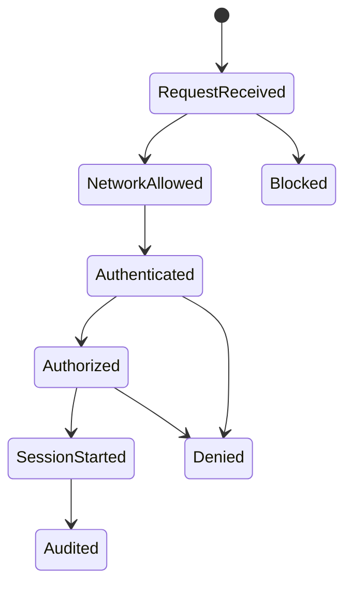

# 보안 {#security}

<nav class="hub-directory" aria-label="보안 문서 목록" markdown="1">

<div class="hub-directory__groups" markdown="1">

<section class="hub-directory__group" aria-labelledby="directory-group-1" markdown="1">

<h2 id="directory-group-1">SSH</h2>

- [SSH Configuration](ssh/configuration.md)
- [SSH Key Management](ssh/key-management.md)
- [SSH Match Rules](ssh/match-rules.md)

</section>

<section class="hub-directory__group" aria-labelledby="directory-group-2" markdown="1">

<h2 id="directory-group-2">VPN</h2>

- [Tailscale VPN](vpn/tailscale.md)
- [WireGuard VPN](vpn/wireguard.md)

</section>

<section class="hub-directory__group" aria-labelledby="directory-group-3" markdown="1">

<h2 id="directory-group-3">Zero Trust</h2>

- [Cloudflare Zero Trust](zerotrust/cloudflare.md)

</section>

<section class="hub-directory__group" aria-labelledby="directory-group-4" markdown="1">

<h2 id="directory-group-4">접근 제어</h2>

- [User and ACL Management](access/user-acl.md)
- [Remote Access Permissions](access/permissions.md)

</section>

<section class="hub-directory__group" aria-labelledby="directory-group-5" markdown="1">

<h2 id="directory-group-5">함께 읽기</h2>

- [리눅스 고정 IP 설정 기준](../infrastructure/networking/network-settings.md)
- [Prometheus, Grafana, Loki 관측 스택](../infrastructure/monitoring/prometheus-grafana-loki.md)
- [Docker 설치 가이드](../development/docker/installation.md)

</section>

</div>
</nav>

<details class="hub-directory-notes" markdown="1" open>
<summary>안내와 학습 노트</summary>

이 영역은 호스트 접근, SSH, 사용자 권한, VPN, Zero Trust를 운영 관점에서 안전하게 구성하기 위한 문서 모음이다.

## 이 문서의 사용 기준

이 페이지는 보안 통제 후보를 찾기 위한 내비게이션이며 모든 환경에 동일하게 적용하는 기준선이 아닙니다. 자산, 위협 행위자, 관리 경로, 규제 요구사항과 가용성 목표를 먼저 정한 뒤 각 통제의 효과와 운영 비용을 평가합니다.

- **환경 전제**: Linux 배포판, OpenSSH와 방화벽 구현, VPN 및 Zero Trust 제품의 버전과 요금제에 따라 명령과 기능이 달라집니다.
- **변경 안전성**: 원격 호스트에서는 콘솔 또는 별도 관리자 세션을 유지하고, 현재 관리 포트와 허용 대역을 확인한 뒤 SSH와 방화벽을 단계적으로 적용합니다.
- **증거 상태**: 체크리스트와 빠른 시작은 예시입니다. 설정 파일, 유효 설정 출력, 방화벽 규칙, 인증 및 거부 로그로 실제 적용 여부를 입증해야 합니다.
- **실패 대응**: 구문 오류, 인증 실패, 네트워크 차단 시 즉시 이전 설정으로 복구할 백업과 명시적인 롤백 담당자를 준비합니다.
- **완료 조건**: 승인된 계정의 새 세션 성공, 비승인 접근 거부, 필요한 서비스의 도달성, 로그와 경보 수신, 복구 절차 리허설을 확인합니다.

패스워드 인증을 끄기 전에는 승인된 키 또는 MFA와 비상 접근 수단을 실제로 시험합니다. 관리 CIDR·실제 SSH 포트·계정은 대상 환경에서 확인하며 검토하지 않은 기본 포트/전체 대역 허용을 적용하지 않습니다.

## 1. 왜 필요한가? (Pain Point & Motivation)

보안 설정은 한 가지 옵션으로 끝나지 않는다. SSH 키 인증을 켜도 `authorized_keys` 권한이 틀리면 실패하고, VPN을 붙여도 ACL이 넓으면 내부망 전체가 열리며, Zero Trust를 써도 우회 경로가 남아 있으면 의미가 줄어든다.

보안 문서의 목적은 "무엇을 켤까"보다 "어떤 접근 경계를 어디에서 검증할까"를 정하는 것이다.

## 2. 현재 나의 상태 (Baseline)

현재 문서 범위는 다음과 같다.

- [SSH Configuration](ssh/configuration.md): SSH 서버와 클라이언트 구성.
- [SSH Key Management](ssh/key-management.md): 키 생성, 배포, 권한, 회전.
- [SSH Match Rules](ssh/match-rules.md): 사용자, 그룹, 주소, 포트 조건별 정책.
- [User ACL](access/user-acl.md): Linux 사용자, 그룹, 홈 디렉터리, ACL.
- [Remote Access Permissions](access/permissions.md): SSHFS와 원격 접근 권한 문제.
- [WireGuard](vpn/wireguard.md): 직접 운영 VPN.
- [Tailscale](vpn/tailscale.md): WireGuard 기반 메시 VPN과 ACL.
- [Cloudflare Zero Trust](zerotrust/cloudflare.md): Tunnel과 Access 정책 기반 접근.

## 3. 도달하고 싶은 목표 (Target State)

목표는 defense in depth를 실제 운영 경계로 나누는 것이다.

- SSH는 키 기반 인증, root 제한, 사용자 제한, 로그 검증을 갖춘다.
- 사용자와 그룹 권한은 최소 권한 원칙을 따른다.
- 원격 파일 접근은 UID/GID, FUSE, mount option을 검증한다.
- VPN은 네트워크 경로와 접근 정책을 분리해서 관리한다.
- Zero Trust는 인증, 정책, 터널, 내부 프록시의 책임을 구분한다.
- 모든 변경은 우회 경로와 복구 경로를 함께 점검한다.

## 4. 시스템 번역 (Data Flow)

원격 접근 보안 흐름은 다음과 같다.

```text
user attempts access
  -> network path allowed or blocked
  -> identity is authenticated
  -> policy checks user, device, source, destination
  -> host-level permissions are evaluated
  -> application or file resource is reached
  -> logs are recorded for audit
```

VPN과 Zero Trust는 SSH 보안을 대체하지 않는다. 외부 노출면을 줄이더라도 호스트 내부 권한 검사는 그대로 필요하다.

## 5. 핵심 구성요소 (Building Blocks)

- Identity: 사용자, 그룹, SSH key, SSO 계정, device identity.
- Authentication: 사용자가 누구인지 확인하는 단계.
- Authorization: 확인된 사용자가 무엇을 할 수 있는지 결정하는 단계.
- Network boundary: 방화벽, VPN, Tunnel, subnet route.
- Host boundary: Unix permission, ACL, sudo, SSHD 정책.
- Application boundary: reverse proxy, Access policy, app-level login.
- Audit: SSH 로그, VPN 연결 로그, Access 로그, 파일 접근 흔적.
- Recovery path: 보안 설정 실수로 잠겼을 때 사용할 콘솔 또는 대체 계정.

## 6. 상태 전이 (State Transition)

접근 요청은 다음 상태를 거친다.



어느 단계에서 막혔는지 알아야 해결 방향이 정해진다. 네트워크 차단, 인증 실패, 권한 거부는 다른 문제다.

## 7. 불변식 (Invariant: 절대 깨지면 안 되는 규칙)

- 인터넷에 노출된 SSH는 키 기반 인증과 root 로그인 제한을 기본값으로 검토해야 한다.
- 방화벽과 VPN을 써도 호스트 사용자 권한은 최소 권한으로 유지해야 한다.
- ACL은 명시적으로 필요한 대상과 포트만 허용해야 한다.
- 비밀키, API token, auth key는 문서와 로그에 남기면 안 된다.
- 보안 변경 전에는 현재 접속이 끊겼을 때 복구할 방법을 확보해야 한다.
- 접근 정책은 실제 로그로 검증해야 한다.

## 8. 가장 작은 예제 (Minimal Viable Example)

최소 원격 접근 보안 루프는 다음과 같다.

```text
create a non-root admin user
  -> add SSH public key
  -> verify key login in a second session
  -> disable password login
  -> restrict allowed users
  -> review firewall dry-run for approved admin CIDR and actual SSH port
  -> enable the reviewed firewall policy
  -> test allowed and denied access; review authentication logs
```

VPN이나 Zero Trust를 추가할 때도 같은 방식으로 "기존 접속 유지, 새 경로 검증, 기존 공개 경로 차단" 순서를 지킨다.

## 9. 실패 사례 (What could go wrong?)

- SSH 설정을 바꾸고 현재 세션만 믿다가 재접속이 안 될 수 있다.
- `authorized_keys` 권한이나 홈 디렉터리 권한이 틀려 키 인증이 실패할 수 있다.
- Tailscale subnet route를 광고했지만 ACL/grants가 열려 내부망 접근 범위가 과도해질 수 있다.
- Cloudflare Tunnel을 붙였지만 origin 공인 IP와 포트가 여전히 열려 있으면 우회 접근이 가능하다.
- WireGuard `AllowedIPs`를 잘못 설정하면 전체 트래픽이 의도치 않게 터널로 들어가거나 내부망에 도달하지 못한다.
- sudo 권한을 그룹에 넓게 주면 SSH 제한보다 강한 권한 상승 경로가 생긴다.

## 10. 뇌 확장하기 (Evolution & Variants)

- SSH 보안은 key rotation, certificate-based SSH, bastion host로 확장한다.
- Tailscale은 grants, tags, subnet routers, exit nodes, Tailscale SSH로 확장한다.
- Cloudflare Zero Trust는 Access policy, device posture, service token, WARP/Gateway와 연결한다.
- WireGuard는 직접 운영, wg-easy, site-to-site, split tunnel로 나눠 설계한다.
- 모든 접근 경로를 위협 모델과 로그 수집 기준으로 다시 정리한다.

## 11. 최종 체크리스트 (Definition of Done)

- [ ] SSH 키 인증과 root 로그인 제한이 검토되어 있다.
- [ ] 사용자, 그룹, sudo, ACL 권한이 최소 권한으로 정리되어 있다.
- [ ] VPN이나 Tunnel 접근 범위가 명시되어 있다.
- [ ] 공개 포트와 우회 경로가 점검되어 있다.
- [ ] 보안 변경 전 복구 접속 경로가 있다.
- [ ] 접근 로그를 확인하는 방법이 문서화되어 있다.

## 12. 뇌에 새기는 복습 문장 (TL;DR Blank)

보안은 단일 도구를 켜는 일이 아니라, 네트워크 경로, 인증, 권한, 로그, 복구 경로를 함께 검증하는 운영 절차다.

</details>
