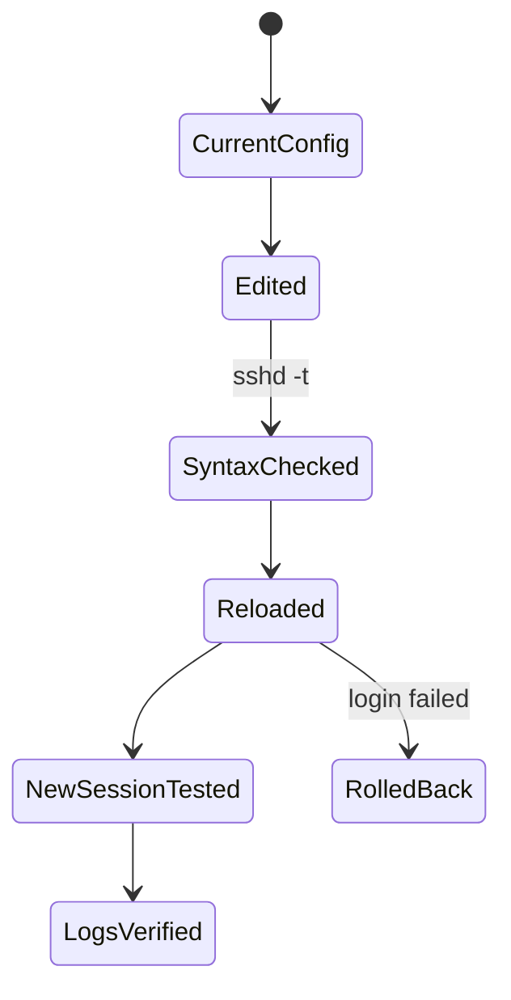

# SSH Configuration

이 문서는 SSH 클라이언트와 서버 설정을 안전하게 관리하기 위한 기준을 정리한다. 핵심은 접속 편의보다 잠금 방지, 인증 강도, 최소 기능 허용, 로그 검증이다.

## 1. 왜 필요한가? (Pain Point & Motivation)

SSH는 서버 관리의 기본 입구다. 설정 한 줄로 root 로그인을 막거나, 포트 포워딩을 제한하거나, SFTP 전용 계정을 만들 수 있지만, 잘못 적용하면 관리자 자신도 접속하지 못할 수 있다.

따라서 SSH 설정은 "강화 옵션 목록"이 아니라 변경 전 테스트, 두 번째 세션 유지, 로그 확인, 롤백 경로까지 포함한 운영 절차로 다뤄야 한다.

## 2. 현재 나의 상태 (Baseline)

흔한 출발점은 다음과 같다.

- `/etc/ssh/sshd_config`와 `~/.ssh/config`를 혼동한다.
- SSH 포트를 바꾸면 보안이 완성된다고 생각한다.
- 비밀번호 인증을 끄기 전에 키 로그인 검증을 하지 않는다.
- `ForceCommand`, `ChrootDirectory`, `AllowTcpForwarding`의 영향을 모른다.
- 서비스 이름이 배포판에 따라 `ssh` 또는 `sshd`일 수 있음을 놓친다.

## 3. 도달하고 싶은 목표 (Target State)

목표는 SSH 설정을 안전하게 변경하고 검증하는 것이다.

- 클라이언트 설정과 서버 설정의 파일 위치와 역할을 구분한다.
- 공개키 인증을 검증한 뒤 비밀번호 인증을 제한한다.
- root 로그인, 허용 사용자, 포워딩, X11, TTY, SFTP 정책을 의도적으로 설정한다.
- `sshd -t`로 문법을 검사한 뒤 reload 또는 restart한다.
- 기존 세션을 유지한 상태에서 새 세션으로 재접속 테스트를 한다.
- 인증 실패와 정책 거부를 로그에서 확인한다.

## 4. 시스템 번역 (Data Flow)

SSH 접속 흐름은 다음과 같다.

```text
client reads ~/.ssh/config
  -> connects to host and port
  -> server reads sshd_config
  -> host key is verified by client
  -> authentication method is negotiated
  -> user, group, address, Match rules are evaluated
  -> session, command, tunnel, or SFTP is allowed or denied
```

서버 설정 변경 흐름은 다음과 같다.

```text
edit sshd_config
  -> run sshd -t
  -> keep current session open
  -> reload ssh service
  -> test a new login
  -> inspect logs
```

## 5. 핵심 구성요소 (Building Blocks)

- `~/.ssh/config`: 클라이언트별 접속 별칭과 옵션.
- `/etc/ssh/sshd_config`: 서버 데몬 정책.
- `Host`: 클라이언트 설정에서 대상 별칭을 정의한다.
- `HostName`, `User`, `Port`, `IdentityFile`: 클라이언트 접속 정보를 줄이는 옵션.
- `PasswordAuthentication`: 비밀번호 인증 허용 여부.
- `PubkeyAuthentication`: 공개키 인증 허용 여부.
- `PermitRootLogin`: root 로그인 정책.
- `AllowUsers`, `AllowGroups`: 서버 접근 대상 제한.
- `AllowTcpForwarding`, `X11Forwarding`, `PermitTTY`: 세션 기능 제한.
- `Subsystem sftp`: SFTP 서브시스템 설정.
- `Match`: 사용자, 그룹, 주소, 포트 같은 조건별 설정 블록.

## 6. 상태 전이 (State Transition)

SSH 설정 변경은 다음 상태로 진행한다.



`NewSessionTested`가 끝날 때까지 기존 관리자 세션을 닫지 않는다.

## 7. 불변식 (Invariant: 절대 깨지면 안 되는 규칙)

- 비밀번호 인증을 끄기 전 공개키 로그인이 실제로 성공해야 한다.
- 설정 변경 전 현재 세션을 유지하고 대체 접속 경로를 확보해야 한다.
- `sshd -t` 문법 검증 없이 재시작하지 않는다.
- root 직접 로그인은 특별한 이유가 없으면 제한한다.
- 포워딩, X11, agent forwarding은 필요한 계정에만 허용한다.
- SFTP chroot는 디렉터리 소유권과 쓰기 권한 요구사항을 함께 만족해야 한다.

## 8. 가장 작은 예제 (Minimal Viable Example)

클라이언트 별칭:

```sshconfig
Host prod
    HostName 203.0.113.10
    User deploy
    Port 22
    IdentityFile ~/.ssh/prod_ed25519
```

서버 기본 강화 예시:

```sshconfig
PermitRootLogin no
PasswordAuthentication no
PubkeyAuthentication yes
PermitEmptyPasswords no
MaxAuthTries 3
AllowUsers deploy admin
X11Forwarding no
AllowTcpForwarding no
```

적용 전후 검증:

```bash
sudo sshd -t
sudo systemctl reload ssh || sudo systemctl reload sshd
ssh prod
sudo journalctl -u ssh -n 50
```

## 9. 실패 사례 (What could go wrong?)

- `PasswordAuthentication no`를 먼저 적용해 키가 없는 계정이 모두 잠긴다.
- `AllowUsers`에 현재 관리자를 빼먹어 재접속이 실패한다.
- `ChrootDirectory`가 사용자가 쓸 수 있는 디렉터리로 설정되어 sshd가 거부한다.
- `ForceCommand internal-sftp`가 예상보다 넓게 적용되어 일반 shell 접근이 막힌다.
- 서비스 이름 차이로 reload가 실패했는데 적용된 줄 알고 넘어간다.
- 방화벽에서 새 SSH 포트를 열지 않고 포트만 바꿔 접속이 끊긴다.

## 10. 뇌 확장하기 (Evolution & Variants)

- `Match` 블록으로 SFTP 전용 사용자와 관리자 shell 접근을 분리한다.
- SSH certificate authority를 도입해 개별 `authorized_keys` 관리를 줄인다.
- bastion host 또는 VPN/Tailscale/Zero Trust 뒤로 SSH 노출면을 줄인다.
- `LogLevel VERBOSE`를 제한적으로 사용해 키 fingerprint 기반 감사 로그를 강화한다.
- config management 도구로 sshd 설정 변경과 검증을 자동화한다.

## 11. 최종 체크리스트 (Definition of Done)

- [ ] 클라이언트 설정과 서버 설정 파일 역할을 구분한다.
- [ ] 공개키 로그인을 새 세션에서 검증했다.
- [ ] `sshd -t` 문법 검사를 통과했다.
- [ ] root 로그인, 비밀번호 인증, 허용 사용자 정책이 명시되어 있다.
- [ ] 포워딩, X11, TTY, SFTP 정책이 필요한 범위로 제한되어 있다.
- [ ] 변경 후 로그를 확인했다.

## 12. 뇌에 새기는 복습 문장 (TL;DR Blank)

SSH 설정은 접속 정책을 바꾸는 고위험 작업이므로, 키 로그인 검증, 문법 검사, 기존 세션 유지, 새 세션 테스트, 로그 확인을 한 세트로 수행해야 한다.
