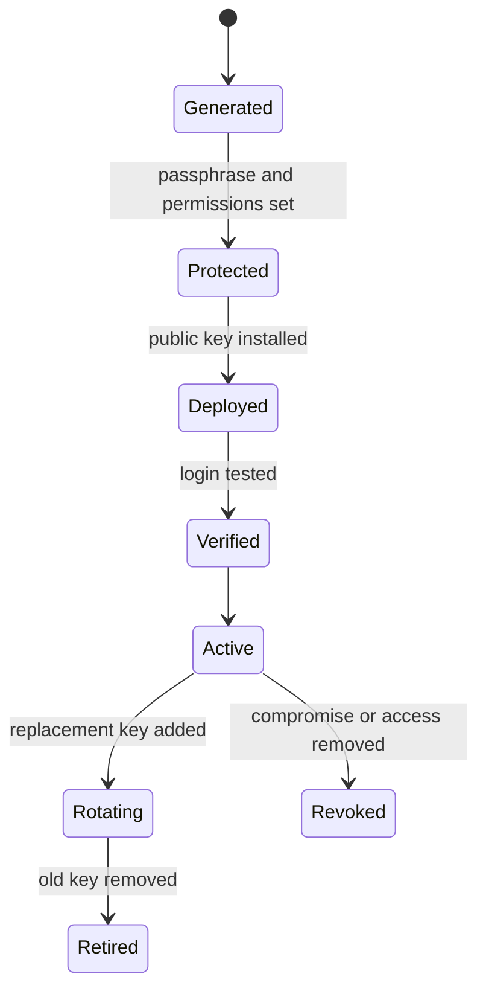

# SSH Key Management

SSH 키 관리는 키를 생성하고 서버에 복사하는 작업만이 아니라, 개인키 보호, 공개키 배포, 권한 설정, 회수, 회전까지 포함하는 접근 통제 절차다.

## 1. 왜 필요한가? (Pain Point & Motivation)

비밀번호 인증보다 키 기반 인증이 안전할 수 있지만, 개인키가 암호 없이 여러 장비에 복사되어 있거나 퇴사자 키가 `authorized_keys`에 남아 있으면 오히려 장기 접근 경로가 된다.

SSH 키 관리는 "한 번 만들어 계속 쓰는 파일"이 아니라 "누가 어떤 서버에 어떤 목적으로 접근할 수 있는지 증명하는 자격 증명"으로 다뤄야 한다.

## 2. 현재 나의 상태 (Baseline)

흔한 출발점은 다음과 같다.

- 모든 서버에 같은 개인키를 사용한다.
- 개인키에 passphrase를 걸지 않는다.
- `authorized_keys`에 오래된 키가 쌓여 있다.
- `.ssh`와 `authorized_keys` 권한을 확인하지 않는다.
- SSH agent가 편의 기능인지 보안 경계인지 구분하지 못한다.
- 키 회수와 로테이션 절차가 없다.

## 3. 도달하고 싶은 목표 (Target State)

목표는 키를 계정과 목적별로 추적 가능하게 관리하는 것이다.

- 새 키는 기본적으로 Ed25519를 사용하고 호환성 요구가 있을 때 RSA를 검토한다.
- 개인키는 passphrase와 파일 권한으로 보호한다.
- 공개키는 필요한 사용자 계정의 `authorized_keys`에만 배포한다.
- 서버별 또는 역할별 키를 구분한다.
- 키를 추가한 이유와 소유자를 기록한다.
- 만료, 회수, 교체 절차를 정한다.

## 4. 시스템 번역 (Data Flow)

키 인증 흐름은 다음과 같다.

```text
client selects private key
  -> server sends authentication challenge
  -> client proves possession of private key
  -> server checks matching public key in authorized_keys
  -> sshd applies user and Match policies
  -> session is allowed or denied
```

키 관리 흐름은 다음과 같다.

```text
generate key pair
  -> protect private key
  -> install public key on target account
  -> verify login
  -> remove password fallback if ready
  -> audit and rotate keys periodically
```

## 5. 핵심 구성요소 (Building Blocks)

- Private key: 절대 공유하지 않는 비밀 파일.
- Public key: 서버의 `authorized_keys`에 등록하는 공개 파일.
- Passphrase: 개인키 파일을 보호하는 암호.
- `authorized_keys`: 해당 사용자로 로그인 가능한 공개키 목록.
- `known_hosts`: 클라이언트가 서버 호스트 키를 기억하는 파일.
- SSH agent: passphrase를 매번 입력하지 않도록 개인키 사용을 중개하는 프로세스.
- `IdentityFile`: 클라이언트가 사용할 키 파일 지정.
- Key comment: 키 소유자와 목적을 추적하기 위한 설명.
- Rotation: 키를 주기적으로 교체하고 오래된 키를 제거하는 절차.
- Revocation: 유출되었거나 더 이상 필요 없는 키를 제거하는 절차.

## 6. 상태 전이 (State Transition)

키 생명주기는 다음처럼 관리한다.



`Rotating`에서는 새 키로 로그인할 수 있음을 확인한 뒤 오래된 공개키를 제거한다.

## 7. 불변식 (Invariant: 절대 깨지면 안 되는 규칙)

- 개인키는 서버에 복사하지 않는다.
- 개인키 파일 권한은 소유자만 읽을 수 있게 제한한다.
- `authorized_keys`는 대상 사용자 계정에만 적용된다.
- 공개키를 제거하기 전 대체 접속 경로를 확인한다.
- root 계정 키 등록은 특별한 운영 근거가 없으면 피한다.
- 키 주석에는 개인 정보나 비밀값을 넣지 않는다.

## 8. 가장 작은 예제 (Minimal Viable Example)

키 생성:

```bash
ssh-keygen -t ed25519 -f ~/.ssh/prod_ed25519 -C "prod deploy access"
chmod 600 ~/.ssh/prod_ed25519
```

공개키 배포:

```bash
ssh-copy-id -i ~/.ssh/prod_ed25519.pub deploy@example.com
```

클라이언트 설정:

```sshconfig
Host prod
    HostName example.com
    User deploy
    IdentityFile ~/.ssh/prod_ed25519
    IdentitiesOnly yes
```

검증:

```bash
ssh -v prod
```

서버에서 권한 문제가 있으면 다음을 확인한다.

```bash
chmod 700 ~/.ssh
chmod 600 ~/.ssh/authorized_keys
```

## 9. 실패 사례 (What could go wrong?)

- 개인키 권한이 너무 넓어 SSH 클라이언트가 키 사용을 거부한다.
- `authorized_keys`가 다른 사용자 홈에 들어가 엉뚱한 계정으로만 로그인된다.
- `ssh-agent`에 오래된 키가 먼저 제시되어 서버의 인증 시도 제한에 걸린다.
- 서버 host key 변경을 무시하고 접속하면 중간자 공격을 놓칠 수 있다.
- 퇴사자나 자동화 계정 키가 남아 장기 접근 경로가 된다.
- 같은 키를 여러 환경에 재사용해 하나의 유출이 전체 접근 유출로 번진다.

## 10. 뇌 확장하기 (Evolution & Variants)

- SSH certificate authority를 사용해 서버별 `authorized_keys` 관리를 줄인다.
- 하드웨어 보안키 기반 FIDO/U2F SSH 키를 검토한다.
- 배포 자동화 계정은 사람 계정과 별도 키, 별도 권한, 별도 로그로 관리한다.
- `from=`, `command=`, `no-port-forwarding` 같은 `authorized_keys` 옵션으로 키별 권한을 제한한다.
- 키 인벤토리를 만들어 소유자, 서버, 생성일, 만료일을 추적한다.

## 11. 최종 체크리스트 (Definition of Done)

- [ ] 키 목적과 소유자가 명확하다.
- [ ] 개인키는 passphrase와 권한으로 보호되어 있다.
- [ ] 공개키는 필요한 계정에만 배포되어 있다.
- [ ] 새 키로 로그인 검증을 완료했다.
- [ ] 오래된 키 제거 절차가 있다.
- [ ] 키 유출 시 회수할 서버 목록을 알고 있다.

## 12. 뇌에 새기는 복습 문장 (TL;DR Blank)

SSH 키는 파일이 아니라 접근 권한이므로, 생성보다 더 중요한 것은 소유자 추적, 개인키 보호, 배포 범위 제한, 회수와 회전이다.
