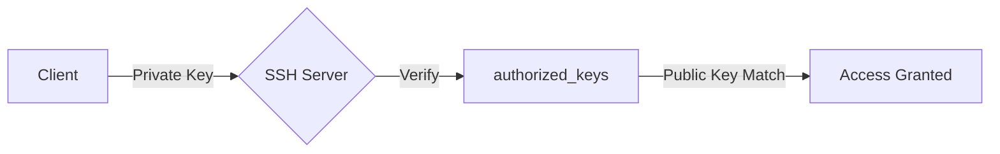

# SSH Key Management

> Complete guide to SSH key-based authentication setup

---

## Overview

SSH key authentication provides secure, password-less access to remote servers. It's more secure than password authentication and enables automation.



---

## Key Generation

### Generate SSH Key Pair

```bash
# Generate RSA key (default)
ssh-keygen -t rsa -b 4096 -C "your-email@example.com"

# Generate Ed25519 key (recommended)
ssh-keygen -t ed25519 -C "your-email@example.com"

# With custom filename
ssh-keygen -t ed25519 -f ~/.ssh/myserver_key -C "myserver-access"
```

**Key files created:**
- `~/.ssh/id_ed25519` - Private key (keep secret!)
- `~/.ssh/id_ed25519.pub` - Public key (share with servers)

---

## Server Setup

### 1. Copy Public Key to Server

```bash
# Method 1: ssh-copy-id (easiest)
ssh-copy-id user@server-ip

# Method 2: Manual copy
cat ~/.ssh/id_ed25519.pub | ssh user@server "mkdir -p ~/.ssh && cat >> ~/.ssh/authorized_keys"

# Method 3: Direct paste
# Copy content of ~/.ssh/id_ed25519.pub
# Paste into server's ~/.ssh/authorized_keys
```

### 2. Set Correct Permissions

```bash
# On the server
chmod 700 ~/.ssh
chmod 600 ~/.ssh/authorized_keys
chown -R $USER:$USER ~/.ssh
```

### 3. Disable Password Authentication

Edit `/etc/ssh/sshd_config`:

```bash
# Disable password auth
PasswordAuthentication no
PubkeyAuthentication yes

# Optional: More security
PermitRootLogin prohibit-password
PermitEmptyPasswords no
```

Restart SSH:

```bash
sudo systemctl restart sshd
```

---

## Multiple Users Setup

Each user needs their own authorized_keys:

```bash
# For user 'john'
/home/john/.ssh/authorized_keys

# For user 'jane'
/home/jane/.ssh/authorized_keys
```

### Permissions

```bash
# Set ownership
sudo chown -R john:john /home/john/.ssh
sudo chown -R jane:jane /home/jane/.ssh

# Set permissions
sudo chmod 700 /home/john/.ssh
sudo chmod 600 /home/john/.ssh/authorized_keys
```

---

## Using Keys

### SSH Connection

```bash
# Default key
ssh user@server

# Specific key
ssh -i ~/.ssh/myserver_key user@server

# With custom port
ssh -i ~/.ssh/myserver_key -p 2222 user@server
```

### SCP with Key

```bash
# Copy file to server
scp -i ~/.ssh/myserver_key file.txt user@server:/path/

# Copy with custom port
scp -P 2222 -i ~/.ssh/myserver_key file.txt user@server:/path/
```

### SSH Config File

Create `~/.ssh/config`:

```bash
Host myserver
    HostName 192.168.1.100
    User john
    Port 22
    IdentityFile ~/.ssh/myserver_key

Host production
    HostName prod.example.com
    User deploy
    Port 2222
    IdentityFile ~/.ssh/production_key
```

Then connect with:
```bash
ssh myserver
ssh production
```

---

## PuTTY Key Conversion

### Generate Key with PuTTYgen

1. Open PuTTYgen
2. Click "Generate" and move mouse for randomness
3. Save public key
4. Save private key (.ppk format)

### Convert PuTTY Key to OpenSSH

```bash
# Using PuTTYgen GUI:
# 1. Load private key (.ppk)
# 2. Conversions → Export OpenSSH key
# 3. Save as ~/.ssh/id_rsa (or desired name)

# Or using command line (Linux):
puttygen mykey.ppk -O private-openssh -o ~/.ssh/mykey
```

### Convert OpenSSH to PuTTY

```bash
# Using PuTTYgen GUI:
# 1. Conversions → Import key
# 2. Select OpenSSH private key
# 3. Save private key (.ppk)
```

---

## SSH Agent

### Start Agent

```bash
# Start ssh-agent
eval "$(ssh-agent -s)"

# Add key to agent
ssh-add ~/.ssh/id_ed25519

# List added keys
ssh-add -l
```

### Persistent Agent (bashrc)

Add to `~/.bashrc`:

```bash
if [ -z "$SSH_AUTH_SOCK" ]; then
   eval "$(ssh-agent -s)"
   ssh-add ~/.ssh/id_ed25519
fi
```

---

## Security Best Practices

| Practice | Description |
|----------|-------------|
| Use Ed25519 | Modern, secure, fast |
| Passphrase | Add passphrase to private keys |
| No root login | Use `PermitRootLogin no` |
| Limit users | Use `AllowUsers` directive |
| Audit keys | Regularly review authorized_keys |
| Rotate keys | Replace keys periodically |

---

## Troubleshooting

### Permission Denied

```bash
# Check permissions
ls -la ~/.ssh/
# Should be: drwx------ (700)

ls -la ~/.ssh/authorized_keys
# Should be: -rw------- (600)
```

### Debug Connection

```bash
ssh -vvv user@server
```

### Check Server Logs

```bash
sudo tail -f /var/log/auth.log
# or
sudo journalctl -u sshd -f
```

---

## Related Documentation

- [SSH Configuration](configuration.md)
- [SSH Match Rules](match-rules.md)
