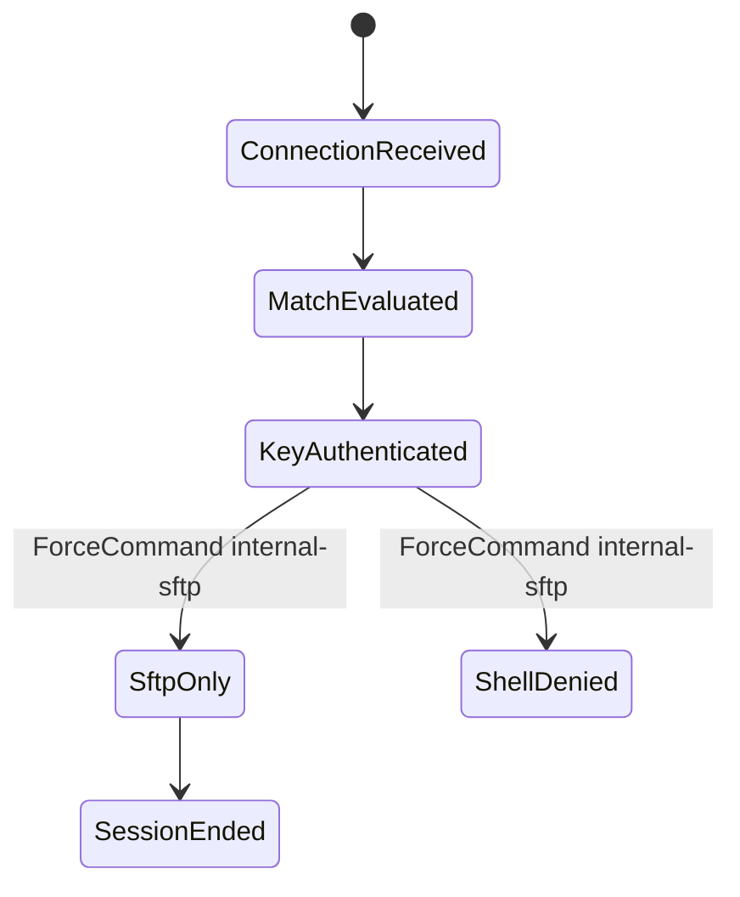

# SSH Match Rules

`Match` 지시어는 `sshd_config`에서 사용자, 그룹, 주소, 로컬 포트 같은 조건에 따라 SSH 서버 정책을 다르게 적용하는 기능이다.

## 적용 범위와 실행 전 조건

이 문서는 OpenSSH 서버 `sshd_config`의 설계 예시입니다. 설치된 버전에서 Match 내부에 허용되는 지시어를 확인합니다. client 전용 `LocalCommand`·`PermitLocalCommand`를 server 설정에 쓰지 않으며 폐기된 `Protocol` 지시어를 복원하지 않습니다.

- **순서 규칙**: 전역값, Include와 일치하는 Match 블록의 순서를 검사합니다. `Match all`은 항상 일치하는 새 조건 블록이며 전역 전용 지시어 허용을 복원하지 않습니다. 전역 기본값은 첫 Match 앞에 둡니다.
- **chroot 전제**: ChrootDirectory와 상위 경로는 root 소유이고 사용자가 쓸 수 없어야 합니다. 쓰기 작업은 jail 내부의 별도 하위 디렉토리에 허용합니다.
- **안전한 적용**: sudo sshd -t와 sudo sshd -T -C의 대표 사용자, 주소, 포트 조합을 통과한 뒤 기존 관리자 세션을 유지한 채 reload합니다.
- **실패 대응**: 새 세션이 실패하면 재시작을 반복하지 말고 백업 설정으로 복구합니다. 콘솔 또는 별도 관리 경로가 없으면 원격 변경을 진행하지 않습니다.
- **완료 조건**: 각 정책 조합의 허용과 거부 테스트, 셸/SFTP/포워딩 동작, chroot 권한, 감사 로그를 결과로 보관합니다.

Root 로그인 정책과 알고리즘 정책은 제품 버전과 조직 암호 정책을 기준으로 전역에서 관리합니다. 비밀번호, X11, 에이전트 및 TCP 포워딩 허용 예시는 위험을 승인한 제한된 환경에서만 사용합니다.

## 1. 왜 필요한가? (Pain Point & Motivation)

모든 SSH 사용자가 같은 권한을 필요로 하지는 않는다. 관리자는 shell과 포트 포워딩이 필요할 수 있지만, 백업 계정은 특정 명령만 실행하면 되고, SFTP 계정은 파일 전송만 허용되어야 한다.

`Match`는 이런 조건부 정책을 만들 수 있지만, 잘못 작성하면 설정이 예상보다 넓게 적용되어 shell 접근이 막히거나 포워딩이 열리는 문제가 생긴다.

## 2. 현재 나의 상태 (Baseline)

흔한 출발점은 다음과 같다.

- `Match` 블록이 어디까지 적용되는지 명확히 알지 못한다.
- SFTP 전용 계정에 chroot를 설정하면서 디렉터리 소유권 조건을 놓친다.
- `Address`와 `LocalAddress`, `LocalPort` 차이를 모른다.
- 조건을 추가한 뒤 `sshd -T -C`로 실제 적용 결과를 확인하지 않는다.
- `ForceCommand`가 일반 shell 접근을 막는다는 점을 뒤늦게 알게 된다.

## 3. 도달하고 싶은 목표 (Target State)

목표는 조건부 SSH 정책을 안전하게 설계하고 검증하는 것이다.

- global setting과 `Match` setting의 경계를 구분한다.
- User, Group, Address, LocalAddress, LocalPort 조건을 설명한다.
- SFTP-only 계정과 관리자 계정을 분리한다.
- 조건부 포워딩, TTY, X11, command 제한을 의도적으로 설정한다.
- `sshd -t`와 `sshd -T -C`로 문법과 effective config를 확인한다.
- 변경 후 실제 사용자/주소 조건으로 새 세션 테스트를 한다.

## 4. 시스템 번역 (Data Flow)

SSH 정책 적용 흐름은 다음과 같다.

```text
connection arrives
  -> sshd reads global config
  -> client user, source address, local address, local port are known
  -> matching Match blocks are evaluated
  -> effective options are applied
  -> authentication and session request are allowed or denied
```

검증 흐름은 다음과 같다.

```text
edit sshd_config
  -> sshd -t
  -> sshd -T -C user=...,host=...,addr=...
  -> reload sshd
  -> test real login
  -> inspect logs
```

## 5. 핵심 구성요소 (Building Blocks)

- `Match User`: 로그인 사용자 이름 기준.
- `Match Group`: 사용자의 그룹 기준.
- `Match Address`: 클라이언트 원격 IP 주소 기준.
- `Match LocalAddress`: 서버에서 연결을 받은 로컬 IP 주소 기준.
- `Match LocalPort`: 서버에서 연결을 받은 로컬 포트 기준.
- `ForceCommand`: 사용자가 요청한 명령 대신 특정 명령을 강제한다.
- `ChrootDirectory`: 사용자의 파일시스템 root를 제한한다.
- `PermitTTY`: interactive terminal 허용 여부.
- `AllowTcpForwarding`: local/remote port forwarding 허용 여부.
- `X11Forwarding`: X11 forwarding 허용 여부.
- `AllowAgentForwarding`: SSH agent forwarding 허용 여부.

## 6. 상태 전이 (State Transition)

SFTP 전용 계정의 접근 상태는 다음처럼 흐른다.



`ForceCommand internal-sftp`가 적용되면 해당 조건의 사용자는 일반 shell이 아니라 SFTP 세션으로 제한된다.

## 7. 불변식 (Invariant: 절대 깨지면 안 되는 규칙)

- `Match` 블록은 가능한 한 파일 끝쪽에 두고 적용 범위를 명확히 한다.
- 변경 전 현재 관리자 세션은 닫지 않는다.
- SFTP chroot 경로는 root가 소유하고 사용자가 쓰기 가능하지 않은 상위 경로 조건을 만족해야 한다.
- `AllowTcpForwarding yes`, `PermitTunnel yes`, `X11Forwarding yes`는 필요한 조건에만 허용한다.
- `ForceCommand`를 적용한 계정은 일반 shell이 필요한지 먼저 확인한다.
- effective config를 실제 사용자와 주소 조건으로 확인한다.

## 8. 가장 작은 예제 (Minimal Viable Example)

SFTP 전용 그룹 예시:

```sshconfig
Subsystem sftp internal-sftp
AllowTcpForwarding no

Match Group sftpusers
    ChrootDirectory /srv/sftp/%u
    ForceCommand internal-sftp
    DisableForwarding yes
    AllowTcpForwarding no
    X11Forwarding no
    PermitTTY no
```

위 전역 기본값과 SFTP 블록 뒤에 추가할 관리자 예시다. 승인된 관리 CIDR로 대체하고 그룹이 겹치는 사용자도 검사한다. SFTP의 `DisableForwarding yes`는 다른 forwarding 허용보다 우선하므로 SFTP 계정에 관리자 포워딩을 기대하지 않는다.

```sshconfig
Match Group admins Address 10.0.0.0/8
    AllowTcpForwarding yes
    PermitTTY yes
```

검증:

```bash
sudo sshd -t
sudo sshd -T -C user=alice,host=server,addr=10.0.0.10 | grep -E 'allowtcpforwarding|permittty|forcecommand|chrootdirectory'
```

## 9. 실패 사례 (What could go wrong?)

- `Match` 조건이 너무 넓어 일반 사용자에게도 `ForceCommand`가 적용된다.
- chroot 디렉터리를 사용자가 소유해 sshd가 보안상 거부한다.
- `Address`에 프록시나 NAT 뒤의 실제 관측 IP를 고려하지 않아 규칙이 맞지 않는다.
- `LocalPort` 기준 정책을 만들었지만 방화벽이나 포트 리다이렉트 경로가 달라 예상과 다르게 적용된다.
- agent forwarding을 넓게 허용해 중간 서버에서 키 사용 위험이 커진다.
- 설정 테스트 없이 reload해 원격 접속이 끊긴다.

## 10. 뇌 확장하기 (Evolution & Variants)

- `authorized_keys`의 `command=`, `from=`, `no-port-forwarding` 옵션과 `Match`의 차이를 비교한다.
- SFTP-only 계정은 업로드 디렉터리 소유권을 root-owned chroot와 분리해 설계한다.
- Tailscale이나 VPN 주소 대역에서만 관리자 기능을 허용하는 정책을 만든다.
- bastion host에서는 `AllowTcpForwarding`과 `PermitOpen`으로 목적지를 제한한다.
- audit 로그를 강화해 어떤 키와 어떤 계정이 어떤 세션을 열었는지 추적한다.

## 11. 최종 체크리스트 (Definition of Done)

- [ ] `Match` 조건의 대상 사용자, 그룹, 주소, 포트가 명확하다.
- [ ] global setting과 condition-specific setting이 충돌하지 않는다.
- [ ] `sshd -t` 문법 검사를 통과했다.
- [ ] `sshd -T -C`로 effective config를 확인했다.
- [ ] 실제 사용자로 새 SSH/SFTP 세션을 테스트했다.
- [ ] 포워딩, TTY, X11, agent forwarding 허용 범위가 최소화되어 있다.

## 12. 뇌에 새기는 복습 문장 (TL;DR Blank)

SSH `Match`는 조건부 접근 정책을 만드는 도구이며, 안전하게 쓰려면 적용 범위를 좁히고 effective config와 실제 로그인으로 반드시 검증해야 한다.
