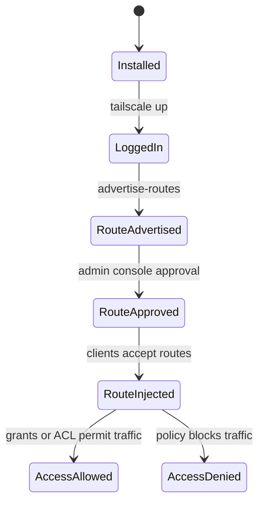

# Tailscale VPN

Tailscale은 WireGuard 기반의 메시 VPN으로, 각 장치를 tailnet에 등록해 NAT 뒤에서도 장치 간 암호화 통신을 쉽게 구성하게 해준다.

## 적용 범위와 운영 계약

이 가이드는 Tailscale 클라이언트와 관리 콘솔을 사용하는 tailnet 예시입니다. 운영체제, 클라이언트 버전, 계정 플랜, ACL 또는 grants 정책 형식에 따라 명령과 제한이 달라지므로 공식 문서와 현재 관리 콘솔을 기준으로 확인합니다.

- **증거 상태**: 속도, 기기 수, 업로드 제한과 기능 비교는 보장값이 아닌 정성적 참고입니다. 실제 경로가 direct인지 DERP relay인지, 왕복 지연과 처리량을 대상 기기 사이에서 측정합니다.
- **보안 전제**: SSO와 MFA, 최소 권한 정책, 태그 소유자, 장치 승인과 만료, 퇴사자 및 분실 장치 회수 절차를 먼저 정의합니다.
- **비밀 관리**: 인증 키는 등록용 비밀이며 문서, 셸 기록, 프로세스 목록, 로그에 남기지 않습니다. 가능한 경우 일회성, 사전 승인, 짧은 수명, ephemeral 속성을 사용하고 즉시 폐기할 수 있어야 합니다.
- **라우팅 변경**: Exit Node와 Subnet Router는 IP forwarding, 방화벽, DNS, 승인된 라우트, 역방향 경로와 장애 시 원복 경로를 함께 검토합니다.
- **완료 조건**: tailscale status, netcheck와 ping 결과, 승인 및 거부 정책 테스트, DNS와 대상 서비스 확인, relay 전환 시 동작, 장치 회수 테스트를 기록합니다.

설치 스크립트를 파이프로 바로 실행하기보다 지원 배포판과 저장소 서명을 확인하고 검토된 패키지 경로를 사용합니다. tailscale up의 반복 실행은 기존 비기본 플래그와 충돌할 수 있으므로 현재 버전에서 증분 변경용 tailscale set 지원 여부를 먼저 확인합니다.

포트포워딩 없이 외부에서 내부 서버에 접속하고 실제 연결 경로와 접근 정책을 검증하는 방법을 정리합니다.

## 1. 왜 필요한가? (Pain Point & Motivation)

내부 서버에 외부에서 접속하려고 SSH, RDP, NAS, 관리 UI 포트를 직접 열면 공격면이 커진다. WireGuard를 직접 운영할 수도 있지만 peer 관리, NAT traversal, ACL, 기기 인증을 직접 설계해야 한다.

Tailscale은 이 복잡성을 서비스형 control plane과 클라이언트로 줄여준다. 다만 "연결이 된다"와 "접근이 허용된다"는 다르다. 라우트 광고, admin console 승인, grants/ACL, 장치 key 만료를 따로 이해해야 한다.

## 2. 현재 나의 상태 (Baseline)

흔한 출발점은 다음과 같다.

- Tailscale IP가 생기면 모든 내부망에 접근할 수 있다고 생각한다.
- subnet router와 exit node를 같은 기능으로 본다.
- ACL이 라우트 주입 자체를 제어한다고 오해한다.
- Tailscale SSH가 일반 SSH 포트와 완전히 같은 방식이라고 생각한다.
- 서버 장치 key expiry를 놓쳐 광고한 route가 어느 날 도달 불가능해진다.
- tailnet에 초대한 장치의 접근 범위를 세밀하게 제한하지 않는다.

## 3. 도달하고 싶은 목표 (Target State)

목표는 Tailscale을 "연결성"과 "접근 정책"으로 분리해 운영하는 것이다.

- tailnet, device, MagicDNS, node key 개념을 설명한다.
- direct 연결과 DERP relay 연결의 차이를 이해한다.
- subnet router는 내부 subnet 접근용, exit node는 인터넷 egress 라우팅용임을 구분한다.
- route advertisement와 grants/ACL packet filtering이 다른 계층임을 설명한다.
- Tailscale SSH의 제한과 policy를 이해한다.
- 서버 장치에는 tags, key expiry, route approval, access control을 함께 설계한다.

## 4. 시스템 번역 (Data Flow)

기본 장치 간 연결 흐름은 다음과 같다.

```text
device logs into tailnet
  -> receives Tailscale IP and node identity
  -> control plane coordinates peer discovery
  -> peers attempt direct WireGuard path
  -> if direct path fails, traffic may use DERP relay
  -> grants or ACLs decide whether traffic is allowed
```

subnet router 흐름은 다음과 같다.

```text
router device advertises 192.168.1.0/24
  -> admin approves route
  -> clients receive route injection
  -> access policy allows or denies packets
  -> router forwards traffic to LAN
```

## 5. 핵심 구성요소 (Building Blocks)

- Tailnet: 한 조직 또는 계정의 Tailscale 사설 네트워크.
- Device: tailnet에 등록된 노드.
- Tailscale IP: tailnet 안에서 장치에 부여되는 주소.
- MagicDNS: 장치 이름으로 Tailscale IP를 해석하는 기능.
- DERP: direct 연결이 어려울 때 쓰이는 relay 경로.
- Subnet router: Tailscale이 설치되지 않은 내부 subnet으로 가는 gateway.
- Exit node: tailnet 장치의 인터넷 트래픽을 특정 장치로 내보내는 egress gateway.
- Grants/ACLs: tailnet에서 누가 어떤 목적지와 포트에 접근할 수 있는지 정하는 policy.
- Tags: 사람 계정 대신 서버 역할에 권한을 붙이기 위한 장치 라벨.
- Tailscale SSH: Tailscale identity와 policy로 SSH 접근을 제어하는 기능.

## 6. 상태 전이 (State Transition)

subnet router의 상태는 다음처럼 관리된다.



라우트가 주입되어도 access control이 막으면 패킷은 허용되지 않는다.

## 7. 불변식 (Invariant: 절대 깨지면 안 되는 규칙)

- subnet router와 exit node는 목적이 다르므로 대체해서 쓰면 안 된다.
- route advertisement는 접근 허용이 아니라 도달 경로 제공이다.
- 새 정책의 ACL/grants 형식은 현재 지원 기능과 요구에 맞게 선택한다. 기존 정책은 동작·거부 시험과 단계적 변경 계획 없이 강제 변환하지 않는다.
- 서버나 라우터 장치는 tags와 key expiry 정책을 명확히 해야 한다.
- auth key는 문서, Git, 로그에 남기지 않는다.
- Tailscale SSH는 대상 장치와 policy opt-in이 필요하며 모든 비-Tailscale 장치에 적용되는 기능이 아니다.

## 8. 가장 작은 예제 (Minimal Viable Example)

장치 연결:

```bash
sudo tailscale up
tailscale status
: "${TAILSCALE_PEER:?set reviewed peer name or address}"
tailscale ping "$TAILSCALE_PEER"
```

현재 client의 `tailscale set --help`를 확인하고 router의 IP forwarding, firewall, DNS·return path와 허용 subnet을 준비한다. 아래는 subnet router의 증분 설정 예시다.

```bash
sudo tailscale set --advertise-routes=192.168.1.0/24
```

그 다음 admin console에서 route를 승인하고, Linux 클라이언트에서는 필요하면 route 수락을 켠다.

```bash
sudo tailscale set --accept-routes
```

exit node 예시:

```bash
sudo tailscale set --advertise-exit-node
```

exit node도 admin 승인과 클라이언트 opt-in이 필요하다.

## 9. 실패 사례 (What could go wrong?)

- route를 광고했지만 admin console에서 승인하지 않아 클라이언트에 경로가 주입되지 않는다.
- Linux 클라이언트가 `--accept-routes`를 켜지 않아 subnet route를 쓰지 않는다.
- grants/ACL이 너무 넓어 모든 사용자가 내부 subnet 전체에 접근한다.
- exit node를 의도치 않게 사용해 모든 인터넷 트래픽이 특정 서버로 나간다.
- 서버 key가 만료되어 subnet route가 남아 있어도 실제 연결이 실패한다.
- Tailscale SSH policy의 `autogroup:nonroot` 의미를 잘못 이해해 원치 않는 로컬 사용자 접근을 허용한다.

## 10. 뇌 확장하기 (Evolution & Variants)

- tailnet policy file의 `grants`, `ssh`, `tagOwners`, `autoApprovers`, `tests`를 단계적으로 도입한다.
- 서버는 개인 계정보다 tag 기반으로 관리하고 tag owner를 제한한다.
- subnet router를 고가용성으로 구성할 때 route 우선순위와 장애 시 동작을 검토한다.
- Tailscale SSH와 기존 OpenSSH key 관리 방식을 함께 쓸지 분리할지 결정한다.
- 공식 문서의 subnet routers, exit nodes, Tailscale SSH, ACL/grants 문서를 기준으로 정책을 업데이트한다.

## 11. 최종 체크리스트 (Definition of Done)

- [ ] tailnet 장치 목록과 역할이 정리되어 있다.
- [ ] subnet router와 exit node 목적이 구분되어 있다.
- [ ] route 광고, admin 승인, client accept-routes가 확인되었다.
- [ ] grants/ACL이 필요한 destination과 port만 허용한다.
- [ ] 서버 장치의 tag와 key expiry 정책이 정해져 있다.
- [ ] `tailscale status`, `tailscale ping`, `tailscale netcheck`로 연결 상태를 확인했다.

## 12. 뇌에 새기는 복습 문장 (TL;DR Blank)

Tailscale의 연결 경로와 인가는 별도 검증 대상이다. 라우트 승인, ACL/grants, 장치 수명주기와 실제 허용·거부 시험을 함께 유지한다.
