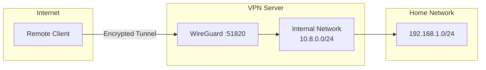

# WireGuard VPN Setup


## Scope and operational contract

This guide combines a third-party wg-easy deployment with a manual WireGuard example. Treat both as templates: container names, environment variables, firewall tooling, kernel support, and authentication settings vary by release and host.

- **Supply chain**: Use the current project registry, pin a reviewed release and image digest, inspect release notes and migrations, and retain a rollback image plus a backup of persistent state.
- **Secrets**: Generate keys under umask 077. Never expose private keys, QR codes, configuration exports, or admin password material in shell history, logs, tickets, or world-readable volumes.
- **Network assumptions**: Replace eth0, subnets, DNS, endpoint, and MTU with observed values. Full tunnel versus split tunnel, IPv6 routing, DNS leak behavior, forwarding, NAT, and overlapping routes require explicit decisions.
- **Exposure**: Keep the web administration UI on loopback or a private management network behind TLS and strong authentication. Only the WireGuard UDP port should be publicly reachable unless another path is justified.
- **Failure and rollback**: Back up firewall and WireGuard state, apply one peer at a time, and remove partially applied NAT rules before retrying.
- **Completion evidence**: Record recent handshakes, peer-specific AllowedIPs, route and DNS tests, intended internet egress, denied cross-peer access, restart persistence, and recovery from the saved configuration.

The Compose schema below reflects one product generation and must be reconciled with the pinned wg-easy release before use. Do not assume legacy PASSWORD_HASH or WG_* variables are accepted by a newer major version.

> Modern, fast, and secure VPN using WireGuard with Docker

---

## Overview

WireGuard is a modern VPN protocol that is faster and simpler than IPSec and OpenVPN.



---

## Quick Setup with Docker

### Docker Compose (wg-easy)

Create `docker-compose.yml`:

```yaml
version: "3.8"
services:
  wg-easy:
    image: ghcr.io/wg-easy/wg-easy:<approved-version>@sha256:<approved-digest>
    container_name: wg-easy
    environment:
      # Required: Your public hostname or IP
      - WG_HOST=vpn.example.com
      
      # Optional settings
      - PASSWORD_HASH=${PASSWORD_HASH}  # Use hash for security
      - WG_PORT=51820
      - WG_DEFAULT_ADDRESS=10.8.0.x
      - WG_DEFAULT_DNS=1.1.1.1
      - WG_MTU=1420
      - WG_ALLOWED_IPS=192.168.1.0/24, 10.8.0.0/24, 0.0.0.0/0
      - WG_PERSISTENT_KEEPALIVE=25
      
    volumes:
      - ./wireguard:/etc/wireguard
    ports:
      - "51820:51820/udp"  # WireGuard
      - "127.0.0.1:51821:51821/tcp"  # Web UI: expose through authenticated TLS proxy
    restart: unless-stopped
    cap_add:
      - NET_ADMIN
      - SYS_MODULE
    sysctls:
      - net.ipv4.ip_forward=1
      - net.ipv4.conf.all.src_valid_mark=1
```

### Generate Password Hash

```bash
# Create .env file with hashed password
echo "PASSWORD_HASH=$(docker run --rm -it ghcr.io/wg-easy/wg-easy wgpw 'your-password')" > .env
```

### Start the Server

```bash
docker compose up -d
```

Access the web UI only through an authenticated TLS reverse proxy; the example binds it to loopback.

---

## Manual Installation

### Install WireGuard

```bash
# Ubuntu/Debian
sudo apt update
sudo apt install wireguard

# Arch Linux
sudo pacman -S wireguard-tools

# Enable IP forwarding
echo "net.ipv4.ip_forward=1" | sudo tee -a /etc/sysctl.conf
sudo sysctl -p
```

### Generate Keys

```bash
# Generate server keys with restrictive permissions
umask 077
wg genkey | tee server_private.key | wg pubkey > server_public.key

# Generate client keys
wg genkey | tee client_private.key | wg pubkey > client_public.key
```

### Server Configuration

Create `/etc/wireguard/wg0.conf`:

```ini
[Interface]
PrivateKey = <server_private_key>
Address = 10.8.0.1/24
ListenPort = 51820
PostUp = iptables -A FORWARD -i wg0 -j ACCEPT; iptables -t nat -A POSTROUTING -o eth0 -j MASQUERADE
PostDown = iptables -D FORWARD -i wg0 -j ACCEPT; iptables -t nat -D POSTROUTING -o eth0 -j MASQUERADE

[Peer]
# Client 1
PublicKey = <client_public_key>
AllowedIPs = 10.8.0.2/32
```

### Client Configuration

Create `client.conf`:

```ini
[Interface]
PrivateKey = <client_private_key>
Address = 10.8.0.2/24
DNS = 1.1.1.1

[Peer]
PublicKey = <server_public_key>
Endpoint = vpn.example.com:51820
AllowedIPs = 0.0.0.0/0
PersistentKeepalive = 25
```

### Start WireGuard

```bash
# Start interface
sudo wg-quick up wg0

# Enable on boot
sudo systemctl enable wg-quick@wg0

# Check status
sudo wg show
```

---

## Configuration Options

| Option | Description | Example |
|--------|-------------|---------|
| `WG_HOST` | Public hostname/IP | `vpn.example.com` |
| `WG_PORT` | UDP listen port | `51820` |
| `WG_DEFAULT_ADDRESS` | Client IP range | `10.8.0.x` |
| `WG_DEFAULT_DNS` | DNS for clients | `1.1.1.1` |
| `WG_MTU` | Maximum transmission unit | `1420` |
| `WG_ALLOWED_IPS` | Networks accessible via VPN | `0.0.0.0/0` |

### AllowedIPs Scenarios

| Use Case | AllowedIPs |
|----------|------------|
| Full tunnel (all traffic) | `0.0.0.0/0` |
| Split tunnel (VPN only) | `10.8.0.0/24` |
| Access home network | `192.168.1.0/24, 10.8.0.0/24` |

---

## Firewall Configuration

### UFW

```bash
sudo ufw allow 51820/udp
sudo ufw reload
```

### iptables

```bash
sudo iptables -A INPUT -p udp --dport 51820 -j ACCEPT
sudo iptables -A FORWARD -i wg0 -j ACCEPT
sudo iptables -t nat -A POSTROUTING -o eth0 -j MASQUERADE
```

---

## Client Setup

### Mobile (iOS/Android)

1. Install WireGuard app
2. Scan QR code from wg-easy web UI
3. Or import `.conf` file

### Desktop (Windows/macOS/Linux)

1. Install WireGuard client
2. Import configuration file
3. Activate tunnel

### Linux CLI

```bash
# Install
sudo apt install wireguard

# Place config
sudo cp client.conf /etc/wireguard/wg0.conf

# Connect
sudo wg-quick up wg0

# Disconnect
sudo wg-quick down wg0
```

---

## Troubleshooting

### Check Connection Status

```bash
# Server
sudo wg show

# Check if port is open
sudo ss -lunp | grep 51820
```

### Common Issues

| Issue | Solution |
|-------|----------|
| Connection timeout | Check firewall, port forwarding |
| Handshake fails | Verify keys match, check endpoint |
| No internet after connect | Check IP forwarding, NAT rules |
| DNS not working | Verify DNS setting in client config |

### Debug Logs

```bash
# Enable verbose logging
sudo modprobe wireguard
dmesg | grep wireguard
```

---

## Related Documentation

- [Tailscale VPN](tailscale.md)
- [Network Configuration](../../infrastructure/networking/network-settings.md)
