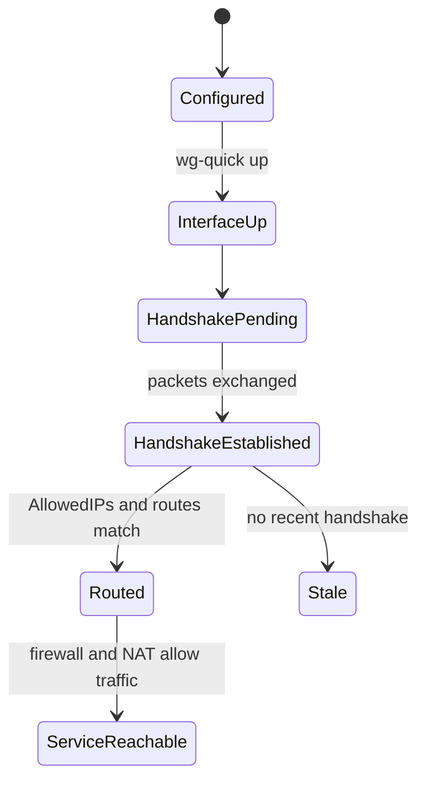

# WireGuard VPN

WireGuard는 peer와 cryptographic key를 중심으로 터널 인터페이스를 구성하는 VPN이다. 단순해 보이지만 `AllowedIPs`, 라우팅, NAT, 방화벽을 잘못 설정하면 연결은 되어도 원하는 네트워크에 도달하지 못한다.

## 1. 왜 필요한가? (Pain Point & Motivation)

집이나 사무실 내부 서비스에 외부에서 접근하려고 SSH, NAS, 관리 UI 포트를 인터넷에 열면 공격면이 커진다. WireGuard는 공개 포트를 하나만 열고 인증된 peer만 내부 네트워크로 들어오게 만드는 선택지다.

문제는 WireGuard가 "사용자 계정 기반 VPN"이 아니라 "peer key와 route 기반 터널"이라는 점이다. 어떤 peer가 어떤 IP 대역을 보낼 수 있는지 `AllowedIPs`로 정확히 설계해야 한다.

## 2. 현재 나의 상태 (Baseline)

흔한 출발점은 다음과 같다.

- server/client 구조로만 이해하고 peer 개념을 놓친다.
- `AllowedIPs = 0.0.0.0/0`가 모든 트래픽 터널링이라는 점을 모르고 쓴다.
- 터널은 handshake되는데 내부망 접근이 안 될 때 라우팅/NAT를 보지 않는다.
- UDP 포트 포워딩과 서버 방화벽 허용을 구분하지 못한다.
- 개인키를 compose 파일이나 문서에 그대로 남긴다.
- wg-easy Web UI를 인터넷에 그대로 노출한다.

## 3. 도달하고 싶은 목표 (Target State)

목표는 WireGuard 터널을 명시적인 route와 peer 정책으로 운영하는 것이다.

- 각 peer의 private key/public key 역할을 설명한다.
- 서버와 클라이언트의 `Address`, `ListenPort`, `Endpoint`, `AllowedIPs`를 구분한다.
- split tunnel과 full tunnel을 의도적으로 선택한다.
- 내부망 접근에는 IP forwarding, NAT 또는 라우팅이 필요함을 이해한다.
- `wg show`, `ip route`, 방화벽 로그로 문제를 진단한다.
- 관리 UI는 VPN 내부나 localhost 뒤에 둔다.

## 4. 시스템 번역 (Data Flow)

WireGuard 접속 흐름은 다음과 같다.

```text
peer sends UDP packet to endpoint
  -> WireGuard validates cryptographic identity
  -> packet is decrypted into wg interface
  -> AllowedIPs determines which peer owns the source/destination routes
  -> kernel routing table forwards packet
  -> NAT or internal route delivers traffic if needed
```

내부망 접근 흐름은 다음과 같다.

```text
remote client 10.8.0.2
  -> wg0 server 10.8.0.1
  -> server forwards packet to LAN
  -> LAN host replies through server route or NAT
  -> response returns through wg0
```

## 5. 핵심 구성요소 (Building Blocks)

- Peer: WireGuard에서 서로 통신하는 각 노드.
- Private key: 각 peer가 절대 공유하지 않는 비밀키.
- Public key: 상대 peer 설정에 등록하는 공개키.
- `Address`: 해당 WireGuard interface에 붙는 터널 IP.
- `ListenPort`: peer가 받는 UDP 포트.
- `Endpoint`: 상대 peer의 공인 주소와 포트.
- `AllowedIPs`: 해당 peer로 라우팅할 IP 대역이자 허용된 터널 IP 범위.
- `PersistentKeepalive`: NAT 뒤 클라이언트가 연결을 유지하도록 주기적 패킷을 보내는 옵션.
- `wg`: WireGuard 상태 확인 도구.
- `wg-quick`: interface bring-up/down을 자동화하는 helper.

## 6. 상태 전이 (State Transition)

peer 연결 상태는 다음처럼 본다.



`HandshakeEstablished`가 되어도 `ServiceReachable`이 보장되지는 않는다. 그 다음은 라우팅과 방화벽 문제다.

## 7. 불변식 (Invariant: 절대 깨지면 안 되는 규칙)

- private key는 문서, Git, 로그, 공유 채팅에 남기지 않는다.
- peer별 tunnel IP는 중복되면 안 된다.
- `AllowedIPs`는 full tunnel, split tunnel, site-to-site 목적에 맞게 최소화한다.
- 서버가 내부망으로 패킷을 전달하려면 IP forwarding과 return path가 필요하다.
- UDP 포트는 필요한 WireGuard listen port만 열어야 한다.
- 관리 UI 도구를 쓴다면 Web UI는 VPN 내부나 localhost 뒤에 둔다.

## 8. 가장 작은 예제 (Minimal Viable Example)

키 생성:

```bash
umask 077
wg genkey | tee server.key | wg pubkey > server.pub
wg genkey | tee client.key | wg pubkey > client.pub
```

서버 `wg0.conf` 예시:

```ini
[Interface]
Address = 10.8.0.1/24
ListenPort = 51820
PrivateKey = <server_private_key>

[Peer]
PublicKey = <client_public_key>
AllowedIPs = 10.8.0.2/32
```

클라이언트 split tunnel 예시:

```ini
[Interface]
Address = 10.8.0.2/24
PrivateKey = <client_private_key>
DNS = 1.1.1.1

[Peer]
PublicKey = <server_public_key>
Endpoint = vpn.example.com:51820
AllowedIPs = 10.8.0.0/24, 192.168.1.0/24
PersistentKeepalive = 25
```

상태 확인:

```bash
sudo wg-quick up wg0
sudo wg show
ip route
```

## 9. 실패 사례 (What could go wrong?)

- `AllowedIPs`가 겹쳐 어느 peer로 라우팅해야 할지 모호해진다.
- full tunnel 설정 후 DNS나 NAT가 없어 인터넷이 끊긴다.
- 서버에서 IP forwarding을 켜지 않아 내부망 접근이 안 된다.
- 내부 LAN host가 `10.8.0.0/24`로 돌아가는 경로를 몰라 응답이 돌아오지 않는다.
- 공유기에서 UDP 51820 포워딩을 하지 않아 외부 handshake가 안 된다.
- peer 개인키를 재사용해 유출 시 여러 장비를 동시에 교체해야 한다.

## 10. 뇌 확장하기 (Evolution & Variants)

- full tunnel, split tunnel, site-to-site, road warrior 구성을 각각 별도 프로필로 나눈다.
- NAT 방식과 내부 라우터에 정적 route를 추가하는 방식을 비교한다.
- `wg-easy` 같은 관리 UI를 쓸 경우 UI 접근 경로와 관리자 암호/해시 보관을 별도 검토한다.
- Tailscale과 비교해 NAT traversal, ACL, device identity를 서비스형으로 맡길지 판단한다.
- 서버 여러 대를 운영할 경우 peer inventory와 키 회전 절차를 만든다.

## 11. 최종 체크리스트 (Definition of Done)

- [ ] peer별 private/public key가 분리되어 있다.
- [ ] `AllowedIPs`가 목적에 맞게 최소화되어 있다.
- [ ] UDP listen port와 방화벽/포트포워딩이 맞다.
- [ ] 내부망 접근 시 IP forwarding과 return path를 검증했다.
- [ ] `wg show`에서 handshake와 transfer를 확인했다.
- [ ] private key와 관리 UI가 외부에 노출되지 않는다.

## 12. 뇌에 새기는 복습 문장 (TL;DR Blank)

WireGuard는 peer key와 `AllowedIPs`로 라우팅과 접근을 동시에 표현하므로, handshake 이후에도 route, NAT, firewall을 따로 검증해야 한다.
