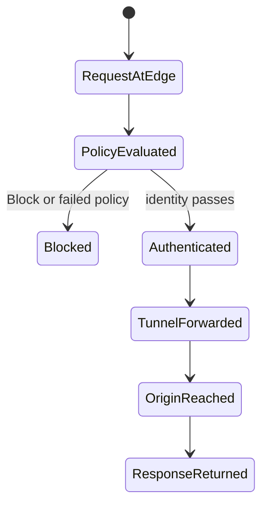

# Cloudflare Zero Trust

Cloudflare Zero Trust 구성은 Cloudflare Tunnel로 origin을 직접 노출하지 않고 연결하고, Access policy로 사용자가 애플리케이션에 도달할 수 있는지 평가하는 접근 제어 구조다.

## 문서 상태와 실행 게이트

이 문서는 Docker 기반 cloudflared connector와 Access 정책의 설계 예시입니다. 선택한 Cloudflare/cloudflared 버전과 실제 origin topology에서 명령·인증·노출 경계를 확인한 뒤 적용합니다.

- **범위와 버전**: Cloudflare 플랜, Access 정책 모델, 터널 유형, cloudflared 이미지와 바이너리 버전, Ubuntu 및 Docker 버전을 기록합니다. 비용, 업로드 크기, 프로토콜 지원은 현재 플랜에서 확인합니다.
- **신뢰 경계**: Tunnel은 오리진을 자동으로 인가하지 않습니다. 기본 거부 Access 정책, MFA, 서비스 토큰 수명과 회수, 최소 권한 API 토큰, 오리진의 직접 접근 차단을 별도로 검증합니다.
- **비밀과 공급망**: 터널 토큰, credentials 파일, API 키와 비밀번호를 명령 기록이나 Compose 파일에 넣지 않습니다. 패키지 서명과 체크섬을 검증하고 이미지와 바이너리를 승인 버전 또는 digest로 고정합니다.
- **진단 원칙**: HTTP 521, 502와 context canceled는 여러 원인이 가능한 증상입니다. DNS, 터널 상태, 컨테이너 네트워크, 오리진 리슨 주소, TLS 검증, 타임아웃을 계층별 증거로 분리하며 noTLSVerify를 일반 해결책으로 사용하지 않습니다.
- **변경과 롤백**: 현재 설정과 인증서를 백업하고 구문 검사를 통과한 뒤 한 계층씩 적용합니다. 기존 관리 경로를 유지하고 실패하면 마지막 정상 설정과 고정 이미지로 되돌립니다.
- **완료 조건**: 비인가 요청 거부, 승인 사용자와 서비스 토큰 성공, 오리진 직접 접근 차단, WebSocket과 업로드 시험, 재시작 후 터널 복구, 감사 로그와 경보 수신을 기록합니다.

장애 로그는 해당 환경·시점의 관찰값으로 취급합니다. debug 로그에는 헤더와 token이 포함될 수 있으므로 수집 범위와 보존을 제한하고 공유 전에 redaction합니다.

## 1. 왜 필요한가? (Pain Point & Motivation)

홈서버나 내부 애플리케이션을 공개하려고 공유기 포트포워딩과 공인 IP 노출을 사용하면 origin이 직접 공격면이 된다. Reverse proxy만 세워도 인증과 정책을 별도로 붙이지 않으면 우회 경로가 남는다.

Cloudflare Tunnel은 `cloudflared`가 내부에서 Cloudflare로 outbound 연결을 만들게 하며, Access는 애플리케이션 앞에서 사용자, 이메일, 그룹, device posture 같은 조건을 평가한다. 핵심은 터널과 정책, origin 방화벽을 함께 맞추는 것이다.

## 2. 현재 나의 상태 (Baseline)

흔한 출발점은 다음과 같다.

- Cloudflare DNS proxy만 켜면 Zero Trust가 된다고 생각한다.
- Tunnel을 만들었지만 origin의 80/443 포트가 여전히 인터넷에 열려 있다.
- Access application을 만들지 않아 인증 없이 서비스가 노출된다.
- Include/Require/Exclude의 차이를 모른다.
- tunnel token을 compose 파일이나 로그에 그대로 남긴다.
- 내부 reverse proxy의 `X-Forwarded-For`, `CF-Connecting-IP` 처리와 로그를 확인하지 않는다.

## 3. 도달하고 싶은 목표 (Target State)

목표는 origin 직접 노출 없이 정책 기반으로 내부 서비스를 공개하는 것이다.

- `cloudflared`가 outbound-only tunnel을 만든다는 점을 설명한다.
- public hostname이 tunnel의 내부 service URL로 매핑되는 흐름을 이해한다.
- Access policy의 action, rule type, selector, value를 구분한다.
- Include, Require, Exclude의 논리 차이를 설명한다.
- tunnel token과 service token을 비밀값으로 관리한다.
- origin은 인터넷에 직접 노출하지 않고 connector의 승인된 내부 경로로만 접근하게 한다. Tunnel은 outbound 연결이므로 공개 origin 포트를 열거나 Cloudflare IP의 inbound 허용을 필수로 가정하지 않는다.

## 4. 시스템 번역 (Data Flow)

HTTP 애플리케이션 접근 흐름은 다음과 같다.

```text
user opens app.example.com
  -> request reaches Cloudflare edge
  -> Access policy checks identity and context
  -> allowed request is sent through Cloudflare Tunnel
  -> cloudflared receives traffic over outbound tunnel
  -> cloudflared forwards to local service or reverse proxy
  -> origin application responds through the same path
```

터널 구성 흐름은 다음과 같다.

```text
create tunnel
  -> install cloudflared connector
  -> authenticate or install tunnel token
  -> map public hostname to internal service
  -> create Access application
  -> add allow and require policies
  -> verify no direct origin bypass remains
```

## 5. 핵심 구성요소 (Building Blocks)

- Cloudflare Tunnel: origin에서 Cloudflare로 만드는 지속적인 outbound 연결.
- `cloudflared`: 서버나 컨테이너에서 tunnel connector로 실행되는 데몬.
- Tunnel token: remotely-managed tunnel을 실행하는 비밀 토큰.
- Public hostname: `app.example.com`처럼 Cloudflare가 받는 외부 이름.
- Origin service: `http://localhost:8080`, `http://nginx:80` 같은 내부 목적지.
- Access application: Access policy를 적용할 self-hosted application 정의.
- Access policy action: Allow, Block, Bypass, Service Auth.
- Include rule: 접근 후보를 넓히는 OR 조건.
- Require rule: 후보가 반드시 만족해야 하는 AND 조건.
- Exclude rule: 조건에 해당하면 제외하는 NOT 조건.
- Service token: 사람 로그인이 아닌 서비스 간 접근에 쓰는 인증 수단.

## 6. 상태 전이 (State Transition)

요청 상태는 다음처럼 전이된다.



터널이 정상이어도 Access policy가 없거나 너무 넓으면 보안 목표를 달성하지 못한다.

## 7. 불변식 (Invariant: 절대 깨지면 안 되는 규칙)

- Tunnel token과 service token은 비밀값으로 관리해야 한다.
- origin의 공인 IP와 직접 포트가 열려 있으면 Cloudflare Access를 우회할 수 있다.
- Access policy에는 최소 하나의 Include 조건이 필요하고, Require와 Exclude로 범위를 좁힌다.
- Bypass는 영구 내부 앱 접근 허용 수단으로 남용하지 않는다.
- 내부 reverse proxy는 실제 client IP 헤더를 신뢰할 조건을 명확히 해야 한다.
- Access 로그와 origin 로그를 함께 확인해 정책 적용 여부를 검증한다.

## 8. 가장 작은 예제 (Minimal Viable Example)

아래는 기존 `app` 컨테이너가 포트 8080으로 서비스하며 공유 Docker network에 연결된 경우다. app의 8080은 public host port로 publish하지 않는다. `ORIGIN_NETWORK`는 app도 연결된 기존 network 이름이며 `CLOUDFLARED_IMAGE`는 검토한 공식 image tag/digest다.

```yaml
services:
  cloudflared:
    image: "${CLOUDFLARED_IMAGE:?set reviewed cloudflared tag or digest}"
    command: tunnel --no-autoupdate run
    environment:
      TUNNEL_TOKEN: "${CLOUDFLARE_TUNNEL_TOKEN:?provide tunnel token securely}"
    networks:
      - origin
    restart: unless-stopped
networks:
  origin:
    external: true
    name: "${ORIGIN_NETWORK:?set the existing app network}"
```

실제 token은 권한이 제한된 비추적 환경 파일 또는 secret 저장소에서 주입한다. Compose의 reference에는 값이 없지만 렌더링 결과와 container inspect에는 비밀이 나타날 수 있으므로 공유하지 않는다.

먼저 `app.example.com`의 Access application을 만들고 기본 거부 및 승인 조건을 검토한다. 그 뒤 public hostname을 연결하며 비인가 요청이 origin에 도달하지 않는지 확인한다.

```text
Access action: Allow
Include: approved organizational identity/group
Require: the explicitly chosen MFA/device conditions
Exclude: explicitly blocked identities or conditions

Tunnel hostname: app.example.com
Tunnel service: http://app:8080
```

Docker connector 내부의 `localhost`는 connector 자신이므로 위 app을 가리키지 않는다. host에서 실행하는 origin은 다른 topology이며 그 실행 위치에서 도달 가능한 private 경로를 별도로 검증한다. Access rule의 OR/AND와 여러 policy의 action 우선순위는 설치된 정책 모델에서 확인한다.

검증은 비인가 거부·승인 사용자 성공, origin 직접 접근 차단, connector의 DNS/서비스 도달성, WebSocket, 재시작과 token 회수 결과를 함께 확인한다.

## 9. 실패 사례 (What could go wrong?)

- origin 포트가 인터넷에 그대로 열려 있어 사용자가 Cloudflare를 우회한다.
- Access application hostname과 Tunnel public hostname이 다르게 설정되어 정책이 적용되지 않는다.
- Include를 `Everyone`으로 넓게 잡고 Require 조건이 없어 사실상 공개 서비스가 된다.
- tunnel token이 Git에 커밋되어 누구나 connector를 실행할 수 있다.
- reverse proxy가 내부 서비스 전체를 wildcard로 라우팅해 의도치 않은 앱이 노출된다.
- WebSocket, large upload, non-HTTP 프로토콜 요구사항을 확인하지 않고 HTTP 앱처럼 연결한다.

## 10. 뇌 확장하기 (Evolution & Variants)

- 여러 connector를 같은 tunnel에 붙여 고가용성을 높인다.
- Access policy에 IdP group, device posture, WARP/Gateway 조건을 추가한다.
- SSH/RDP 같은 non-HTTP 접근은 Access for Infrastructure 또는 Cloudflare One Client 요구사항을 별도 검토한다.
- Terraform으로 Tunnel, DNS, Access application, policy를 코드화한다.
- Nginx Proxy Manager, Caddy, Traefik 같은 내부 프록시와 Cloudflare Tunnel의 책임을 분리한다.

## 11. 최종 체크리스트 (Definition of Done)

- [ ] `cloudflared` connector가 정상 실행된다.
- [ ] public hostname이 올바른 내부 service URL로 매핑되어 있다.
- [ ] Access application과 hostname이 일치한다.
- [ ] Include, Require, Exclude 정책이 최소 권한으로 작성되어 있다.
- [ ] origin 직접 접속 우회 경로가 차단되어 있다.
- [ ] tunnel token, service token, API token이 비밀로 관리된다.

## 12. 뇌에 새기는 복습 문장 (TL;DR Blank)

Cloudflare Zero Trust는 Tunnel로 origin을 직접 숨기고 Access policy로 사용자를 검증하는 구조이며, 우회 포트 차단과 정책 로그 확인까지 해야 안전하다.
