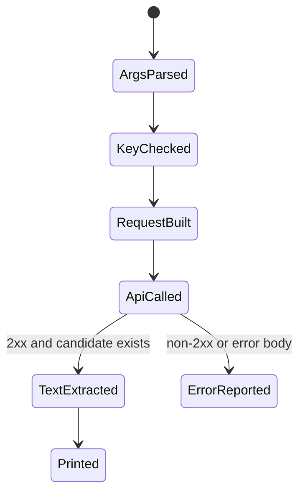

# Gemini Shell

Gemini Shell은 Google Gemini API의 `generateContent` 호출을 터미널에서 안전하게 실행하기 위한 작은 래퍼 설계 문서다.

## 1. 왜 필요한가? (Pain Point & Motivation)

Gemini API는 `curl`로도 호출할 수 있지만, 매번 JSON을 직접 만들면 escaping, API key 관리, 오류 처리, 응답 파싱에서 실수하기 쉽다.

쉘 래퍼의 목적은 모델 호출을 단순하게 만드는 것이 아니라, API key를 환경 변수로 분리하고, 입력을 검증하고, 실패 응답을 명확히 표시하고, 텍스트 출력과 raw JSON을 선택할 수 있게 하는 것이다.

## 2. 현재 나의 상태 (Baseline)

기존 스크립트형 접근에서 흔한 문제는 다음과 같다.

- API key를 명령어, 파일, Git 기록에 남긴다.
- `sed`로 JSON을 조립해 따옴표와 줄바꿈에서 깨진다.
- 응답 JSON 전체를 그대로 출력해 실제 답변을 찾기 어렵다.
- HTTP status와 API error body를 구분하지 않는다.
- 모델 이름을 스크립트에 하드코딩한다.
- `jq`, `curl` 의존성을 확인하지 않는다.

## 3. 도달하고 싶은 목표 (Target State)

목표는 반복 사용 가능한 최소 CLI를 만드는 것이다.

- `GEMINI_API_KEY` 환경 변수만으로 인증한다.
- prompt, model, temperature, max output tokens를 인자로 받는다.
- JSON은 `jq`로 생성해 escaping 문제를 줄인다.
- HTTP status code와 Gemini error body를 모두 확인한다.
- 기본 출력은 텍스트만, 옵션으로 raw JSON을 출력한다.
- secrets와 prompt 로그 저장 여부를 명확히 통제한다.

## 4. 시스템 번역 (Data Flow)

호출 흐름은 다음과 같다.

```text
user enters prompt
  -> script validates arguments and GEMINI_API_KEY
  -> jq builds request JSON
  -> curl calls models/<model>:generateContent
  -> script checks HTTP status and error body
  -> script extracts candidates[0].content.parts text
  -> text or raw JSON is printed
```

API key는 URL query string보다 header나 공식 SDK 설정을 우선 검토한다. 쉘 래퍼에서 query string을 쓰는 경우 shell history와 process listing 노출을 별도로 주의한다.

## 5. 핵심 구성요소 (Building Blocks)

- `curl`: REST API 호출.
- `jq`: JSON request 생성과 response 파싱.
- `GEMINI_API_KEY`: API key 환경 변수.
- `model`: 호출할 Gemini model 이름.
- `contents`: 사용자 prompt를 담는 요청 필드.
- `generationConfig`: temperature, max output tokens 같은 생성 옵션.
- HTTP status: 네트워크/API gateway 수준의 성공/실패.
- API error body: Gemini API가 반환하는 상세 오류.
- raw mode: 디버깅을 위해 전체 JSON을 출력하는 모드.

## 6. 상태 전이 (State Transition)

CLI 호출 상태는 다음처럼 흐른다.



`ApiCalled` 이후 실패를 단순히 "빈 응답"으로 처리하면 rate limit, auth error, safety block, model name 오류를 구분할 수 없다.

## 7. 불변식 (Invariant: 절대 깨지면 안 되는 규칙)

- API key는 스크립트 본문에 하드코딩하지 않는다.
- JSON request는 문자열 치환보다 JSON 도구로 만든다.
- model 이름은 기본값이 있어도 인자로 덮어쓸 수 있어야 한다.
- HTTP status와 `.error` 필드를 확인한다.
- prompt와 응답을 파일로 저장할 때는 민감 정보 포함 여부를 검토한다.
- API 응답 구조가 바뀔 수 있으므로 raw JSON 디버그 옵션을 유지한다.

## 8. 가장 작은 예제 (Minimal Viable Example)

최소 호출 예시는 다음과 같다.

```bash
export GEMINI_API_KEY="..."

prompt="Write a one sentence summary of SSH key rotation."
model="gemini-2.5-flash"

jq -n --arg text "$prompt" '{
  contents: [
    {
      parts: [
        {text: $text}
      ]
    }
  ]
}' > request.json

curl -sS \
  -H "Content-Type: application/json" \
  -H "x-goog-api-key: ${GEMINI_API_KEY}" \
  -X POST \
  "https://generativelanguage.googleapis.com/v1beta/models/${model}:generateContent" \
  -d @request.json | jq -r '.candidates[0].content.parts[]?.text'
```

실제 래퍼에서는 임시 파일 대신 pipe를 쓰고, `trap`으로 임시 파일을 지우며, status code를 따로 저장한다.

## 9. 실패 사례 (What could go wrong?)

- API key가 shell history나 process list에 노출된다.
- 모델 이름이 현재 API에서 지원되지 않아 404나 unsupported method 오류가 난다.
- `jq` 없이 `sed`로 prompt를 넣다가 따옴표, 역슬래시, 줄바꿈이 깨진다.
- safety 또는 content policy로 candidate가 비어 있는데 텍스트 없음만 출력한다.
- rate limit이나 quota 오류를 재시도 없이 무시한다.
- raw JSON을 로그에 저장해 민감 prompt가 남는다.

## 10. 뇌 확장하기 (Evolution & Variants)

- 공식 SDK 기반 버전과 REST `curl` 버전을 분리한다.
- streaming endpoint를 사용하는 별도 명령을 만든다.
- system instruction, JSON schema output, tool calling 같은 옵션을 플래그로 확장한다.
- `--raw`, `--text`, `--save`, `--model`, `--temperature` 옵션을 추가한다.
- retry는 429/5xx에만 제한적으로 적용하고 exponential backoff를 둔다.

## 11. 최종 체크리스트 (Definition of Done)

- [ ] `GEMINI_API_KEY` 환경 변수 없으면 실행을 중단한다.
- [ ] `curl`과 `jq` 존재를 확인한다.
- [ ] JSON request는 `jq`로 만든다.
- [ ] HTTP status와 API error를 구분해 출력한다.
- [ ] 텍스트 출력과 raw JSON 출력 모드를 분리한다.
- [ ] API key와 prompt 로그 노출 위험을 문서화했다.

## 12. 뇌에 새기는 복습 문장 (TL;DR Blank)

Gemini Shell의 핵심은 API 호출을 짧게 만드는 것이 아니라, key 관리, JSON 생성, 오류 처리, 응답 파싱을 안전하게 표준화하는 것이다.
