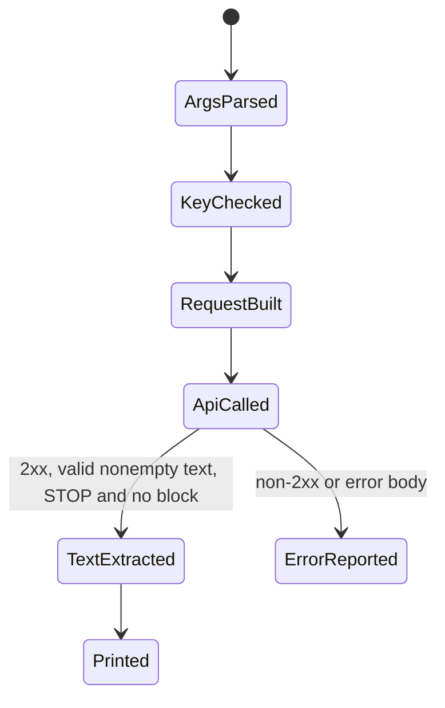

# Gemini Shell

Gemini Shell은 Google Gemini API의 `generateContent` 호출을 터미널에서 안전하게 실행하기 위한 작은 래퍼 설계 문서다.

## 실행 전 계약과 예제 상태

이 문서는 단일 Bash 요청 예제와 확장 가능한 CLI 설계를 설명합니다. v1beta endpoint, model ID, 생성 옵션과 응답 형식은 선택한 Gemini API/model revision의 명세로 확인하고 모델을 명시적으로 지정합니다.

- **증거 상태**: 예제는 이 문서에서 실행 검증되지 않았습니다. sed 또는 grep 기반 JSON 대체 경로는 따옴표, 줄바꿈, Unicode와 오류 응답을 안전하게 처리하지 못하므로 운영 사용에서는 jq를 필수 의존성으로 둡니다.
- **비밀과 데이터**: API 키를 URL 쿼리, 명령 인자, 디버그 로그에 넣지 않고 전용 헤더와 비밀 저장소를 사용합니다. 프롬프트와 응답의 개인정보, 소스 코드, 보존 기간과 출력 파일 권한을 검토합니다.
- **오류 처리**: curl의 HTTP 실패와 타임아웃을 구분하고 429 및 일시적 5xx만 Retry-After와 지수 백오프, jitter, 최대 횟수로 재시도합니다. 인증 실패와 잘못된 요청은 자동 재시도하지 않습니다.
- **응답 판정**: HTTP 상태, API 오류 객체, candidate 종료 이유, 안전 차단, 빈 응답, 토큰 사용량을 각각 처리하고 원문 응답은 민감정보를 제거한 경우에만 제한적으로 보관합니다.
- **완료 조건**: 정상 응답, 잘못된 키, 할당량 제한, 타임아웃, 빈 candidate, 특수문자 프롬프트를 시험하고 종료 코드와 stderr, 요청 추적 ID를 증거로 남깁니다.

아래 최소 예제는 요청 한 번만 수행하며 자동 재시도·streaming·raw mode는 구현하지 않습니다. 이를 운영 wrapper로 확장할 때 요청 생성, 오류 분류, 제한 재시도와 출력 계약을 함수로 나누어 검증합니다.

## 1. 왜 필요한가? (Pain Point & Motivation)

Gemini API는 `curl`로도 호출할 수 있지만, 매번 JSON을 직접 만들면 escaping, API key 관리, 오류 처리, 응답 파싱에서 실수하기 쉽다.

쉘 래퍼의 목적은 모델 호출을 단순하게 만드는 것이 아니라, API key를 환경 변수로 분리하고, 입력을 검증하고, 실패 응답을 명확히 표시하고, 텍스트 출력과 raw JSON을 선택할 수 있게 하는 것이다.

## 2. 현재 나의 상태 (Baseline)

기존 스크립트형 접근에서 흔한 문제는 다음과 같다.

- API key를 명령어, 파일, Git 기록에 남긴다.
- `sed`로 JSON을 조립해 따옴표와 줄바꿈에서 깨진다.
- 응답 JSON 전체를 그대로 출력해 실제 답변을 찾기 어렵다.
- HTTP status와 API error body를 구분하지 않는다.
- 모델 이름을 스크립트에 하드코딩한다.
- `jq`, `curl` 의존성을 확인하지 않는다.

## 3. 도달하고 싶은 목표 (Target State)

목표는 반복 사용 가능한 최소 CLI를 만드는 것이다.

- `GEMINI_API_KEY` 환경 변수만으로 인증한다.
- prompt, model, temperature, max output tokens를 인자로 받는다.
- JSON은 `jq`로 생성해 escaping 문제를 줄인다.
- HTTP status code와 Gemini error body를 모두 확인한다.
- 기본 출력은 텍스트만, 옵션으로 raw JSON을 출력한다.
- secrets와 prompt 로그 저장 여부를 명확히 통제한다.

## 4. 시스템 번역 (Data Flow)

호출 흐름은 다음과 같다.

```text
user enters prompt
  -> script validates arguments and GEMINI_API_KEY
  -> jq builds request JSON
  -> curl calls models/<model>:generateContent
  -> script checks HTTP status and error body
  -> script extracts candidates[0].content.parts text
  -> text or raw JSON is printed
```

API key는 URL query string에 넣지 않는다. 이 예제는 제한된 header 파일을 통해 curl에 전달하며 shell history·명령 인자·debug log에 값을 남기지 않는다.

## 5. 핵심 구성요소 (Building Blocks)

- `curl`: REST API 호출.
- `jq`: JSON request 생성과 response 파싱.
- `GEMINI_API_KEY`: API key 환경 변수.
- `model`: 호출할 Gemini model 이름.
- `contents`: 사용자 prompt를 담는 요청 필드.
- `generationConfig`: temperature, max output tokens 같은 생성 옵션.
- HTTP status: 네트워크/API gateway 수준의 성공/실패.
- API error body: Gemini API가 반환하는 상세 오류.
- raw mode: 디버깅을 위해 전체 JSON을 출력하는 모드.

## 6. 상태 전이 (State Transition)

CLI 호출 상태는 다음처럼 흐른다.



`ApiCalled` 이후 실패를 단순히 "빈 응답"으로 처리하면 rate limit, auth error, safety block, model name 오류를 구분할 수 없다.

## 7. 불변식 (Invariant: 절대 깨지면 안 되는 규칙)

- API key는 스크립트 본문에 하드코딩하지 않는다.
- JSON request는 문자열 치환보다 JSON 도구로 만든다.
- model 이름은 기본값이 있어도 인자로 덮어쓸 수 있어야 한다.
- HTTP status와 `.error` 필드를 확인한다.
- prompt와 응답을 파일로 저장할 때는 민감 정보 포함 여부를 검토한다.
- API 응답 구조가 바뀔 수 있으므로 raw JSON 디버그 옵션을 유지한다.

## 8. 가장 작은 예제 (Minimal Viable Example)

Bash, jq와 `--header @file`을 지원하는 curl을 사용한다. API key는 비밀 저장소에서 실행 환경으로 제공하고 model은 지원되는 검토한 ID로 설정한다. `GEMINI_PROMPT_FILE`은 접근이 제한된 UTF-8 입력 파일이다. 실제 key나 민감 prompt를 명령 인자로 입력하지 않는다.

```bash
(
  set -eu -o pipefail
  umask 077
  command -v curl >/dev/null
  command -v jq >/dev/null
  : "${GEMINI_API_KEY:?provide key through the secret environment}"
  : "${GEMINI_MODEL:?set a reviewed supported model id}"
  : "${GEMINI_PROMPT_FILE:?set a protected UTF-8 input file}"
  test -s "$GEMINI_PROMPT_FILE"
  [[ "$GEMINI_MODEL" =~ ^[A-Za-z0-9._-]+$ ]] || exit 2
  case "$GEMINI_API_KEY" in
    *$'\r'*|*$'\n'*) printf 'invalid key format\n' >&2; exit 2 ;;
  esac

  request_dir=$(mktemp -d)
  trap 'rm -rf -- "$request_dir"' EXIT
  trap 'exit 130' INT
  trap 'exit 143' TERM
  printf 'x-goog-api-key: %s\n' "$GEMINI_API_KEY" > "$request_dir/headers"
  unset GEMINI_API_KEY
  jq -Rs '{contents:[{parts:[{text:.}]}]}' \
    < "$GEMINI_PROMPT_FILE" > "$request_dir/request.json"

  if http_status=$(curl --silent --show-error \
    --connect-timeout 10 --max-time 120 \
    --header "@$request_dir/headers" --header 'Content-Type: application/json' \
    --data-binary "@$request_dir/request.json" \
    --output "$request_dir/response.json" --write-out '%{http_code}' \
    "https://generativelanguage.googleapis.com/v1beta/models/$GEMINI_MODEL:generateContent"); then
    :
  else
    curl_status=$?
    printf 'transport failure (curl=%s)\n' "$curl_status" >&2
    exit 20
  fi
  case "$http_status" in
    2??) ;;
    *) printf 'HTTP failure (%s); no automatic retry\n' "$http_status" >&2; exit 21 ;;
  esac
  if ! jq -e 'type == "object"' "$request_dir/response.json" >/dev/null 2>&1; then
    printf 'invalid JSON response\n' >&2; exit 22
  fi
  if jq -e '.error != null' "$request_dir/response.json" >/dev/null; then
    printf 'API error response\n' >&2; exit 23
  fi
  if jq -e '.promptFeedback.blockReason != null' "$request_dir/response.json" >/dev/null; then
    printf 'prompt blocked\n' >&2; exit 24
  fi
  finish=$(jq -r '.candidates[0].finishReason // "MISSING"' "$request_dir/response.json")
  case "$finish" in
    STOP) ;;
    MAX_TOKENS) printf 'incomplete output: token limit\n' >&2; exit 25 ;;
    *) printf 'blocked, missing or unsupported candidate completion\n' >&2; exit 26 ;;
  esac
  if ! jq -er '[.candidates[0].content.parts[]? | select(.thought != true) | .text? | select(type == "string")] | join("") | select(test("\\S"))' \
    "$request_dir/response.json" > "$request_dir/text"; then
    printf 'empty or invalid text output\n' >&2; exit 27
  fi
  cat "$request_dir/text"
)
```

성공 시 text만 stdout에 출력하며, transport·HTTP·JSON·API·차단·미완료·빈 출력은 각각 실패로 종료한다. 원문 response와 header 임시 파일은 종료 시 제거한다. 이 예제는 API 호출을 자동 반복하지 않는다. 재시도를 추가할 때만 429의 Retry-After와 일시적 5xx/네트워크 오류, backoff·jitter·최대 횟수·총 시간을 정하고 중복 생성 비용 가능성을 기록한다.

요청 추적 정보와 `usageMetadata`의 수치만 별도 기록할 수 있으며 prompt·response·key를 통째로 로그에 남기지 않는다. 응답 판정은 [Gemini generateContent 응답 명세](https://ai.google.dev/api/generate-content)의 candidate 종료 이유와 차단 상태를 선택한 모델에서 시험한다.

## 9. 실패 사례 (What could go wrong?)

- API key가 shell history나 process list에 노출된다.
- 모델 이름이 현재 API에서 지원되지 않아 404나 unsupported method 오류가 난다.
- `jq` 없이 `sed`로 prompt를 넣다가 따옴표, 역슬래시, 줄바꿈이 깨진다.
- safety 또는 content policy로 candidate가 비어 있는데 텍스트 없음만 출력한다.
- rate limit이나 quota 오류를 성공으로 숨기거나 상한 없이 반복해 비용과 부하가 증가한다.
- raw JSON을 로그에 저장해 민감 prompt가 남는다.

## 10. 뇌 확장하기 (Evolution & Variants)

- 공식 SDK 기반 버전과 REST `curl` 버전을 분리한다.
- streaming endpoint를 사용하는 별도 명령을 만든다.
- system instruction, JSON schema output, tool calling 같은 옵션을 플래그로 확장한다.
- `--raw`, `--text`, `--save`, `--model`, `--temperature` 옵션을 추가한다.
- retry는 429/5xx에만 제한적으로 적용하고 exponential backoff를 둔다.

## 11. 최종 체크리스트 (Definition of Done)

- [ ] `GEMINI_API_KEY` 환경 변수 없으면 실행을 중단한다.
- [ ] `curl`과 `jq` 존재를 확인한다.
- [ ] JSON request는 `jq`로 만든다.
- [ ] HTTP status와 API error를 구분해 출력한다.
- [ ] 텍스트 출력과 raw JSON 출력 모드를 분리한다.
- [ ] API key와 prompt 로그 노출 위험을 문서화했다.

## 12. 뇌에 새기는 복습 문장 (TL;DR Blank)

Gemini Shell의 핵심은 API 호출을 짧게 만드는 것이 아니라, key 관리, JSON 생성, 오류 처리, 응답 파싱을 안전하게 표준화하는 것이다.
