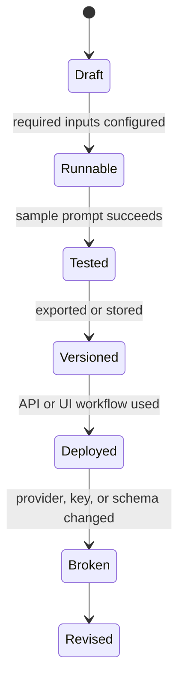

# Langflow

Langflow는 LLM 애플리케이션, RAG, 에이전트 흐름을 시각적으로 구성하고 실행할 수 있는 도구다. Docker로 빠르게 실행할 수 있지만, 운영에 가까운 구성에서는 데이터베이스와 secrets, 네트워크 경계를 분리해야 한다.

## 적용 범위와 운영 계약

이 예시는 Langflow, PostgreSQL과 OpenAI 호환 API를 Docker Compose로 연결하는 출발점입니다. 이미지 태그, 환경 변수, 데이터베이스 스키마, UI 메뉴와 각 공급자의 호환 범위는 버전별로 달라지므로 승인 버전과 release note를 기준으로 조정합니다.

- **배포 전제**: 개발용 단일 호스트 예시이며 인터넷에 직접 노출하는 운영 구성이 아닙니다. 인증, TLS reverse proxy, 네트워크 분리, 자원 제한과 백업을 별도로 설계합니다.
- **비밀 관리**: 데이터베이스와 모델 API 자격 증명은 Compose 본문이나 flow export에 넣지 않고 secret 파일 또는 비밀 저장소에서 주입합니다.
- **공급망과 변경**: latest 대신 검토한 이미지 버전과 digest를 고정하고 업그레이드 전에 데이터베이스와 flow를 백업합니다. migration 실패 시 이전 이미지와 백업으로 복구할 절차를 둡니다.
- **연결 원칙**: 컨테이너의 localhost는 컨테이너 자신입니다. 동일 Docker 네트워크, 명시적 host gateway 또는 제한된 내부 주소 중 플랫폼에 맞는 경로를 사용하며 모델 서버를 0.0.0.0에 무조건 노출하지 않습니다.
- **완료 조건**: health 상태, 재시작 후 데이터 보존, 인증되지 않은 접근 거부, 모델명 조회와 최소 요청 성공, timeout 및 모델 서버 장애 처리, 백업 복원 시험을 기록합니다.

## 1. 왜 필요한가? (Pain Point & Motivation)

LLM workflow를 코드로만 작성하면 prompt, model, retriever, tool, output 연결을 눈으로 확인하기 어렵다. Langflow는 이 흐름을 노드 기반 UI로 설계하고 테스트할 수 있게 한다.

하지만 기본 실행만으로 운영 준비가 끝나는 것은 아니다. flow 저장소, 데이터베이스, API key, custom model endpoint, reverse proxy, 인증 정책을 별도로 정해야 한다.

## 2. 현재 나의 상태 (Baseline)

흔한 출발점은 다음과 같다.

- `langflowai/langflow:latest` 컨테이너만 띄우고 데이터 영속성을 확인하지 않는다.
- SQLite와 PostgreSQL 사용 차이를 모른다.
- OpenAI 호환 endpoint를 연결하면서 `localhost`가 컨테이너 내부를 가리킨다는 점을 놓친다.
- API key를 flow나 compose 파일에 직접 넣는다.
- Langflow UI를 인증 없이 외부에 노출한다.
- 모델 서버, vector store, Langflow가 같은 Docker network에 있는지 확인하지 않는다.

## 3. 도달하고 싶은 목표 (Target State)

목표는 Langflow를 실험용과 운영형 구성으로 구분하는 것이다.

- 로컬 실험은 단일 컨테이너로 빠르게 실행한다.
- 유지해야 할 flow와 설정은 볼륨 또는 외부 DB에 저장한다.
- 여러 인스턴스나 안정적 운영이 필요하면 PostgreSQL을 사용한다.
- Ollama, LM Studio, LiteLLM, vLLM 같은 OpenAI 호환 endpoint의 base URL을 정확히 설정한다.
- API key와 DB password는 환경 변수 또는 secret으로 분리한다.
- 외부 노출 시 reverse proxy와 인증을 둔다.

## 4. 시스템 번역 (Data Flow)

Langflow 실행 흐름은 다음과 같다.

```text
browser user opens Langflow UI
  -> creates flow graph
  -> flow stores configuration
  -> model node calls LLM provider or OpenAI-compatible endpoint
  -> retriever/tool nodes call external services
  -> output node renders response
```

Docker에서 custom model endpoint 호출은 다음처럼 해석한다.

```text
Langflow container
  -> base URL in model component
  -> Docker network DNS or host gateway
  -> Ollama, LM Studio, LiteLLM, vLLM, or remote API
```

컨테이너 내부의 `localhost`는 Docker host가 아니라 Langflow 컨테이너 자신이다.

## 5. 핵심 구성요소 (Building Blocks)

- Langflow UI: flow를 만들고 실행하는 브라우저 인터페이스.
- Flow: component node와 edge로 구성된 LLM workflow.
- Component: model, prompt, input, output, retriever, tool 같은 실행 단위.
- Database: flow와 설정을 저장하는 저장소. 실험용과 운영형 요구가 다르다.
- `LANGFLOW_DATABASE_URL`: PostgreSQL 같은 외부 DB 연결을 지정하는 환경 변수.
- OpenAI-compatible endpoint: `/v1` API 호환 서버를 통해 로컬/프록시 모델을 호출하는 방식.
- Docker network: Langflow와 model server가 서로 이름으로 통신하게 하는 경계.
- Reverse proxy: HTTPS, 인증, host routing을 담당하는 외부 진입점.

## 6. 상태 전이 (State Transition)

Langflow flow는 다음 상태로 관리한다.



모델 endpoint나 API key가 바뀌면 `Deployed` flow도 다시 테스트해야 한다.

## 7. 불변식 (Invariant: 절대 깨지면 안 되는 규칙)

- API key와 DB password는 flow export나 Git에 남기지 않는다.
- 컨테이너에서 `localhost`를 쓰기 전 어느 네트워크 namespace를 가리키는지 확인한다.
- Langflow UI를 인터넷에 직접 노출하지 않는다.
- production-like 구성에서는 데이터 영속성과 백업을 먼저 확인한다.
- custom endpoint는 모델명, base URL, authentication 요구사항을 함께 기록한다.
- flow 변경 후 sample input으로 회귀 테스트를 한다.

## 8. 가장 작은 예제 (Minimal Viable Example)

먼저 검토한 공식 Langflow image reference와 강한 `LANGFLOW_SUPERUSER_PASSWORD`, 안정적으로 보존할 `LANGFLOW_SECRET_KEY`를 비밀 저장소에서 실행 환경으로 제공한다. 인증의 기본값을 가정하지 않고 auto-login을 명시적으로 끈다. 아래 단일 컨테이너는 일회성 로컬 평가용이며 flow 보존에는 다음 Compose 예제를 사용한다.

```bash
: "${LANGFLOW_IMAGE:?set reviewed official Langflow tag or digest}"
: "${LANGFLOW_SUPERUSER_PASSWORD:?provide a strong admin password}"
: "${LANGFLOW_SECRET_KEY:?provide a persistent nondefault secret key}"
export LANGFLOW_SUPERUSER_PASSWORD LANGFLOW_SECRET_KEY
docker run --rm -p 127.0.0.1:7860:7860 \
  --env LANGFLOW_AUTO_LOGIN=false \
  --env LANGFLOW_SUPERUSER=admin \
  --env LANGFLOW_SUPERUSER_PASSWORD --env LANGFLOW_SECRET_KEY \
  "$LANGFLOW_IMAGE"
```

PostgreSQL 16을 사용하는 아래 예제는 DB 비밀번호 원본 하나를 연결 URL과 PostgreSQL secret에 함께 사용한다. URL escaping을 생략할 수 있도록 이 예제의 `LANGFLOW_DB_PASSWORD`는 비밀 저장소에서 생성한 충분히 긴 hexadecimal 값으로 제한한다. 다른 문자 집합의 비밀번호를 사용하면 URL password component만 percent-encode하고 DB secret에는 원본을 전달해야 한다. 기존 DB의 password는 환경 변수만 바꿔도 회전되지 않는다.

```yaml
services:
  langflow:
    image: "${LANGFLOW_IMAGE:?set reviewed Langflow tag or digest}"
    ports:
      - "127.0.0.1:7860:7860"
    environment:
      LANGFLOW_DATABASE_URL: "postgresql://langflow:${LANGFLOW_DB_PASSWORD:?provide hex DB password}@postgres:5432/langflow"
      LANGFLOW_CONFIG_DIR: /app/langflow
      LANGFLOW_AUTO_LOGIN: "false"
      LANGFLOW_SUPERUSER: admin
      LANGFLOW_SUPERUSER_PASSWORD: "${LANGFLOW_SUPERUSER_PASSWORD:?provide admin password}"
      LANGFLOW_SECRET_KEY: "${LANGFLOW_SECRET_KEY:?provide persistent secret key}"
    volumes:
      - langflow-data:/app/langflow
    depends_on:
      postgres:
        condition: service_healthy
    restart: unless-stopped

  postgres:
    image: "${LANGFLOW_POSTGRES_IMAGE:?set reviewed PostgreSQL 16 tag or digest}"
    environment:
      POSTGRES_USER: langflow
      POSTGRES_PASSWORD_FILE: /run/secrets/langflow_db_password
      POSTGRES_DB: langflow
    secrets:
      - langflow_db_password
    volumes:
      - langflow-db:/var/lib/postgresql/data
    healthcheck:
      test: ["CMD-SHELL", "pg_isready -U langflow -d langflow"]
      interval: 5s
      timeout: 3s
      retries: 12
    restart: unless-stopped

volumes:
  langflow-data:
  langflow-db:
secrets:
  langflow_db_password:
    environment: LANGFLOW_DB_PASSWORD
```

실행 전 environment-backed secrets와 health dependency를 지원하는 Compose인지 확인하고 선택한 image의 환경 변수 schema를 대조한다. Bash에서 비밀번호 형식을 검사한 뒤 비밀을 출력하지 않는 config 검사로 시작한다.

```bash
: "${LANGFLOW_DB_PASSWORD:?provide DB password}"
[[ "$LANGFLOW_DB_PASSWORD" =~ ^[0-9a-fA-F]{64,}$ ]] || exit 2
export LANGFLOW_DB_PASSWORD
docker compose config --quiet && docker compose up -d
docker compose ps
```

`http://127.0.0.1:7860`에서 인증 없는 접근 거부와 관리자 로그인을 확인한다. 재시작 후 flow·DB·암호화 key의 일관성과 독립 backup 복원을 검증한다. readiness가 DB 인증이나 migration 성공까지 보장하지 않으므로 실제 flow 저장·읽기를 시험한다.

OpenAI 호환 endpoint의 Base URL·Model Name·인증 방식을 함께 맞춘다. 서버가 인증을 요구하면 실제 key를 비밀 저장소에서 주입하며, 인증 없는 제한된 로컬 서버에서 component가 입력을 요구할 때에만 비밀이 아닌 placeholder를 쓴다.

인증 변수는 [Langflow 인증 문서](https://docs.langflow.org/api-keys-and-authentication)와 [환경 변수 문서](https://docs.langflow.org/environment-variables)에서 선택한 release에 맞게 확인한다.

## 9. 실패 사례 (What could go wrong?)

- 컨테이너 안에서 `http://localhost:11434/v1`를 설정해 Ollama host가 아니라 Langflow 자신으로 요청한다.
- DB 볼륨 없이 컨테이너를 지워 flow가 사라진다.
- `latest` 이미지를 무조건 사용해 업그레이드 후 component schema가 바뀐다.
- API key를 flow JSON에 저장해 export 파일로 유출한다.
- Langflow UI를 공개망에 열어 임의 사용자가 LLM 비용을 발생시킨다.
- custom endpoint의 `/v1` 경로, 모델명, 인증 방식이 실제 서버와 맞지 않는다.

## 10. 뇌 확장하기 (Evolution & Variants)

- flow export를 Git에 넣되 secrets는 환경 변수 참조로 분리한다.
- Langflow API 서버를 reverse proxy 뒤에 두고 SSO 또는 VPN으로 접근을 제한한다.
- Ollama, LiteLLM, vLLM, OpenAI, Gemini endpoint를 provider별 profile로 분리한다.
- vector store와 document loader를 붙일 때 데이터 위치와 개인정보 범위를 점검한다.
- 운영 flow는 input/output contract와 실패 응답을 테스트 케이스로 만든다.

## 11. 최종 체크리스트 (Definition of Done)

- [ ] 실행 방식이 실험용인지 운영형인지 구분되어 있다.
- [ ] flow와 DB 데이터가 영속화된다.
- [ ] API key와 DB password가 환경 변수/secret으로 분리되어 있다.
- [ ] custom endpoint의 base URL이 컨테이너 네트워크 기준으로 맞다.
- [ ] Langflow UI 접근이 인증 또는 사설망으로 제한되어 있다.
- [ ] sample prompt로 flow 실행을 검증했다.

## 12. 뇌에 새기는 복습 문장 (TL;DR Blank)

Langflow는 LLM workflow를 시각화해 주지만, 안정적으로 쓰려면 데이터 영속성, secrets 분리, 컨테이너 네트워크, 접근 제어를 함께 설계해야 한다.
