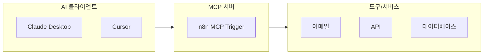
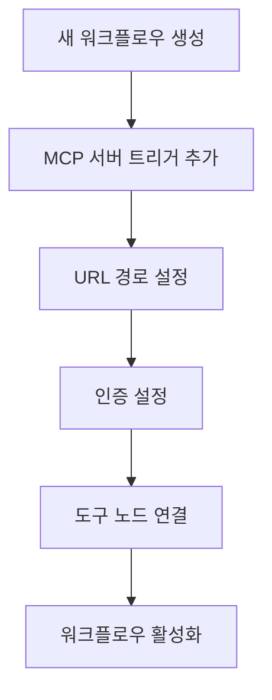
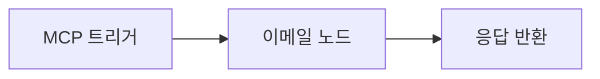
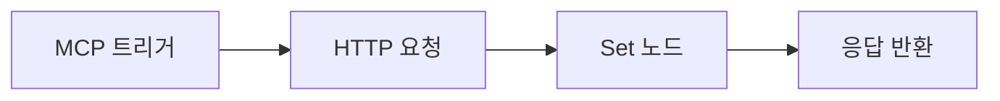
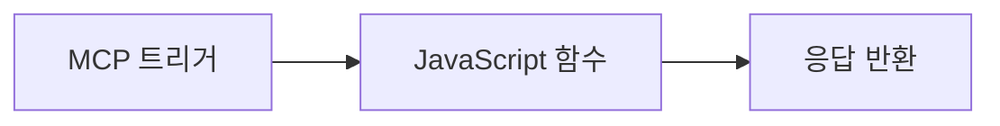
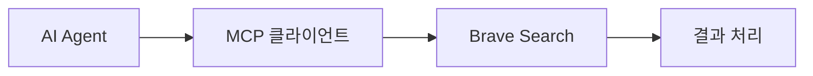

# MCP (Model Context Protocol)


## 적용 범위와 신뢰 경계

이 문서는 n8n의 MCP 관련 기능을 설명하는 개념 가이드입니다. 노드 이름, 전송 방식, 인증 옵션, 패키지 이름과 클라이언트 설정은 n8n, MCP 명세 및 각 클라이언트 버전에 따라 달라지므로 현재 공식 문서에서 실제 지원 여부를 먼저 확인합니다.

- **증거 상태**: 통합 수, 템플릿 수와 예상 시간은 시점과 숙련도에 따른 참고값이며 기능 보장이나 일정 약속이 아닙니다. 예제 엔드포인트는 이 문서에서 실행 검증되지 않았습니다.
- **신뢰 경계**: MCP 연결은 모델 출력이 외부 작업으로 이어지는 경로입니다. 인증만으로 충분하지 않으며 도구 allowlist, 입력 스키마, 최소 권한 자격 증명, 대상 및 작업 범위 제한, 고위험 쓰기 작업의 사람 승인을 둡니다.
- **공급망과 비밀**: npx -y와 고정되지 않은 컨테이너 이미지는 임의의 새 코드를 실행할 수 있습니다. 패키지 버전, lockfile, 이미지 digest를 고정하고 API 키를 workflow export, 로그와 클라이언트 설정에 남기지 않습니다.
- **실패와 재시도**: 메일 발송과 데이터 쓰기는 idempotency key, 중복 억제, timeout, 재시도 상한과 보상 절차가 있어야 합니다. 읽기와 쓰기 도구를 분리하고 부분 성공을 감사 로그에 기록합니다.
- **완료 조건**: 무인증 거부, 허용 및 비허용 도구 호출, 잘못된 스키마, timeout, 중복 요청, 자격 증명 회수와 감사 로그 조회를 시험합니다.

None 인증은 격리된 일회성 개발 환경 외에는 사용하지 않습니다. 인터넷 공개 전에 reverse proxy TLS, 사용자 또는 서비스 단위 인증, 속도 제한과 경보를 구성합니다.

n8n 기반 MCP 통합 서버 관리 가이드입니다.

---

## 📋 개요

### n8n이란?

**n8n**은 오픈소스 워크플로우 자동화 플랫폼으로, 2019년 베를린에서 개발되었습니다. 기술팀에게 코드의 유연성과 노코드의 속도를 동시에 제공합니다.

| 특징 | 설명 |
|------|------|
| **통합** | 제공 범위는 설치 버전과 라이선스에서 확인 |
| **유연성** | JavaScript/Python 코드 또는 드래그-앤-드롭 |
| **배포** | 셀프 호스팅 또는 클라우드 |
| **템플릿** | 제공 범위와 신뢰성은 현재 카탈로그에서 확인 |

### MCP란?

**MCP (Model Context Protocol)**는 AI 모델이 외부 도구, API 및 데이터 소스와 표준화된 방식으로 상호작용할 수 있게 해주는 프로토콜입니다.



---

## 🚀 n8n 설치

### Docker 설치 (권장)

```bash
# 볼륨 생성
docker volume create n8n_data

# 컨테이너 실행
docker run -it --rm \
  --name n8n \
  -p 127.0.0.1:5678:5678 \
  -v n8n_data:/home/node/.n8n \
  docker.n8n.io/n8nio/n8n:<approved-version>@sha256:<approved-digest>
```

### npm 설치

```bash
npm install --global n8n@<approved-version> && n8n start
```

설치 후 `http://localhost:5678`에서 접속 가능합니다.

---

## ⚙️ MCP 서버 트리거 설정

### 기본 설정 단계



### 설정 옵션

| 옵션 | 설명 | 예시 |
|------|------|------|
| **MCP URL 경로** | 트리거 엔드포인트 | `/mcp/abc123` (자동 생성) |
| **인증** | 접근 제어 | Bearer 또는 Header; None은 격리된 개발 환경만 |

### 워크플로우 구조

```
┌─────────────────┐     ┌──────────────────┐     ┌─────────────────┐
│ AI 모델 요청    │ --> │ MCP 서버 트리거  │ --> │ 도구 노드(들)   │
└─────────────────┘     └──────────────────┘     └─────────────────┘
                               │                        │
                               v                        v
                        ┌──────────────┐         ┌──────────────┐
                        │ 요청 처리    │         │ 응답 반환    │
                        └──────────────┘         └──────────────┘
```

---

## 🔗 Claude Desktop 연결

### 설정 파일 구성

`claude_desktop_config.json` 파일 편집:

```json
{
  "mcpServers": {
    "n8n": {
      "command": "npx",
      "args": [
        "-y",
        "supergateway@<approved-version>",
        "--sse",
        "https://your-n8n-instance.com/mcp/abc123"
      ]
    }
  }
}
```

### 환경 변수 설정

```bash
# 커뮤니티 노드를 도구로 사용 허용
export N8N_COMMUNITY_PACKAGES_ALLOW_TOOL_USAGE=true
```

---

## 🔧 다중 서버 구성

### Docker Compose 설정

```yaml
version: '3.8'
services:
  n8n:
    image: n8nio/n8n:<approved-version>@sha256:<approved-digest>
    environment:
      # MCP 서버 API 키
      - MCP_BRAVE_API_KEY=${BRAVE_API_KEY}
      - MCP_OPENAI_API_KEY=${OPENAI_API_KEY}
      - MCP_SERPER_API_KEY=${SERPER_API_KEY}
      - MCP_WEATHER_API_KEY=${WEATHER_API_KEY}
      # 커뮤니티 노드 활성화
      - N8N_COMMUNITY_PACKAGES_ALLOW_TOOL_USAGE=true
    ports:
      - "5678:5678"
    volumes:
      - ~/.n8n:/home/node/.n8n
```

### MCP 클라이언트 자격 증명

| 서비스 | 설치 명령 |
|--------|----------|
| Brave Search | `npx -y @modelcontextprotocol/server-brave-search` |
| OpenAI Tools | `npx -y @modelcontextprotocol/server-openai` |
| Web Search | `npx -y @modelcontextprotocol/server-serper` |
| Weather API | `npx -y @modelcontextprotocol/server-weather` |

---

## 📝 구현 사례

### 1. 이메일 자동화 (초급)



**테스트:**
```bash
curl -X POST http://localhost:5678/mcp/abc123 \
  -H "Content-Type: application/json" \
  -d '{"to": "user@example.com", "subject": "테스트", "text": "n8n에서 인사드립니다!"}'
```

### 2. API 데이터 가져오기 (중급)



**테스트:**
```bash
curl -X POST http://localhost:5678/mcp/abc123 \
  -d '{"query": "test"}'
```

### 3. 계산기 도구 (중급)



### 4. 웹 검색 통합 (고급)



---

## ⏱️ 난이도 및 소요 시간

| 시나리오 | 난이도 | 필요 지식 | 소요 시간 |
|---------|--------|----------|----------|
| 기본 MCP 서버 설정 | 초급 | n8n 기본 | 30분 |
| 이메일 자동화 | 초급 | 이메일 노드 | 1시간 |
| API 데이터 가져오기 | 중급 | HTTP, API | 2시간 |
| 계산기 도구 | 중급 | JavaScript | 2시간 |
| 웹 검색 통합 | 고급 | MCP, API 키 | 3-4시간 |
| 다중 서버 구성 | 고급 | Docker, 환경변수 | 5시간+ |

---

## 🔒 보안

### 권장 보안 설정

1. **인증 설정**: Bearer 또는 Header 인증 활성화
2. **환경 변수**: API 키는 환경 변수로 관리
3. **Docker Secrets**: 셀프 호스팅 시 시크릿 활용
4. **HMAC 서명**: 요청 검증 구현

```yaml
# docker-compose.yml 보안 설정 예시
services:
  n8n:
    environment:
      - N8N_BASIC_AUTH_ACTIVE=true
      - N8N_BASIC_AUTH_USER=${N8N_USER}
      - N8N_BASIC_AUTH_PASSWORD=${N8N_PASSWORD}
    secrets:
      - n8n_api_key
```

---

## 🔗 관련 문서

- [Gemini Shell](gemini-shell.md)
- [자동화 도구](../automation/selenium.md)

---

## 📚 참고 자료

- [n8n 공식 웹사이트](https://n8n.io)
- [n8n GitHub](https://github.com/n8n-io/n8n)
- [n8n MCP 문서](https://docs.n8n.io/integrations/builtin/core-nodes/n8n-nodes-langchain.mcptrigger/)
- [MCP 프로토콜 명세](https://modelcontextprotocol.io/)
