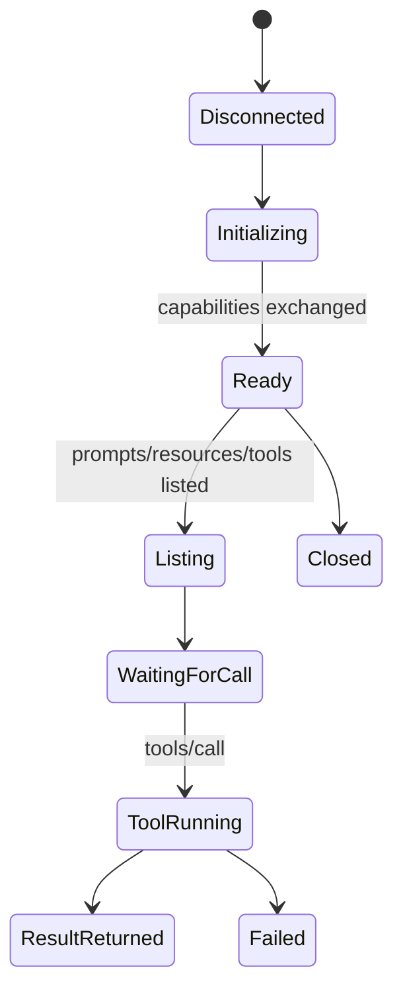

# MCP (Model Context Protocol)

MCP는 AI 애플리케이션이 외부 도구, 데이터, 프롬프트를 표준화된 방식으로 발견하고 호출할 수 있게 하는 프로토콜이다.

## 1. 왜 필요한가? (Pain Point & Motivation)

LLM 애플리케이션이 파일, 데이터베이스, API, 검색, 자동화 도구를 각각 다른 방식으로 직접 붙이면 통합 수가 빠르게 늘어난다. 클라이언트마다 도구별 커넥터를 따로 만들면 권한, 오류, 로그, 보안 검토도 분산된다.

MCP의 목적은 LLM host/client와 MCP server 사이에 표준 계약을 두는 것이다. 다만 도구 호출은 실제 시스템에 영향을 줄 수 있으므로, 프로토콜을 붙이는 순간 보안 경계도 함께 설계해야 한다.

## 2. 현재 나의 상태 (Baseline)

흔한 출발점은 다음과 같다.

- MCP를 "AI 플러그인" 정도로만 이해한다.
- host, client, server, tool의 역할을 섞어서 말한다.
- resources, prompts, tools의 제어 주체 차이를 모른다.
- 로컬 stdio 서버를 신뢰하고 임의 명령 실행 권한을 넓게 준다.
- 인증, scopes, 사용자 승인, audit log를 나중으로 미룬다.
- n8n, Langflow 같은 workflow 도구와 MCP protocol 자체를 혼동한다.

## 3. 도달하고 싶은 목표 (Target State)

목표는 MCP를 안전한 tool boundary로 설계하는 것이다.

- MCP host/client/server의 역할을 구분한다.
- 서버가 제공하는 prompts, resources, tools를 구분한다.
- tool call이 side effect를 가질 수 있음을 전제로 권한을 좁힌다.
- resource URI와 tool argument를 검증한다.
- 인증이 필요한 MCP server는 최소 scope와 짧은 수명의 token을 사용한다.
- 로그, timeout, cancellation, error handling을 설계한다.

## 4. 시스템 번역 (Data Flow)

MCP 기본 흐름은 다음과 같다.

```text
AI host starts or connects to MCP client
  -> client initializes connection with MCP server
  -> server advertises capabilities
  -> client lists prompts, resources, and tools
  -> model selects a tool or host attaches resources
  -> client sends JSON-RPC request
  -> server executes allowed operation
  -> result returns to client and model context
```

도구 호출은 다음처럼 위험을 가진다.

```text
model proposes tool call
  -> client checks user consent and policy
  -> server validates arguments
  -> tool reads or writes external system
  -> server returns result or tool-level error
  -> audit log records action
```

## 5. 핵심 구성요소 (Building Blocks)

- Host: Claude Desktop, IDE, agent runner처럼 사용자가 상호작용하는 AI 애플리케이션.
- Client: host 안에서 MCP server와 통신하는 프로토콜 클라이언트.
- Server: tools, resources, prompts를 노출하는 프로세스나 서비스.
- Tools: 모델이 호출할 수 있는 실행 함수. 외부 API 호출, 파일 쓰기, 명령 실행 같은 side effect를 가질 수 있다.
- Resources: 파일, DB schema, 문서처럼 모델 context로 읽을 수 있는 데이터.
- Prompts: 사용자가 선택하거나 호출할 수 있는 prompt template.
- Transport: stdio, HTTP 계열 등 client-server 통신 경로.
- JSON-RPC: MCP 메시지의 기본 요청/응답 형식.
- Capability negotiation: 서버와 클라이언트가 지원 기능을 협상하는 단계.
- Authorization scope: 도구 접근 권한을 최소 단위로 나누는 기준.

## 6. 상태 전이 (State Transition)

MCP server 연결 상태는 다음처럼 볼 수 있다.



장시간 작업이 필요한 경우에는 task나 별도 job 상태를 도입해 timeout과 polling을 설계한다.

## 7. 불변식 (Invariant: 절대 깨지면 안 되는 규칙)

- MCP server는 tool argument와 resource URI를 반드시 검증해야 한다.
- 모델이 tool을 호출할 수 있다고 해서 사용자의 승인 없이 side effect를 실행하면 안 된다.
- 파일 쓰기, shell command, 외부 API mutation은 읽기 도구보다 높은 권한으로 분리한다.
- OAuth나 token을 쓰는 서버는 audience, scope, expiry를 검증해야 한다.
- tool 결과의 오류는 protocol error와 tool-level error를 구분해 반환한다.
- MCP server 패키지와 marketplace 항목은 supply chain 위험을 검토해야 한다.

## 8. 가장 작은 예제 (Minimal Viable Example)

가장 작은 MCP 사고 모델은 다음과 같다.

```text
Host: AI desktop app
Client: app's MCP client
Server: local filesystem MCP server
Resource: file:///project/README.md
Tool: read_file(path)
Policy: read-only under /project
```

위 구조에서 안전한 tool은 프로젝트 디렉터리 아래 파일만 읽는다. 같은 서버에 `write_file`이나 `run_shell`을 추가하려면 별도 승인, 경로 제한, 로그, dry-run이 필요하다.

n8n 같은 workflow 도구를 MCP server로 사용할 때도 원칙은 같다.

```text
MCP request
  -> n8n MCP trigger
  -> workflow node executes
  -> result is returned
```

이 경우 workflow credential과 MCP client 권한을 분리해야 한다.

## 9. 실패 사례 (What could go wrong?)

- "검색 도구"로 등록한 tool이 실제로는 파일 쓰기나 외부 API 변경까지 수행한다.
- tool description이 악의적으로 작성되어 모델이 원치 않는 호출을 선택한다.
- resource URI 검증이 없어 서버가 허용 범위 밖의 파일을 읽는다.
- stdio server 실행 명령에 사용자 입력이 섞여 command injection이 생긴다.
- 모든 권한을 하나의 token에 묶어 부분 회수가 불가능하다.
- tool timeout과 cancellation이 없어 agent 실행이 무한 대기한다.

## 10. 뇌 확장하기 (Evolution & Variants)

- read-only MCP server와 write-capable MCP server를 분리한다.
- tool별 risk level, required scope, approval requirement를 표로 관리한다.
- MCP Inspector나 테스트 클라이언트로 capabilities와 tool schema를 검증한다.
- OAuth 기반 remote MCP server는 PKCE, resource indicator, short-lived token을 검토한다.
- prompt injection, tool poisoning, data exfiltration threat model을 별도 문서로 만든다.

## 11. 최종 체크리스트 (Definition of Done)

- [ ] host, client, server 역할이 구분되어 있다.
- [ ] prompts, resources, tools가 각각 무엇을 노출하는지 문서화되어 있다.
- [ ] tool argument와 resource URI 검증 규칙이 있다.
- [ ] side effect가 있는 tool은 승인과 최소 권한을 요구한다.
- [ ] timeout, cancellation, error handling, audit log가 설계되어 있다.
- [ ] 인증 token과 workflow credential이 분리되어 있다.

## 12. 뇌에 새기는 복습 문장 (TL;DR Blank)

MCP는 LLM과 외부 도구를 연결하는 표준 경계이며, 안전한 MCP 설계의 핵심은 tools/resources/prompts를 구분하고 tool 권한을 최소화하는 것이다.
