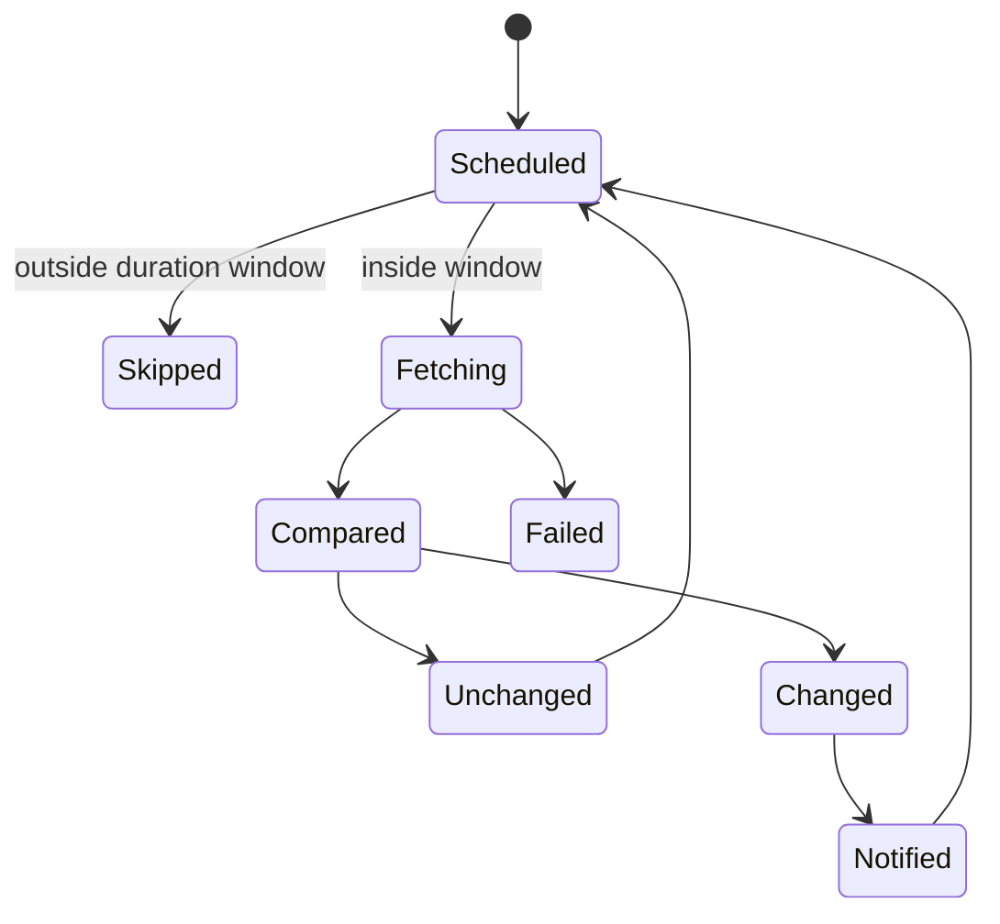

# Change Detection

Change Detection은 웹 페이지나 API 응답의 변화를 주기적으로 확인하고, 의미 있는 변화가 생겼을 때 알림을 보내는 자동화 패턴이다.

## 1. 왜 필요한가? (Pain Point & Motivation)

가격, 공지, 예약 가능 상태, 문서 변경, 재고 같은 정보는 사람이 계속 새로고침하기 어렵다. 변경 감지 도구는 이 반복 확인을 자동화한다.

하지만 감지 주기와 알림을 잘못 설정하면 대상 사이트에 과도한 요청을 보내거나, 의미 없는 변경 때문에 알림이 폭주하거나, Discord webhook 같은 비밀 URL이 유출될 수 있다.

## 2. 현재 나의 상태 (Baseline)

흔한 출발점은 다음과 같다.

- 전체 페이지 HTML을 그대로 비교해 광고나 타임스탬프 변화에도 알림이 온다.
- 감지 주기를 너무 짧게 잡아 rate limit이나 IP 차단을 유발한다.
- 업무 시간에만 감지해야 하는데 24시간 계속 실행한다.
- Discord webhook URL을 문서에 그대로 저장한다.
- 스크린샷 첨부를 켜고 저장소 사용량을 모니터링하지 않는다.
- 변경 감지 실패와 변경 없음 상태를 구분하지 않는다.

## 3. 도달하고 싶은 목표 (Target State)

목표는 필요한 시간과 필요한 부분만 감시하는 것이다.

- 감지 대상 URL과 selector/filter를 명확히 한다.
- 주기, 시간대, duration window를 비용과 중요도에 맞춘다.
- 알림 채널은 Apprise URL이나 webhook secret으로 관리한다.
- 변경 감지, fetch 실패, parsing 실패, 알림 실패를 구분한다.
- 테스트 알림을 보내고 실제 채널 수신을 확인한다.
- robots.txt, 이용 약관, 인증 요구사항을 검토한다.

## 4. 시스템 번역 (Data Flow)

변경 감지 흐름은 다음과 같다.

```text
scheduler wakes up
  -> fetch target URL
  -> apply filters or selectors
  -> compare with previous snapshot
  -> if changed, create diff
  -> send notification through configured channel
  -> store new baseline
```

시간 제한이 있으면 다음 조건이 추가된다.

```text
current time in configured timezone
  -> inside active duration window?
  -> run check or skip until next window
```

## 5. 핵심 구성요소 (Building Blocks)

- Watch: 감시 대상 URL과 감지 설정.
- Fetcher: HTTP 요청 또는 browser-based fetch 방식.
- Filter/selector: 페이지에서 비교할 영역만 추출하는 규칙.
- Snapshot: 이전 상태를 저장한 기준 데이터.
- Diff: 이전 상태와 현재 상태의 차이.
- Schedule: 감지 주기와 요일/시간 제한.
- Duration window: 시작 시각부터 일정 시간 동안만 감지를 실행하는 시간 범위.
- Timezone: schedule을 해석할 기준 시간대.
- Notification URL: Apprise 문법 기반 알림 대상. 예: Discord, Slack, email, webhook.
- Secret URL: webhook token이 포함된 민감한 URL.

## 6. 상태 전이 (State Transition)

watch 상태는 다음처럼 볼 수 있다.



`Failed`는 변경 없음이 아니다. 실패 알림이나 재시도 정책을 별도로 둔다.

## 7. 불변식 (Invariant: 절대 깨지면 안 되는 규칙)

- webhook URL은 비밀값으로 관리한다.
- 대상 사이트에 과도한 요청을 보내지 않는다.
- selector/filter 없이 noisy page 전체를 비교하지 않는다.
- duration window와 timezone은 실제 업무 기준 시간으로 검증한다.
- 인증 쿠키나 세션 토큰을 저장할 때 노출 범위를 검토한다.
- 알림은 테스트 전송으로 수신 여부를 확인한다.

## 8. 가장 작은 예제 (Minimal Viable Example)

Discord webhook은 Apprise 형식으로 변환해 Notification URL에 넣는다.

```text
Discord webhook:
https://discord.com/api/webhooks/<webhook_id>/<webhook_token>

Apprise notification URL:
discord://<webhook_id>/<webhook_token>
```

duration window 예시는 다음과 같다.

```text
timezone: Asia/Seoul
start at: 09:00
run duration: 8 hours
active window: 09:00-17:00
```

최소 설정 후에는 반드시 `Send test notification` 또는 동등한 테스트 기능으로 알림 수신을 확인한다.

## 9. 실패 사례 (What could go wrong?)

- 광고, 추천 영역, 시간 표시 때문에 매번 변경으로 감지된다.
- JavaScript 렌더링 페이지를 단순 HTTP fetch로 읽어 원하는 내용이 없다.
- webhook URL이 유출되어 외부에서 임의 메시지를 보낸다.
- 스크린샷 첨부가 많아 디스크 사용량이 증가한다.
- duration window timezone을 잘못 잡아 감시가 원하는 시간에 실행되지 않는다.
- 대상 사이트의 로그인 세션이 만료되어 로그인 페이지 변경만 감지한다.

## 10. 뇌 확장하기 (Evolution & Variants)

- CSS selector, XPath, JSONPath 같은 필터를 사용해 비교 영역을 좁힌다.
- browser mode와 simple fetch mode를 페이지 특성에 따라 분리한다.
- 알림 템플릿에 diff URL, watch name, timestamp, screenshot 여부를 표준화한다.
- 중요도별로 감지 주기와 알림 채널을 다르게 둔다.
- API가 있는 서비스는 HTML scraping보다 API 응답 감지를 우선 검토한다.

## 11. 최종 체크리스트 (Definition of Done)

- [ ] 감시 대상과 비교 영역이 명확하다.
- [ ] 감지 주기와 duration window가 과도하지 않다.
- [ ] timezone이 실제 기대 시간과 맞다.
- [ ] webhook URL이 비밀값으로 관리된다.
- [ ] 테스트 알림을 보냈고 수신을 확인했다.
- [ ] 변경 없음, 변경 발생, fetch 실패를 구분할 수 있다.

## 12. 뇌에 새기는 복습 문장 (TL;DR Blank)

좋은 변경 감지는 페이지 전체를 자주 긁는 것이 아니라, 필요한 영역을 적절한 시간대에 비교하고 비밀 알림 채널로만 전달하는 것이다.
