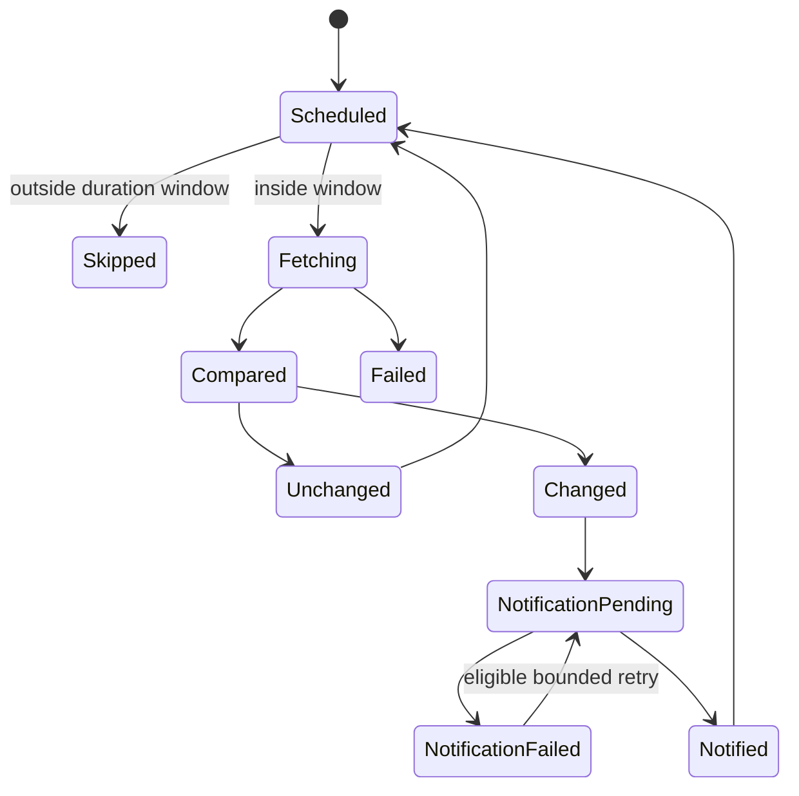

# Change Detection

Change Detection은 웹 페이지나 API 응답의 변화를 주기적으로 확인하고, 의미 있는 변화가 생겼을 때 알림을 보내는 자동화 패턴이다.

## 적용 범위와 검증 기준

이 문서는 변경 감지 패턴과 changedetection.io 계열 설정의 학습 예시다. 설치한 application·worker·Apprise version, timezone, fetch 주기와 browser/proxy 사용 여부를 기록한다. UI 이름과 duration의 경계는 해당 version에서 시험하며 운영 성공을 문서만으로 보장하지 않는다.

활성 시간은 요청 한 번의 실행 시간이 아니라 검사를 허용할 시간 범위다. worker 지연·queue와 재시도 때문에 정확한 실행 시각이나 비용 절감을 보장하지 않으며 실제 fetch 수·browser/proxy 비용·마지막 성공 시각을 관찰한다. webhook은 발송 권한이 있는 전용 채널에서 만들고 global 설정과 watch별 override 범위를 구분한다.

## 1. 왜 필요한가? (Pain Point & Motivation)

가격, 공지, 예약 가능 상태, 문서 변경, 재고 같은 정보는 사람이 계속 새로고침하기 어렵다. 변경 감지 도구는 이 반복 확인을 자동화한다.

하지만 감지 주기와 알림을 잘못 설정하면 대상 사이트에 과도한 요청을 보내거나, 의미 없는 변경 때문에 알림이 폭주하거나, Discord webhook 같은 비밀 URL이 유출될 수 있다.

## 2. 현재 나의 상태 (Baseline)

흔한 출발점은 다음과 같다.

- 전체 페이지 HTML을 그대로 비교해 광고나 타임스탬프 변화에도 알림이 온다.
- 감지 주기를 너무 짧게 잡아 rate limit이나 IP 차단을 유발한다.
- 업무 시간에만 감지해야 하는데 24시간 계속 실행한다.
- Discord webhook URL을 문서에 그대로 저장한다.
- 스크린샷 첨부를 켜고 저장소 사용량을 모니터링하지 않는다.
- 변경 감지 실패와 변경 없음 상태를 구분하지 않는다.

## 3. 도달하고 싶은 목표 (Target State)

목표는 필요한 시간과 필요한 부분만 감시하는 것이다.

- 감지 대상 URL과 selector/filter를 명확히 한다.
- 주기, 시간대, duration window를 비용과 중요도에 맞춘다.
- 알림 채널은 Apprise URL이나 webhook secret으로 관리한다.
- 변경 감지, fetch 실패, parsing 실패, 알림 실패를 구분한다.
- 테스트 알림을 보내고 실제 채널 수신을 확인한다.
- robots.txt, 이용 약관, 인증 요구사항을 검토한다.

## 4. 시스템 번역 (Data Flow)

변경 감지 흐름은 다음과 같다.

```text
scheduler evaluates active window in the configured timezone
  -> worker fetches target with a bounded timeout
  -> apply filters or selectors
  -> compare with previous valid snapshot
  -> persist change id/diff and pending notification
  -> advance baseline under the documented persistence policy
  -> deliver notification and record acknowledgement or retry state
```

시간 제한이 있으면 다음 조건이 추가된다.

```text
current time in configured timezone
  -> inside active duration window?
  -> run check or skip until next window
```

## 5. 핵심 구성요소 (Building Blocks)

- Watch: 감시 대상 URL과 감지 설정.
- Fetcher: HTTP 요청 또는 browser-based fetch 방식.
- Filter/selector: 페이지에서 비교할 영역만 추출하는 규칙.
- Snapshot: 이전 상태를 저장한 기준 데이터.
- Diff: 이전 상태와 현재 상태의 차이.
- Schedule: 감지 주기와 요일/시간 제한.
- Duration window: 시작 시각부터 일정 시간 동안만 감지를 실행하는 시간 범위.
- Timezone: schedule을 해석할 기준 시간대.
- Notification URL: Apprise 문법 기반 알림 대상. 예: Discord, Slack, email, webhook.
- Secret URL: webhook token이 포함된 민감한 URL.

## 6. 상태 전이 (State Transition)

watch 상태는 다음처럼 볼 수 있다.



`Failed`는 변경 없음이 아니다. 실패 알림이나 재시도 정책을 별도로 둔다.

## 7. 불변식 (Invariant: 절대 깨지면 안 되는 규칙)

- webhook URL·cookie·token은 비밀로 보관하고 유출 시 폐기·재발급한다. 전용 채널의 실제 발송 권한과 global/watch 적용 범위를 확인한다.
- 대상 사이트의 접근 정책과 rate limit을 지키고 비교할 selector/filter를 정한다. fetch 실패를 새 정상 baseline으로 저장하지 않는다.
- 활성 시간은 IANA timezone과 날짜 경계·DST·queue 지연을 포함해 시험한다. 24시간 감시에는 지원되는 연속 감시 옵션을 쓰며 23:59 같은 경계 우회로 대체하지 않는다.
- notification 실패는 감지 결과와 분리하고 change id로 중복을 억제한다. 장애 중 쌓인 변경을 모두 보낼지 최신 상태로 합칠지 정한다.
- 알림 429는 Retry-After를 따르고 일시적 5xx·네트워크 오류만 횟수·총 시간 상한이 있는 backoff로 재시도한다. 영구 4xx·잘못된 인증은 반복하지 않고 운영자에게 알린다.
- screenshot·diff·첨부에는 개인정보가 들어갈 수 있다. 접근·보존·용량을 제한하고 page 내용은 신뢰하지 않으며 mention과 payload 크기도 제한한다.
- 테스트 알림 성공 외에 실제 변경 감지부터 최종 채널 수신까지 검증한다.

## 8. 가장 작은 예제 (Minimal Viable Example)

설치한 Apprise/알림 플러그인이 해당 형식을 지원하는지 확인한 뒤 승인된 Discord 전용 채널의 webhook을 비밀 저장소에서 설정한다. 다음 문자열은 실제 비밀이 없는 형식 설명이다.

```text
Discord webhook shape: https://discord.com/api/webhooks/WEBHOOK_ID/WEBHOOK_TOKEN
Apprise shape, if supported: discord://WEBHOOK_ID/WEBHOOK_TOKEN
```

업무 시간 감시의 의도는 다음처럼 기록한다. duration이 8시간이라는 것은 한 HTTP 요청을 8시간 실행한다는 의미가 아니다.

```text
timezone: Asia/Seoul
intended start: 09:00
intended duration: 8 hours
intended window: 09:00 to 17:00
fetch interval: explicitly configured and observed
```

설치한 scheduler에서 시작/종료 포함 여부, queue에 이미 들어간 작업과 마지막 실행 시점을 확인한다. DST가 있는 timezone은 전환일도 별도 시험한다.

최소 시험은 테스트 알림, 의도한 실제 한 번의 변경, 비활성 시간의 동작, 잘못된 webhook과 429/일시 장애를 포함한다. webhook을 폐기한 뒤 더 이상 발송되지 않고 새 비밀로 복구되는지도 확인한다. 서버 측 발송의 DNS/TLS·방화벽 오류를 브라우저 CORS 문제로 해석하지 않는다.

## 9. 실패 사례 (What could go wrong?)

- 광고, 추천 영역, 시간 표시 때문에 매번 변경으로 감지된다.
- JavaScript 렌더링 페이지를 단순 HTTP fetch로 읽어 원하는 내용이 없다.
- webhook URL이 유출되어 외부에서 임의 메시지를 보낸다.
- 스크린샷 첨부가 많아 디스크 사용량이 증가한다.
- duration window timezone을 잘못 잡아 감시가 원하는 시간에 실행되지 않는다.
- 대상 사이트의 로그인 세션이 만료되어 로그인 페이지 변경만 감지한다.

## 10. 뇌 확장하기 (Evolution & Variants)

- CSS selector, XPath, JSONPath 같은 필터를 사용해 비교 영역을 좁힌다.
- browser mode와 simple fetch mode를 페이지 특성에 따라 분리한다.
- 알림 템플릿에 diff URL, watch name, timestamp, screenshot 여부를 표준화한다.
- 중요도별로 감지 주기와 알림 채널을 다르게 둔다.
- API가 있는 서비스는 HTML scraping보다 API 응답 감지를 우선 검토한다.

## 11. 최종 체크리스트 (Definition of Done)

- [ ] application·worker·알림 플러그인 version과 실제 fetch 주기를 기록했다.
- [ ] 비교 영역과 마지막 성공 시각을 확인하고 fetch 실패·변경 없음·변경 발생·발송 실패를 구분한다.
- [ ] 시작 직전/직후·종료 직전/직후·timezone/DST와 queue 지연을 시험했다.
- [ ] 실제 변경이 의도한 채널에 한 번 도착하고 장애 backlog·중복 정책이 동작한다.
- [ ] webhook 비밀 보관·회수·복구와 429/영구 오류 재시도 정책을 검증했다.
- [ ] screenshot/diff/첨부의 개인정보·보존·크기·mention 경계를 확인했다.
- [ ] 실제 요청 수와 browser/proxy·재시도 비용을 관찰했다.

## 12. 뇌에 새기는 복습 문장 (TL;DR Blank)

좋은 변경 감지는 페이지 전체를 자주 긁는 것이 아니라, 필요한 영역을 적절한 시간대에 비교하고 비밀 알림 채널로만 전달하는 것이다.
