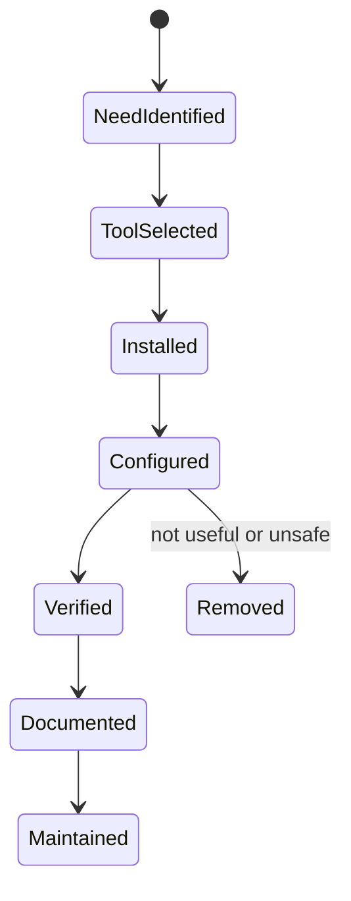

# Tools

이 영역은 터미널, 원격 접근, 자동화, AI 도구를 실제 작업 흐름에 맞춰 선택하고 운영하기 위한 문서 모음이다.

## 1. 왜 필요한가? (Pain Point & Motivation)

생산성 도구는 많이 설치할수록 좋은 것이 아니다. 터미널 멀티플렉서, 에디터, 스니펫 매니저, 원격 접속, 웹 자동화, AI 도구는 서로 겹치는 역할이 있고, 잘못 섞으면 설정만 복잡해진다.

도구 문서의 목적은 "인기 있는 도구 목록"이 아니라 "내 작업 흐름에서 어떤 문제를 어떤 도구가 해결하는가"를 분명히 하는 것이다.

## 2. 현재 나의 상태 (Baseline)

현재 문서 범위는 다음과 같다.

- Terminal: [Linux Commands](terminal/linux-commands.md), [Modern CLI Tools](terminal/modern-cli-tools.md), [tmux](terminal/tmux.md), [Vim](terminal/vim.md), [pet](terminal/pet.md), [GNU Stow](terminal/stow.md).
- Remote: [Guacamole](remote/guacamole.md).
- Automation: [Selenium](automation/selenium.md), [Change Detection](automation/change-detection.md), [Schedule Manager](automation/schedule-manager.md).
- AI: [Gemini Shell](ai/gemini-shell.md), [Langflow](ai/langflow.md), [MCP](ai/mcp.md).
- UI helper: [Split View](split-view.md).

## 3. 도달하고 싶은 목표 (Target State)

목표는 도구를 역할별로 분리해 유지보수 가능한 작업 환경을 만드는 것이다.

- 명령 실행, 세션 유지, 편집, 스니펫, dotfiles 관리를 구분한다.
- 원격 접근은 브라우저 기반 gateway와 SSH/VPN 접근을 분리한다.
- 자동화는 브라우저 자동화, 변경 감지, 스케줄링을 분리한다.
- AI 도구는 API 호출, 시각적 플로우, 외부 도구 연결 프로토콜을 구분한다.
- secrets와 토큰은 문서에 직접 남기지 않는다.
- 설치보다 검증과 rollback 절차를 먼저 둔다.

## 4. 시스템 번역 (Data Flow)

작업 환경 흐름은 다음처럼 구성된다.

```text
shell
  -> tmux session
  -> editor or CLI tools
  -> snippets and dotfiles
  -> remote access if needed
  -> automation for repeated work
  -> AI tools for generation or tool integration
```

도구를 추가할 때는 기존 흐름의 어느 단계에 들어가는지 먼저 정한다.

## 5. 핵심 구성요소 (Building Blocks)

- Shell: 명령 실행의 기본 환경.
- Tmux: 장시간 세션과 여러 pane/window 관리.
- Vim: 터미널 기반 편집과 빠른 텍스트 조작.
- Modern CLI tools: `rg`, `fd`, `bat`, `eza`, `fzf`, `jq` 같은 대체/보완 도구.
- Pet: 긴 명령어를 스니펫으로 저장하고 검색하는 도구.
- Stow: dotfiles를 symlink로 관리하는 도구.
- Guacamole: 브라우저 기반 SSH/RDP/VNC gateway.
- Selenium: 브라우저 자동화와 E2E 테스트 도구.
- Change Detection: 웹 페이지 변경 감지와 알림.
- Gemini API shell: API 호출을 CLI로 감싼 작은 도구.
- Langflow: LLM workflow를 시각적으로 구성하는 플랫폼.
- MCP: LLM 클라이언트와 외부 도구/리소스를 연결하는 프로토콜.

## 6. 상태 전이 (State Transition)

도구 도입은 다음 순서로 진행한다.



`Verified` 없이 dotfiles나 자동화에 넣으면 문제가 생겼을 때 원인을 찾기 어렵다.

## 7. 불변식 (Invariant: 절대 깨지면 안 되는 규칙)

- API key, webhook URL, tunnel token, SSH private key는 문서에 직접 기록하지 않는다.
- 도구 설치 명령은 운영 시스템에서 바로 실행하기 전 격리된 환경에서 검토한다.
- 자동화 도구는 실패, 재시도, 중복 실행 조건을 가져야 한다.
- 브라우저 자동화는 사이트 이용 약관과 rate limit을 고려해야 한다.
- dotfiles 도구는 기존 설정 파일을 백업한 뒤 적용한다.
- 원격 접근 도구는 인증과 로그를 반드시 확인한다.

## 8. 가장 작은 예제 (Minimal Viable Example)

기본 터미널 생산성 세트는 다음 정도면 충분하다.

```text
tmux for persistent sessions
vim or nvim for terminal editing
rg and fd for search
jq for JSON
stow for dotfiles
pet for reusable long commands
```

AI 도구는 다음처럼 목적별로 나눈다.

```text
single API call -> Gemini shell wrapper
visual LLM flow -> Langflow
tool and resource integration -> MCP
```

## 9. 실패 사례 (What could go wrong?)

- 최신 도구를 많이 설치했지만 기존 shell alias와 충돌한다.
- dotfiles를 stow로 적용하다가 기존 설정을 덮어쓴다.
- 웹 자동화가 로그인/2FA/캡차 변화에 취약해진다.
- 변경 감지 알림 webhook URL이 유출되어 외부에서 메시지를 보낸다.
- AI 도구에 API key를 하드코딩해 저장소에 커밋한다.
- Guacamole 같은 원격 gateway를 외부에 열고 기본 계정을 바꾸지 않는다.

## 10. 뇌 확장하기 (Evolution & Variants)

- shell 설정을 bootstrap script가 아니라 stow 패키지와 문서화된 설치 순서로 관리한다.
- terminal multiplexer는 tmux, zellij, terminal built-in split 중 하나로 통일한다.
- 자동화는 cron, systemd timer, workflow tool 중 운영 관찰이 쉬운 방식을 선택한다.
- AI 도구는 local-first, cloud API, workflow orchestration, MCP integration으로 분류한다.
- 원격 접근은 VPN, Zero Trust, Guacamole, SSH bastion의 보안 경계를 비교한다.

## 11. 최종 체크리스트 (Definition of Done)

- [ ] 도구마다 해결하려는 문제가 명확하다.
- [ ] secrets를 환경 변수나 secret store로 분리했다.
- [ ] 설치 후 최소 검증 명령이 있다.
- [ ] 기존 설정 파일을 백업하고 rollback할 수 있다.
- [ ] 자동화는 실패와 중복 실행을 고려한다.
- [ ] 도구 문서가 실제 사용 흐름과 연결되어 있다.

## 12. 뇌에 새기는 복습 문장 (TL;DR Blank)

좋은 도구 환경은 많은 프로그램을 설치한 상태가 아니라, 각 도구가 맡는 역할과 검증 방법이 분명한 작업 흐름이다.
