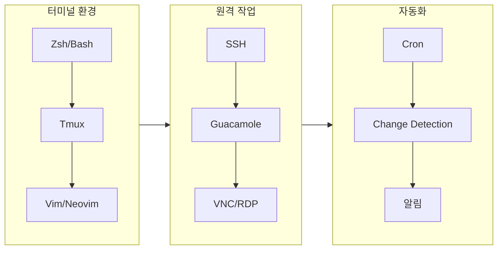
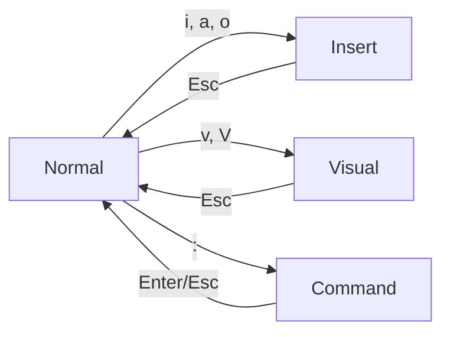
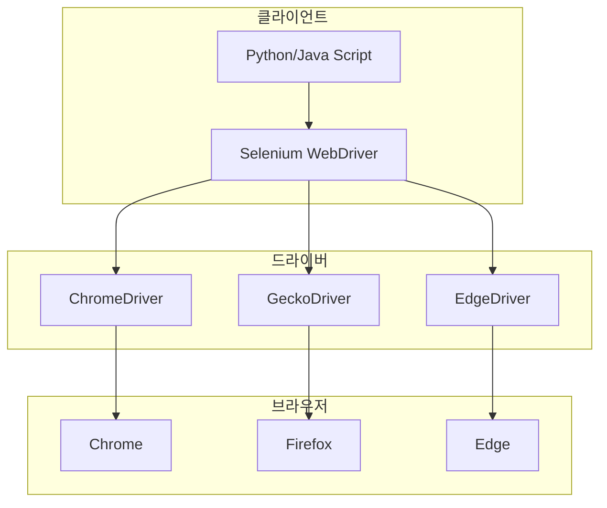
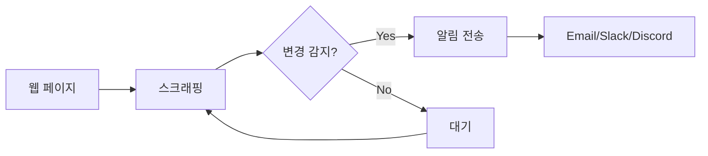
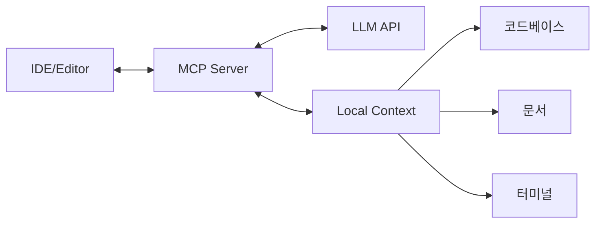

# 도구 문서

터미널 유틸리티, 원격 접근, 자동화 도구에 관한 가이드입니다.


<div class="compose-hero" markdown>
<span class="compose-kicker">Tools</span>

## 작업 환경을 바로 구성할 수 있는 생산성 도구 모음

터미널 기반 생산성 도구, 원격 접근, 자동화, AI 도구를 실제 사용 흐름에 맞춰 빠르게 탐색할 수 있도록 정리했습니다.

<div class="landing-meta-list" markdown>
<span>Terminal</span>
<span>Remote Access</span>
<span>Automation</span>
<span>AI Tools</span>
</div>

<div class="compose-actions" markdown>
[:octicons-arrow-right-24: 모던 CLI 도구](terminal/modern-cli-tools.md){ .md-button .md-button--primary }
[:material-console: Tmux 빠른 참조](terminal/tmux.md){ .md-button }
[:material-arrow-split-vertical: Split View](split-view.md){ .md-button }
</div>
</div>

## :material-tools: 핵심 도구 영역

<div class="grid cards" markdown>

-   :material-console:{ .lg .middle } **터미널 도구**

    ---

    커맨드라인 생산성 도구

    - [모던 CLI 도구 가이드](terminal/modern-cli-tools.md) - 터미널 에뮬레이터 & CLI 도구 종합
    - [Tmux](terminal/tmux.md) - 터미널 멀티플렉서
    - [Vim](terminal/vim.md) - 텍스트 에디터
    - [Linux 명령어](terminal/linux-commands.md) - 필수 레퍼런스
    - [Pet](terminal/pet.md) - CLI 스니펫 매니저

-   :material-remote-desktop:{ .lg .middle } **원격 접근**

    ---

    웹 기반 원격 연결 도구

    - [Guacamole](remote/guacamole.md) - 웹 원격 데스크톱

-   :material-robot:{ .lg .middle } **자동화**

    ---

    작업 자동화 및 모니터링

    - [Selenium](automation/selenium.md) - 웹 자동화
    - [Change Detection](automation/change-detection.md) - 웹 변경 감지
    - [스케줄 매니저](automation/schedule-manager.md) - 작업 스케줄링

-   :material-head-snowflake:{ .lg .middle } **AI 도구**

    ---

    AI 통합 개발 도구

    - [Gemini Shell](ai/gemini-shell.md) - AI 셸 통합
    - [MCP](ai/mcp.md) - Model Context Protocol

</div>

---

## :material-lightning-bolt: 생산성 도구 체인



---

## :material-keyboard: Tmux 빠른 참조

### 기본 키바인딩 (Prefix: `Ctrl+b`)

| 키 | 동작 |
|----|------|
| `c` | 새 윈도우 |
| `n` / `p` | 다음/이전 윈도우 |
| `%` | 수직 분할 |
| `"` | 수평 분할 |
| `o` | 다음 패인 |
| `d` | 세션 분리 |
| `[` | 복사 모드 |

### 세션 관리

```bash
# 새 세션 생성
tmux new -s dev

# 세션 목록
tmux ls

# 세션 연결
tmux attach -t dev

# 세션 종료
tmux kill-session -t dev
```

---

## :material-file-edit: Vim 모드와 명령어

### 모드 전환



### 필수 명령어

| 범주 | 명령 | 설명 |
|------|------|------|
| **이동** | `h,j,k,l` | 좌, 하, 상, 우 |
| | `w/b` | 단어 앞/뒤로 |
| | `gg/G` | 파일 시작/끝 |
| **편집** | `dd` | 줄 삭제 |
| | `yy` | 줄 복사 |
| | `p` | 붙여넣기 |
| | `u` | 실행 취소 |
| **검색** | `/pattern` | 검색 |
| | `n/N` | 다음/이전 |
| **저장** | `:w` | 저장 |
| | `:q` | 종료 |
| | `:wq` | 저장 후 종료 |

---

## :material-web: 웹 자동화 스택

### Selenium 아키텍처



### Change Detection 워크플로우



---

## :material-server-network: 원격 접근 비교

| 도구 | 프로토콜 | 장점 | 단점 |
|------|----------|------|------|
| **SSH** | SSH | 가볍고, 안전 | CLI 전용 |
| **Guacamole** | VNC/RDP/SSH | 웹 기반, 다중 프로토콜 | 설정 복잡 |
| **VS Code Remote** | SSH | IDE 통합 | 리소스 사용 |
| **Code Server** | HTTP | 웹 기반 VS Code | 서버 필요 |
| **RustDesk** | 자체 | 오픈소스, P2P | 설정 필요 |

---

## :material-robot-outline: AI 개발 도구

### MCP (Model Context Protocol)



### 추천 AI 도구

| 도구 | 용도 | 통합 |
|------|------|------|
| **GitHub Copilot** | 코드 자동완성 | VS Code, JetBrains |
| **Cursor** | AI 네이티브 IDE | 독립 |
| **Aider** | CLI 코딩 어시스턴트 | 터미널 |
| **Continue** | 오픈소스 Copilot | VS Code |

---

## :material-check-circle: 도구 설치 체크리스트

### 개발 환경 필수 도구

- [ ] **Shell**: Zsh + Oh My Zsh
- [ ] **Terminal Multiplexer**: Tmux
- [ ] **Editor**: Vim/Neovim 또는 VS Code
- [ ] **Version Control**: Git + GitHub CLI
- [ ] **Container**: Docker + Docker Compose

### 자동화 도구

- [ ] **Cron**: 시스템 작업 스케줄링
- [ ] **Change Detection**: 웹 모니터링
- [ ] **Ansible**: 서버 자동화

### 모니터링

- [ ] **htop**: 시스템 모니터링
- [ ] **Prometheus + Grafana**: 메트릭 수집

---

## :material-link-variant: 관련 문서

- [Linux 명령어](../linux/commands.md)
- [SSH 설정](../security/ssh/configuration.md)
- [Docker 설치](../development/docker/installation.md)
- [Code Server 설치](../development/ide/code-server.md)

---

## :material-book-open-page-variant: 참고 자료

- [Tmux Cheat Sheet](https://tmuxcheatsheet.com/)
- [Vim Adventures](https://vim-adventures.com/) - 게임으로 Vim 학습
- [Selenium Documentation](https://www.selenium.dev/documentation/)
- [Apache Guacamole](https://guacamole.apache.org/)
