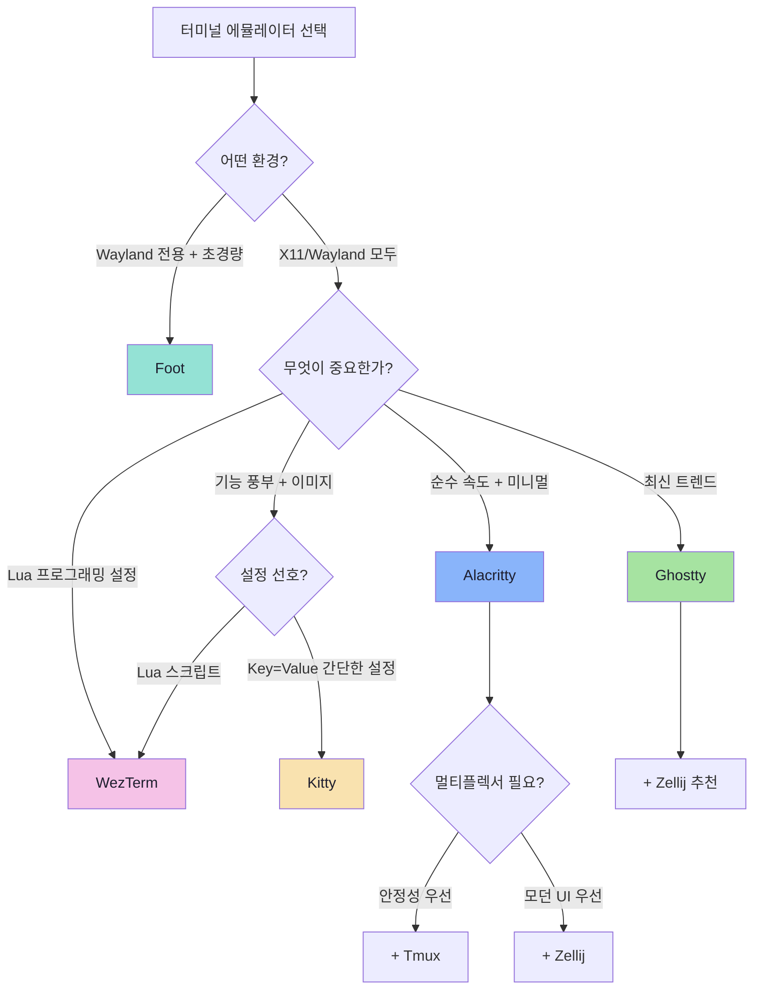
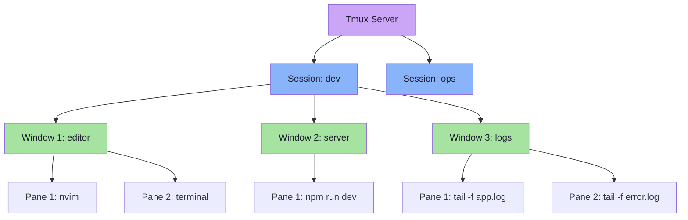
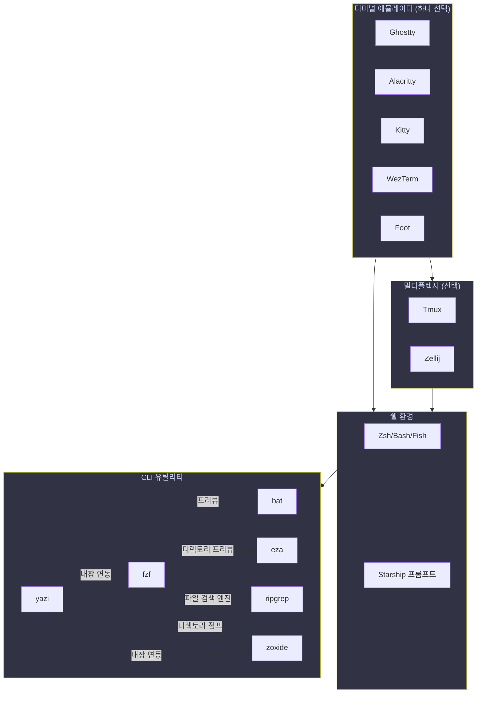

# 모던 터미널 에뮬레이터 & CLI 도구 완벽 가이드

2024-2026년 Reddit 커뮤니티(r/unixporn, r/commandline, r/archlinux)에서 가장 많이 추천되는 터미널 에뮬레이터와 CLI 도구를 정리한 Power User 가이드입니다. Arch Linux와 Fedora 환경을 기준으로 설치, 설정, 활용법을 다룹니다.

!!! info "대상 독자"
    GPU 가속 터미널, Lua/TOML 기반 설정, 모던 Rust CLI 도구에 관심 있는 리눅스 사용자를 대상으로 합니다. 기본적인 터미널 사용 경험이 있다고 가정합니다.

---

## 터미널 에뮬레이터

### 한눈에 보는 비교표

| 항목 | Ghostty | Alacritty | Kitty | WezTerm | Foot |
|------|---------|-----------|-------|---------|------|
| **언어** | Zig | Rust | C/Python | Rust | C |
| **GPU 가속** | OpenGL | OpenGL | OpenGL | OpenGL | 없음 (Wayland 네이티브) |
| **설정 형식** | 자체 Key=Value | TOML | 자체 Key=Value | Lua | INI |
| **탭/분할** | 탭 지원 | 없음 | 탭 + 분할 | 탭 + 분할 | 없음 |
| **이미지 프로토콜** | Kitty 프로토콜 | 없음 | Kitty 프로토콜 | iTerm2/Sixel | Sixel |
| **내장 멀티플렉서** | 없음 | 없음 | 있음 | 있음 | 없음 |
| **Wayland 지원** | 네이티브 | 네이티브 | 네이티브 | 네이티브 | 전용 |
| **X11 지원** | 지원 | 지원 | 지원 | 지원 | 미지원 |
| **메모리 사용량** | ~30MB | ~15MB | ~40MB | ~50MB | ~10MB |
| **폰트 합자** | 지원 | 미지원 | 지원 | 지원 | 미지원 |
| **라이선스** | MIT | Apache 2.0 | GPL 3.0 | MIT | MIT |
| **출시 연도** | 2024 | 2017 | 2018 | 2020 | 2020 |

---

### Ghostty

#### 개요

Ghostty는 Zig 언어로 작성된 차세대 터미널 에뮬레이터입니다. 2024년 12월에 공개되어 Reddit과 Hacker News에서 폭발적인 관심을 받았습니다. GPU 가속을 지원하면서도 각 플랫폼의 네이티브 UI 요소(GTK4 on Linux, AppKit on macOS)를 사용하여 운영체제와 자연스럽게 통합됩니다.

**핵심 특징:**

- Zig 언어 기반의 고성능 렌더링 엔진
- 네이티브 GTK4 윈도우 데코레이션 (리눅스)
- Kitty 이미지 프로토콜 지원
- 직관적인 Key=Value 설정 파일
- libadwaita 테마 자동 적용

#### 설치

=== "Arch Linux"

    ```bash
    # 공식 저장소에 포함
    sudo pacman -S ghostty
    ```

=== "Fedora"

    ```bash
    # COPR 저장소 사용
    sudo dnf copr enable pgdev/ghostty
    sudo dnf install ghostty

    # 또는 소스 빌드 (Zig 0.13+ 필요)
    sudo dnf install zig gtk4-devel libadwaita-devel
    git clone https://github.com/ghostty-org/ghostty.git
    cd ghostty
    zig build -Doptimize=ReleaseFast
    sudo cp zig-out/bin/ghostty /usr/local/bin/
    ```

#### 설정

설정 파일 위치: `~/.config/ghostty/config`

```ini
# ~/.config/ghostty/config
# Ghostty 설정 파일 - Key = Value 형식

# 폰트 설정
font-family = "JetBrains Mono"
font-size = 13
font-feature = "calt"
font-feature = "liga"

# 창 설정
window-padding-x = 8
window-padding-y = 8
window-decoration = auto
window-theme = ghostty
gtk-titlebar = false

# 테마 (내장 테마 사용 가능)
theme = catppuccin-mocha

# 커서 설정
cursor-style = block
cursor-style-blink = false
shell-integration-features = cursor

# 클립보드
clipboard-read = allow
clipboard-write = allow
clipboard-paste-protection = true

# 마우스
mouse-hide-while-typing = true
link-url = true

# 스크롤
scrollback-limit = 10000

# 키바인딩
keybind = ctrl+shift+c=copy_to_clipboard
keybind = ctrl+shift+v=paste_from_clipboard
keybind = ctrl+shift+n=new_window
keybind = ctrl+shift+t=new_tab
keybind = ctrl+shift+w=close_surface
keybind = ctrl+shift+enter=new_split:right
keybind = ctrl+shift+minus=new_split:down
keybind = ctrl+tab=next_tab
keybind = ctrl+shift+tab=previous_tab
keybind = ctrl+shift+plus=increase_font_size:1
keybind = ctrl+minus=decrease_font_size:1
keybind = ctrl+zero=reset_font_size

# 성능
bold-is-bright = false
adjust-cell-width = 0
adjust-cell-height = 0
```

#### 고급 설정

!!! tip "내장 테마 목록 확인"
    ```bash
    ghostty +list-themes
    ```
    Ghostty는 수백 개의 내장 테마를 포함하고 있어 별도 파일 없이 `theme = 테마이름`으로 즉시 적용됩니다.

!!! note "쉘 통합"
    Ghostty는 자동 쉘 통합을 지원합니다. Zsh, Bash, Fish에서 자동으로 커서 모양 변경, 작업 디렉토리 추적, 명령어 완료 알림 등의 기능이 활성화됩니다.

#### 장단점

| 장점 | 단점 |
|------|------|
| 직관적이고 간결한 설정 | 2024년 출시로 생태계가 아직 성장 중 |
| 네이티브 GTK4 통합 | 일부 고급 설정 옵션이 제한적 |
| 뛰어난 폰트 렌더링 | 플러그인/확장 시스템 부재 |
| 풍부한 내장 테마 | X11 환경에서 일부 기능 제한 |
| 빠른 시작 속도 | Fedora 공식 저장소 미포함 (COPR 필요) |

---

### Alacritty

#### 개요

Alacritty는 "가장 빠른 터미널 에뮬레이터"를 표방하는 Rust 기반 프로젝트입니다. 탭, 창 분할, 스크롤바 등의 기능을 의도적으로 배제하고 순수한 터미널 에뮬레이션에만 집중합니다. 이러한 미니멀리즘 철학 때문에 Tmux나 Zellij 같은 멀티플렉서와 함께 사용하는 것이 일반적입니다.

**핵심 특징:**

- Rust로 작성된 초고속 GPU 가속 렌더링
- 의도적으로 기능을 제한한 순수 에뮬레이터
- TOML 형식의 설정 파일
- Vi 모드 내장 (터미널 출력 탐색)
- 정규식 기반 URL 힌트

#### 설치

=== "Arch Linux"

    ```bash
    sudo pacman -S alacritty
    ```

=== "Fedora"

    ```bash
    sudo dnf install alacritty
    ```

#### 설정

설정 파일 위치: `~/.config/alacritty/alacritty.toml`

```toml
# ~/.config/alacritty/alacritty.toml

[env]
TERM = "xterm-256color"

[window]
padding = { x = 8, y = 8 }
dynamic_padding = true
decorations = "Full"
opacity = 0.95
blur = true
startup_mode = "Windowed"
dynamic_title = true

[scrolling]
history = 10000
multiplier = 3

[font]
size = 13.0

[font.normal]
family = "JetBrains Mono"
style = "Regular"

[font.bold]
family = "JetBrains Mono"
style = "Bold"

[font.italic]
family = "JetBrains Mono"
style = "Italic"

[font.bold_italic]
family = "JetBrains Mono"
style = "Bold Italic"

[font.offset]
x = 0
y = 1

# Catppuccin Mocha 테마
[colors.primary]
background = "#1E1E2E"
foreground = "#CDD6F4"
dim_foreground = "#CDD6F4"
bright_foreground = "#CDD6F4"

[colors.cursor]
text = "#1E1E2E"
cursor = "#F5E0DC"

[colors.vi_mode_cursor]
text = "#1E1E2E"
cursor = "#B4BEFE"

[colors.search.matches]
foreground = "#1E1E2E"
background = "#A6ADC8"

[colors.search.focused_match]
foreground = "#1E1E2E"
background = "#A6E3A1"

[colors.normal]
black = "#45475A"
red = "#F38BA8"
green = "#A6E3A1"
yellow = "#F9E2AF"
blue = "#89B4FA"
magenta = "#F5C2E7"
cyan = "#94E2D5"
white = "#BAC2DE"

[colors.bright]
black = "#585B70"
red = "#F38BA8"
green = "#A6E3A1"
yellow = "#F9E2AF"
blue = "#89B4FA"
magenta = "#F5C2E7"
cyan = "#94E2D5"
white = "#A6ADC8"

[selection]
save_to_clipboard = true

[cursor]
unfocused_hollow = true

[cursor.style]
shape = "Block"
blinking = "Off"

[mouse]
hide_when_typing = true

# Vi 모드 활성화
[keyboard]
bindings = [
  # Vi 모드 토글
  { key = "Space", mods = "Control|Shift", action = "ToggleViMode" },

  # 클립보드
  { key = "C", mods = "Control|Shift", action = "Copy" },
  { key = "V", mods = "Control|Shift", action = "Paste" },

  # 폰트 크기 조절
  { key = "Plus", mods = "Control", action = "IncreaseFontSize" },
  { key = "Minus", mods = "Control", action = "DecreaseFontSize" },
  { key = "Key0", mods = "Control", action = "ResetFontSize" },

  # 새 인스턴스
  { key = "N", mods = "Control|Shift", action = "CreateNewWindow" },
]

# URL 힌트 (Ctrl+Shift+U로 URL 선택 모드)
[[hints.enabled]]
command = "xdg-open"
hyperlinks = true
post_processing = true
persist = false
regex = "(ipfs:|ipns:|magnet:|mailto:|gemini://|gopher://|https://|http://|news:|ssh:|ftp://)[^\u0000-\u001F\u007F-\u009F<>\"\\s{-}\\^⟨⟩`]+"

[hints.enabled.binding]
key = "U"
mods = "Control|Shift"

[hints.enabled.mouse]
enabled = true
mods = "None"
```

#### 고급 활용

**Vi 모드:**

`Ctrl+Shift+Space`를 누르면 Vi 모드에 진입합니다. 이 모드에서는 Vim과 동일한 키바인딩으로 터미널 출력을 탐색하고 텍스트를 선택할 수 있습니다.

| 키 | 동작 |
|----|------|
| `h/j/k/l` | 좌/하/상/우 이동 |
| `w/b` | 단어 단위 이동 |
| `0/$` | 줄 시작/끝 이동 |
| `gg/G` | 스크롤백 시작/끝 |
| `v` | 선택 모드 시작 |
| `V` | 줄 선택 모드 |
| `y` | 선택 영역 복사 |
| `/` | 검색 |
| `n/N` | 다음/이전 검색 결과 |
| `Escape` | Vi 모드 종료 |

!!! tip "Tmux와 함께 사용하기"
    Alacritty의 미니멀리즘은 Tmux와 함께 사용할 때 빛을 발합니다. Alacritty가 빠른 렌더링을 담당하고, Tmux가 세션/창 관리를 담당하는 역할 분담이 효율적입니다.
    ```bash
    # Alacritty 시작 시 자동으로 Tmux 세션에 연결
    # alacritty.toml에 추가:
    [terminal]
    shell = { program = "/usr/bin/zsh", args = ["-c", "tmux new-session -A -s main"] }
    ```

#### 장단점

| 장점 | 단점 |
|------|------|
| 최고 수준의 렌더링 성능 | 탭/분할 기능 없음 (별도 멀티플렉서 필요) |
| 매우 낮은 메모리 사용량 | 폰트 합자 미지원 |
| 안정적이고 성숙한 프로젝트 | 이미지 프로토콜 미지원 |
| TOML 설정으로 관리 용이 | GUI 설정 도구 없음 |
| Vi 모드 내장 | 스크롤바 없음 |

---

### Kitty

#### 개요

Kitty는 C와 Python으로 작성된 기능이 풍부한 GPU 가속 터미널 에뮬레이터입니다. 자체적인 탭/창 분할 기능, 이미지 표시 프로토콜(Kitty 그래픽 프로토콜), 확장 스크립트 시스템(Kittens)을 갖추고 있어 "터미널 에뮬레이터의 끝판왕"으로 불립니다.

**핵심 특징:**

- OpenGL GPU 가속 렌더링
- Kitty 그래픽 프로토콜 (이미지/동영상 표시)
- Kittens 확장 스크립트 시스템
- 내장 탭/창 분할 기능
- 유니코드 입력 지원
- 원격 제어 프로토콜

#### 설치

=== "Arch Linux"

    ```bash
    sudo pacman -S kitty
    ```

=== "Fedora"

    ```bash
    sudo dnf install kitty
    ```

#### 설정

설정 파일 위치: `~/.config/kitty/kitty.conf`

```bash
# ~/.config/kitty/kitty.conf

# 폰트 설정
font_family      JetBrains Mono
bold_font        JetBrains Mono Bold
italic_font      JetBrains Mono Italic
bold_italic_font JetBrains Mono Bold Italic
font_size        13.0

# 폰트 합자 활성화
disable_ligatures never

# 커서 설정
cursor_shape block
cursor_blink_interval 0
cursor_stop_blinking_after 0

# 스크롤백
scrollback_lines 10000
scrollback_pager less --chop-long-lines --RAW-CONTROL-CHARS +INPUT_LINE_NUMBER

# 마우스
mouse_hide_wait 3.0
url_style curly
open_url_with default
url_prefixes file ftp ftps gemini git gopher http https irc ircs kitty mailto news sftp ssh
detect_urls yes
copy_on_select clipboard

# 성능
repaint_delay 10
input_delay 3
sync_to_monitor yes

# 벨 설정
enable_audio_bell no
visual_bell_duration 0.0

# 창 설정
window_padding_width 8
window_margin_width 0
single_window_margin_width -1
placement_strategy center
hide_window_decorations no
confirm_os_window_close -1

# 탭 설정
tab_bar_edge bottom
tab_bar_style powerline
tab_powerline_style slanted
tab_bar_min_tabs 2
tab_title_template "{index}: {title}"
active_tab_font_style bold

# 레이아웃
enabled_layouts tall:bias=50;full_size=1;mirrored=false, fat, grid, splits, stack

# 색상 테마 (Catppuccin Mocha)
foreground              #CDD6F4
background              #1E1E2E
selection_foreground     #1E1E2E
selection_background     #F5E0DC
cursor                  #F5E0DC
cursor_text_color       #1E1E2E
url_color               #F5E0DC

# 일반 색상
color0  #45475A
color1  #F38BA8
color2  #A6E3A1
color3  #F9E2AF
color4  #89B4FA
color5  #F5C2E7
color6  #94E2D5
color7  #BAC2DE

# 밝은 색상
color8  #585B70
color9  #F38BA8
color10 #A6E3A1
color11 #F9E2AF
color12 #89B4FA
color13 #F5C2E7
color14 #94E2D5
color15 #A6ADC8

# 탭 바 색상
active_tab_foreground   #11111B
active_tab_background   #CBA6F7
inactive_tab_foreground #CDD6F4
inactive_tab_background #181825

# 키바인딩
map ctrl+shift+c copy_to_clipboard
map ctrl+shift+v paste_from_clipboard
map ctrl+shift+t new_tab
map ctrl+shift+w close_tab
map ctrl+shift+right next_tab
map ctrl+shift+left previous_tab
map ctrl+shift+enter new_window
map ctrl+shift+n new_os_window

# 창 분할
map ctrl+shift+minus launch --location=hsplit
map ctrl+shift+backslash launch --location=vsplit

# 창 이동
map ctrl+shift+h neighboring_window left
map ctrl+shift+j neighboring_window down
map ctrl+shift+k neighboring_window up
map ctrl+shift+l neighboring_window right

# 창 크기 조절
map ctrl+shift+r start_resizing_window

# 폰트 크기
map ctrl+shift+equal change_font_size all +1.0
map ctrl+shift+minus change_font_size all -1.0
map ctrl+shift+0 change_font_size all 0

# 레이아웃 전환
map ctrl+shift+l next_layout

# 스크롤
map ctrl+shift+up scroll_line_up
map ctrl+shift+down scroll_line_down
map ctrl+shift+page_up scroll_page_up
map ctrl+shift+page_down scroll_page_down
map ctrl+shift+home scroll_home
map ctrl+shift+end scroll_end

# 원격 제어 활성화 (Kittens 사용 시 필요)
allow_remote_control yes
listen_on unix:/tmp/kitty
```

#### Kittens (확장 스크립트)

Kittens는 Kitty의 확장 스크립트 시스템입니다. Python으로 작성되며 터미널의 기능을 확장합니다.

**내장 Kittens:**

```bash
# icat - 터미널에서 이미지 표시
kitty +kitten icat image.png

# diff - 컬러풀한 diff 도구
kitty +kitten diff file1 file2

# clipboard - 클립보드 관리
echo "텍스트" | kitty +kitten clipboard

# unicode_input - 유니코드 문자 입력 (Ctrl+Shift+U)
kitty +kitten unicode_input

# ssh - Kitty의 SSH 래퍼 (원격 서버에서도 Kitty 기능 사용)
kitty +kitten ssh user@server

# hints - URL/경로/해시 등 텍스트 패턴 선택
kitty +kitten hints --type url
kitty +kitten hints --type path
kitty +kitten hints --type hash
```

!!! tip "icat으로 이미지 미리보기"
    ```bash
    # 단일 이미지 표시
    kitty +kitten icat photo.jpg

    # 크기 지정
    kitty +kitten icat --place 80x24@0x0 photo.jpg

    # fzf와 결합한 이미지 브라우저
    find . -name "*.png" | fzf --preview 'kitty +kitten icat --clear --transfer-mode file --place ${FZF_PREVIEW_COLUMNS}x${FZF_PREVIEW_LINES}@0x0 {}'
    ```

#### 탭/창 분할 사용법

| 키 | 동작 |
|----|------|
| `Ctrl+Shift+T` | 새 탭 |
| `Ctrl+Shift+W` | 탭 닫기 |
| `Ctrl+Shift+Right/Left` | 다음/이전 탭 |
| `Ctrl+Shift+Enter` | 새 창 (현재 레이아웃에 따라) |
| `Ctrl+Shift+\` | 수직 분할 |
| `Ctrl+Shift+-` | 수평 분할 |
| `Ctrl+Shift+H/J/K/L` | 창 간 이동 |
| `Ctrl+Shift+R` | 창 크기 조절 모드 |
| `Ctrl+Shift+L` | 레이아웃 전환 |

#### 장단점

| 장점 | 단점 |
|------|------|
| 기능이 매우 풍부 (올인원) | 메모리 사용량이 상대적으로 높음 |
| Kitty 그래픽 프로토콜 (이미지 표시) | 설정 파일이 길어질 수 있음 |
| Kittens 확장 시스템 | GPL 라이선스 (상업적 사용 시 주의) |
| 폰트 합자 지원 | 개발자(kovid)의 독선적 의사결정에 대한 커뮤니티 논란 |
| 강력한 원격 제어 API | SSH kitten 학습 곡선 |

---

### WezTerm

#### 개요

WezTerm은 Rust로 작성된 GPU 가속 터미널 에뮬레이터로, Lua 스크립트로 설정을 작성한다는 점이 가장 큰 차별점입니다. Neovim의 Lua 설정과 유사한 접근 방식으로, 프로그래밍적인 설정이 가능합니다. 내장 멀티플렉서를 포함하고 있어 Tmux 없이도 세션 관리가 가능합니다.

**핵심 특징:**

- Rust 기반 고성능 렌더링
- Lua 스크립트 기반 설정 (프로그래밍 가능)
- 내장 멀티플렉서 (세션/탭/패인)
- 뛰어난 폰트 합자 지원
- iTerm2/Sixel 이미지 프로토콜
- 내장 SSH 클라이언트

#### 설치

=== "Arch Linux"

    ```bash
    # AUR에서 설치
    yay -S wezterm
    ```

=== "Fedora"

    ```bash
    # COPR 저장소 사용
    sudo dnf copr enable wezfurlong/wezterm-nightly
    sudo dnf install wezterm

    # 또는 Flatpak
    flatpak install flathub org.wezfurlong.wezterm
    ```

#### 설정

설정 파일 위치: `~/.config/wezterm/wezterm.lua`

```lua
-- ~/.config/wezterm/wezterm.lua
local wezterm = require("wezterm")
local config = wezterm.config_builder()

-- 폰트 설정
config.font = wezterm.font_with_fallback({
  {
    family = "JetBrains Mono",
    weight = "Regular",
    harfbuzz_features = { "calt=1", "clig=1", "liga=1" },
  },
  { family = "Noto Sans KR" },       -- 한글 폴백
  { family = "Symbols Nerd Font" },   -- 아이콘 폴백
})
config.font_size = 13.0
config.line_height = 1.1

-- 색상 테마
config.color_scheme = "Catppuccin Mocha"

-- 창 설정
config.window_padding = {
  left = 8,
  right = 8,
  top = 8,
  bottom = 8,
}
config.window_background_opacity = 0.95
config.window_decorations = "RESIZE"
config.window_close_confirmation = "AlwaysPrompt"
config.adjust_window_size_when_changing_font_size = false

-- 탭 바 설정
config.use_fancy_tab_bar = false
config.tab_bar_at_bottom = true
config.hide_tab_bar_if_only_one_tab = true
config.tab_max_width = 32

-- 커서 설정
config.default_cursor_style = "SteadyBlock"
config.cursor_blink_rate = 0

-- 스크롤
config.scrollback_lines = 10000
config.enable_scroll_bar = false

-- Wayland 지원
config.enable_wayland = true

-- GPU 설정
config.front_end = "WebGpu"
config.webgpu_power_preference = "HighPerformance"

-- 키바인딩
config.keys = {
  -- 패인 분할
  {
    key = "\\",
    mods = "CTRL|SHIFT",
    action = wezterm.action.SplitHorizontal({ domain = "CurrentPaneDomain" }),
  },
  {
    key = "-",
    mods = "CTRL|SHIFT",
    action = wezterm.action.SplitVertical({ domain = "CurrentPaneDomain" }),
  },

  -- 패인 이동
  {
    key = "h",
    mods = "CTRL|SHIFT",
    action = wezterm.action.ActivatePaneDirection("Left"),
  },
  {
    key = "j",
    mods = "CTRL|SHIFT",
    action = wezterm.action.ActivatePaneDirection("Down"),
  },
  {
    key = "k",
    mods = "CTRL|SHIFT",
    action = wezterm.action.ActivatePaneDirection("Up"),
  },
  {
    key = "l",
    mods = "CTRL|SHIFT",
    action = wezterm.action.ActivatePaneDirection("Right"),
  },

  -- 패인 크기 조절
  {
    key = "H",
    mods = "CTRL|SHIFT|ALT",
    action = wezterm.action.AdjustPaneSize({ "Left", 5 }),
  },
  {
    key = "J",
    mods = "CTRL|SHIFT|ALT",
    action = wezterm.action.AdjustPaneSize({ "Down", 5 }),
  },
  {
    key = "K",
    mods = "CTRL|SHIFT|ALT",
    action = wezterm.action.AdjustPaneSize({ "Up", 5 }),
  },
  {
    key = "L",
    mods = "CTRL|SHIFT|ALT",
    action = wezterm.action.AdjustPaneSize({ "Right", 5 }),
  },

  -- 탭 이동
  {
    key = "Tab",
    mods = "CTRL",
    action = wezterm.action.ActivateTabRelative(1),
  },
  {
    key = "Tab",
    mods = "CTRL|SHIFT",
    action = wezterm.action.ActivateTabRelative(-1),
  },

  -- 폰트 크기
  {
    key = "=",
    mods = "CTRL",
    action = wezterm.action.IncreaseFontSize,
  },
  {
    key = "-",
    mods = "CTRL",
    action = wezterm.action.DecreaseFontSize,
  },
  {
    key = "0",
    mods = "CTRL",
    action = wezterm.action.ResetFontSize,
  },

  -- 명령 팔레트
  {
    key = "p",
    mods = "CTRL|SHIFT",
    action = wezterm.action.ActivateCommandPalette,
  },
}

-- 숫자키로 탭 전환 (Ctrl+1~9)
for i = 1, 9 do
  table.insert(config.keys, {
    key = tostring(i),
    mods = "CTRL",
    action = wezterm.action.ActivateTab(i - 1),
  })
end

-- 마우스 바인딩
config.mouse_bindings = {
  -- URL 클릭
  {
    event = { Up = { streak = 1, button = "Left" } },
    mods = "CTRL",
    action = wezterm.action.OpenLinkAtMouseCursor,
  },
}

return config
```

#### Lua 스크립팅 고급 활용

WezTerm의 가장 강력한 기능은 Lua로 동적 설정을 작성할 수 있다는 점입니다.

**시간대별 자동 테마 전환:**

```lua
-- 시간에 따른 자동 테마 전환
local function scheme_for_appearance()
  local hour = tonumber(os.date("%H"))
  if hour >= 7 and hour < 19 then
    return "Catppuccin Latte"  -- 낮: 라이트 테마
  else
    return "Catppuccin Mocha"  -- 밤: 다크 테마
  end
end

config.color_scheme = scheme_for_appearance()
```

**호스트별 조건부 설정:**

```lua
-- 호스트명에 따른 설정 분기
local hostname = wezterm.hostname()

if hostname == "workstation" then
  config.font_size = 14.0
  config.window_background_opacity = 1.0
elseif hostname == "laptop" then
  config.font_size = 12.0
  config.window_background_opacity = 0.9
end
```

**동적 탭 타이틀:**

```lua
-- 탭 타이틀에 프로세스명과 cwd 표시
wezterm.on("format-tab-title", function(tab, tabs, panes, config, hover, max_width)
  local pane = tab.active_pane
  local title = pane.title
  if title and #title > 0 then
    title = string.gsub(title, "^(%S+).*", "%1")
  end

  local cwd = pane.current_working_dir
  if cwd then
    local dir = string.gsub(cwd.path, "^.*/", "")
    title = title .. " @ " .. dir
  end

  return {
    { Text = " " .. (tab.tab_index + 1) .. ": " .. title .. " " },
  }
end)
```

!!! note "내장 멀티플렉서 vs Tmux"
    WezTerm의 내장 멀티플렉서는 SSH를 통한 원격 패인 관리도 지원합니다. 하지만 Tmux와 달리 WezTerm 프로세스가 종료되면 세션도 함께 종료됩니다. 원격 서버에서의 세션 유지가 중요하다면 Tmux를 병행하는 것을 권장합니다.

#### 장단점

| 장점 | 단점 |
|------|------|
| Lua 기반 프로그래밍 가능한 설정 | 메모리 사용량이 상대적으로 높음 |
| 뛰어난 폰트 합자 지원 | Arch 공식 저장소 미포함 (AUR) |
| 내장 멀티플렉서 | 설정 파일 복잡도가 높을 수 있음 |
| 크로스 플랫폼 (Linux/macOS/Windows) | 시작 시간이 다소 느림 |
| 활발한 개발 커뮤니티 | Lua 학습이 필요 |

---

### Foot (Wayland 전용)

#### 개요

Foot은 Wayland 전용 터미널 에뮬레이터로, 극도로 가볍고 빠른 것이 특징입니다. GPU 가속 없이도 Wayland의 네이티브 렌더링 파이프라인을 활용하여 뛰어난 성능을 보여줍니다. Sway, Hyprland 같은 Wayland 타일링 윈도우 매니저와 함께 사용하는 유저들에게 인기가 높습니다.

**핵심 특징:**

- Wayland 네이티브 (X11 미지원)
- 극도로 낮은 메모리 사용량 (~10MB)
- Sixel 이미지 프로토콜 지원
- PGO(Profile-Guided Optimization) 빌드
- 빠른 시작 시간

#### 설치

=== "Arch Linux"

    ```bash
    sudo pacman -S foot
    ```

=== "Fedora"

    ```bash
    sudo dnf install foot
    ```

#### 설정

설정 파일 위치: `~/.config/foot/foot.ini`

```ini
# ~/.config/foot/foot.ini

[main]
term=xterm-256color
font=JetBrains Mono:size=13
dpi-aware=yes
pad=8x8
initial-window-size-chars=120x35

[bell]
urgent=no
notify=no
visual=no

[scrollback]
lines=10000
multiplier=3.0

[url]
launch=xdg-open ${url}
osc8-underline=url-mode
protocols=http, https, ftp, ftps, file, gemini, gopher, ssh

[cursor]
style=block
blink=no
color=1E1E2E F5E0DC

[mouse]
hide-when-typing=yes
alternate-scroll-mode=yes

[key-bindings]
clipboard-copy=Control+Shift+c
clipboard-paste=Control+Shift+v
font-increase=Control+plus
font-decrease=Control+minus
font-reset=Control+0
search-start=Control+Shift+f
spawn-terminal=Control+Shift+n
show-urls-launch=Control+Shift+u

[search-bindings]
find-prev=Control+Shift+p
find-next=Control+Shift+n
cursor-left=Left
cursor-right=Right
delete-prev=BackSpace

[text-bindings]
# 필요 시 커스텀 텍스트 바인딩 추가

[colors]
foreground=CDD6F4
background=1E1E2E
selection-foreground=1E1E2E
selection-background=F5E0DC

regular0=45475A
regular1=F38BA8
regular2=A6E3A1
regular3=F9E2AF
regular4=89B4FA
regular5=F5C2E7
regular6=94E2D5
regular7=BAC2DE

bright0=585B70
bright1=F38BA8
bright2=A6E3A1
bright3=F9E2AF
bright4=89B4FA
bright5=F5C2E7
bright6=94E2D5
bright7=A6ADC8
```

!!! warning "X11 미지원"
    Foot은 Wayland 전용입니다. X11 환경에서는 사용할 수 없습니다. Wayland 세션(GNOME Wayland, Sway, Hyprland 등)에서만 동작합니다. `echo $XDG_SESSION_TYPE`으로 현재 세션 타입을 확인할 수 있습니다.

#### 장단점

| 장점 | 단점 |
|------|------|
| 극도로 낮은 리소스 사용량 | X11 환경 미지원 |
| 빠른 시작/렌더링 | 기능이 제한적 (탭/분할 없음) |
| Wayland 네이티브 통합 | 커뮤니티 규모가 작음 |
| 간단한 INI 설정 | 폰트 합자 미지원 |
| Sixel 이미지 지원 | 확장 시스템 없음 |

---

### 에뮬레이터 선택 가이드



---

## 터미널 멀티플렉서

### Tmux

#### 개요

Tmux(Terminal Multiplexer)는 하나의 터미널에서 여러 세션을 관리하고, SSH 연결이 끊겨도 작업을 유지할 수 있는 업계 표준 도구입니다. 수십 년간 축적된 안정성과 방대한 레퍼런스가 강점입니다.

!!! info "기존 문서 참고"
    Tmux의 기본 사용법과 세션 관리 트러블슈팅은 [Tmux 가이드](tmux.md)를 참조하세요. 이 섹션에서는 모던 설정과 고급 활용법에 집중합니다.

#### 설치

=== "Arch Linux"

    ```bash
    sudo pacman -S tmux
    ```

=== "Fedora"

    ```bash
    sudo dnf install tmux
    ```

#### 핵심 개념



- **서버(Server)**: 백그라운드에서 실행되는 Tmux 프로세스
- **세션(Session)**: 독립적인 작업 환경 단위 (프로젝트별로 분리)
- **윈도우(Window)**: 세션 내의 탭 (편집기, 서버, 로그 등으로 분리)
- **패인(Pane)**: 윈도우를 분할한 개별 터미널 영역

#### 모던 설정

```bash
# ~/.tmux.conf - 모던 Tmux 설정

# ===== 기본 설정 =====

# Prefix 키를 Ctrl+a로 변경 (Ctrl+b 대신)
unbind C-b
set -g prefix C-a
bind C-a send-prefix

# 터미널 색상 지원
set -g default-terminal "tmux-256color"
set -ag terminal-overrides ",xterm-256color:RGB"

# 마우스 지원
set -g mouse on

# 시작 인덱스를 1로 (0 대신)
set -g base-index 1
setw -g pane-base-index 1

# 윈도우 번호 자동 재정렬
set -g renumber-windows on

# 히스토리 크기
set -g history-limit 50000

# Escape 딜레이 제거 (Vim 사용자 필수)
set -sg escape-time 0

# 포커스 이벤트 전달 (Vim autoread 등)
set -g focus-events on

# 디스플레이 시간
set -g display-time 4000
set -g display-panes-time 4000

# 상태 바 갱신 간격
set -g status-interval 5

# ===== 키바인딩 =====

# 설정 리로드
bind r source-file ~/.tmux.conf \; display "Config reloaded!"

# 창 분할 (직관적인 키)
bind | split-window -h -c "#{pane_current_path}"
bind - split-window -v -c "#{pane_current_path}"
unbind '"'
unbind %

# 새 윈도우에서 현재 경로 유지
bind c new-window -c "#{pane_current_path}"

# Vim 스타일 패인 이동
bind h select-pane -L
bind j select-pane -D
bind k select-pane -U
bind l select-pane -R

# Alt+방향키로 패인 이동 (prefix 없이)
bind -n M-h select-pane -L
bind -n M-j select-pane -D
bind -n M-k select-pane -U
bind -n M-l select-pane -R

# 패인 크기 조절 (Prefix + H/J/K/L)
bind -r H resize-pane -L 5
bind -r J resize-pane -D 5
bind -r K resize-pane -U 5
bind -r L resize-pane -R 5

# 윈도우 이동
bind -n S-Left previous-window
bind -n S-Right next-window

# 복사 모드에서 Vim 키바인딩
setw -g mode-keys vi
bind -T copy-mode-vi v send -X begin-selection
bind -T copy-mode-vi y send -X copy-pipe-and-cancel "wl-copy"
bind -T copy-mode-vi MouseDragEnd1Pane send -X copy-pipe-and-cancel "wl-copy"

# ===== 상태 바 =====

set -g status-position bottom
set -g status-justify left
set -g status-style "bg=#1E1E2E,fg=#CDD6F4"

set -g status-left-length 40
set -g status-left "#[fg=#1E1E2E,bg=#89B4FA,bold] #S #[fg=#89B4FA,bg=#1E1E2E]"

set -g status-right-length 60
set -g status-right "#[fg=#45475A]#[fg=#CDD6F4,bg=#45475A] %Y-%m-%d #[fg=#89B4FA]#[fg=#1E1E2E,bg=#89B4FA,bold] %H:%M "

# 윈도우 상태 스타일
setw -g window-status-format "#[fg=#6C7086] #I:#W "
setw -g window-status-current-format "#[fg=#1E1E2E,bg=#CBA6F7,bold] #I:#W "

# 패인 테두리
set -g pane-border-style "fg=#45475A"
set -g pane-active-border-style "fg=#CBA6F7"

# 메시지 스타일
set -g message-style "fg=#CDD6F4,bg=#45475A"

# ===== 플러그인 (TPM) =====

# TPM (Tmux Plugin Manager) 설치:
# git clone https://github.com/tmux-plugins/tpm ~/.tmux/plugins/tpm

set -g @plugin 'tmux-plugins/tpm'
set -g @plugin 'tmux-plugins/tmux-sensible'
set -g @plugin 'tmux-plugins/tmux-resurrect'
set -g @plugin 'tmux-plugins/tmux-continuum'
set -g @plugin 'tmux-plugins/tmux-yank'

# tmux-resurrect 설정
set -g @resurrect-capture-pane-contents 'on'
set -g @resurrect-strategy-nvim 'session'

# tmux-continuum 설정 (자동 저장/복구)
set -g @continuum-restore 'on'
set -g @continuum-save-interval '15'

# TPM 초기화 (이 줄은 반드시 설정 파일 맨 마지막에)
run '~/.tmux/plugins/tpm/tpm'
```

**TPM(Tmux Plugin Manager) 설치:**

```bash
# TPM 설치
git clone https://github.com/tmux-plugins/tpm ~/.tmux/plugins/tpm

# Tmux 내에서 플러그인 설치: Prefix + I (대문자)
# 플러그인 업데이트: Prefix + U
# 플러그인 제거: Prefix + Alt + u
```

#### 주요 단축키 표

| 키 (Prefix: `Ctrl+a`) | 동작 |
|------------------------|------|
| `\|` | 수직 분할 |
| `-` | 수평 분할 |
| `h/j/k/l` | 패인 이동 |
| `H/J/K/L` | 패인 크기 조절 |
| `c` | 새 윈도우 |
| `Shift+Left/Right` | 이전/다음 윈도우 (prefix 불필요) |
| `d` | 세션 분리 |
| `r` | 설정 리로드 |
| `[` | 복사 모드 진입 |
| `v` (복사 모드) | 선택 시작 |
| `y` (복사 모드) | 선택 복사 |

#### 원격 서버 작업 패턴

```bash
# SSH 접속 후 Tmux 세션 생성 또는 연결
ssh user@server -t "tmux new-session -A -s work"

# 여러 서버에 동시 명령 실행 (synchronize-panes)
# Tmux 내에서:
# Prefix + :setw synchronize-panes on
# 이후 입력하는 모든 명령이 모든 패인에 동시 전달

# 스크립트로 개발 환경 자동 구성
tmux new-session -d -s dev -n editor
tmux send-keys -t dev:editor "nvim ." Enter
tmux new-window -t dev -n server
tmux send-keys -t dev:server "npm run dev" Enter
tmux new-window -t dev -n logs
tmux send-keys -t dev:logs "tail -f logs/app.log" Enter
tmux select-window -t dev:editor
tmux attach-session -t dev
```

---

### Zellij

#### 개요

Zellij는 Rust로 작성된 차세대 터미널 멀티플렉서로, Tmux의 현대적인 대안입니다. 직관적인 UI, 기본 내장된 상태 바, KDL(KDL Document Language) 형식의 설정 파일이 특징입니다. Tmux보다 진입 장벽이 낮아 최근 빠르게 성장하고 있습니다.

#### 설치

=== "Arch Linux"

    ```bash
    sudo pacman -S zellij
    ```

=== "Fedora"

    ```bash
    sudo dnf install zellij
    ```

#### 핵심 개념

- **세션(Session)**: 독립적인 작업 공간
- **탭(Tab)**: 세션 내의 탭 (윈도우 개념)
- **패인(Pane)**: 탭을 분할한 영역
- **레이아웃(Layout)**: 탭/패인 구성을 정의하는 템플릿
- **모드(Mode)**: 키바인딩 충돌을 방지하는 모달 시스템

#### 설정

설정 파일 위치: `~/.config/zellij/config.kdl`

```kdl
// ~/.config/zellij/config.kdl

// 테마
theme "catppuccin-mocha"

// 기본 설정
default_shell "zsh"
default_layout "compact"
pane_frames false
auto_layout true
session_serialization true
serialize_pane_viewport true
scrollback_lines_to_serialize 10000

// 마우스 지원
mouse_mode true
scroll_buffer_size 10000

// 복사 명령어 (Wayland)
copy_command "wl-copy"
copy_clipboard "system"
copy_on_select true

// UI 설정
simplified_ui false
default_mode "normal"
styled_underlines true

// 키바인딩
keybinds clear-defaults=true {
    // Normal 모드
    normal {
        // Zellij 모드 전환
        bind "Ctrl a" { SwitchToMode "tmux"; }
    }

    // Tmux 호환 모드 (Ctrl+a 후 사용)
    tmux {
        bind "Esc" { SwitchToMode "Normal"; }

        // 패인 분할
        bind "|" { NewPane "Right"; SwitchToMode "Normal"; }
        bind "-" { NewPane "Down"; SwitchToMode "Normal"; }

        // 패인 이동
        bind "h" { MoveFocus "Left"; SwitchToMode "Normal"; }
        bind "j" { MoveFocus "Down"; SwitchToMode "Normal"; }
        bind "k" { MoveFocus "Up"; SwitchToMode "Normal"; }
        bind "l" { MoveFocus "Right"; SwitchToMode "Normal"; }

        // 탭 관리
        bind "c" { NewTab; SwitchToMode "Normal"; }
        bind "n" { GoToNextTab; SwitchToMode "Normal"; }
        bind "p" { GoToPreviousTab; SwitchToMode "Normal"; }
        bind "x" { CloseFocus; SwitchToMode "Normal"; }

        // 숫자로 탭 전환
        bind "1" { GoToTab 1; SwitchToMode "Normal"; }
        bind "2" { GoToTab 2; SwitchToMode "Normal"; }
        bind "3" { GoToTab 3; SwitchToMode "Normal"; }
        bind "4" { GoToTab 4; SwitchToMode "Normal"; }
        bind "5" { GoToTab 5; SwitchToMode "Normal"; }

        // 세션
        bind "d" { Detach; }
        bind "w" { ToggleFloatingPanes; SwitchToMode "Normal"; }
        bind "z" { ToggleFocusFullscreen; SwitchToMode "Normal"; }

        // 크기 조절 모드
        bind "r" { SwitchToMode "Resize"; }

        // 스크롤 모드
        bind "[" { SwitchToMode "Scroll"; }
    }

    // 크기 조절 모드
    resize {
        bind "Esc" { SwitchToMode "Normal"; }
        bind "h" { Resize "Increase Left"; }
        bind "j" { Resize "Increase Down"; }
        bind "k" { Resize "Increase Up"; }
        bind "l" { Resize "Increase Right"; }
        bind "H" { Resize "Decrease Left"; }
        bind "J" { Resize "Decrease Down"; }
        bind "K" { Resize "Decrease Up"; }
        bind "L" { Resize "Decrease Right"; }
    }

    // 스크롤 모드
    scroll {
        bind "Esc" { SwitchToMode "Normal"; }
        bind "j" { ScrollDown; }
        bind "k" { ScrollUp; }
        bind "d" { HalfPageScrollDown; }
        bind "u" { HalfPageScrollUp; }
        bind "G" { ScrollToBottom; SwitchToMode "Normal"; }
    }

    // 공유 키바인딩 (모든 모드에서 동작)
    shared_except "normal" {
        bind "Esc" { SwitchToMode "Normal"; }
    }
}

// 플러그인
plugins {
    tab-bar location="zellij:tab-bar"
    status-bar location="zellij:status-bar"
    strider location="zellij:strider"
    compact-bar location="zellij:compact-bar"
    session-manager location="zellij:session-manager"
}
```

#### 레이아웃 파일

```kdl
// ~/.config/zellij/layouts/dev.kdl
// 개발 환경 레이아웃

layout {
    default_tab_template {
        pane size=1 borderless=true {
            plugin location="compact-bar"
        }
        children
    }

    tab name="editor" focus=true {
        pane command="nvim" {
            args "."
        }
    }

    tab name="terminal" {
        pane split_direction="vertical" {
            pane size="60%"
            pane size="40%" split_direction="horizontal" {
                pane
                pane command="btm"  // bottom 시스템 모니터
            }
        }
    }

    tab name="server" {
        pane command="npm" {
            args "run" "dev"
        }
    }

    tab name="logs" {
        pane split_direction="vertical" {
            pane command="tail" {
                args "-f" "logs/app.log"
            }
            pane command="tail" {
                args "-f" "logs/error.log"
            }
        }
    }
}
```

```bash
# 레이아웃으로 세션 시작
zellij --layout dev

# 세션 관리
zellij list-sessions        # 세션 목록
zellij attach session-name  # 세션 연결
zellij kill-session name    # 세션 종료
zellij delete-session name  # 세션 삭제
```

#### Tmux vs Zellij 비교

| 항목 | Tmux | Zellij |
|------|------|--------|
| **언어** | C | Rust |
| **설정 형식** | 자체 문법 | KDL |
| **진입 장벽** | 높음 | 낮음 |
| **UI** | 커스텀 필요 | 기본 내장 |
| **플러그인** | TPM + 쉘 스크립트 | WebAssembly 기반 |
| **세션 유지** | 플러그인 필요 (resurrect) | 기본 내장 |
| **레이아웃** | 스크립트로 구성 | KDL 선언형 파일 |
| **원격 서버 호환** | 대부분 사전 설치됨 | 별도 설치 필요 |
| **레퍼런스** | 방대함 | 성장 중 |
| **안정성** | 매우 높음 | 높음 (간헐적 크래시 보고) |
| **플로팅 패인** | 팝업 (3.2+) | 기본 지원 |

#### 주요 단축키 표 (Tmux 호환 설정 기준)

| 키 (Prefix: `Ctrl+a`) | 동작 |
|------------------------|------|
| `\|` | 수직 분할 |
| `-` | 수평 분할 |
| `h/j/k/l` | 패인 이동 |
| `c` | 새 탭 |
| `n/p` | 다음/이전 탭 |
| `1~5` | 탭 번호로 이동 |
| `x` | 현재 패인 닫기 |
| `d` | 세션 분리 |
| `w` | 플로팅 패인 토글 |
| `z` | 현재 패인 전체화면 토글 |
| `r` | 크기 조절 모드 |
| `[` | 스크롤 모드 |

---

## 필수 CLI 유틸리티

### Starship (프롬프트)

#### 개요

Starship은 Rust로 작성된 크로스 쉘 프롬프트입니다. Zsh, Bash, Fish, PowerShell 등 어떤 쉘에서든 동일한 프롬프트를 사용할 수 있으며, TOML 파일로 간단하게 설정합니다. Git 상태, 프로그래밍 언어 버전, 실행 시간 등의 정보를 자동으로 표시합니다.

#### 설치

=== "Arch Linux"

    ```bash
    sudo pacman -S starship
    ```

=== "Fedora"

    ```bash
    sudo dnf install starship
    ```

**쉘 통합:**

```bash
# Zsh (~/.zshrc에 추가)
eval "$(starship init zsh)"

# Bash (~/.bashrc에 추가)
eval "$(starship init bash)"

# Fish (~/.config/fish/config.fish에 추가)
starship init fish | source
```

#### 설정

설정 파일 위치: `~/.config/starship.toml`

```toml
# ~/.config/starship.toml

# 프롬프트 형식
format = """
[](fg:#89B4FA)\
$os\
$username\
[](bg:#CBA6F7 fg:#89B4FA)\
$directory\
[](fg:#CBA6F7 bg:#A6E3A1)\
$git_branch\
$git_status\
[](fg:#A6E3A1 bg:#F9E2AF)\
$python\
$nodejs\
$rust\
$golang\
$java\
[](fg:#F9E2AF bg:#F38BA8)\
$docker_context\
$kubernetes\
[](fg:#F38BA8)\
$fill\
$cmd_duration\
$time\
$line_break\
$character"""

# 프롬프트 응답 시간 제한 (ms)
command_timeout = 1000

# 빈 줄 추가
add_newline = true

# 충전용 빈 공간
[fill]
symbol = " "

# OS 아이콘
[os]
disabled = false
format = "[$symbol]($style)"
style = "bg:#89B4FA fg:#1E1E2E"

[os.symbols]
Arch = " "
Fedora = " "
Linux = " "

# 사용자 이름
[username]
show_always = false
format = "[ $user ]($style)"
style_user = "bg:#89B4FA fg:#1E1E2E bold"
style_root = "bg:#F38BA8 fg:#1E1E2E bold"

# 디렉토리
[directory]
format = "[ $path ]($style)"
style = "bg:#CBA6F7 fg:#1E1E2E"
truncation_length = 3
truncation_symbol = ".../"

[directory.substitutions]
"Documents" = " "
"Downloads" = " "
"Music" = " "
"Pictures" = " "
"~" = " "

# Git 브랜치
[git_branch]
format = "[ $symbol$branch ]($style)"
style = "bg:#A6E3A1 fg:#1E1E2E"
symbol = " "

# Git 상태
[git_status]
format = "[$all_status$ahead_behind ]($style)"
style = "bg:#A6E3A1 fg:#1E1E2E"
ahead = "⇡${count}"
behind = "⇣${count}"
diverged = "⇕⇡${ahead_count}⇣${behind_count}"
modified = "!${count}"
staged = "+${count}"
untracked = "?${count}"
deleted = "✘${count}"

# 프로그래밍 언어
[python]
format = "[ $symbol$version ]($style)"
style = "bg:#F9E2AF fg:#1E1E2E"
symbol = " "

[nodejs]
format = "[ $symbol$version ]($style)"
style = "bg:#F9E2AF fg:#1E1E2E"
symbol = " "

[rust]
format = "[ $symbol$version ]($style)"
style = "bg:#F9E2AF fg:#1E1E2E"
symbol = " "

[golang]
format = "[ $symbol$version ]($style)"
style = "bg:#F9E2AF fg:#1E1E2E"
symbol = " "

[java]
format = "[ $symbol$version ]($style)"
style = "bg:#F9E2AF fg:#1E1E2E"
symbol = " "

# Docker
[docker_context]
format = "[ $symbol$context ]($style)"
style = "bg:#F38BA8 fg:#1E1E2E"
symbol = " "

# Kubernetes
[kubernetes]
disabled = false
format = "[ $symbol$context/$namespace ]($style)"
style = "bg:#F38BA8 fg:#1E1E2E"
symbol = "⎈ "

# 명령어 실행 시간
[cmd_duration]
format = "[ 祥$duration]($style)"
style = "fg:#F9E2AF"
min_time = 2_000

# 시간
[time]
disabled = false
format = "[ $time]($style)"
style = "fg:#6C7086"
time_format = "%H:%M"

# 프롬프트 문자
[character]
success_symbol = "[❯](bold fg:#A6E3A1)"
error_symbol = "[❯](bold fg:#F38BA8)"
vimcmd_symbol = "[❮](bold fg:#89B4FA)"
```

!!! tip "프리셋 활용"
    ```bash
    # 사용 가능한 프리셋 목록
    starship preset --list

    # 프리셋 적용 (기존 설정에 덮어쓰기)
    starship preset nerd-font-symbols -o ~/.config/starship.toml

    # 추천 프리셋: nerd-font-symbols, pastel-powerline, tokyo-night
    ```

---

### Fzf (퍼지 파인더)

#### 개요

Fzf는 Go로 작성된 범용 커맨드 라인 퍼지 파인더입니다. 파일 찾기, 히스토리 검색, 프로세스 목록 등 모든 종류의 목록에서 인터랙티브하게 검색할 수 있습니다. 대부분의 CLI 워크플로우에서 핵심 역할을 합니다.

!!! info "기존 문서 참고"
    Fzf의 기본 설치는 [Pet 스니펫 매니저](pet.md)에서도 다루고 있습니다.

#### 설치

=== "Arch Linux"

    ```bash
    sudo pacman -S fzf
    ```

=== "Fedora"

    ```bash
    sudo dnf install fzf
    ```

**쉘 통합:**

```bash
# Zsh (~/.zshrc에 추가)
source <(fzf --zsh)

# Bash (~/.bashrc에 추가)
eval "$(fzf --bash)"

# Fish (~/.config/fish/config.fish에 추가)
fzf --fish | source
```

#### 기본 사용법

```bash
# 파일 검색 (현재 디렉토리 재귀)
fzf

# 파이프와 함께 사용
cat /etc/passwd | fzf

# Vim으로 검색된 파일 열기
vim $(fzf)

# 쉘 통합 단축키
# Ctrl+R : 히스토리 퍼지 검색
# Ctrl+T : 파일 퍼지 검색 (현재 명령줄에 삽입)
# Alt+C  : 디렉토리 퍼지 검색 후 이동
```

#### 고급 활용

```bash
# 프리뷰와 함께 검색 (bat 사용)
fzf --preview 'bat --color=always --style=numbers --line-range=:500 {}'

# ripgrep과 결합한 코드 내용 검색
rg --line-number --no-heading . | fzf --delimiter=: --preview 'bat --color=always --highlight-line {2} {1}' --preview-window='~3:+{2}'

# Git 브랜치 퍼지 선택
git branch -a | fzf | xargs git checkout

# Git 커밋 로그 퍼지 검색
git log --oneline | fzf --preview 'git show --color=always {1}'

# 프로세스 kill
ps aux | fzf | awk '{print $2}' | xargs kill -9

# Docker 컨테이너 접속
docker ps | fzf | awk '{print $1}' | xargs -I {} docker exec -it {} /bin/bash

# SSH 호스트 퍼지 선택
grep "^Host " ~/.ssh/config | awk '{print $2}' | fzf | xargs -I {} ssh {}
```

#### 환경 변수 설정

```bash
# ~/.zshrc 또는 ~/.bashrc에 추가

# 기본 검색 명령어 (ripgrep 사용 시)
export FZF_DEFAULT_COMMAND='rg --files --hidden --follow --glob "!.git/*"'

# 기본 옵션
export FZF_DEFAULT_OPTS="
  --height=60%
  --layout=reverse
  --border=rounded
  --margin=1
  --padding=1
  --info=inline
  --separator='─'
  --pointer='▶'
  --marker='✓'
  --header='Press CTRL-Y to copy'
  --bind='ctrl-y:execute-silent(echo {} | wl-copy)+abort'
  --color=bg+:#313244,bg:#1e1e2e,spinner:#f5e0dc,hl:#f38ba8
  --color=fg:#cdd6f4,header:#f38ba8,info:#cba6f7,pointer:#f5e0dc
  --color=marker:#f5e0dc,fg+:#cdd6f4,prompt:#cba6f7,hl+:#f38ba8
"

# Ctrl+T 옵션 (파일 검색)
export FZF_CTRL_T_COMMAND="$FZF_DEFAULT_COMMAND"
export FZF_CTRL_T_OPTS="
  --preview 'bat --color=always --style=numbers --line-range=:500 {}'
  --preview-window='right:60%:wrap'
  --bind='ctrl-/:toggle-preview'
"

# Alt+C 옵션 (디렉토리 이동)
export FZF_ALT_C_COMMAND='fd --type d --hidden --follow --exclude .git'
export FZF_ALT_C_OPTS="
  --preview 'eza --tree --level=2 --color=always --icons {}'
  --preview-window='right:50%'
"

# Ctrl+R 옵션 (히스토리)
export FZF_CTRL_R_OPTS="
  --preview 'echo {}'
  --preview-window='up:3:wrap'
  --bind='ctrl-y:execute-silent(echo -n {2..} | wl-copy)+abort'
  --header='Press CTRL-Y to copy command'
"
```

!!! tip "fzf + bat + eza + ripgrep 통합"
    위 환경 변수에서 `bat`을 파일 프리뷰에, `eza`를 디렉토리 프리뷰에, `ripgrep`을 파일 검색 엔진으로 사용하고 있습니다. 이 4개 도구의 시너지가 fzf 워크플로우의 핵심입니다.

---

### Zoxide (스마트 디렉토리 이동)

#### 개요

Zoxide는 Rust로 작성된 스마트 디렉토리 이동 도구입니다. `cd` 명령어의 대체재로, 방문 빈도(frequency)와 최근성(recency)을 결합한 "frecency" 알고리즘을 사용하여 가장 적절한 디렉토리로 이동합니다.

#### 설치

=== "Arch Linux"

    ```bash
    sudo pacman -S zoxide
    ```

=== "Fedora"

    ```bash
    sudo dnf install zoxide
    ```

**쉘 통합:**

```bash
# Zsh (~/.zshrc에 추가)
eval "$(zoxide init zsh)"

# Bash (~/.bashrc에 추가)
eval "$(zoxide init bash)"

# Fish (~/.config/fish/config.fish에 추가)
zoxide init fish | source
```

!!! tip "cd 대체"
    ```bash
    # cd를 zoxide로 완전히 대체하려면:
    eval "$(zoxide init zsh --cmd cd)"
    # 이제 cd 명령이 zoxide의 z처럼 동작합니다.
    ```

#### 사용법

```bash
# 기본 이동 (부분 경로 매칭)
z project          # ~/workspace/my-project 등으로 이동
z doc              # ~/workspace/document 등으로 이동

# 여러 키워드로 범위 좁히기
z work doc         # ~/workspace/document로 이동

# 인터랙티브 선택 (fzf 사용)
zi                 # fzf를 통해 후보 목록에서 선택

# 데이터베이스 조회
zoxide query       # 모든 기록 출력
zoxide query -l    # 점수 포함 출력
zoxide query -s    # 점수 기준 정렬

# 수동 항목 관리
zoxide add /path/to/dir     # 디렉토리 추가
zoxide remove /path/to/dir  # 디렉토리 제거
```

---

### Bat (cat 대체)

#### 개요

Bat은 Rust로 작성된 `cat` 명령어의 대체재입니다. 구문 강조(Syntax Highlighting), 줄 번호, Git 변경 표시, 파일명 헤더 등의 기능을 제공합니다.

#### 설치

=== "Arch Linux"

    ```bash
    sudo pacman -S bat
    ```

=== "Fedora"

    ```bash
    sudo dnf install bat
    ```

#### 사용법

```bash
# 기본 사용 (구문 강조 + 줄 번호)
bat file.py

# 여러 파일 연결
bat file1.py file2.py

# 특정 줄 범위만 표시
bat --line-range 10:20 file.py

# 언어 강제 지정
bat --language=json < data.txt

# cat처럼 평문 출력 (파이프 시 자동)
bat --plain file.py
bat -p file.py

# Git diff 표시
bat --diff file.py

# 사용 가능한 테마 목록
bat --list-themes

# 사용 가능한 언어 목록
bat --list-languages
```

#### 테마 및 통합 설정

```bash
# ~/.zshrc 또는 ~/.bashrc에 추가

# 기본 테마 설정
export BAT_THEME="Catppuccin Mocha"

# bat으로 man 페이지 색상 표시
export MANPAGER="sh -c 'sed -u -e \"s/\\x1B\[[0-9;]*m//g; s/.\\x08//g\" | bat -p -lman'"
export MANROFFOPT="-c"

# cat 별칭
alias cat='bat --paging=never'

# 도움말 페이지를 bat으로 표시
alias bathelp='bat --plain --language=help'
help() {
    "$@" --help 2>&1 | bathelp
}
```

!!! tip "fzf 프리뷰에서 bat 사용"
    fzf 섹션의 환경 변수 설정에서 이미 bat을 프리뷰로 설정하는 방법을 다루고 있습니다. bat은 fzf의 파일 프리뷰를 위한 최고의 도구입니다.

---

### Eza (ls 대체)

#### 개요

Eza는 Rust로 작성된 `ls`의 모던한 대체재입니다. 원래 `exa` 프로젝트의 유지보수 중단 이후 커뮤니티에서 포크하여 활발하게 개발 중입니다. 아이콘, 트리 뷰, Git 상태 표시 등을 지원합니다.

#### 설치

=== "Arch Linux"

    ```bash
    sudo pacman -S eza
    ```

=== "Fedora"

    ```bash
    sudo dnf install eza
    ```

#### 사용법 및 주요 옵션

```bash
# 기본 사용
eza

# 상세 정보 (long format)
eza -l

# 숨김 파일 포함
eza -la

# 아이콘 표시
eza --icons

# 트리 뷰
eza --tree --level=2

# Git 상태 표시
eza -l --git

# 시간순 정렬 (최신 먼저)
eza -l --sort=modified --reverse

# 크기 표시 (사람이 읽기 쉬운 형식)
eza -lh

# 헤더 포함
eza -lh --header

# 그룹 디렉토리 우선 표시
eza -l --group-directories-first

# 종합 예시
eza -la --icons --git --header --group-directories-first
```

#### Alias 설정

```bash
# ~/.zshrc 또는 ~/.bashrc에 추가

alias ls='eza --icons --group-directories-first'
alias ll='eza -l --icons --git --header --group-directories-first'
alias la='eza -la --icons --git --header --group-directories-first'
alias lt='eza --tree --level=2 --icons --group-directories-first'
alias lta='eza --tree --level=2 --icons --group-directories-first -a'
alias l='eza -1 --icons'
```

---

### Ripgrep (grep 대체)

#### 개요

Ripgrep(rg)은 Rust로 작성된 초고속 검색 도구입니다. `.gitignore` 파일을 자동으로 인식하여 불필요한 파일을 건너뛰고, 기본적으로 정규식을 지원합니다. 코드베이스 검색의 사실상 표준으로 자리잡았습니다.

#### 설치

=== "Arch Linux"

    ```bash
    sudo pacman -S ripgrep
    ```

=== "Fedora"

    ```bash
    sudo dnf install ripgrep
    ```

#### 사용법

```bash
# 기본 검색 (현재 디렉토리 재귀)
rg "패턴"

# 특정 파일 타입만 검색
rg -t py "import"          # Python 파일만
rg -t js "function"        # JavaScript 파일만
rg -T html "TODO"          # HTML 제외

# 대소문자 무시
rg -i "pattern"

# 줄 번호 포함 (기본 활성화)
rg -n "pattern"

# 컨텍스트 라인 포함
rg -C 3 "pattern"          # 앞뒤 3줄
rg -B 2 "pattern"          # 앞 2줄
rg -A 2 "pattern"          # 뒤 2줄

# 숨김 파일 포함
rg --hidden "pattern"

# .gitignore 무시
rg --no-ignore "pattern"

# 파일명만 출력
rg -l "pattern"

# 매칭 개수만 출력
rg -c "pattern"

# 정규식 활용
rg "fn\s+\w+\(" -t rust    # Rust 함수 정의 찾기
rg "TODO|FIXME|HACK"       # 여러 패턴 동시 검색
rg "^\s*import" -t py      # Python import 문 찾기

# 파일 내용 교체 (미리보기)
rg "old_name" --replace "new_name"

# 특정 디렉토리에서 검색
rg "pattern" src/
rg "pattern" -g "*.rs"     # glob 패턴으로 필터
rg "pattern" -g "!test*"   # glob 제외 패턴

# JSON 출력 (다른 도구와 파이프)
rg --json "pattern"
```

#### 설정 파일

```bash
# 설정 파일 경로 지정
export RIPGREP_CONFIG_PATH="$HOME/.config/ripgrep/config"
```

```
# ~/.config/ripgrep/config

# 스마트 대소문자 구분
--smart-case

# 최대 열 수 (긴 줄 자르기)
--max-columns=200
--max-columns-preview

# 숨김 파일 검색
--hidden

# 제외 패턴
--glob=!.git/*
--glob=!node_modules/*
--glob=!target/*
--glob=!*.min.js
--glob=!*.lock

# 색상 설정
--colors=line:fg:yellow
--colors=line:style:bold
--colors=path:fg:magenta
--colors=path:style:bold
--colors=match:fg:red
--colors=match:style:bold
```

---

### Yazi (파일 매니저)

#### 개요

Yazi는 Rust로 작성된 터미널 파일 매니저입니다. Ranger의 영향을 받았지만 비동기 I/O를 사용하여 대규모 디렉토리에서도 빠르게 동작합니다. Kitty/Sixel 이미지 프로토콜을 통한 이미지 미리보기를 지원합니다.

#### 설치

=== "Arch Linux"

    ```bash
    sudo pacman -S yazi ffmpegthumbnailer unarchiver jq poppler fd ripgrep fzf zoxide imagemagick
    ```

=== "Fedora"

    ```bash
    sudo dnf install yazi ffmpegthumbnailer unar jq poppler-utils fd-find ripgrep fzf zoxide ImageMagick
    ```

!!! note "선택적 의존성"
    `ffmpegthumbnailer`(비디오 썸네일), `unar`(아카이브 미리보기), `jq`(JSON), `poppler`(PDF), `fd`(파일 검색), `imagemagick`(이미지 변환)은 미리보기 기능을 위한 선택적 의존성입니다.

#### 기본 사용법

```bash
# Yazi 실행
yazi

# 특정 디렉토리에서 시작
yazi /path/to/dir

# Yazi 종료 시 해당 디렉토리로 이동하는 쉘 래퍼
# ~/.zshrc에 추가:
function y() {
    local tmp="$(mktemp -t "yazi-cwd.XXXXXX")" cwd
    yazi "$@" --cwd-file="$tmp"
    if cwd="$(command cat -- "$tmp")" && [ -n "$cwd" ] && [ "$cwd" != "$PWD" ]; then
        builtin cd -- "$cwd"
    fi
    rm -f -- "$tmp"
}
```

#### 주요 키바인딩

| 키 | 동작 |
|----|------|
| `h/l` | 상위/하위 디렉토리 이동 |
| `j/k` | 위/아래 이동 |
| `Enter` | 파일 열기 |
| `q` | 종료 |
| `Space` | 파일 선택/해제 |
| `y` | 선택 파일 복사 (yank) |
| `x` | 선택 파일 잘라내기 |
| `p` | 붙여넣기 |
| `d` | 선택 파일 휴지통으로 이동 |
| `D` | 선택 파일 영구 삭제 |
| `a` | 파일/디렉토리 생성 |
| `r` | 이름 변경 |
| `/` | 검색 |
| `z` | zoxide 점프 |
| `Z` | fzf 검색 |
| `.` | 숨김 파일 토글 |
| `t` | 탭 관리 |
| `~` | 도움말 |

#### 설정

Yazi의 설정은 `~/.config/yazi/` 디렉토리에 여러 파일로 나뉩니다.

**yazi.toml (주 설정):**

```toml
# ~/.config/yazi/yazi.toml

[manager]
ratio = [1, 3, 4]           # 패널 비율 (부모:현재:미리보기)
sort_by = "natural"
sort_sensitive = false
sort_reverse = false
sort_dir_first = true
linemode = "size"
show_hidden = false
show_symlink = true

[preview]
tab_size = 2
max_width = 1000
max_height = 1000
cache_dir = ""
image_filter = "triangle"
image_quality = 75
sixel_fraction = 15
ueberzug_scale = 1
ueberzug_offset = [0, 0, 0, 0]

[opener]
edit = [
    { run = '${EDITOR:-nvim} "$@"', desc = "Edit", block = true, for = "unix" },
]
open = [
    { run = 'xdg-open "$1"', desc = "Open", for = "linux" },
]
reveal = [
    { run = 'xdg-open "$(dirname "$1")"', desc = "Reveal", for = "linux" },
]

[open]
rules = [
    { mime = "text/*", use = ["edit", "reveal"] },
    { mime = "image/*", use = ["open", "reveal"] },
    { mime = "video/*", use = ["open", "reveal"] },
    { mime = "audio/*", use = ["open", "reveal"] },
    { mime = "application/json", use = ["edit", "reveal"] },
    { mime = "*/javascript", use = ["edit", "reveal"] },
    { mime = "application/pdf", use = ["open", "reveal"] },
    { mime = "application/zip", use = ["open", "reveal"] },
    { name = "*.html", use = ["open", "edit"] },

    # 기본: 모든 파일
    { use = ["open", "reveal"] },
]

[tasks]
micro_workers = 10
macro_workers = 25
bizarre_retry = 5
image_alloc = 536870912     # 512MB
image_bound = [0, 0]

[plugin]
prepend_previewers = []
prepend_preloaders = []
```

**theme.toml (테마):**

```toml
# ~/.config/yazi/theme.toml
# Catppuccin Mocha 테마

[manager]
cwd = { fg = "#94E2D5" }
hovered = { fg = "#1E1E2E", bg = "#89B4FA" }
preview_hovered = { underline = true }
find_keyword = { fg = "#F9E2AF", italic = true }
find_position = { fg = "#F5C2E7", bg = "reset", italic = true }
marker_selected = { fg = "#A6E3A1", bg = "#A6E3A1" }
marker_copied = { fg = "#F9E2AF", bg = "#F9E2AF" }
marker_cut = { fg = "#F38BA8", bg = "#F38BA8" }
tab_active = { fg = "#1E1E2E", bg = "#89B4FA" }
tab_inactive = { fg = "#CDD6F4", bg = "#45475A" }
tab_width = 1
border_symbol = "│"
border_style = { fg = "#6C7086" }

[status]
separator_open = ""
separator_close = ""
separator_style = { fg = "#45475A", bg = "#45475A" }
mode_normal = { fg = "#1E1E2E", bg = "#89B4FA", bold = true }
mode_select = { fg = "#1E1E2E", bg = "#A6E3A1", bold = true }
mode_unset = { fg = "#1E1E2E", bg = "#F5C2E7", bold = true }
progress_label = { fg = "#CDD6F4", bold = true }
progress_normal = { fg = "#89B4FA", bg = "#45475A" }
progress_error = { fg = "#F38BA8", bg = "#45475A" }
permissions_t = { fg = "#89B4FA" }
permissions_r = { fg = "#F9E2AF" }
permissions_w = { fg = "#F38BA8" }
permissions_x = { fg = "#A6E3A1" }
permissions_s = { fg = "#6C7086" }
```

#### 이미지 미리보기 설정

```bash
# Kitty 터미널에서는 자동으로 Kitty 이미지 프로토콜 사용
# 다른 터미널에서는 Sixel 또는 Ueberzug++ 설정 필요

# Ueberzug++ 설치 (Sixel 미지원 터미널용)
# Arch:
yay -S ueberzugpp

# Fedora:
sudo dnf install ueberzugpp
```

!!! tip "Yazi + Zoxide 연동"
    Yazi 내에서 `z`를 누르면 zoxide를 통한 디렉토리 점프가 가능합니다. `Z`를 누르면 fzf 기반의 인터랙티브 디렉토리 검색을 사용할 수 있습니다.

---

## 실전 조합 가이드

### 조합 1: 미니멀 스피드 (Alacritty + Tmux + Starship)

가장 가볍고 빠른 조합입니다. Alacritty가 GPU 가속 렌더링을 담당하고, Tmux가 세션/창 관리를 담당합니다.

```toml
# ~/.config/alacritty/alacritty.toml (핵심 설정만)

[terminal]
shell = { program = "/usr/bin/zsh", args = ["-c", "tmux new-session -A -s main"] }

[font]
size = 13.0

[font.normal]
family = "JetBrains Mono"

[window]
padding = { x = 8, y = 8 }
opacity = 0.95
```

```bash
# ~/.tmux.conf (핵심 설정만)
unbind C-b
set -g prefix C-a
set -g default-terminal "tmux-256color"
set -ag terminal-overrides ",alacritty:RGB"
set -g mouse on
set -g base-index 1
set -sg escape-time 0
bind | split-window -h -c "#{pane_current_path}"
bind - split-window -v -c "#{pane_current_path}"
bind h select-pane -L
bind j select-pane -D
bind k select-pane -U
bind l select-pane -R
```

**워크플로우:**

1. Alacritty 실행 시 자동으로 Tmux 세션에 연결
2. `Ctrl+a |`로 수직 분할, `Ctrl+a -`로 수평 분할
3. `Ctrl+a c`로 새 윈도우, `Ctrl+a d`로 세션 분리
4. SSH 연결이 끊겨도 Tmux 세션은 서버에서 유지

---

### 조합 2: 올인원 파워 (Kitty 단독 + Starship)

Kitty의 내장 기능만으로 멀티플렉서 없이 강력한 환경을 구성합니다.

```bash
# ~/.config/kitty/kitty.conf (핵심 설정만)

font_family      JetBrains Mono
font_size        13.0
disable_ligatures never

# 레이아웃 설정
enabled_layouts splits,stack
map ctrl+shift+enter launch --location=split
map ctrl+shift+\ launch --location=vsplit
map ctrl+shift+- launch --location=hsplit

# 패인 이동
map ctrl+shift+h neighboring_window left
map ctrl+shift+j neighboring_window down
map ctrl+shift+k neighboring_window up
map ctrl+shift+l neighboring_window right

# 탭 설정
tab_bar_style powerline
tab_powerline_style slanted

# 이미지 프로토콜
allow_remote_control yes
```

**워크플로우:**

1. `Ctrl+Shift+Enter`로 스마트 분할
2. `Ctrl+Shift+\`로 수직 분할, `Ctrl+Shift+-`로 수평 분할
3. `Ctrl+Shift+T`로 새 탭
4. `kitty +kitten icat image.png`으로 이미지 미리보기
5. `kitty +kitten ssh user@server`로 원격 서버에서도 Kitty 기능 사용

!!! warning "원격 세션 유지"
    Kitty의 내장 기능은 로컬 환경에 최적화되어 있습니다. SSH를 통한 원격 작업에서 세션 유지가 필요하다면 원격 서버에 Tmux를 설치하여 병행 사용하세요.

---

### 조합 3: 최신 트렌드 (Ghostty + Zellij + Starship)

2024년 이후 가장 주목받는 조합입니다. 두 프로젝트 모두 최신 기술과 모던한 설계를 채택하고 있습니다.

```ini
# ~/.config/ghostty/config (핵심 설정만)

font-family = "JetBrains Mono"
font-size = 13
theme = catppuccin-mocha
window-padding-x = 8
window-padding-y = 8
gtk-titlebar = false
mouse-hide-while-typing = true
```

```kdl
// ~/.config/zellij/config.kdl (핵심 설정만)

theme "catppuccin-mocha"
default_shell "zsh"
default_layout "compact"
pane_frames false
mouse_mode true
copy_command "wl-copy"
copy_on_select true

keybinds clear-defaults=true {
    normal {
        bind "Ctrl a" { SwitchToMode "tmux"; }
    }
    tmux {
        bind "Esc" { SwitchToMode "Normal"; }
        bind "|" { NewPane "Right"; SwitchToMode "Normal"; }
        bind "-" { NewPane "Down"; SwitchToMode "Normal"; }
        bind "h" { MoveFocus "Left"; SwitchToMode "Normal"; }
        bind "j" { MoveFocus "Down"; SwitchToMode "Normal"; }
        bind "k" { MoveFocus "Up"; SwitchToMode "Normal"; }
        bind "l" { MoveFocus "Right"; SwitchToMode "Normal"; }
        bind "c" { NewTab; SwitchToMode "Normal"; }
        bind "d" { Detach; }
        bind "z" { ToggleFocusFullscreen; SwitchToMode "Normal"; }
    }
}
```

**워크플로우:**

1. Ghostty 실행 후 `zellij` 명령으로 세션 시작
2. `zellij --layout dev`로 미리 정의된 레이아웃으로 개발 환경 구성
3. `Ctrl+a |/-`로 분할, `Ctrl+a c`로 탭 추가
4. 자동 세션 직렬화로 종료 후에도 복원 가능

---

### 조합 4: 개발자 특화 (WezTerm + Starship)

WezTerm의 Lua 설정으로 모든 것을 하나의 터미널에서 해결합니다. 내장 멀티플렉서를 사용하여 별도 도구 없이 세션 관리가 가능합니다.

```lua
-- ~/.config/wezterm/wezterm.lua (핵심 설정)
local wezterm = require("wezterm")
local config = wezterm.config_builder()

config.font = wezterm.font("JetBrains Mono")
config.font_size = 13.0
config.color_scheme = "Catppuccin Mocha"
config.use_fancy_tab_bar = false
config.tab_bar_at_bottom = true
config.window_padding = { left = 8, right = 8, top = 8, bottom = 8 }

-- Vim 스타일 패인 이동
config.keys = {
  { key = "\\", mods = "CTRL|SHIFT", action = wezterm.action.SplitHorizontal({ domain = "CurrentPaneDomain" }) },
  { key = "-", mods = "CTRL|SHIFT", action = wezterm.action.SplitVertical({ domain = "CurrentPaneDomain" }) },
  { key = "h", mods = "CTRL|SHIFT", action = wezterm.action.ActivatePaneDirection("Left") },
  { key = "j", mods = "CTRL|SHIFT", action = wezterm.action.ActivatePaneDirection("Down") },
  { key = "k", mods = "CTRL|SHIFT", action = wezterm.action.ActivatePaneDirection("Up") },
  { key = "l", mods = "CTRL|SHIFT", action = wezterm.action.ActivatePaneDirection("Right") },
  { key = "p", mods = "CTRL|SHIFT", action = wezterm.action.ActivateCommandPalette },
}

-- 프로젝트별 워크스페이스 런처
config.keys[#config.keys + 1] = {
  key = "w",
  mods = "CTRL|SHIFT",
  action = wezterm.action.ShowLauncherArgs({ flags = "WORKSPACES|FUZZY" }),
}

-- SSH 도메인 설정
config.ssh_domains = {
  {
    name = "prod-server",
    remote_address = "server.example.com",
    username = "deploy",
  },
}

return config
```

**워크플로우:**

1. WezTerm 실행 시 자동으로 마지막 워크스페이스 복원
2. `Ctrl+Shift+P`로 명령 팔레트 (모든 기능 검색)
3. `Ctrl+Shift+W`로 워크스페이스 전환
4. SSH 도메인을 통한 원격 서버 관리

---

### 공통 CLI 도구 통합 설정

아래는 어떤 에뮬레이터/멀티플렉서 조합이든 공통으로 사용할 수 있는 CLI 도구 통합 설정입니다.

```bash
# ~/.zshrc 또는 ~/.bashrc에 추가
# ============================================
# 모던 CLI 도구 통합 설정
# ============================================

# ----- Starship 프롬프트 -----
eval "$(starship init zsh)"

# ----- Zoxide (스마트 cd) -----
eval "$(zoxide init zsh)"

# ----- Fzf -----
source <(fzf --zsh)

# 기본 검색 엔진: ripgrep
export FZF_DEFAULT_COMMAND='rg --files --hidden --follow --glob "!.git/*"'

# Fzf 옵션 (Catppuccin Mocha 테마)
export FZF_DEFAULT_OPTS="
  --height=60%
  --layout=reverse
  --border=rounded
  --info=inline
  --pointer='▶'
  --marker='✓'
  --color=bg+:#313244,bg:#1e1e2e,spinner:#f5e0dc,hl:#f38ba8
  --color=fg:#cdd6f4,header:#f38ba8,info:#cba6f7,pointer:#f5e0dc
  --color=marker:#f5e0dc,fg+:#cdd6f4,prompt:#cba6f7,hl+:#f38ba8
"

# Ctrl+T: 파일 검색 (bat 프리뷰)
export FZF_CTRL_T_COMMAND="$FZF_DEFAULT_COMMAND"
export FZF_CTRL_T_OPTS="
  --preview 'bat --color=always --style=numbers --line-range=:500 {}'
  --preview-window='right:60%:wrap'
  --bind='ctrl-/:toggle-preview'
"

# Alt+C: 디렉토리 이동 (eza 프리뷰)
export FZF_ALT_C_COMMAND='fd --type d --hidden --follow --exclude .git'
export FZF_ALT_C_OPTS="
  --preview 'eza --tree --level=2 --color=always --icons {}'
  --preview-window='right:50%'
"

# ----- Bat (cat 대체) -----
export BAT_THEME="Catppuccin Mocha"
export MANPAGER="sh -c 'sed -u -e \"s/\\x1B\[[0-9;]*m//g; s/.\\x08//g\" | bat -p -lman'"

# ----- Ripgrep -----
export RIPGREP_CONFIG_PATH="$HOME/.config/ripgrep/config"

# ----- Alias 모음 -----

# ls -> eza
alias ls='eza --icons --group-directories-first'
alias ll='eza -l --icons --git --header --group-directories-first'
alias la='eza -la --icons --git --header --group-directories-first'
alias lt='eza --tree --level=2 --icons --group-directories-first'
alias l='eza -1 --icons'

# cat -> bat
alias cat='bat --paging=never'

# grep -> ripgrep
alias grep='rg'

# Yazi 래퍼 (종료 시 디렉토리 이동)
function y() {
    local tmp="$(mktemp -t "yazi-cwd.XXXXXX")" cwd
    yazi "$@" --cwd-file="$tmp"
    if cwd="$(command cat -- "$tmp")" && [ -n "$cwd" ] && [ "$cwd" != "$PWD" ]; then
        builtin cd -- "$cwd"
    fi
    rm -f -- "$tmp"
}

# ----- 유틸리티 함수 -----

# fzf + ripgrep으로 코드 내용 검색 후 에디터로 열기
fif() {
    if [ ! "$#" -gt 0 ]; then echo "검색어를 입력하세요."; return 1; fi
    rg --files-with-matches --no-messages "$1" |
        fzf --preview "bat --color=always --style=numbers {} | rg --color=always --context=3 '$1'" \
            --preview-window='right:60%:wrap' |
        xargs -r "${EDITOR:-nvim}"
}

# fzf + git log로 커밋 검색
fgl() {
    git log --oneline --color=always |
        fzf --ansi --preview 'git show --color=always {1}' \
            --preview-window='right:60%:wrap' |
        awk '{print $1}' |
        xargs -r git show
}

# fzf + git branch로 브랜치 전환
fbr() {
    git branch -a --color=always |
        fzf --ansi --preview 'git log --oneline --color=always {1}' |
        sed 's/remotes\/origin\///' |
        xargs -r git checkout
}

# fzf + docker로 컨테이너 관리
fdo() {
    docker ps -a |
        fzf --header-lines=1 --preview 'docker logs --tail=50 {1}' |
        awk '{print $1}'
}
```

---

## 원클릭 설치 스크립트

### Arch Linux

```bash
#!/usr/bin/env bash
# install-cli-tools-arch.sh
# Arch Linux 모던 CLI 도구 원클릭 설치 스크립트

set -euo pipefail

echo "========================================="
echo " Arch Linux 모던 CLI 도구 설치"
echo "========================================="

# 시스템 업데이트
echo "[1/6] 시스템 업데이트..."
sudo pacman -Syu --noconfirm

# 터미널 에뮬레이터 (하나 선택하여 설치)
echo "[2/6] 터미널 에뮬레이터 설치..."
sudo pacman -S --needed --noconfirm \
    ghostty \
    alacritty \
    kitty \
    foot

# AUR 헬퍼가 있는 경우 WezTerm도 설치
if command -v yay &> /dev/null; then
    yay -S --needed --noconfirm wezterm
fi

# 터미널 멀티플렉서
echo "[3/6] 멀티플렉서 설치..."
sudo pacman -S --needed --noconfirm \
    tmux \
    zellij

# CLI 유틸리티
echo "[4/6] CLI 유틸리티 설치..."
sudo pacman -S --needed --noconfirm \
    starship \
    fzf \
    zoxide \
    bat \
    eza \
    ripgrep \
    fd \
    yazi \
    ffmpegthumbnailer \
    unarchiver \
    jq \
    poppler \
    imagemagick

# Nerd Font 설치
echo "[5/6] 폰트 설치..."
sudo pacman -S --needed --noconfirm \
    ttf-jetbrains-mono-nerd \
    noto-fonts-cjk

# TPM (Tmux Plugin Manager) 설치
echo "[6/6] Tmux Plugin Manager 설치..."
if [ ! -d "$HOME/.tmux/plugins/tpm" ]; then
    git clone https://github.com/tmux-plugins/tpm ~/.tmux/plugins/tpm
    echo "TPM 설치 완료. Tmux 내에서 Prefix + I 로 플러그인을 설치하세요."
fi

echo ""
echo "========================================="
echo " 설치 완료!"
echo "========================================="
echo ""
echo "다음 단계:"
echo "1. 설정 파일을 각 도구의 설정 디렉토리에 복사"
echo "2. ~/.zshrc에 쉘 통합 설정 추가"
echo "3. 터미널 재시작"
echo ""
echo "설정 디렉토리:"
echo "  Ghostty:  ~/.config/ghostty/config"
echo "  Alacritty: ~/.config/alacritty/alacritty.toml"
echo "  Kitty:    ~/.config/kitty/kitty.conf"
echo "  WezTerm:  ~/.config/wezterm/wezterm.lua"
echo "  Foot:     ~/.config/foot/foot.ini"
echo "  Tmux:     ~/.tmux.conf"
echo "  Zellij:   ~/.config/zellij/config.kdl"
echo "  Starship: ~/.config/starship.toml"
echo "  Yazi:     ~/.config/yazi/"
echo "  Ripgrep:  ~/.config/ripgrep/config"
```

### Fedora

```bash
#!/usr/bin/env bash
# install-cli-tools-fedora.sh
# Fedora 모던 CLI 도구 원클릭 설치 스크립트

set -euo pipefail

echo "========================================="
echo " Fedora 모던 CLI 도구 설치"
echo "========================================="

# 시스템 업데이트
echo "[1/7] 시스템 업데이트..."
sudo dnf upgrade -y

# COPR 저장소 추가
echo "[2/7] COPR 저장소 추가..."
sudo dnf copr enable -y pgdev/ghostty 2>/dev/null || echo "Ghostty COPR 이미 활성화됨"
sudo dnf copr enable -y wezfurlong/wezterm-nightly 2>/dev/null || echo "WezTerm COPR 이미 활성화됨"

# 터미널 에뮬레이터
echo "[3/7] 터미널 에뮬레이터 설치..."
sudo dnf install -y \
    ghostty \
    alacritty \
    kitty \
    foot \
    wezterm

# 터미널 멀티플렉서
echo "[4/7] 멀티플렉서 설치..."
sudo dnf install -y \
    tmux \
    zellij

# CLI 유틸리티
echo "[5/7] CLI 유틸리티 설치..."
sudo dnf install -y \
    starship \
    fzf \
    zoxide \
    bat \
    eza \
    ripgrep \
    fd-find \
    yazi \
    ffmpegthumbnailer \
    unar \
    jq \
    poppler-utils \
    ImageMagick

# Nerd Font 설치
echo "[6/7] 폰트 설치..."
sudo dnf install -y \
    jetbrains-mono-fonts \
    google-noto-sans-cjk-fonts

# JetBrains Mono Nerd Font (수동 설치)
FONT_DIR="$HOME/.local/share/fonts"
mkdir -p "$FONT_DIR"
if [ ! -f "$FONT_DIR/JetBrainsMonoNerdFont-Regular.ttf" ]; then
    echo "JetBrains Mono Nerd Font 설치 중..."
    NERD_FONT_VERSION="v3.3.0"
    curl -fLo /tmp/JetBrainsMono.tar.xz \
        "https://github.com/ryanoasis/nerd-fonts/releases/download/${NERD_FONT_VERSION}/JetBrainsMono.tar.xz"
    tar -xf /tmp/JetBrainsMono.tar.xz -C "$FONT_DIR"
    fc-cache -fv
    rm /tmp/JetBrainsMono.tar.xz
fi

# TPM (Tmux Plugin Manager) 설치
echo "[7/7] Tmux Plugin Manager 설치..."
if [ ! -d "$HOME/.tmux/plugins/tpm" ]; then
    git clone https://github.com/tmux-plugins/tpm ~/.tmux/plugins/tpm
    echo "TPM 설치 완료. Tmux 내에서 Prefix + I 로 플러그인을 설치하세요."
fi

echo ""
echo "========================================="
echo " 설치 완료!"
echo "========================================="
echo ""
echo "다음 단계:"
echo "1. 설정 파일을 각 도구의 설정 디렉토리에 복사"
echo "2. ~/.zshrc에 쉘 통합 설정 추가"
echo "3. 터미널 재시작"
echo ""
echo "설정 디렉토리:"
echo "  Ghostty:  ~/.config/ghostty/config"
echo "  Alacritty: ~/.config/alacritty/alacritty.toml"
echo "  Kitty:    ~/.config/kitty/kitty.conf"
echo "  WezTerm:  ~/.config/wezterm/wezterm.lua"
echo "  Foot:     ~/.config/foot/foot.ini"
echo "  Tmux:     ~/.tmux.conf"
echo "  Zellij:   ~/.config/zellij/config.kdl"
echo "  Starship: ~/.config/starship.toml"
echo "  Yazi:     ~/.config/yazi/"
echo "  Ripgrep:  ~/.config/ripgrep/config"
```

!!! danger "스크립트 실행 전 주의"
    위 스크립트는 모든 에뮬레이터를 한꺼번에 설치합니다. 필요한 에뮬레이터만 선택하여 설치하려면 해당 줄의 주석을 해제/추가하세요.

---

## 도구 관계도



---

## 참고 자료

### 공식 문서 및 GitHub

| 도구 | GitHub | 공식 문서 |
|------|--------|-----------|
| Ghostty | [ghostty-org/ghostty](https://github.com/ghostty-org/ghostty) | [ghostty.org](https://ghostty.org/) |
| Alacritty | [alacritty/alacritty](https://github.com/alacritty/alacritty) | [alacritty.org](https://alacritty.org/) |
| Kitty | [kovidgoyal/kitty](https://github.com/kovidgoyal/kitty) | [sw.kovidgoyal.net/kitty](https://sw.kovidgoyal.net/kitty/) |
| WezTerm | [wez/wezterm](https://github.com/wez/wezterm) | [wezfurlong.org/wezterm](https://wezfurlong.org/wezterm/) |
| Foot | [dnkl/foot](https://codeberg.org/dnkl/foot) | [codeberg.org/dnkl/foot](https://codeberg.org/dnkl/foot) |
| Tmux | [tmux/tmux](https://github.com/tmux/tmux) | [tmux.github.io](https://tmux.github.io/) |
| Zellij | [zellij-org/zellij](https://github.com/zellij-org/zellij) | [zellij.dev](https://zellij.dev/) |
| Starship | [starship/starship](https://github.com/starship/starship) | [starship.rs](https://starship.rs/) |
| Fzf | [junegunn/fzf](https://github.com/junegunn/fzf) | [junegunn/fzf Wiki](https://github.com/junegunn/fzf/wiki) |
| Zoxide | [ajeetdsouza/zoxide](https://github.com/ajeetdsouza/zoxide) | README 참조 |
| Bat | [sharkdp/bat](https://github.com/sharkdp/bat) | README 참조 |
| Eza | [eza-community/eza](https://github.com/eza-community/eza) | [eza.rocks](https://eza.rocks/) |
| Ripgrep | [BurntSushi/ripgrep](https://github.com/BurntSushi/ripgrep) | [ripgrep user guide](https://github.com/BurntSushi/ripgrep/blob/master/GUIDE.md) |
| Yazi | [sxyazi/yazi](https://github.com/sxyazi/yazi) | [yazi-rs.github.io](https://yazi-rs.github.io/) |

### Reddit 추천 스레드

- [r/linux - Ghostty Terminal is out](https://www.reddit.com/r/linux/comments/1hmxpg1/ghostty_terminal_is_out/)
- [r/archlinux - Terminal Emulation: A Comparison](https://www.reddit.com/r/archlinux/comments/pmqdac/terminal_emulation_a_comparison/)
- [r/commandline - What's your favorite terminal emulator?](https://www.reddit.com/r/commandline/comments/11y8xqt/whats_your_favorite_terminal_emulator/)
- [r/unix - What CLI/TUI tools are essential for you?](https://www.reddit.com/r/unix/comments/1iq5ew5/what_clitui_tools_are_essential_for_you/)

### 관련 내부 문서

- [Tmux 세션 관리 가이드](tmux.md)
- [Vim 에디터 가이드](vim.md)
- [Pet CLI 스니펫 매니저](pet.md)
- [GNU Stow 설정 파일 관리](stow.md)
- [Linux 명령어 레퍼런스](linux-commands.md)
