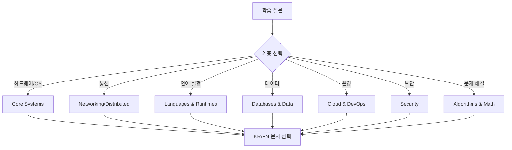
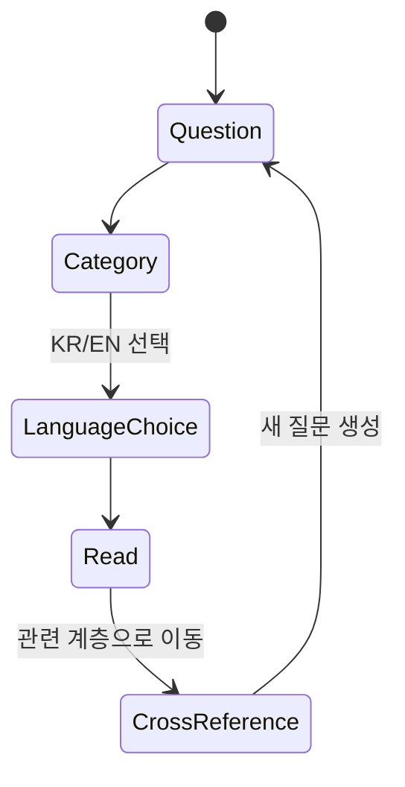

# CS References 학습 및 기록 노트

> 이 문서는 이전 인덱스의 학습 기록을 보존한 노트다. 현재 문서 탐색과 필터는 [CS 참고 문서 목록](../docs/books/cs-reference/index.md)에서 제공한다. 아래 체크리스트는 당시 작성 상태를 기록한다.

## 1. 왜 필요한가? (Pain Point & Motivation)

CS reference 문서는 컴퓨터 아키텍처, 운영체제, 네트워킹, 언어 런타임, 데이터베이스, 보안, 클라우드, 알고리즘, AI/ML, 분산 시스템을 EN/KR 문서로 묶는 허브다. 기존처럼 링크 목록만 있으면 전체 지식 지형은 보이지만, 어떤 순서로 읽고 어떤 기준으로 문서를 고를지 흐려질 수 있다.

이 인덱스는 레퍼런스 목록을 유지하면서도 "어떤 시스템 계층을 학습하려는가"라는 기준으로 다시 정리한다.

## 2. 현재 나의 상태 (Baseline)

- 한국어/영어 문서가 같은 주제를 병렬로 제공한다는 점은 알고 있다.
- 카테고리별 문서 수가 많아 지금 필요한 문서를 바로 고르기 어렵다.
- 시스템 계층별 의존 관계, 예를 들어 CPU -> OS -> 네트워크 -> 분산 시스템 순서가 명확하지 않다.
- 링크 허브가 단순 목록인지 학습 경로인지 역할을 정해야 한다.

## 3. 도달하고 싶은 목표 (Target State)

- 카테고리별 대표 문서를 빠르게 찾는다.
- 한국어 문서와 영어 문서의 대응 관계를 유지한다.
- low-level 시스템부터 application architecture까지 읽는 순서를 제안한다.
- 각 문서를 읽을 때 확인할 핵심 질문을 함께 제공한다.
- 인덱스 자체도 동일한 12개 섹션 템플릿을 따른다.

## 4. 시스템 번역 (Data Flow)

## 5. 핵심 구성요소 (Building Blocks)

| 카테고리 | 한국어 문서 | English document |
| --- | --- | --- |
| Core Systems | [컴퓨터 아키텍처](../docs/books/cs-reference/ko/computer-architecture-internals.md), [컴파일러](../docs/books/cs-reference/ko/compiler-internals.md), [운영체제](../docs/books/cs-reference/ko/operating-systems-internals.md), [시스템 프로그래밍](../docs/books/cs-reference/ko/systems-programming-internals.md) | [Computer Architecture](../docs/books/cs-reference/computer-architecture-internals.md), [Compiler](../docs/books/cs-reference/compiler-internals.md), [Operating Systems](../docs/books/cs-reference/operating-systems-internals.md), [Systems Programming](../docs/books/cs-reference/systems-programming-internals.md) |
| Networking | [네트워킹](../docs/books/cs-reference/ko/networking-internals.md) | [Networking](../docs/books/cs-reference/networking-internals.md) |
| Languages & Runtimes | [C/C++](../docs/books/cs-reference/ko/c-cpp-internals.md), [Python](../docs/books/cs-reference/ko/python-internals.md), [Java](../docs/books/cs-reference/ko/java-internals.md), [프로그래밍 언어](../docs/books/cs-reference/ko/programming-languages-internals.md), [함수형 프로그래밍](../docs/books/cs-reference/ko/functional-programming-internals.md) | [C/C++](../docs/books/cs-reference/c-cpp-internals.md), [Python](../docs/books/cs-reference/python-internals.md), [Java](../docs/books/cs-reference/java-internals.md), [Programming Languages](../docs/books/cs-reference/programming-languages-internals.md), [Functional Programming](../docs/books/cs-reference/functional-programming-internals.md) |
| Databases & Data | [데이터베이스 시스템](../docs/books/cs-reference/ko/database-systems-internals.md), [자료구조](../docs/books/cs-reference/ko/data-structures-internals.md), [데이터 마이닝/빅데이터](../docs/books/cs-reference/ko/data-mining-bigdata-internals.md) | [Database Systems](../docs/books/cs-reference/database-systems-internals.md), [Data Structures](../docs/books/cs-reference/data-structures-internals.md), [Data Mining & Big Data](../docs/books/cs-reference/data-mining-bigdata-internals.md) |
| Security | [보안](../docs/books/cs-reference/ko/security-internals.md) | [Security](../docs/books/cs-reference/security-internals.md) |
| Cloud & DevOps | [Cloud/AWS](../docs/books/cs-reference/ko/cloud-aws-internals.md), [DevOps/Linux](../docs/books/cs-reference/ko/devops-linux-internals.md), [Docker/Kubernetes](../docs/books/cs-reference/ko/docker-kubernetes-cs.md), [Microservices](../docs/books/cs-reference/ko/microservices-internals.md) | [Cloud/AWS](../docs/books/cs-reference/cloud-aws-internals.md), [DevOps/Linux](../docs/books/cs-reference/devops-linux-internals.md), [Docker/Kubernetes](../docs/books/cs-reference/docker-kubernetes-cs.md), [Microservices](../docs/books/cs-reference/microservices-internals.md) |
| Algorithms & Math | [알고리즘](../docs/books/cs-reference/ko/algorithms-cs-reference.md), [수학/과학 컴퓨팅](../docs/books/cs-reference/ko/math-computing-internals.md) | [Algorithms](../docs/books/cs-reference/algorithms-cs-reference.md), [Math & Scientific Computing](../docs/books/cs-reference/math-computing-internals.md) |
| AI/ML & Data Science | [ML/AI](../docs/books/cs-reference/ko/ml-ai-internals.md) | [ML/AI](../docs/books/cs-reference/ml-ai-internals.md) |
| Platform & Mobile | [Mobile/Android](../docs/books/cs-reference/ko/mobile-android-internals.md), [Web/Frontend](../docs/books/cs-reference/ko/web-frontend-internals.md) | [Mobile/Android](../docs/books/cs-reference/mobile-android-internals.md), [Web/Frontend](../docs/books/cs-reference/web-frontend-internals.md) |
| Software Engineering | [소프트웨어 공학](../docs/books/cs-reference/ko/software-engineering-internals.md), [기타 CS](../docs/books/cs-reference/ko/miscellaneous-cs.md) | [Software Engineering](../docs/books/cs-reference/software-engineering-internals.md), [Miscellaneous CS](../docs/books/cs-reference/miscellaneous-cs.md) |
| Distributed Systems | [분산 시스템](../docs/books/cs-reference/ko/distributed-systems-cs.md) | [Distributed Systems](../docs/books/cs-reference/distributed-systems-cs.md) |

## 6. 상태 전이 (State Transition)

이 인덱스는 한 번 보고 끝나는 목차가 아니라, 읽은 문서에서 새 질문이 생기면 인접 계층으로 돌아오게 하는 탐색 루프다.

## 7. 불변식 (Invariant: 절대 깨지면 안 되는 규칙)

- 한국어 링크와 영어 링크는 같은 주제의 대응 문서를 가리켜야 한다.
- 카테고리는 사용자가 학습 질문을 분류할 수 있을 만큼 구체적이어야 한다.
- 인덱스는 문서 내용을 과장하지 않고 실제 제공되는 주제만 안내한다.
- 문서 링크는 상대 경로를 유지해 사이트 빌드에서 깨지지 않아야 한다.
- 개념을 읽는 순서는 선택 사항이지만, low-level 의존 관계는 설명에 반영한다.

## 8. 가장 작은 예제 (Minimal Viable Example)

| 학습 질문 | 먼저 볼 문서 | 다음으로 연결할 문서 |
| --- | --- | --- |
| "캐시 미스가 왜 느린가?" | [Computer Architecture](../docs/books/cs-reference/computer-architecture-internals.md) | [Operating Systems](../docs/books/cs-reference/operating-systems-internals.md) |
| "TCP 연결이 왜 끊기는가?" | [Networking](../docs/books/cs-reference/networking-internals.md) | [Distributed Systems](../docs/books/cs-reference/distributed-systems-cs.md) |
| "Python GIL이 성능에 어떤 영향을 주는가?" | [Python](../docs/books/cs-reference/python-internals.md) | [Operating Systems](../docs/books/cs-reference/operating-systems-internals.md) |
| "AWS 장애를 어디서 추적할까?" | [Cloud/AWS](../docs/books/cs-reference/cloud-aws-internals.md) | [DevOps/Linux](../docs/books/cs-reference/devops-linux-internals.md) |

## 9. 실패 사례 (What could go wrong?)

- 같은 주제의 KR/EN 링크 중 하나만 갱신해 대응이 깨진다.
- 인덱스가 지나치게 상세해져 실제 학습 진입점보다 긴 문서가 된다.
- 카테고리 이름이 겹쳐 사용자가 문서를 잘못 고른다.
- HTML 기반 동적 필터에만 의존하면 Markdown 독자나 검색 인덱스에서 구조가 약해진다.
- 상대 링크가 깨져도 로컬 문서에서 바로 알아차리지 못한다.

## 10. 뇌 확장하기 (Evolution & Variants)

- 각 문서에 prerequisite와 related 문서를 추가하면 학습 그래프가 더 명확해진다.
- KR/EN 대응 검증을 빌드 검증에 포함하면 링크 drift를 줄일 수 있다.
- 카테고리별 "first read" 문서를 지정하면 초심자 경로가 선명해진다.
- 같은 주제의 deep dive, cheat sheet, 실습 문서를 분리해 여러 읽기 깊이를 제공할 수 있다.

## 11. 최종 체크리스트 (Definition of Done)

- [x] 기존 EN/KR 레퍼런스 허브 역할을 유지했다.
- [x] 모든 주요 카테고리의 대표 링크를 Markdown 표로 정리했다.
- [x] 학습 질문에서 문서 선택으로 이어지는 data flow를 추가했다.
- [x] 링크 대응과 상대 경로 유지 규칙을 불변식으로 명시했다.
- [x] HTML 필터 테이블 대신 템플릿 형식의 인덱스로 재작성했다.

## 12. 뇌에 새기는 복습 문장 (TL;DR Blank)

CS reference 인덱스는 링크 모음이 아니라 학습 질문을 올바른 시스템 계층의 문서로 라우팅하는 지도다.
