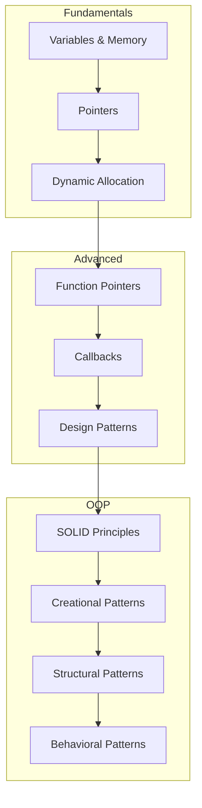

# Algorithms & Data Structures

> Learning resources for algorithms, data structures, and OOP patterns

---

<div class="compose-hero" markdown>
<span class="compose-kicker">Algorithms</span>

## 포인터, 함수 포인터, OOP 패턴 및 자료구조 핵심 문서

<div class="landing-meta-list" markdown>
<span>Pointers</span>
<span>Function Pointers</span>
<span>OOP Patterns</span>
<span>Data Structures</span>
</div>

<div class="compose-actions" markdown>
[:octicons-arrow-right-24: Pointers Guide](pointers.md){ .md-button .md-button--primary }
[:material-shape: OOP Patterns](oop-patterns.md){ .md-button }
</div>
</div>

## :material-graph: 핵심 알고리즘 영역

<div class="grid cards" markdown>

-   :material-cursor-pointer:{ .lg .middle } **Pointers**

    ---

    C/C++ 포인터, 메모리 관리, 공통 패턴

    [:octicons-arrow-right-24: View Guide](pointers.md)

-   :material-function:{ .lg .middle } **Function Pointers**

    ---

    언어별 함수 포인터 비교와 콜백 패턴

    [:octicons-arrow-right-24: View Guide](function-pointers.md)

-   :material-shape:{ .lg .middle } **OOP Patterns**

    ---

    Python 예제를 활용한 객체지향 프로그래밍 패턴

    [:octicons-arrow-right-24: View Guide](oop-patterns.md)

</div>

## Topics

<div class="grid cards" markdown>

-   :material-cursor-pointer:{ .lg .middle } **Pointers**

    ---

    In-depth guide to C/C++ pointers, memory management, and common patterns.

    [:octicons-arrow-right-24: View Guide](pointers.md)

-   :material-function:{ .lg .middle } **Function Pointers**

    ---

    Comparison of function pointers across languages and callback patterns.

    [:octicons-arrow-right-24: View Guide](function-pointers.md)

-   :material-shape:{ .lg .middle } **OOP Patterns**

    ---

    Object-oriented programming patterns with Python examples.

    [:octicons-arrow-right-24: View Guide](oop-patterns.md)

</div>

---

## Learning Path



---

## Concept Overview

### Memory & Pointers

| Concept | Language | Description |
|---------|----------|-------------|
| Raw Pointers | C/C++ | Direct memory address manipulation |
| Smart Pointers | C++ | Automatic memory management |
| References | C++/Java | Alias to existing objects |

### Design Patterns

| Category | Patterns | Use Case |
|----------|----------|----------|
| **Creational** | Singleton, Factory, Builder | Object creation |
| **Structural** | Adapter, Decorator, Proxy | Object composition |
| **Behavioral** | Observer, Strategy, Command | Object interaction |

---

## Quick Reference

### Pointer Operations (C/C++)

```c
int x = 10;
int *ptr = &x;      // Pointer to x
int val = *ptr;     // Dereference: val = 10
int **pptr = &ptr;  // Pointer to pointer
```

### Function Pointer (C)

```c
int (*func_ptr)(int, int);  // Declaration
func_ptr = &add;            // Assignment
int result = func_ptr(3, 4); // Call
```

---

## Related Documentation

- [Compiler Theory](../compiler/index.md)
- [Java Core Concepts](../java/core-concepts.md)
- [Operating Systems](../os/index.md)
