# Compiler Internals: From Source to Machine Code

> **Under the Hood** — How the Dragon Book's phases transform source text into executable binary: lexer DFA state machines, parser LR automata, type-checking environments, IR lowering, dataflow analysis, and register allocation via graph coloring. Sources: *Compilers: Principles, Techniques & Tools* (Aho/Lam/Sethi/Ullman, 2nd ed. — "Dragon Book"), *Programming Language Pragmatics* (Scott), *Concepts of Programming Languages* (Sebesta).

---

## 1. Compiler Pipeline: End-to-End Phase Architecture

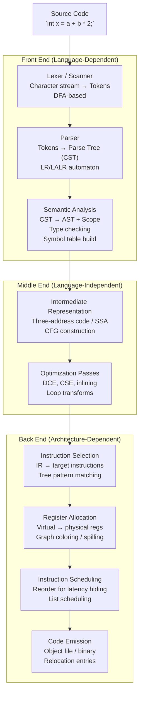

---

## 2. Lexical Analysis: DFA State Machine Internals

The lexer converts a character stream into a token stream using a deterministic finite automaton compiled from regular expressions.

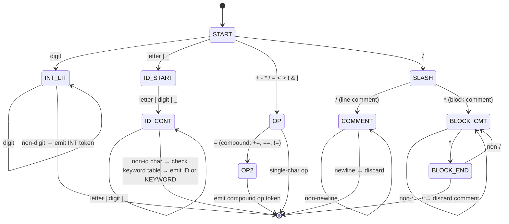

### Maximal Munch Rule and Backtracking

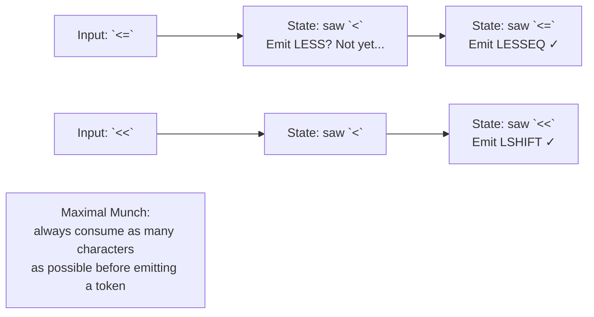

---

## 3. Parsing: LR(1) Automaton and Shift-Reduce Decisions

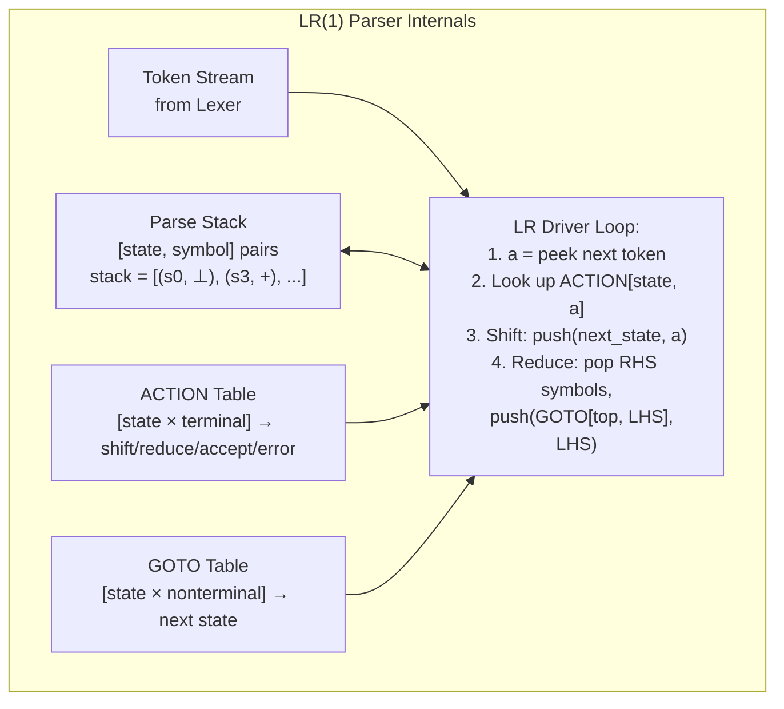

### Conflict Resolution: Shift/Reduce, Reduce/Reduce

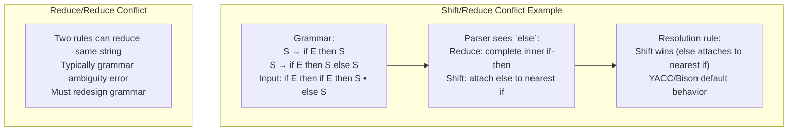

---

## 4. Symbol Table: Scope and Type Environment

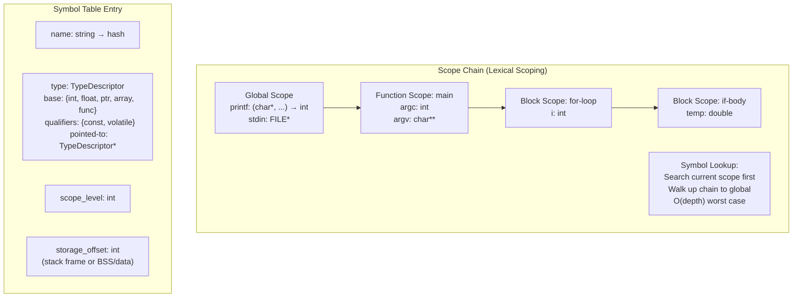

---

## 5. Three-Address Code and SSA Form

### Three-Address Code (TAC) Generation

Source: `x = a + b * 2`

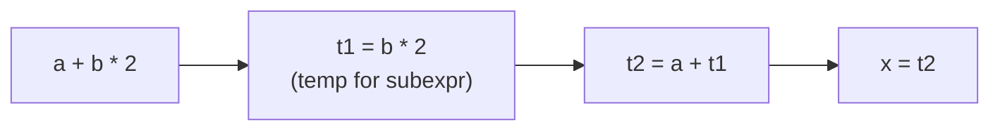

```
Generated TAC:
  t1 = b * 2
  t2 = a + t1
  x  = t2
```

### SSA (Static Single Assignment) Form

Every variable assigned exactly once. φ-functions at control flow join points.

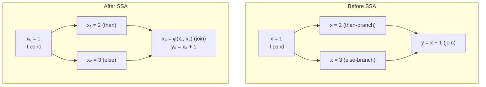

### Control Flow Graph (CFG)

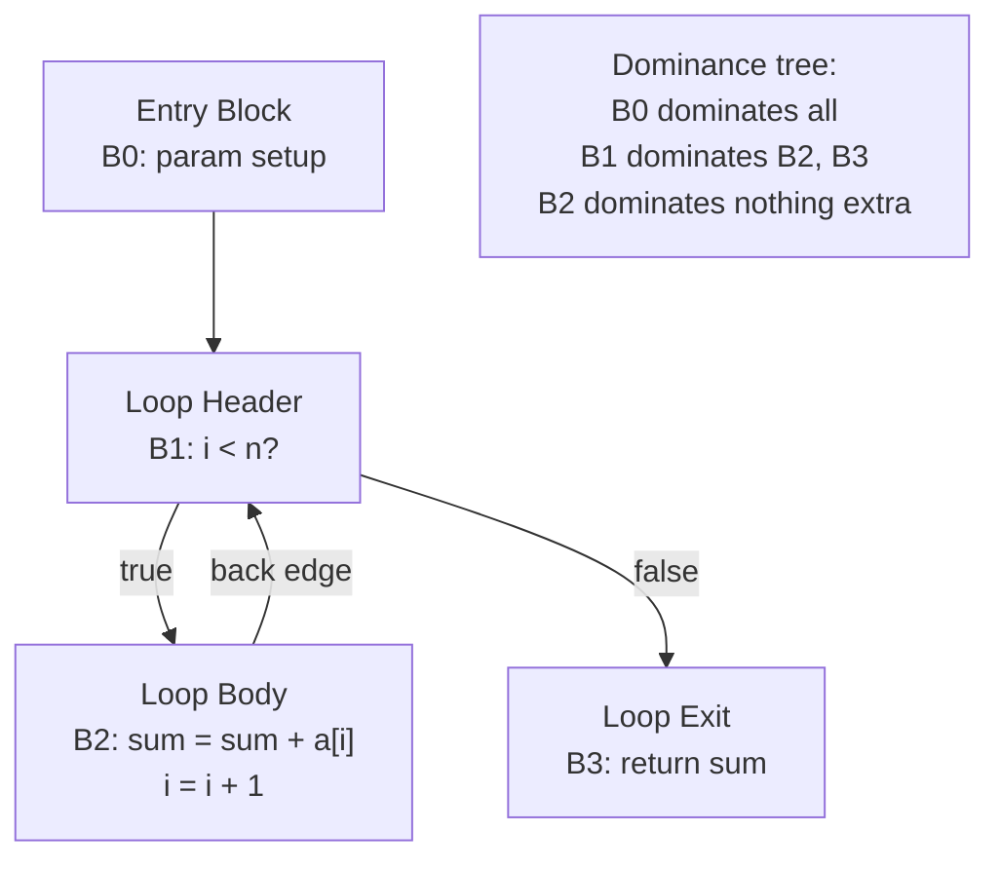

---

## 6. Dataflow Analysis: Liveness and Reaching Definitions

### Liveness Analysis (backward dataflow)

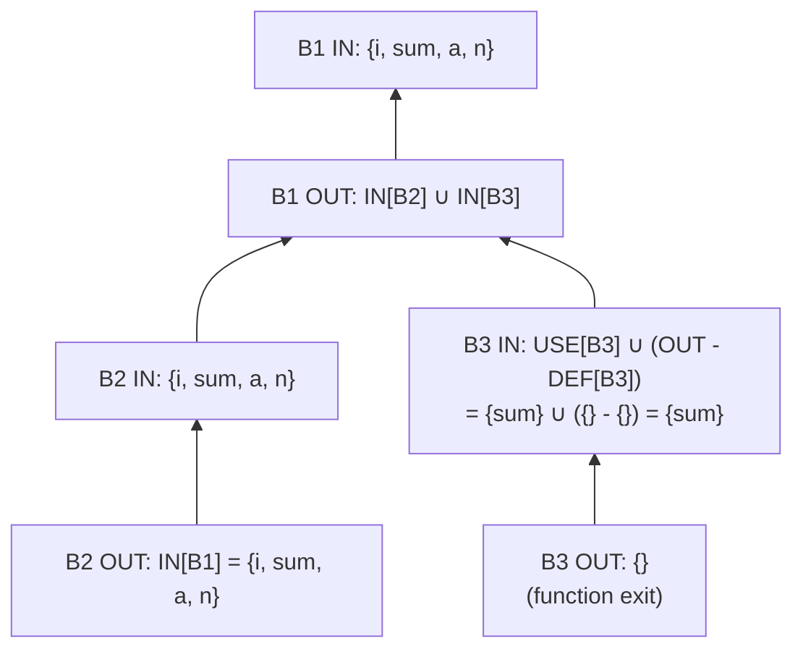

**Algorithm**: Iterative fixed-point — start with all LIVE_OUT = ∅, propagate backwards until no change. Used by register allocators to determine register lifetimes (interference).

---

## 7. Register Allocation: Graph Coloring

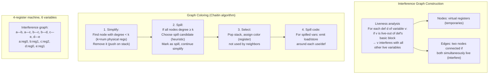

### Coalescing: Eliminating MOV Instructions

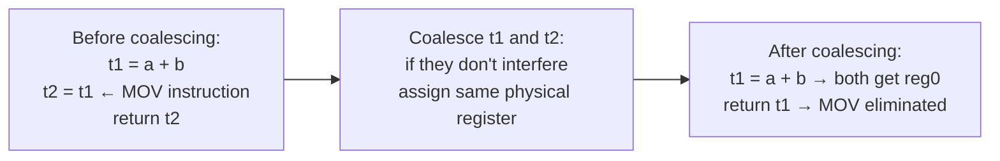

---

## 8. Optimization: Loop Transformations

### Loop Invariant Code Motion (LICM)

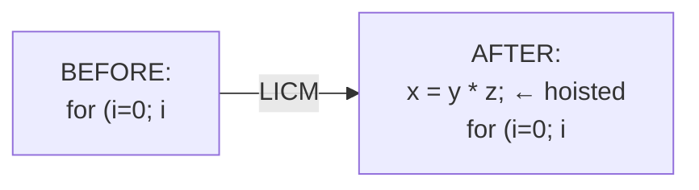

### Loop Unrolling

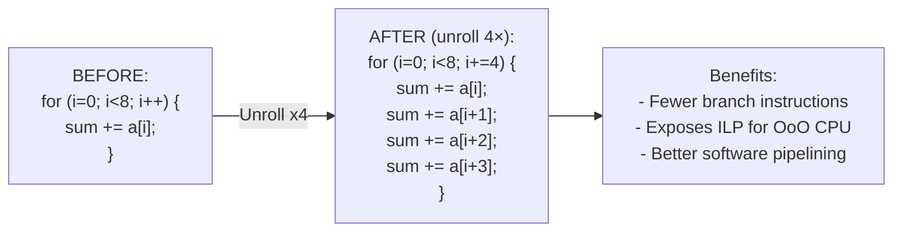

### Loop Tiling (Cache Optimization)

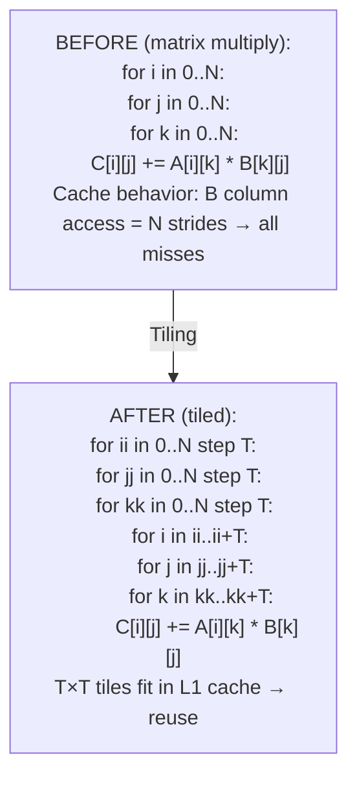

---

## 9. Code Generation: Instruction Selection via Tree Pattern Matching

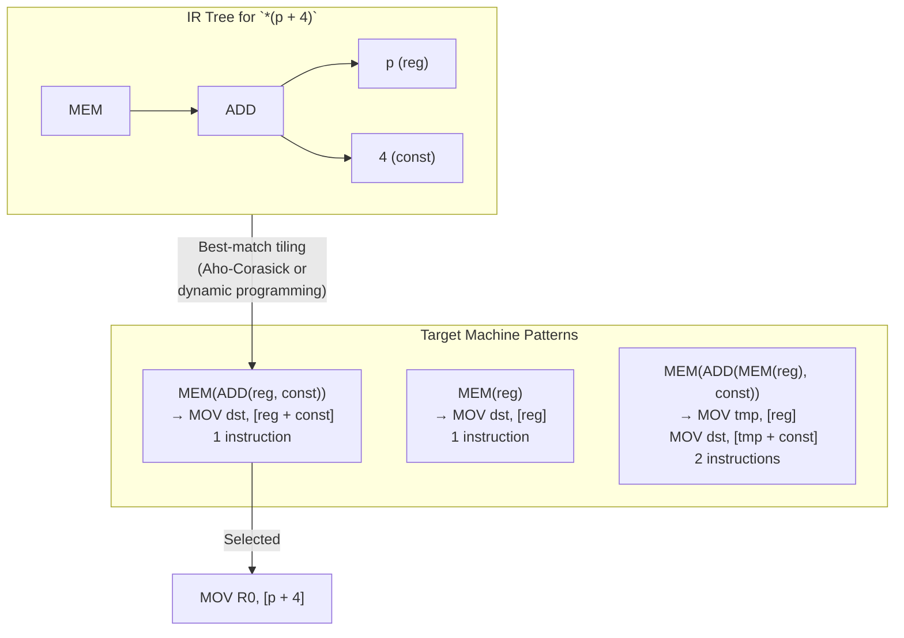

---

## 10. Linker and Loader Internals

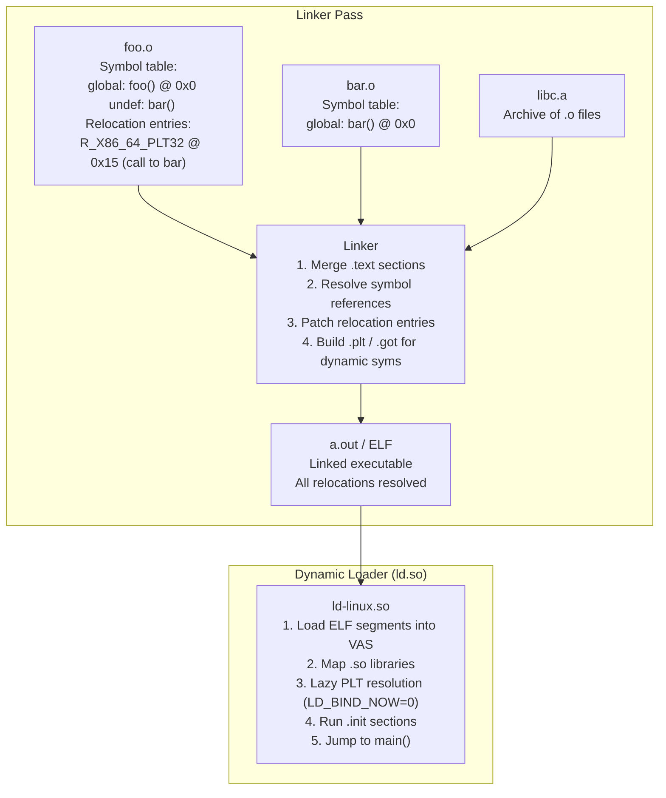

### ELF File Structure

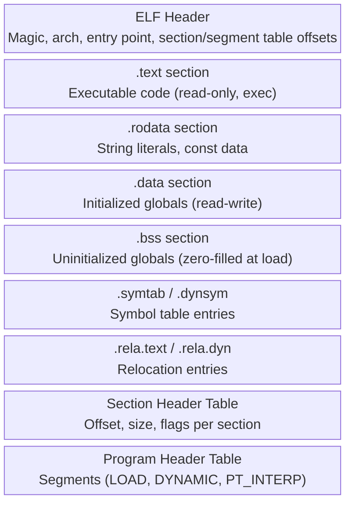

---

## 11. JIT Compilation: Dynamic Code Generation

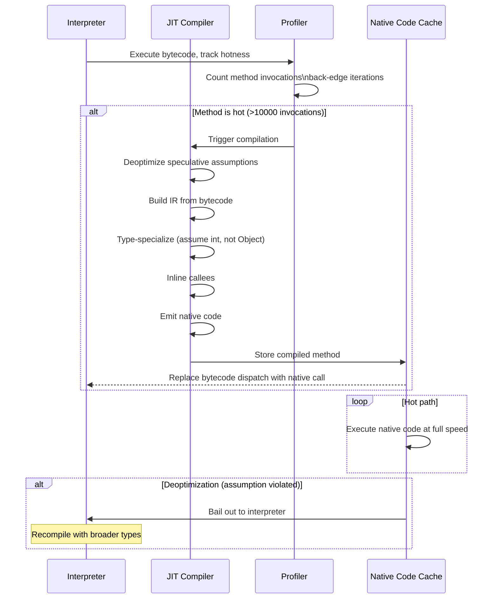

---

## 12. Language Feature → Compiler Mechanism Mapping

| Language Feature | Compiler Mechanism |
|---|---|
| Variables | Symbol table entry + stack frame slot or register |
| Type checking | Type environment + subtype lattice traversal |
| Function calls | Activation record (frame), calling convention (cdecl/fastcall) |
| Closures / lambdas | Closure record: function ptr + captured env heap-allocated |
| Generics (C++ templates) | Monomorphization: instantiate per type at compile time |
| Generics (Java/C#) | Type erasure: single bytecode, runtime casts |
| Virtual dispatch | vtable: array of function pointers, dynamic dispatch |
| Exceptions | Zero-cost tables (DWARF .eh_frame), unwind on throw |
| `async/await` | State machine transformation: locals → struct fields |
| Garbage collection | Safepoints, stack maps, write barriers |
| SIMD vectorization | Auto-vectorizer: loop → `vmovups`, `vaddps` instructions |
