# Database Systems Internals: Under the Hood

> Synthesized from: Elmasri & Navathe *Fundamentals of Database Systems* 6th ed, Korotkevitch *Pro SQL Server Internals* 2nd ed, MySQL database design references, and supporting comp(85/230/305-322) database references.

---

## 1. Storage Engine Architecture — Pages, Extents, and Buffer Pool

Every relational database manages storage through a **page-based** abstraction layer. Understanding page anatomy is the foundation for all performance analysis.

### InnoDB Page Layout (16 KB default)

```
+------------------+ offset 0
| File Header      | 38 bytes: page type, LSN, space_id, page_no, checksum
+------------------+
| Page Header      | 56 bytes: slot count, free space, garbage ptr, level
+------------------+
| Infimum Record   | virtual lower bound record (fixed)
+------------------+
| User Records     | actual row data (grows toward free space)
|   ↓              |
+------------------+
| Free Space       | unallocated area between records and directory
|   ↑              |
+------------------+
| Page Directory   | 2-byte slots, each points to record (grows upward)
| (Slot Array)     | binary searchable: O(log n) slot scan
+------------------+
| File Trailer     | 8 bytes: LSN checksum verification
+------------------+ offset 16383
```

Page types: `FIL_PAGE_INDEX` (B+Tree node), `FIL_PAGE_UNDO_LOG`, `FIL_PAGE_INODE`, `FIL_PAGE_IBUF_BITMAP`, `FIL_PAGE_TYPE_SYS`, `FIL_PAGE_BLOB`.

### Buffer Pool Architecture

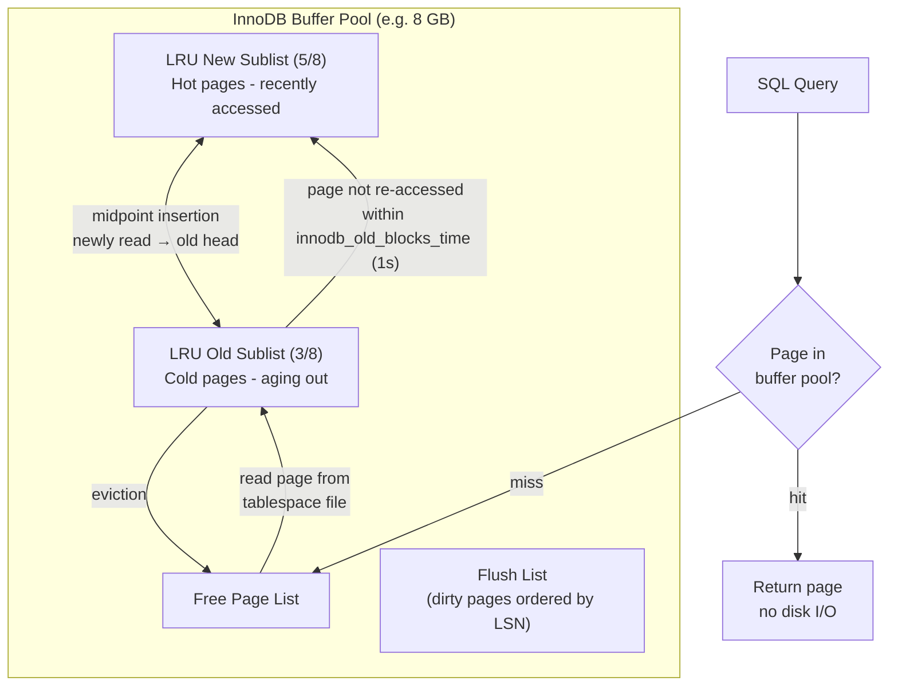

**Double-write buffer**: Before flushing dirty pages to tablespace, InnoDB writes them sequentially to the doublewrite buffer (2 MB, 128 pages). This protects against partial page writes (torn pages) during crash — recovery reads from doublewrite if page checksum fails.

---

## 2. B+Tree Index Internals

### Node Structure and Split Algorithm

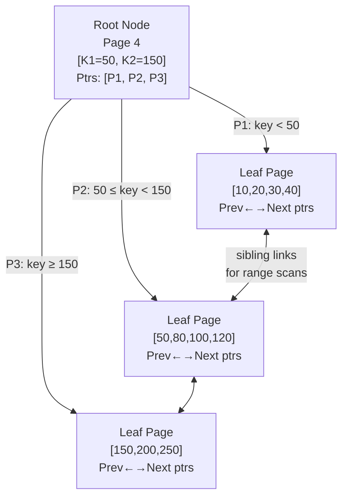

### Page Split on INSERT

When a leaf page reaches capacity (fill factor ~69% to leave room for updates):

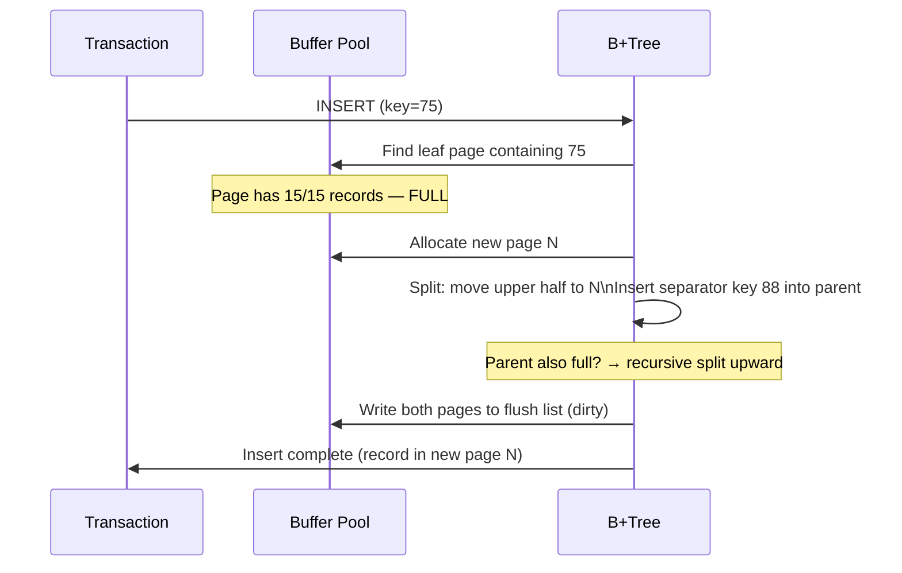

**Clustered index** (InnoDB primary key): Entire row stored in B+Tree leaf. Physical order = PK order. Fragmentation occurs on random PK inserts (UUID PKs = worst case).

**Secondary index**: Leaf stores `(secondary_key, primary_key)`. Point lookup: secondary index B+Tree → PK value → clustered index B+Tree (two B+Tree traversals = "bookmark lookup").

### Index Fill Factor and Fragmentation

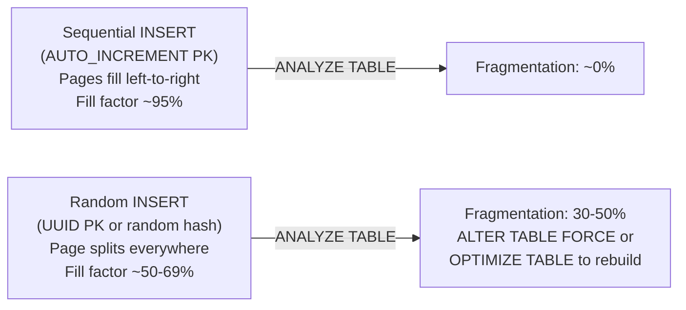

---

## 3. InnoDB MVCC — Undo Log Chain

MVCC (Multi-Version Concurrency Control) enables readers to never block writers. Every row version is chained through undo logs.

### Row Version Chain

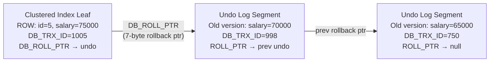

### Read View Mechanism

```mermaid
sequenceDiagram
    participant TX100 as Transaction 100 (long-running read)
    participant TX1005 as Transaction 1005 (writer)
    participant TRX_SYS as trx_sys (active list)

    Note over TX100: BEGIN; → ReadView created\nup_limit_id=999, low_limit_id=1000\nids_list=[998,999]

    TX1005->>TRX_SYS: UPDATE row (trx_id=1005)
    TX1005->>TRX_SYS: COMMIT

    TX100->>TRX_SYS: SELECT salary FROM employees WHERE id=5
    Note over TX100: Row has DB_TRX_ID=1005\n1005 >= low_limit_id(1000) → INVISIBLE\nWalk undo chain → find DB_TRX_ID=750 < up_limit_id(999)\n→ VISIBLE: return salary=65000
```

**Purge thread**: Background thread (`srv_purge_coordinator_thread`) cleans undo logs when no active ReadView needs them. Long-running transactions prevent purge → undo tablespace grows unboundedly (classic `ibdata1` bloat problem).

---

## 4. Transaction Log (WAL) and Crash Recovery

### Write-Ahead Logging Protocol

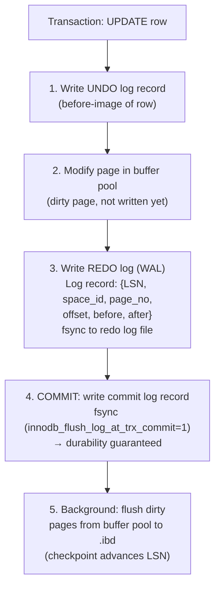

**LSN (Log Sequence Number)**: monotonically increasing byte offset into redo log. Every page header stores `FIL_PAGE_LSN` = LSN of last modification. Pages with `page_LSN < checkpoint_LSN` are guaranteed durable.

### Crash Recovery — ARIES Algorithm

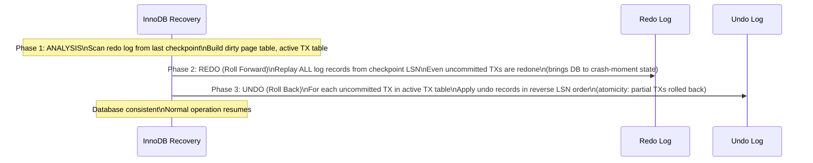

---

## 5. Query Execution Pipeline

### Query Lifecycle

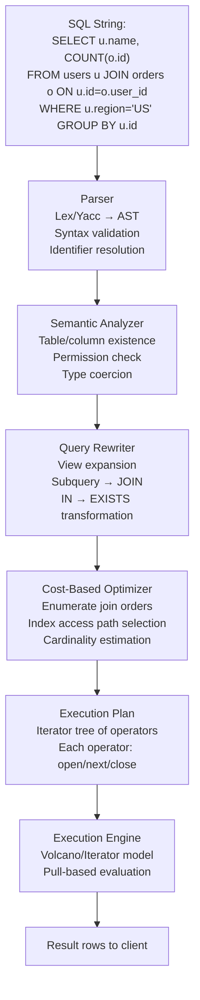

### Cost-Based Optimizer — Index Selection

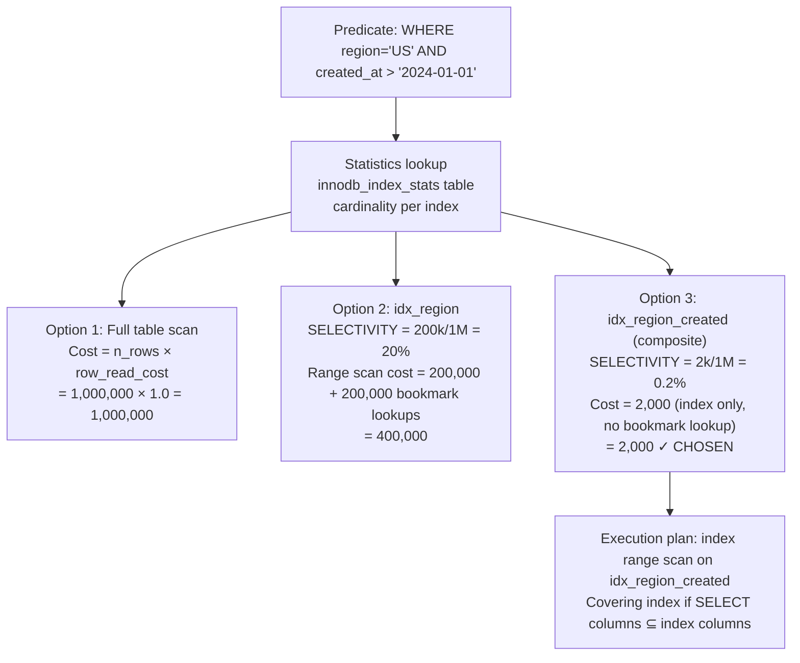

### Volcano Iterator Model

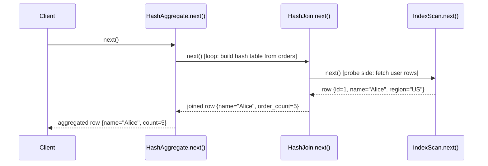

**Hash join internals**: Build phase reads smaller table into in-memory hash table (`hash(join_key) → bucket → row`). Probe phase reads larger table, hashes join key, probes buckets. If hash table exceeds `join_buffer_size` → spill to disk (grace hash join with partitioning).

---

## 6. SQL Server Storage Internals (Pro SQL Server Internals)

### Data Page (8 KB)

```
+-------------------+ 0
| Page Header       | 96 bytes: pageID, type, freeCount, slotCount, nextPage, prevPage
+-------------------+
| Row 0             | Variable-length: null bitmap + fixed cols + var-length ptr array + var data
| Row 1             |
| ...               |
| Row N             |
+-------------------+
| Free Space        |
+-------------------+
| Row Offset Array  | 2 bytes per row, grows from bottom
| [N offset]        | slot[i] = byte offset of row i within page
+-------------------+ 8191
```

### Row Structure (Variable Length)

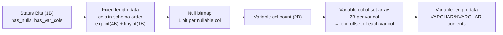

**Forwarded records**: When UPDATE increases row size beyond page capacity, row moved to new page. Original slot gets an 8-byte forwarding pointer. Heap scans follow forwarding pointers — performance degrades. Fix: `ALTER TABLE REBUILD` (clustered index) eliminates forwarded records.

### SQL Server Lock Hierarchy

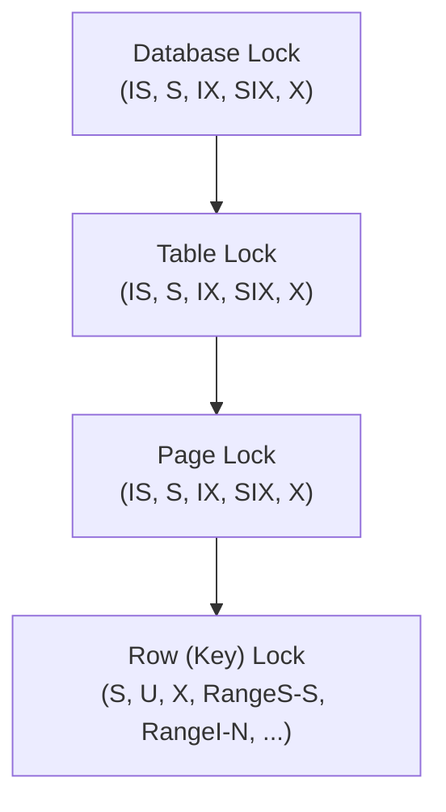

**Lock escalation**: SQL Server escalates row/page locks to table lock when lock count exceeds ~5000 per transaction (to reduce memory overhead). Can cause blocking. Disable with `ALTER TABLE ... SET (LOCK_ESCALATION = DISABLE)`.

**NOLOCK hint / READ UNCOMMITTED**: Reads pages without acquiring shared locks → dirty reads possible (sees uncommitted data, phantom rows, even rolled-back data mid-flight).

---

## 7. Transaction Isolation Levels and Anomaly Prevention

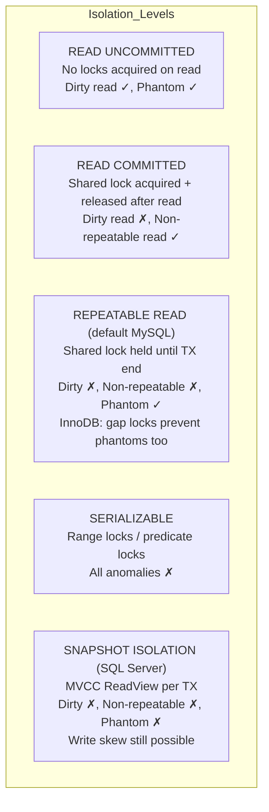

**Gap locks (InnoDB RR)**: Lock the gap before a record, preventing INSERT into range. If `WHERE id BETWEEN 10 AND 20`, gap locks on all gaps in that range prevent concurrent INSERTs. Eliminates phantoms without full serializable isolation.

**Deadlock detection**: Each lock manager maintains a "waits-for graph". Background thread runs cycle detection (DFS). On cycle found, victim selection: smallest transaction (by undo log size) rolled back. Deadlock information written to `INFORMATION_SCHEMA.INNODB_TRX`.

---

## 8. Index Types and Access Patterns

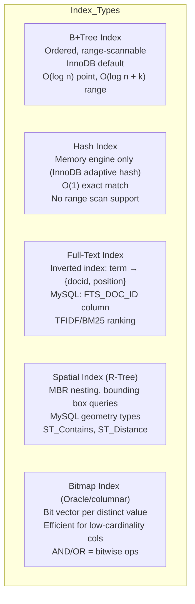

### Covering Index — Eliminating Bookmark Lookup

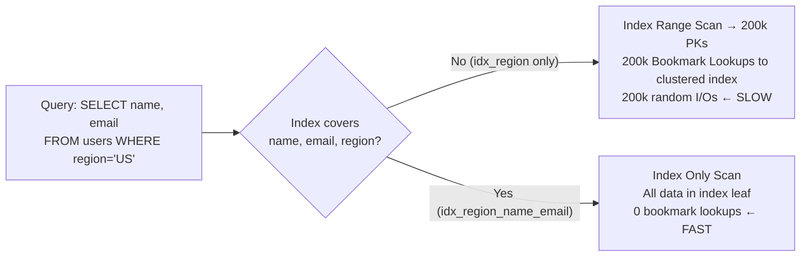

---

## 9. Join Algorithms — Memory and CPU Paths

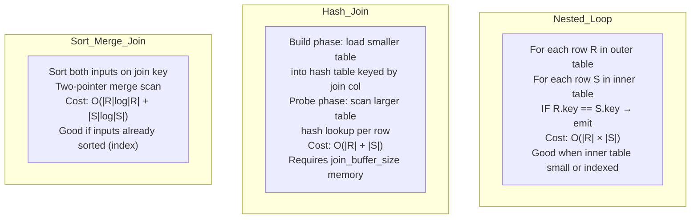

**Block Nested Loop** (MySQL pre-8.0): Read outer table in chunks of `join_buffer_size`, scan inner table once per chunk. Reduces inner table reads from `|outer|` to `|outer| / buffer_chunk_size`.

**Hash Anti-Join** (for NOT IN / NOT EXISTS): Build hash set from subquery result; for each probe row, emit only if no hash match found.

---

## 10. Write Path — Checkpoint and Redo Log Cycle

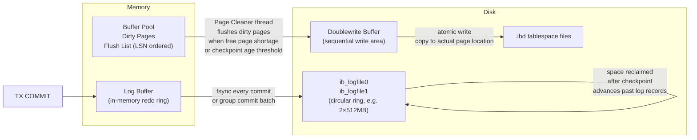

**Checkpoint age**: `innodb_log_file_size × 2 × 0.75` = maximum dirty data before forced flushing. If redo log fills (checkpoint age = log size), all writes STALL while checkpoint completes. Symptom: "InnoDB: page_cleaner: 1000ms intended loop took 5000ms" in error log.

---

## 11. Partitioning Internals

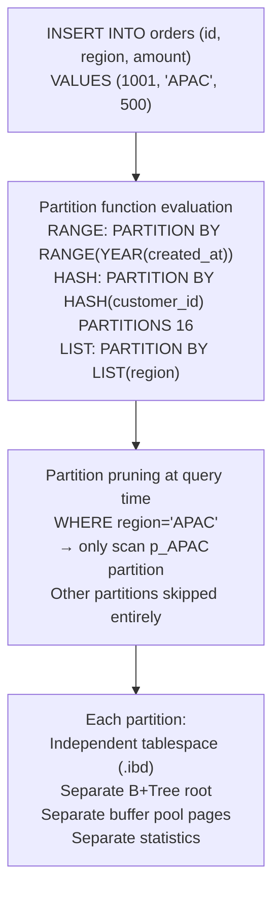

Partition pruning requires **predicates on partition column** in WHERE clause. Without pruning, all partitions scanned — worse than non-partitioned table (more B+Tree roots to descend). Partition key must be part of every unique/primary key.

---

## 12. Column Store vs Row Store Internals

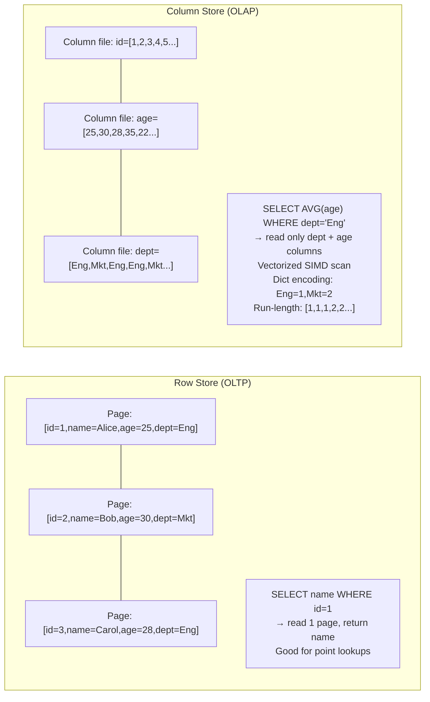

**Dictionary encoding**: Replace string column values with integer codes. `dept` column stored as `uint8` array, dictionary: `{0: "Engineering", 1: "Marketing"}`. Compression ratio 10-100x for low-cardinality columns.

**Vectorized execution**: Process 1024 rows at once using SIMD (AVX-256: 8 × 32-bit ops per instruction). Columnar layout enables this — all values of one column contiguous in memory → CPU prefetch efficient, L1/L2 cache utilized.

---

## Database Performance Numbers Reference

| Operation | InnoDB | SQL Server | Notes |
|-----------|--------|------------|-------|
| Buffer pool hit | ~100 ns | ~100 ns | DRAM access |
| Page read from NVMe SSD | ~50 µs | ~50 µs | Sequential: ~10 µs |
| B+Tree point lookup (3 levels) | 3 × 50 µs = 150 µs | similar | Cache may save most |
| Full table scan (1M rows) | 0.5-5 sec | similar | Depends on I/O bandwidth |
| Hash join (2 × 1M rows) | 1-10 sec | similar | Spill to disk if no memory |
| Index rebuild (100M rows) | 10-60 min | similar | Online rebuild: longer |
| Checkpoint flush stall | 0-5 sec | 0-5 sec | Tunable via log file size |
| Row lock acquisition | ~1 µs | ~1 µs | In-memory hash lookup |
| Deadlock detection | ~1 ms | ~1 ms | DFS cycle detection |

---

## Summary — Data Flow Map

```mermaid
flowchart TD
    SQL["SQL Query arrives"] --> PARSE["Parse → AST"]
    PARSE --> OPT["Cost-based optimizer\nStatistics → access path"]
    OPT --> EXEC["Iterator execution tree\nVolcano pull model"]
    EXEC --> BP["Buffer Pool lookup\n(page granularity)"]
    BP -->|"miss"| DISK["Disk read\n.ibd page → buffer pool"]
    BP -->|"hit"| ROW["Row extraction\nslot array → row offset\nnull bitmap → field values"]
    ROW -->|"MVCC"| UNDO["Undo chain walk\nReadView visibility check"]
    UNDO --> RESULT["Return row to iterator"]
    
    WRITE["DML: INSERT/UPDATE/DELETE"] --> UNDOW["Write undo log"]
    UNDOW --> MODP["Modify buffer pool page\n(dirty)"]
    MODP --> REDOW["Append redo log record"]
    REDOW --> COMMIT["COMMIT → fsync redo log"]
    COMMIT --> BGFLUSH["Background: page cleaner\nflushes dirty pages"]
```

The complete lifecycle of every byte: SQL text → AST → cost-estimated plan → iterator pull → buffer pool page → MVCC undo chain → field bytes. On write: undo log (before-image) → dirty page (in-memory) → redo log (WAL, durable) → background flush to .ibd. The WAL guarantee is the bedrock: data is durable the moment redo log is fsynced, regardless of whether the actual data page is on disk.
