# 고급 알고리즘 내부: 동적 프로그래밍, 그래프 이론 및 복잡성

> 내부적으로: DP 하위 문제 DAG가 최적의 하위 구조를 인코딩하는 방법, 네트워크 흐름 알고리즘이 증가 경로를 포화시키는 방법, NP 감소가 경도를 증명하는 방법, 무작위 알고리즘이 확률적 정확성을 보장하는 방법(정확한 반복, 그래프 변환 및 계산 모델).

---

## 1. 동적 프로그래밍: 하위 문제 DAG 및 메모

DP는 문제에 **최적 하위 구조**(최적 하위 솔루션으로 구성된 최적 솔루션) 및 **겹치는 하위 문제**(동일 하위 문제가 여러 번 해결됨)가 있을 때 작동합니다.

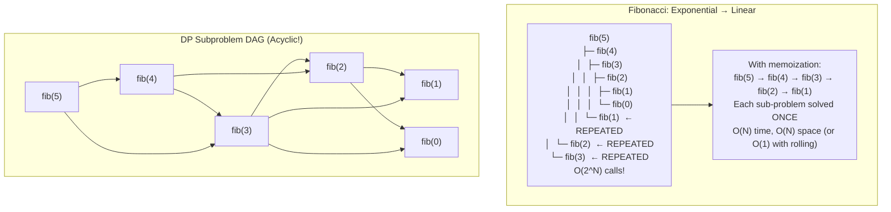

### 가장 긴 공통 부분 수열: DP 테이블

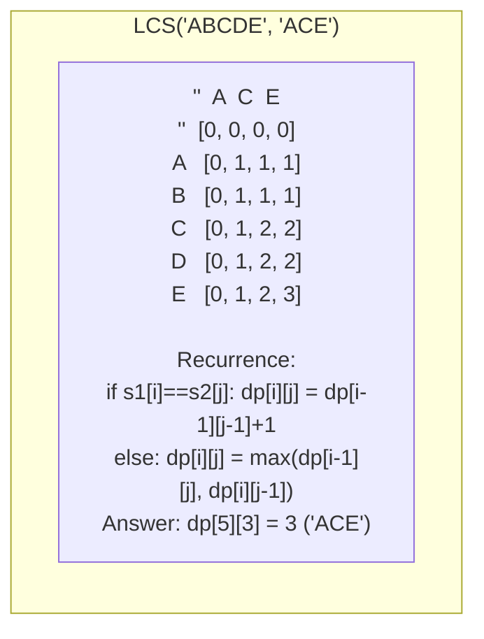

---

## 2. 배낭 문제: 완전한 DP 분석

0/1 배낭: n개 항목, 각각 무게 wᵢ 및 가치 vᵢ. 용량 W로 총 가치를 극대화합니다.

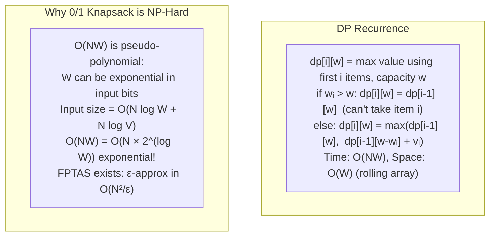

---

## 3. 네트워크 흐름: Ford-Fulkerson에서 Push-Relabel까지

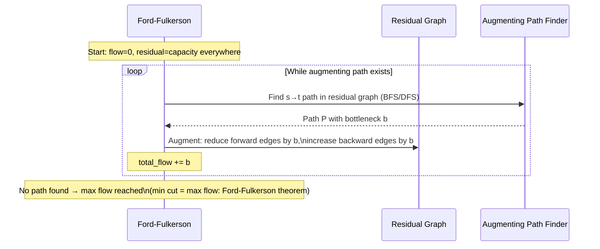

### 최소 컷 ⇔ 최대 흐름 이중성

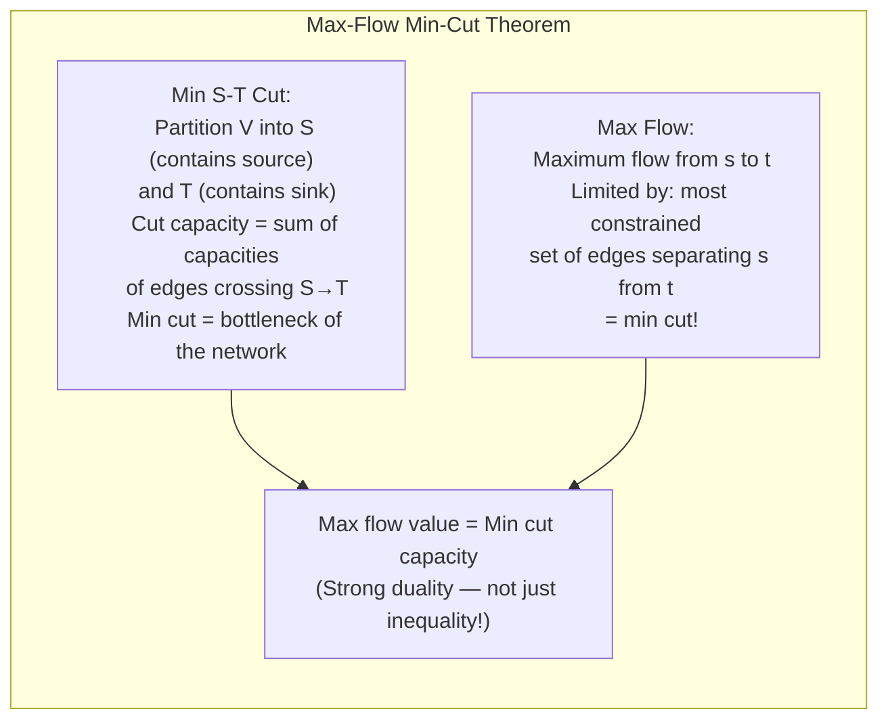

### 푸시 재레이블 알고리즘: O(V²√E)

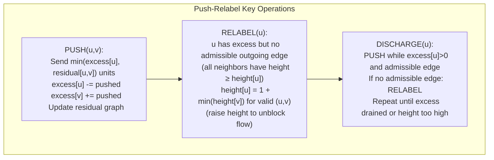

---

## 4. 문자열 알고리즘: KMP 및 접미사 배열

### KMP: 실패 기능 메커니즘

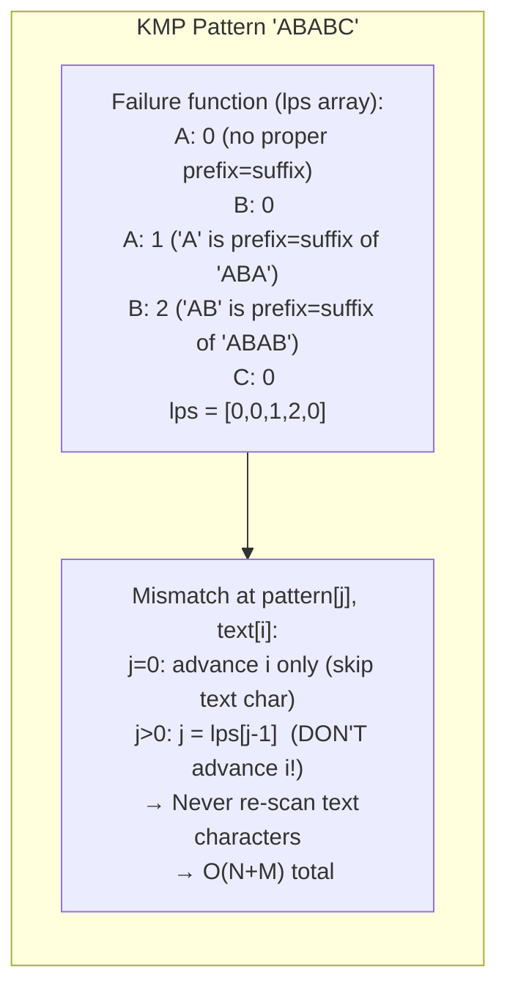

### 접미사 배열: O(N log N) 구성

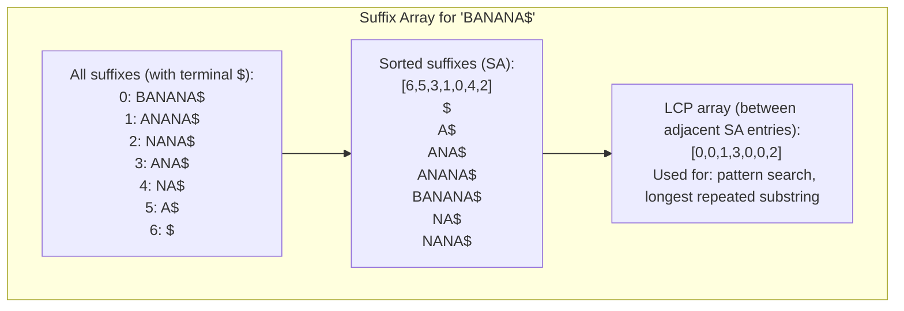

---

## 5. 계산 복잡성: 축소 메커니즘

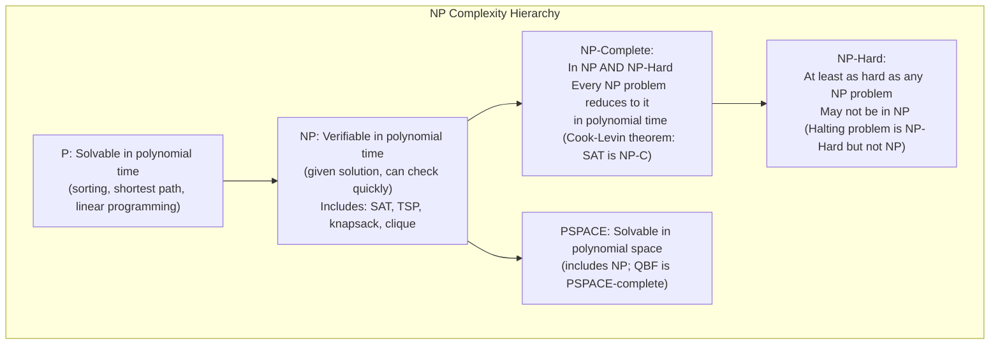

### 다항식 축소: 3-SAT → 독립 집합

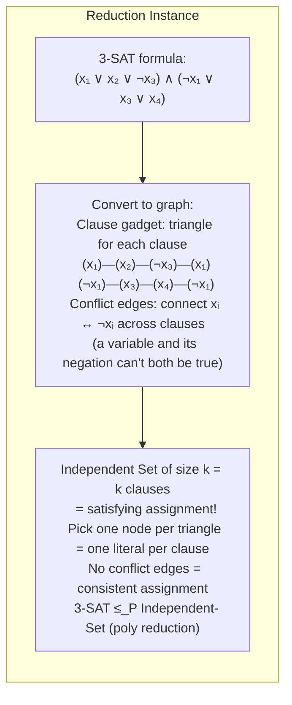

---

## 6. 무작위 알고리즘: 정확성과 확률

### QuickSort 예상 O(N log N)

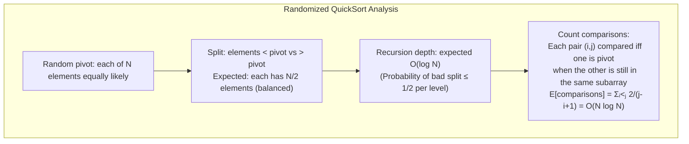

### 블룸 필터: 거짓 긍정 분석

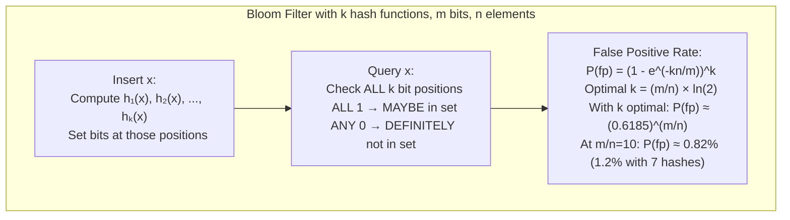

---

## 7. 상각분석: 회계처리 방법

### 동적 어레이 푸시백

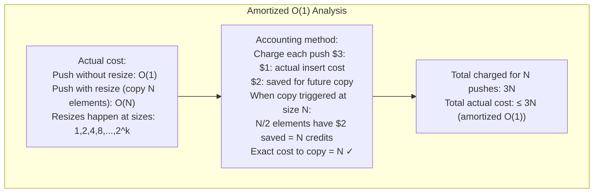

---

## 8. 근사 알고리즘: 정점 커버 및 TSP

### 2-정점 커버에 대한 근사

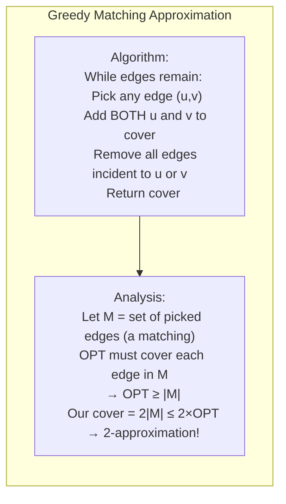

### Christofides 알고리즘: 1.5-TSP에 대한 근사치(미터법)

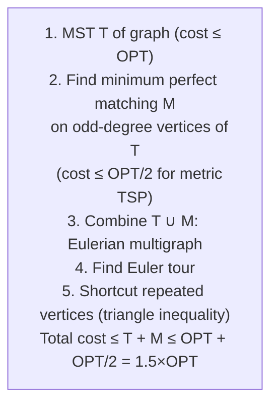

---

## 9. 경쟁 프로그래밍: 고전적인 문제 패턴

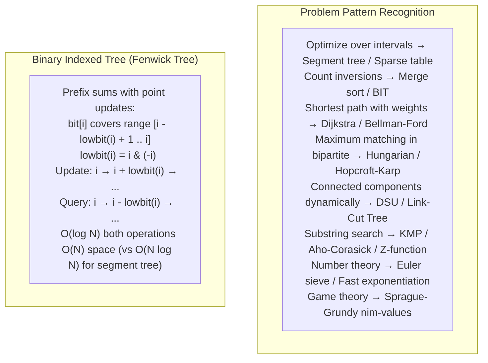

---

## 10. 계산 기하학: 볼록 껍질 내부

### 그레이엄 스캔: O(N log N)

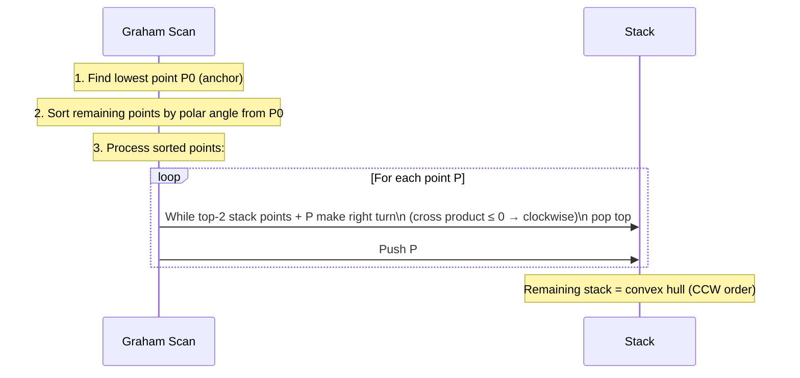

**외적 테스트**: 주어진 A, B, C 지점에서 좌회전하는지 확인합니다.
```
cross = (B.x-A.x)*(C.y-A.y) - (B.y-A.y)*(C.x-A.x)
cross > 0: left turn (CCW) — keep B
cross < 0: right turn (CW) — pop B
cross = 0: collinear — depends on requirements
```

---

## 요약: 알고리즘 복잡성 참조

| 문제 | 알고리즘 | 시간 | 공간 |
|---|---|---|---|
| 정렬 | 병합 정렬 | O(N 로그 N) | 오(엔) |
| 패턴 검색 | KMP | O(N+M) | 오(남) |
| 최대 유량 | 푸시 라벨 재지정 | O(V²√E) | O(V+E) |
| MST | 프림(바이너리 힙) | O(E로그V) | 오(V) |
| SSSP(음수가 아님) | 다익스트라(피보나치 힙) | O(E + V 로그 V) | 오(V) |
| SSSP(음의 가중치) | 벨먼-포드 | O(VE) | 오(V) |
| LCS | DP 테이블 | 오(NM) | O(최소(N,M)) |
| 배낭 | DP(유사폴리) | 오(북서) | 오(W) |
| 볼록 껍질 | 그레이엄 스캔 | O(N 로그 N) | 오(엔) |
| 정점 커버 약 | 최대 매칭 | O(E) | 오(V) |
