# C/C++ 내부: 내부

> 다음에서 합성됨: Stroustrup *The C++ 프로그래밍 언어* 4판, Meyers *Effective C++* / *Effective Modern C++*, Lippman *C++ Primer* 5판, comp(9/10/18/22-23/31/43/45/53/57/78/138/198-199/242/303/318/465) C 및 C++ 참조.

---

## 1. 메모리 모델 — 메모리의 객체 레이아웃

스택 프레임, 힙, 데이터 세그먼트 등 C++ 개체가 메모리에서 어디에 있는지 정확히 이해하는 것은 성능 분석에서 디버깅에 이르기까지 모든 것의 기초입니다.

### 스택 프레임 레이아웃(x86-64 시스템 V ABI)

```
Higher addresses
+------------------------+ ← previous frame's RSP (caller's stack)
| caller's local vars    |
+------------------------+
| return address (8B)    | ← pushed by CALL instruction
+------------------------+
| saved RBP (8B)         | ← PUSH RBP at function entry
+------------------------+ ← RBP points here (frame base)
| local variable a (8B)  | [RBP-8]
| local variable b (4B)  | [RBP-12]
| padding (4B)           | alignment to 16 bytes
+------------------------+
| spilled registers      | callee-saved: RBX, R12-R15
+------------------------+ ← RSP points here during function body
Lower addresses
```

**호출 규칙(System V AMD64 ABI)**:
- 정수/포인터 인수 1-6: `RDI, RSI, RDX, RCX, R8, R9`
- 부동 소수점 인수 1-8: `XMM0–XMM7`
- 반환 값: `RAX`(int/ptr), `XMM0`(float/double)
- 수신자 저장: `RBX, RBP, R12-R15`
- 발신자 저장: `RAX, RCX, RDX, RSI, RDI, R8-R11, XMM0–XMM7`

### 가상 메모리 세그먼트

```
+------------------------+ 0x7FFFFFFFFFFFFFFF (128TB)
| Stack (grows down)     | 8MB default limit (ulimit -s)
| ...                    |
+------------------------+
| mmap region            | shared libs, mmap(), large malloc
| (grows down)           | /usr/lib/libc.so.6 mapped here
+------------------------+
| ...                    |
+------------------------+
| Heap (grows up)        | brk()/mmap() managed by malloc
+------------------------+
| BSS segment            | zero-initialized global/static vars
+------------------------+
| Data segment           | initialized global/static vars
+------------------------+
| Text segment           | executable code (read-only)
+------------------------+ 0x400000 (typical ELF load address)
| NULL guard page        |
+------------------------+ 0x0
```

---

## 2. C++ 개체 모델 — vtable 및 vptr 레이아웃

### 단일 상속 vtable

```c++
class Animal {
    int age;
public:
    virtual void speak();     // slot 0
    virtual void move();      // slot 1
    virtual ~Animal();        // slot 2
};

class Dog : public Animal {
    char name[16];
public:
    void speak() override;    // overrides slot 0
    // move() inherited → slot 1 unchanged
    ~Dog() override;          // overrides slot 2
};
```

```
Dog object in memory:
+--------------------+
| vptr               | → Dog vtable (8 bytes, first field)
+--------------------+
| int age            | (inherited from Animal, 4 bytes)
| [4 bytes padding]  |
+--------------------+
| char name[16]      | (Dog's own data)
+--------------------+

Dog vtable (read-only, in .rodata):
+--------------------+
| offset-to-top = 0  | (RTTI bookkeeping)
+--------------------+
| type_info* Dog     | → typeinfo for Dog
+--------------------+
| &Dog::speak        | slot 0: overridden
+--------------------+
| &Animal::move      | slot 1: inherited
+--------------------+
| &Dog::~Dog         | slot 2: overridden
+--------------------+
```

### 가상 파견 - 조립 수준

```asm
; dog->speak();  compiles to:
mov rax, [rdi]        ; load vptr from dog object (rdi = this)
call [rax + 0]        ; indirect call through vtable slot 0
; compare with direct call (non-virtual):
; call Dog::speak     ; direct, no indirection, inlinable
```

가상 호출 오버헤드: 1개의 메모리 로드(vptr) + 1개의 간접 점프 + 분기 예측 누락(다형성 호출 사이트인 경우). 인라인 비가상 호출의 경우 ~5-10ns 대 ~0-1ns.

### 다중 상속 레이아웃

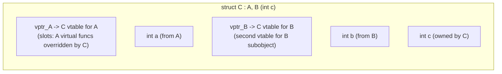

`C*`을 `B*`로 캐스팅할 때 컴파일러는 B 하위 개체를 가리키도록 포인터 조정(원시 포인터에 `sizeof(A)` 추가)을 내보냅니다. 이것이 `static_cast<B*>(c_ptr)` ≠ `reinterpret_cast<B*>(c_ptr)` 이유입니다.

---

## 3. RAII 및 스마트 포인터 내부

### Unique_ptr — 비용이 전혀 들지 않는 추상화

```cpp
template<typename T, typename Deleter = std::default_delete<T>>
class unique_ptr {
    T* ptr;
    [[no_unique_address]] Deleter del;  // EBO: empty base optimization
                                         // sizeof(unique_ptr<T>) == sizeof(T*)
                                         // when Deleter is stateless (default)
public:
    ~unique_ptr() { if(ptr) del(ptr); }
    unique_ptr(unique_ptr&& o) noexcept : ptr(o.ptr), del(std::move(o.del)) {
        o.ptr = nullptr;
    }
    unique_ptr(const unique_ptr&) = delete;  // no copy
};
```

`unique_ptr<T>`에는 원시 `T*`에 **동일한 기계어 코드**가 있습니다(기본 삭제 프로그램의 경우 최적화 프로그램은 `del(ptr)` = `delete ptr`을 통해 확인합니다). 런타임 오버헤드가 없습니다.

### shared_ptr — 제어 블록 레이아웃

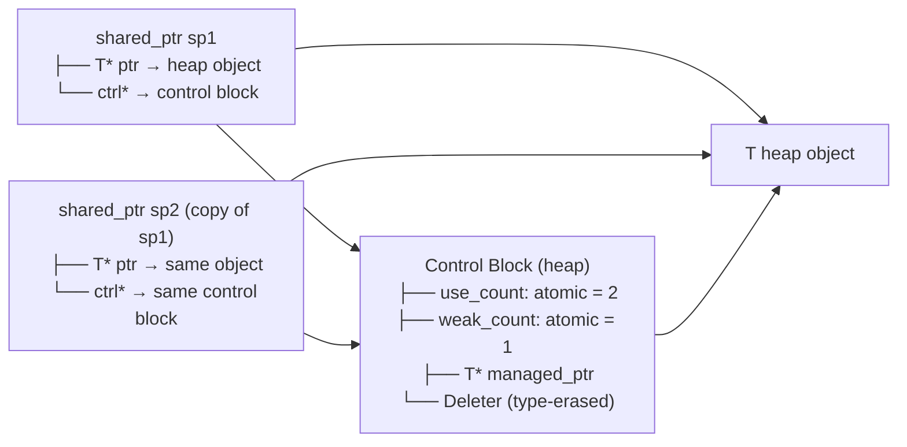

`make_shared<T>(args...)`은 T와 제어 블록 모두에 **하나의 연속 블록**을 할당합니다. → 2 대신 1 할당, 더 나은 캐시 지역성. 절충: T는 마지막 `weak_ptr`이 해제될 때까지 해제되지 않습니다(use_count=0이지만 Weak_count>0은 제어 블록을 활성 상태로 유지합니다).

**원자 참조 계산 비용**: `use_count`은 `std::atomic<int>`을(를) 사용합니다. x86에서 증가/감소 = `LOCK XADD`(원자적 읽기-수정-쓰기). 복사/파괴당 ~5-10ns. 긴밀한 루프를 피하세요. 복사보다 `const shared_ptr&` 전달을 선호하세요.

---

## 4. 이동 의미론 - 값 범주 및 Rvalue 참조

### 가치 카테고리

```
Expression categories:
lvalue:  has identity + not movable     int x; x = 5;  // x is lvalue
xvalue:  has identity + movable         std::move(x)   // cast to xvalue
prvalue: no identity + movable          42, f()        // pure rvalue

lvalue + xvalue = glvalue (has identity)
xvalue + prvalue = rvalue (movable)
```

### 생성자 이동과 복사 — 메모리 경로

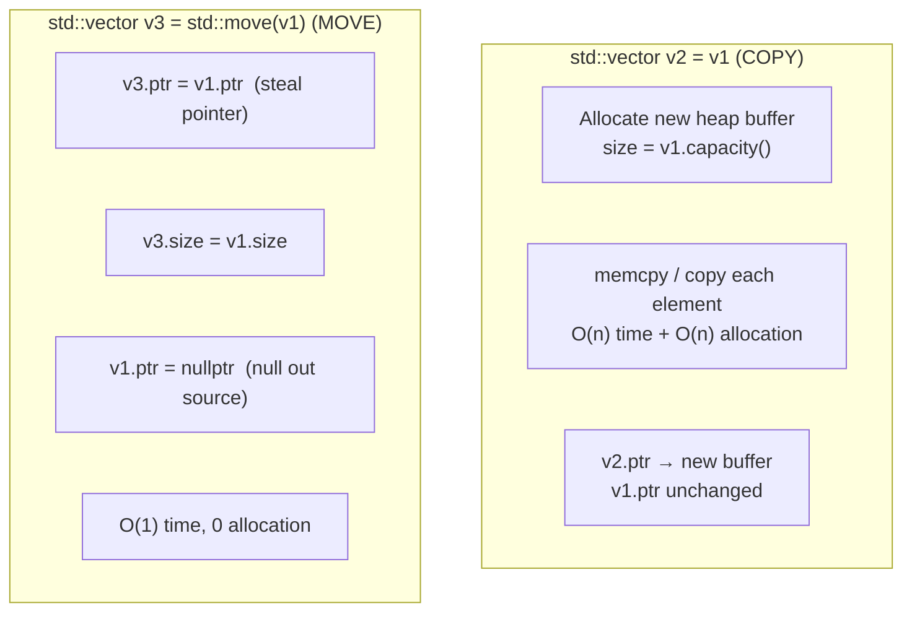

**완벽한 전달**:
```cpp
template<typename T>
void wrapper(T&& arg) {            // T&& = forwarding reference
    inner(std::forward<T>(arg));   // preserves lvalue/rvalue category
}
// If arg is lvalue: T=T&, forward<T&>(arg) → lvalue passed
// If arg is rvalue: T=T,  forward<T>(arg)  → rvalue passed (moved)
```

참조 축소 규칙: `T& &` → `T&`, `T& &&` → `T&`, `T&& &` → `T&`, `T&& &&` → `T&&`.

---

## 5. 템플릿 인스턴스화 및 컴파일 타임 계산

### 템플릿 인스턴스화 모델

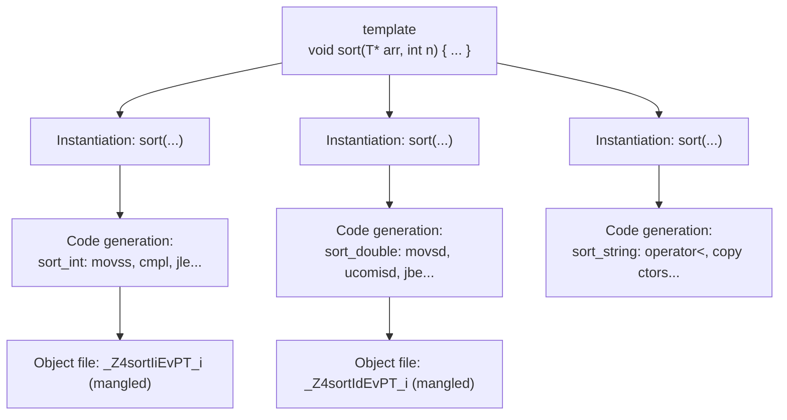

**코드 팽창**: 각 인스턴스화는 전체 기능 본문을 내보냅니다. `std::vector<int>`, `std::vector<double>`, `std::vector<string>` = 3개의 완전히 분리된 컴파일된 구현입니다. 완화: 명시적인 인스턴스화 선언, 유형이 지워진 기본 클래스.

### Constexpr 및 컴파일 타임 평가

```cpp
constexpr uint64_t fibonacci(uint64_t n) {
    if (n <= 1) return n;
    return fibonacci(n-1) + fibonacci(n-2);
}
// At compile time:
constexpr auto fib20 = fibonacci(20);  // = 6765, computed at compile time
// Assembly: mov eax, 6765  (constant folded, zero runtime cost)

// std::array with compile-time size:
template<size_t N>
constexpr std::array<uint64_t, N> make_fib_table() {
    std::array<uint64_t, N> t{};
    t[0]=0; t[1]=1;
    for(size_t i=2; i<N; i++) t[i] = t[i-1]+t[i-2];
    return t;
}
constexpr auto FIB_TABLE = make_fib_table<50>();
// Entire table in .rodata, no runtime computation
```

**템플릿 메타프로그래밍**은 컴파일러의 유형 시스템을 인터프리터로 활용합니다.
```cpp
template<int N> struct Factorial { 
    static constexpr int value = N * Factorial<N-1>::value; 
};
template<> struct Factorial<0> { static constexpr int value = 1; };
// Factorial<10>::value = 3628800 — computed entirely by template instantiation
```

---

## 6. 메모리 할당자 내부 — malloc/free/new/delete

### glibc ptmalloc2 아키텍처

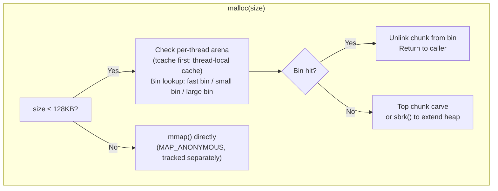

### 청크 레이아웃(glibc malloc)

```
+----------------------+ ← prev chunk end
| PREV_SIZE (8B)       | size of prev chunk (if prev is free)
+----------------------+ ← chunk start (returned ptr - 16)
| SIZE (8B)            | size of THIS chunk | PREV_IN_USE | IS_MMAPED | NON_MAIN
+----------------------+ ← user data pointer (returned by malloc)
| Forward ptr (8B)     | (free chunks only: next free in bin)
| Backward ptr (8B)    | (free chunks only: prev free in bin)
| User data ...        |
+----------------------+
| [next chunk header]  |
```

최소 할당: 32바이트(헤더 16개 + 정렬용 사용자 16명) 요청된 크기는 16바이트 경계로 반올림되었습니다. **해제 후 사용**: `free()`은 fd/bk 포인터를 해제된 메모리에 씁니다. free 후에 읽으면 이러한 손상된 포인터가 표시됩니다.

### tcache (glibc ≥ 2.26) — 스레드-로컬 캐시

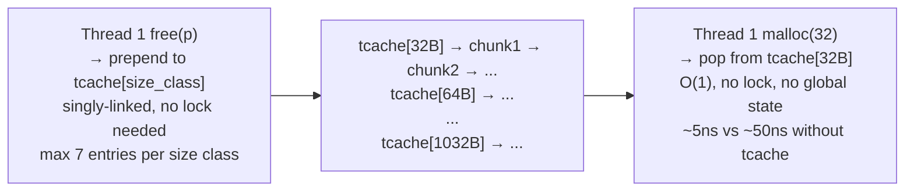

---

## 7. C++ 예외 — 비용이 전혀 들지 않는 예외 처리

### DWARF 해제 테이블(Itanium C++ ABI)

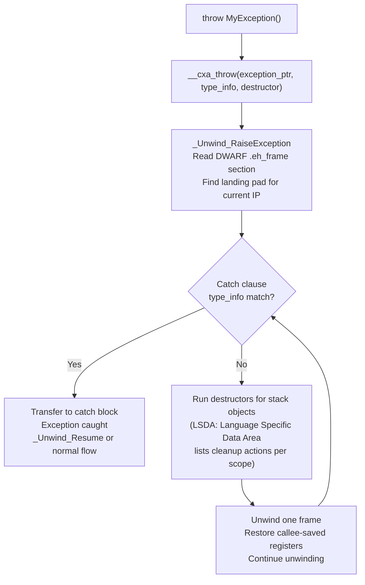

**비용 없음**: Happy 경로에는 오버헤드가 없습니다(시도 없음). `.eh_frame`/`.gcc_except_table` 읽기 전용 섹션에 저장된 예외 테이블입니다. 예외가 발생한 경우에만 지불되는 비용 — ~10,000ns(매우 느림, 정말 예외적인 경로에만 적합)

**RAII + 예외**: 스택 해제 중에 호출되는 모든 소멸자. 이것이 RAII가 중요한 이유입니다. `std::unique_ptr`, `std::lock_guard` 소멸자는 예외 전파 중에도 실행이 보장됩니다.

---

## 8. C 메모리 관리 — malloc vs 스택 vs mmap

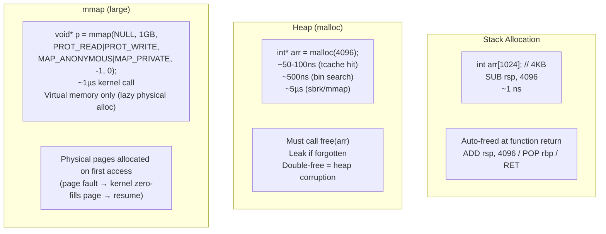

---

## 9. 정의되지 않은 동작 — 실제로 일어나는 일

### 부호 있는 정수 오버플로

```c
int x = INT_MAX;
int y = x + 1;  // UB: signed overflow
// Compiler ASSUMES this never happens → optimizes based on assumption:
// Loop: for(int i = 0; i >= 0; i++) — compiler sees i is always ≥0 (no overflow)
// → removes the loop termination check entirely (infinite loop!)
// -fsanitize=undefined catches this at runtime
```

### 엄격한 앨리어싱 위반

```c
float f = 3.14f;
int* ip = (int*)&f;         // UB: aliasing float through int*
int bits = *ip;             // compiler may return stale cached value
                             // (optimizer assumed float ptr and int ptr don't alias)

// Correct way: memcpy (portable type punning)
int bits2;
memcpy(&bits2, &f, 4);     // well-defined
// Or: __attribute__((may_alias)) (GCC extension)
```

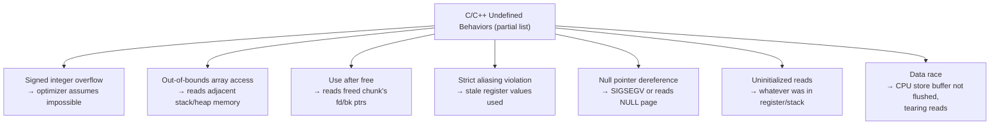

---

## 10. C++ 표준 라이브러리 컨테이너 - 내부 구조

### std::벡터 — 용량 증가

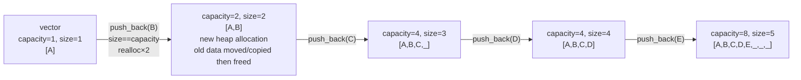

상각 O(1) push_back. 성장 인자: 2×(GCC) 또는 1.5×(MSVC). `reserve(n)`은 n ≤ 용량인 경우 재할당을 방지합니다.

### std::unordered_map — 해시 테이블 레이아웃

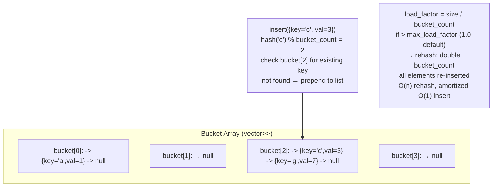

### std::map — 레드-블랙 트리

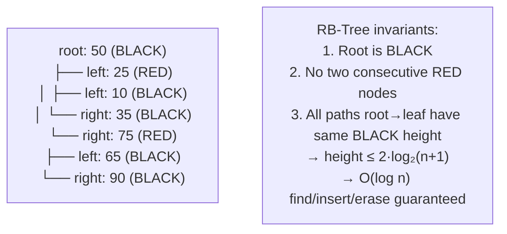

`std::map` 노드 = `std::_Rb_tree_node<pair<const K,V>>`: 포인터 3개(상위, 왼쪽, 오른쪽) + 색상 비트 + 키 + 값. 요소당 오버헤드: 5개의 기계어(40바이트) + 키+값. 순차 액세스의 경우 `std::vector`에 비해 캐시 성능이 낮습니다.

---

## 11. 잠금 없는 프로그래밍 - 메모리 순서 지정

### C++11 메모리 모델

```cpp
std::atomic<int> flag{0};
std::atomic<int> data{0};

// Thread 1 (producer):
data.store(42, std::memory_order_relaxed);    // may reorder
flag.store(1, std::memory_order_release);      // RELEASE: all prior stores visible before this

// Thread 2 (consumer):
while(flag.load(std::memory_order_acquire) == 0) {} // ACQUIRE: no subsequent loads before this
int x = data.load(std::memory_order_relaxed); // guaranteed to see 42
```

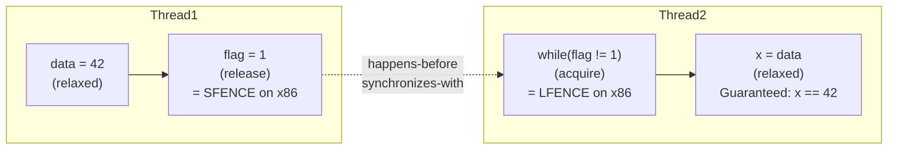

**x86 메모리 모델**은 이미 강력하게 정렬되어 있습니다(총 저장 순서): `seq_cst`/`acquire`/`release`는 x86에서 무료입니다(컴파일러 장벽만 있고 하드웨어 펜스는 없음). ARM/POWER(약한 순서): 획득/해제를 위해 방출된 실제 `DMB ISH` 펜스 명령어.

---

## 12. 컴파일 파이프라인 — C++ 소스를 바이너리로

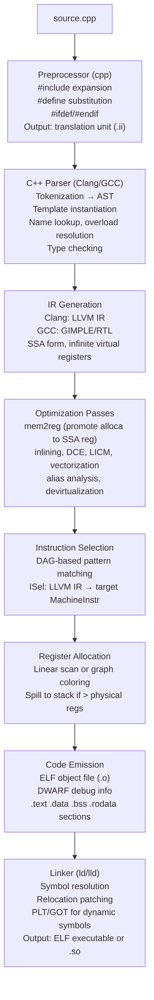

**이름 맹글링**: 과부하 명확성을 위한 유형으로 인코딩된 C++ 기호:
- `void foo(int)` → `_Z3fooi`
- `void foo(double)` → `_Z3food`  
- `Foo::bar(int, float)` → `_ZN3Foo3barEif`
- `extern "C"`은 맹글링을 비활성화합니다(C 상호 운용성의 경우).

---

## 핵심 성과 수치(C++)

| 운영 | 비용 | 메모 |
|-----------|------|-------|
| 스택 할당/해제 | ~1ns | 하위/추가 rsp |
| malloc(tcache 적중) | ~5-10ns | 스레드 로컬, 잠금 없음 |
| malloc(빈 검색) | ~50-100ns | 글로벌 경기장 잠금 |
| malloc(sbrk/mmap) | ~1~5μs | 시스템콜 |
| 가상통화 | ~5-10ns | vptr 로드 + 간접 jmp |
| 인라인 호출 | ~0ns | 인라인 후 오버헤드 없음 |
| shared_ptr 복사 | ~10-20ns | 원자 증가 |
| 예외 던지기 | ~5~50μs | 난쟁이 풀기 |
| 표준::지도 찾기 | O(log n) ~100ns(n=1M) | 캐시에 적합하지 않은 나무 산책 |
| std::unordered_map 찾기 | O(1) ~50-100ns | 해시 + 연결 목록 순회 |
| std::벡터 push_back(상환) | ~2-5ns | 직접 메모리 쓰기 |
