# 클라우드 및 AWS 내부: 하이퍼바이저, 가상 네트워크 및 관리형 서비스

> 내부 내용: 베어 메탈에서 EC2 인스턴스를 부팅하는 방법, S3가 오류 도메인 전체에 객체를 저장하는 방법, VPC가 가상 스위치를 통해 패킷을 라우팅하는 방법, Lambda 콜드 스타트 작동 방법 등 클라우드 인프라 이면의 정확한 하드웨어, 네트워크 및 스토리지 메커니즘을 설명합니다.

---

## 1. 하이퍼바이저 아키텍처: Nitro의 EC2

AWS Nitro는 호스트 OS가 아닌 전용 하드웨어 카드에 I/O 및 보안을 오프로드하는 맞춤형 하이퍼바이저입니다.

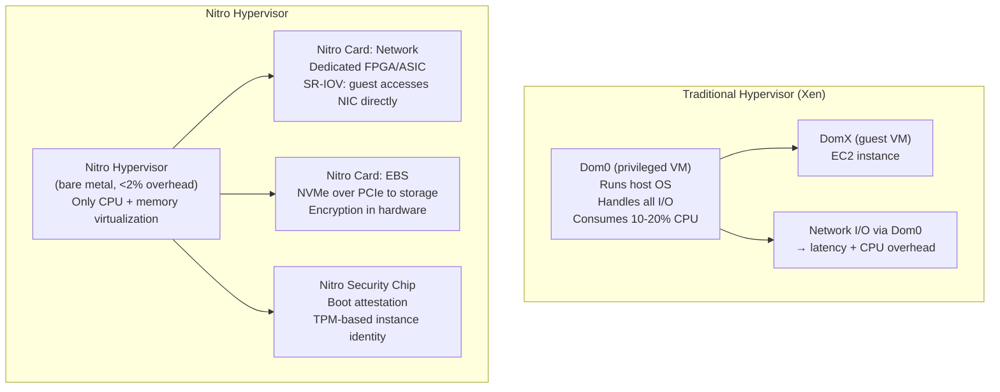

### Nitro의 VM 부팅 순서

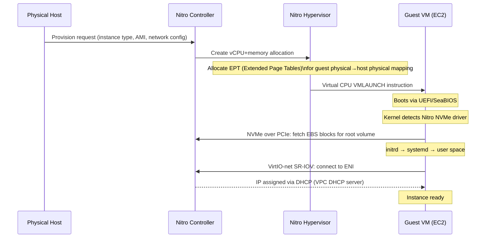

---

## 2. VPC 네트워크 아키텍처: 가상 스위치 및 라우팅

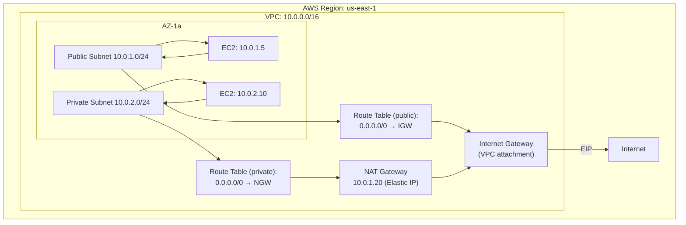

### 패킷 흐름: EC2에서 인터넷으로

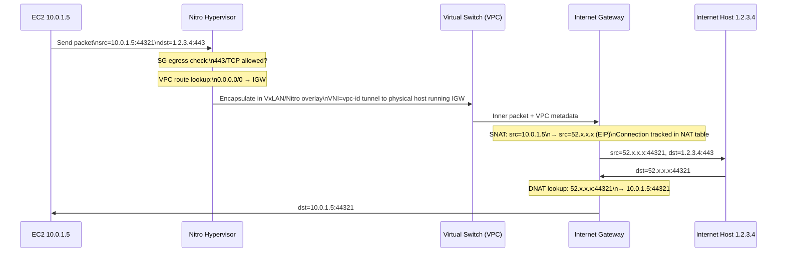

### 보안 그룹: 상태 저장 패킷 검사

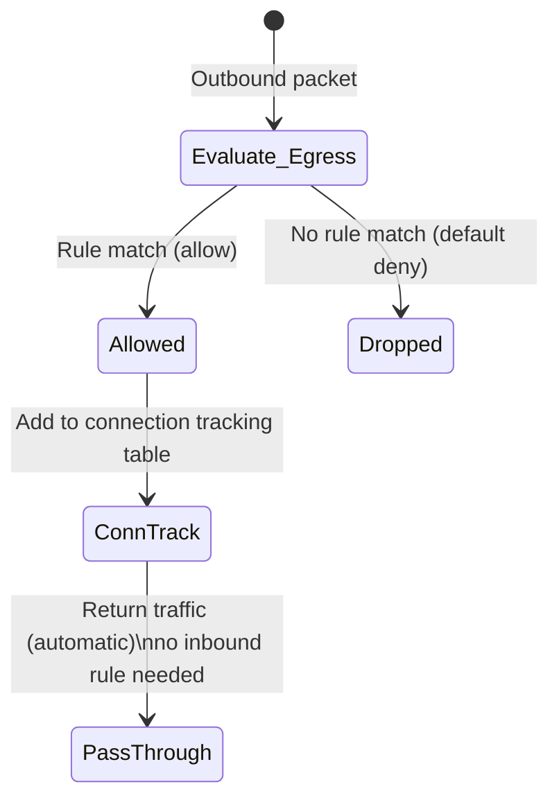

SG는 **상태 저장**(Nitro 하이퍼바이저의 Linux conntrack 테이블을 통한 연결 추적) — 인바운드 규칙은 반환 트래픽이 아닌 새 연결에 대해서만 확인됩니다.

---

## 3. S3 내부: 개체 스토리지 아키텍처

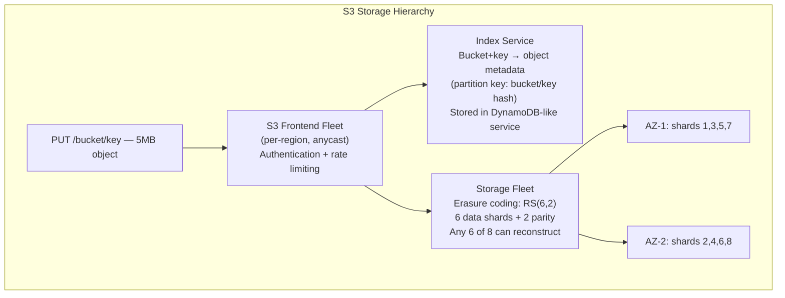

### 리드 솔로몬 삭제 코딩(RS 6+2)

S3는 객체를 6개의 데이터 청크로 분할하고 GF(2⁸)를 통한 리드 솔로몬 코딩을 사용하여 2개의 패리티 청크를 계산합니다.

```
Object → [d1, d2, d3, d4, d5, d6]  (data chunks)
         [p1, p2]                   (parity: p_i = linear combination of d_j over GF(2⁸))

Reconstruction: Any 6 of 8 shards sufficient.
               Solve system of linear equations over GF(2⁸)
               Tolerates: 2 simultaneous shard failures = 2 AZ failures
```

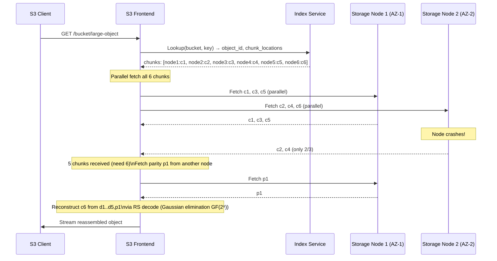

### S3 일관성 모델

2020년 12월부터 S3는 모든 작업에 대해 **강력한 쓰기 후 읽기 일관성**을 제공합니다. 내부적으로 이는 직렬화 가능한 메타데이터 저장소를 사용하는 인덱스 서비스에 의해 달성됩니다. PUT 후 GET은 보장된 새 객체를 확인합니다(이전에는 덮어쓰기에 대해 최종 일관성만 유지).

---

## 4. Lambda 콜드 스타트 내부

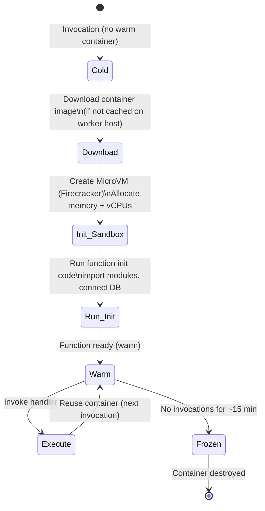

### 폭죽 MicroVM

AWS Lambda는 **Firecracker**(오픈 소스 KVM 기반 microVM)를 사용합니다.

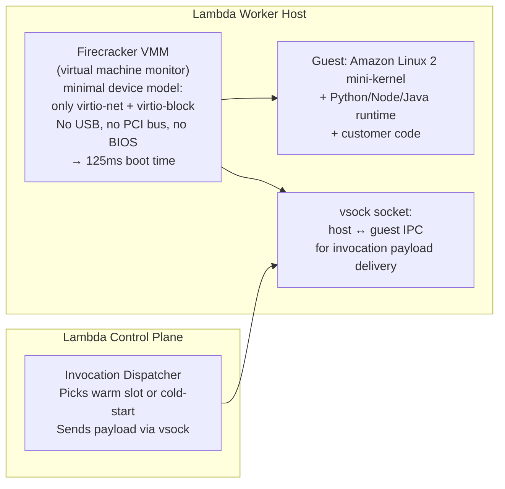

**콜드 스타트 분석(Python 3.11, 256MB)**:
- 폭죽 부팅: ~125ms
- Amazon Linux 초기화: ~50ms  
- Python 인터프리터 시작: ~100ms
- 고객 `import` 문: 가변(0ms~2000ms)
- **총계: 250ms~2500ms**(웜 대비: <1ms 오버헤드)

---

## 5. DynamoDB 내부: 파티셔닝 및 복제

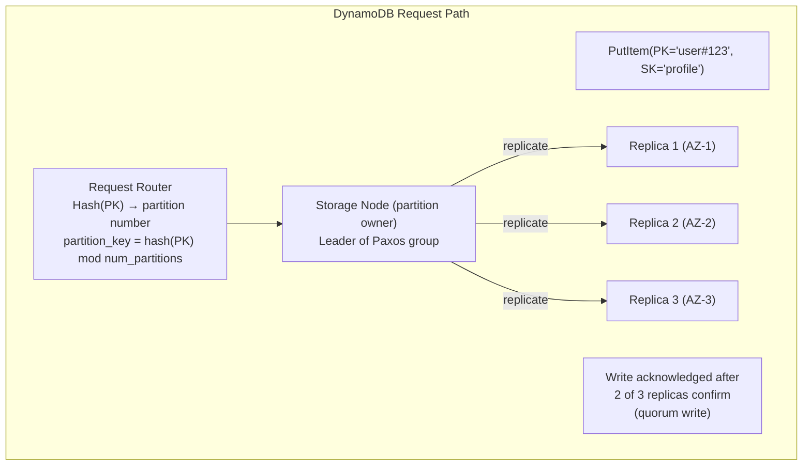

### DynamoDB LSM-트리 스토리지 엔진

각 DynamoDB 파티션은 내부적으로 LSM 트리(Log-Structured Merge-Tree)를 사용합니다.

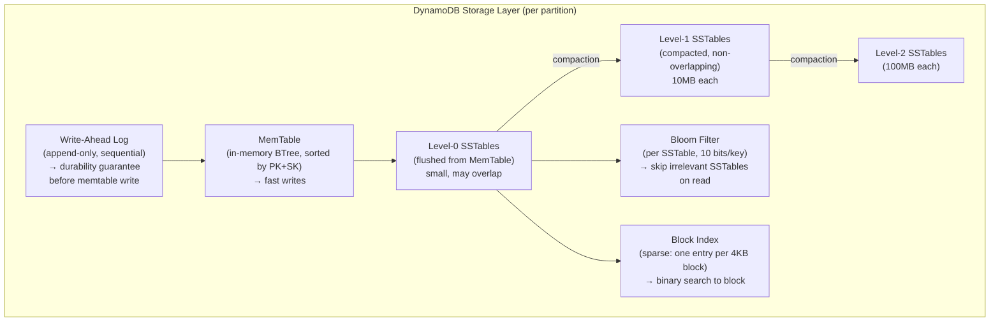

### DynamoDB 자동 파티셔닝(적응형 용량)

파티션이 1000WCU/s 또는 3000RCU/s를 초과하면 DynamoDB는 파티션을 분할합니다.

```
partition_id=abc → [abc_low, abc_high]
split_point = median key in partition
all keys < median → abc_low
all keys ≥ median → abc_high
Transparent to application: router table updated atomically
```

---

## 6. EBS: 블록 스토리지 내부

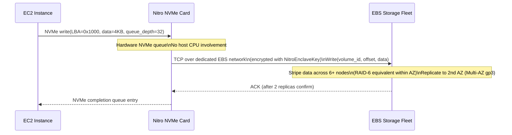

**EBS gp3 처리량**: 125MB/s 기준, 최대 1000MB/s(프로비저닝) Nitro 카드는 모든 NVMe 프로토콜, 암호화(하드웨어의 AES-256) 및 EBS 플릿에 대한 TCP 네트워킹을 처리하며 I/O용 호스트 CPU는 없습니다.

---

## 7. IAM 정책 평가 엔진

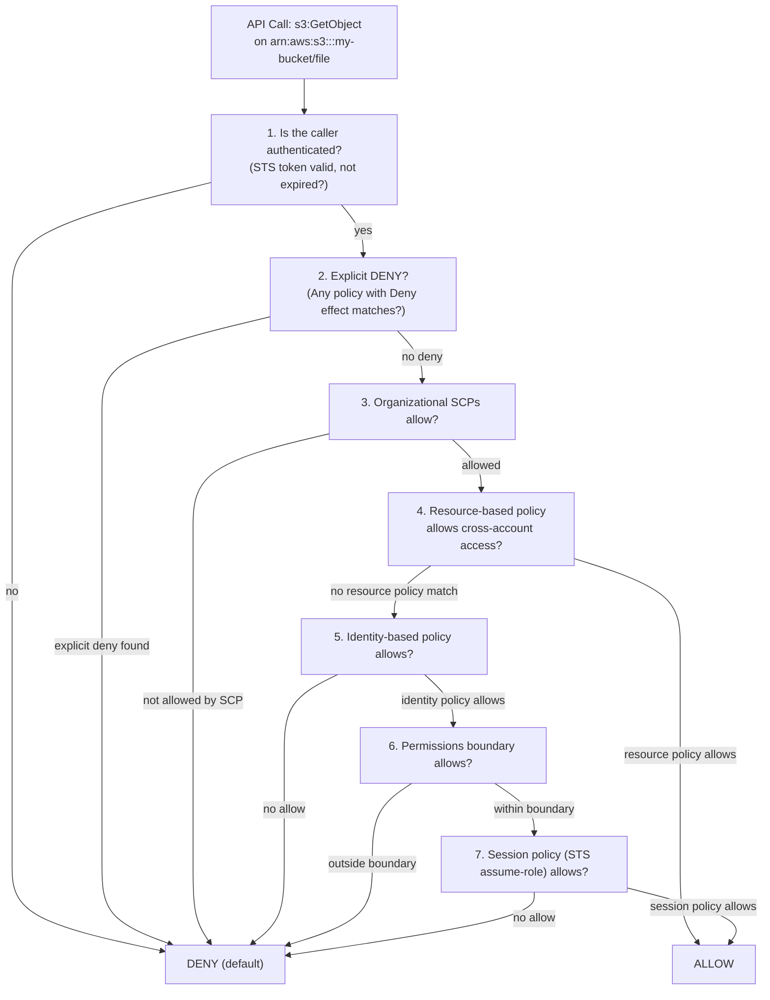

**조건 평가**: IAM 조건은 Condition 블록 내에서 AND를 사용하거나 여러 Condition 요소에 걸쳐 평가됩니다. `aws:RequestedRegion`, `aws:SourceVpc`, `aws:CurrentTime`는 서비스 제어 플레인에 의해 평가 시 삽입된 컨텍스트 키입니다.

---

## 8. RDS 다중 AZ: 동기식 복제 내부

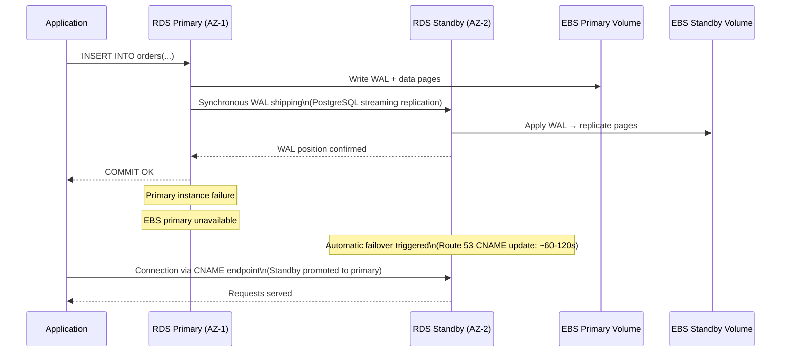

### 읽기 전용 복제본 아키텍처(비동기)

읽기 복제본은 **비동기** 로그 전달을 사용합니다. 다중 AZ(동기식, 동일 리전 장애 조치)와 달리 읽기 전용 복제본은 몇 분 정도 지연될 수 있으며 HA가 아닌 **읽기 확장**에 사용됩니다.

```
Primary → WAL chunks → replica_1 (async, may lag)
                     → replica_2 (async, may lag)
                     → replica_3 (cross-region, higher lag)
```

---

## 9. CloudFront CDN 내부: 엣지 캐싱

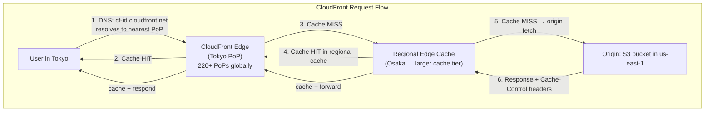

### 캐시 키 구성

```
Default cache key = host + path + query string params (configured)
Vary headers (Accept-Encoding: gzip,br) → separate cache variants
CloudFront Functions: modify cache key in edge compute (sub-ms JS runtime)
Lambda@Edge: full Node.js (origin/response/request phase — 5ms max)
```

---

## 10. AWS Auto Scaling: 제어 루프 메커니즘

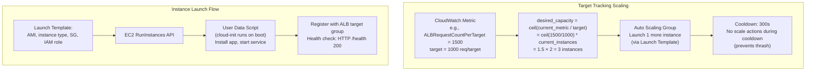

---

## 11. AWS 서비스 내부 요약

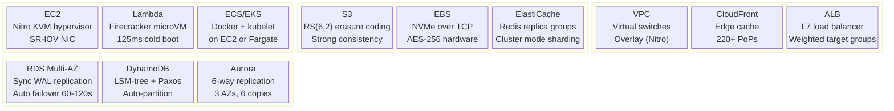

---

## AWS 공동 책임 모델: 기술 경계

| 레이어 | AWS 책임 | 고객 책임 |
|---|---|---|
| 물리적 하드웨어 | ✅ 니트로 카드, BIOS, 펌웨어 | — |
| 하이퍼바이저 | ✅ Nitro 하이퍼바이저 격리 | — |
| 호스트 OS | ✅ 패치, 업데이트 | — |
| 게스트 OS | — | ✅ EC2 AMI 패치 |
| 네트워크 ACL | ✅ VPC 인프라 | ✅ 규칙 구성 |
| 미사용 데이터 | ✅ 하드웨어 AES-256 옵션 | ✅ 암호화 활성화 |
| IAM 권한 | ✅ 정책 엔진 | ✅ 최소 권한 정책 작성 |
| 애플리케이션 코드 | — | ✅ 취약점은 당신의 것입니다 |
