# 컴파일러 내부: 소스에서 기계 코드까지

> **고급** — Dragon Book의 단계가 소스 텍스트를 실행 가능한 바이너리로 변환하는 방법: 렉서 DFA 상태 머신, 파서 LR 오토마타, 유형 확인 환경, IR 낮추기, 데이터 흐름 분석 및 그래프 색상 지정을 통한 레지스터 할당. 출처: *컴파일러: 원리, 기법 및 도구*(Aho/Lam/Sethi/Ullman, 2판 — "Dragon Book"), *프로그래밍 언어 화용론*(Scott), *프로그래밍 언어의 개념*(Sebesta).

---

## 1. 컴파일러 파이프라인: 엔드투엔드 단계 아키텍처

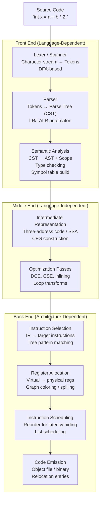

---

## 2. 어휘 분석: DFA 상태 머신 내부

어휘 분석기는 정규식에서 컴파일된 결정론적 유한 자동 장치를 사용하여 문자 스트림을 토큰 스트림으로 변환합니다.

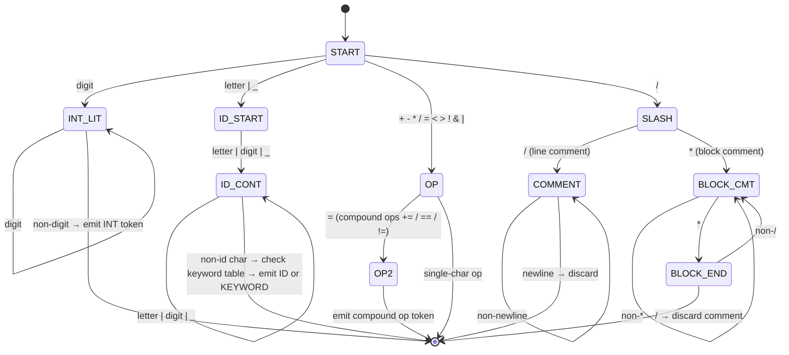

### 최대 뭉크 법칙과 역추적

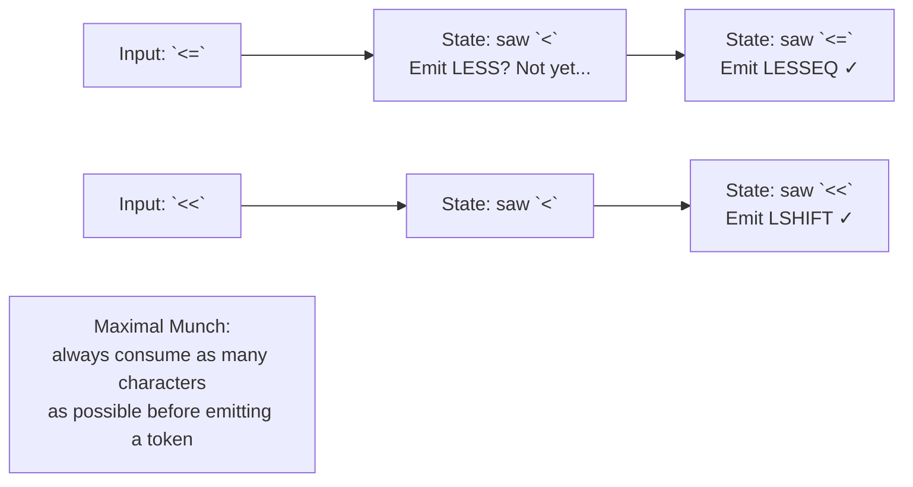

---

## 3. 구문 분석: LR(1) Automaton 및 Shift-Reduce 결정

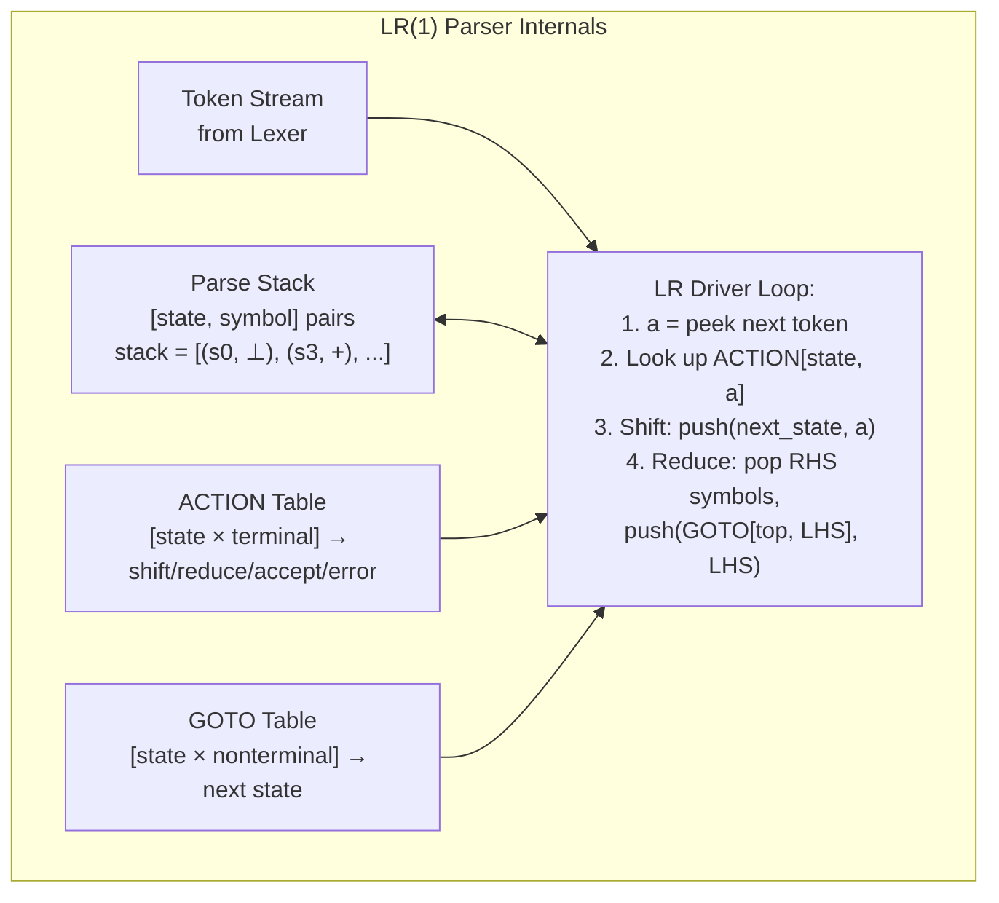

### 충돌 해결: 이동/감소, 감소/감소

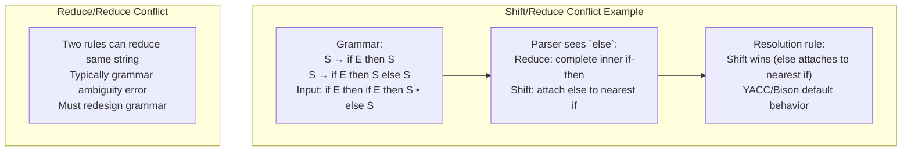

---

## 4. 기호표: 범위 및 유형 환경

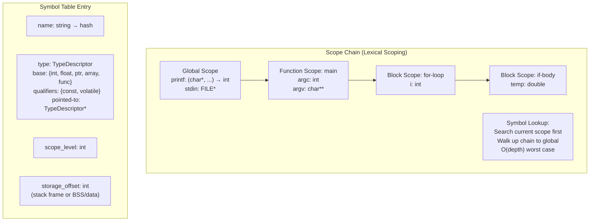

---

## 5. 3개 주소 코드 및 SSA 양식

### 3개 주소 코드(TAC) 생성

출처: `x = a + b * 2`

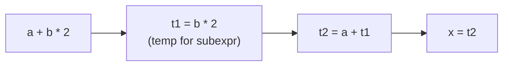

```
Generated TAC:
  t1 = b * 2
  t2 = a + t1
  x  = t2
```

### SSA(정적 단일 할당) 양식

모든 변수는 정확히 한 번만 할당됩니다. 제어 흐름 조인 포인트의 Φ 기능.

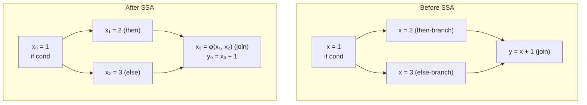

### 제어 흐름 그래프(CFG)

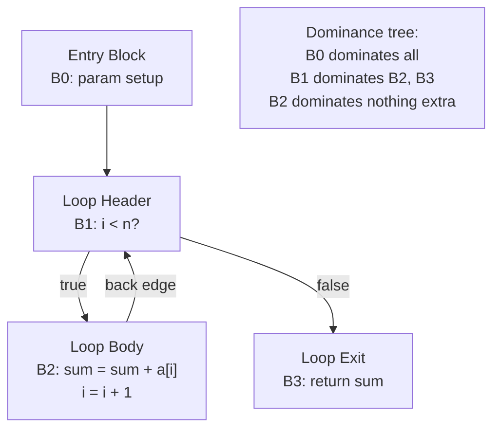

---

## 6. 데이터 흐름 분석: 활성 및 도달 정의

### 활동성 분석(역방향 데이터 흐름)

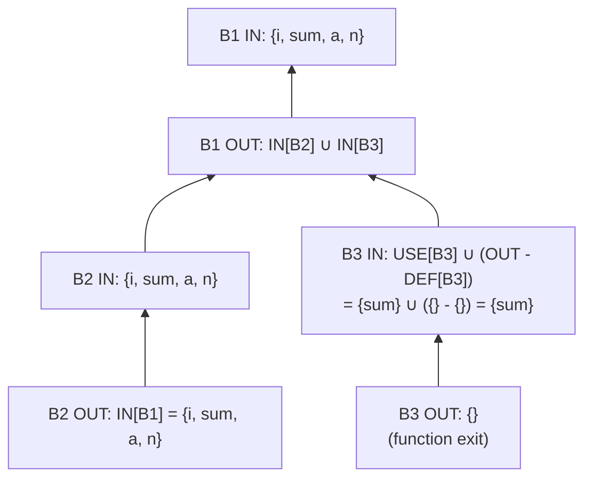

**알고리즘**: 반복 고정 소수점 — 모든 LIVE_OUT = ∅로 시작하고 변경 사항이 없을 때까지 뒤로 전파합니다. 레지스터 수명(간섭)을 결정하기 위해 레지스터 할당자가 사용합니다.

---

## 7. 레지스터 할당: 그래프 컬러링

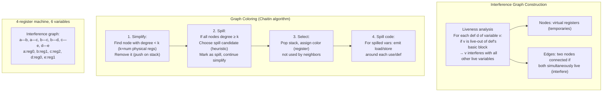

### 통합: MOV 명령어 제거

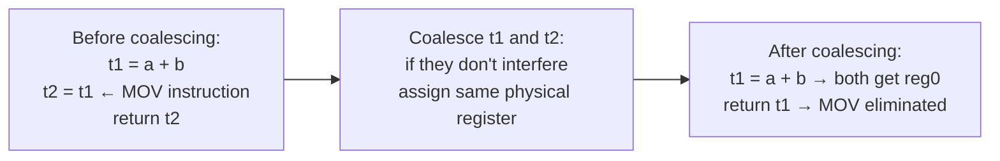

---

## 8. 최적화: 루프 변환

### 루프 불변 코드 모션(LICM)

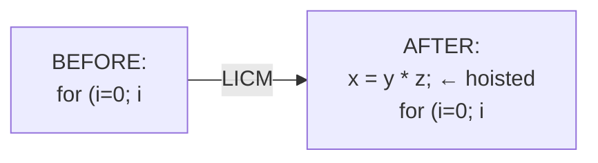

### 루프 풀기

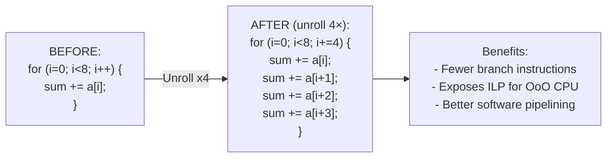

### 루프 타일링(캐시 최적화)

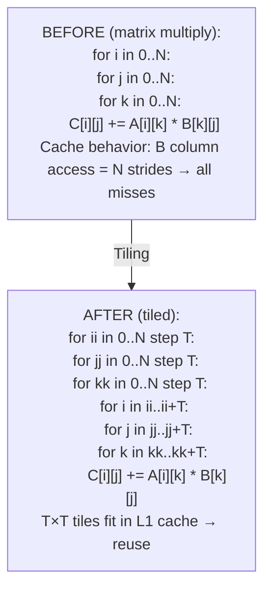

---

## 9. 코드 생성: 트리 패턴 매칭을 통한 명령어 선택

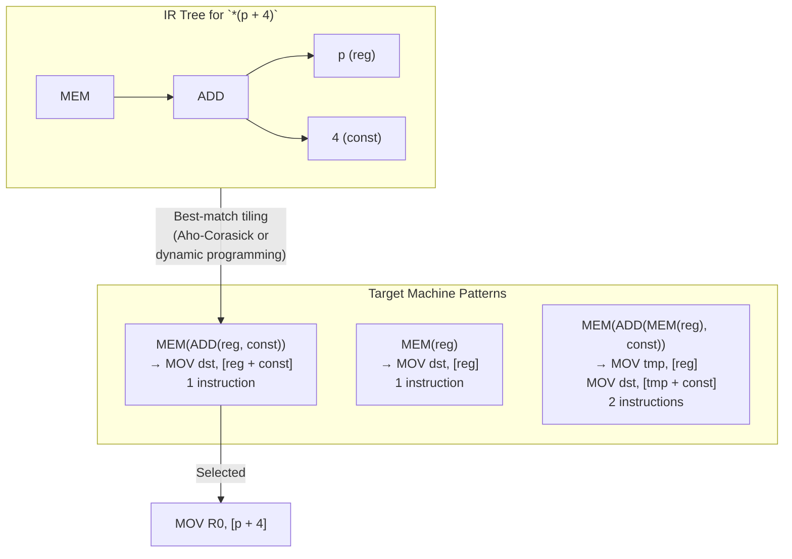

---

## 10. 링커 및 로더 내부

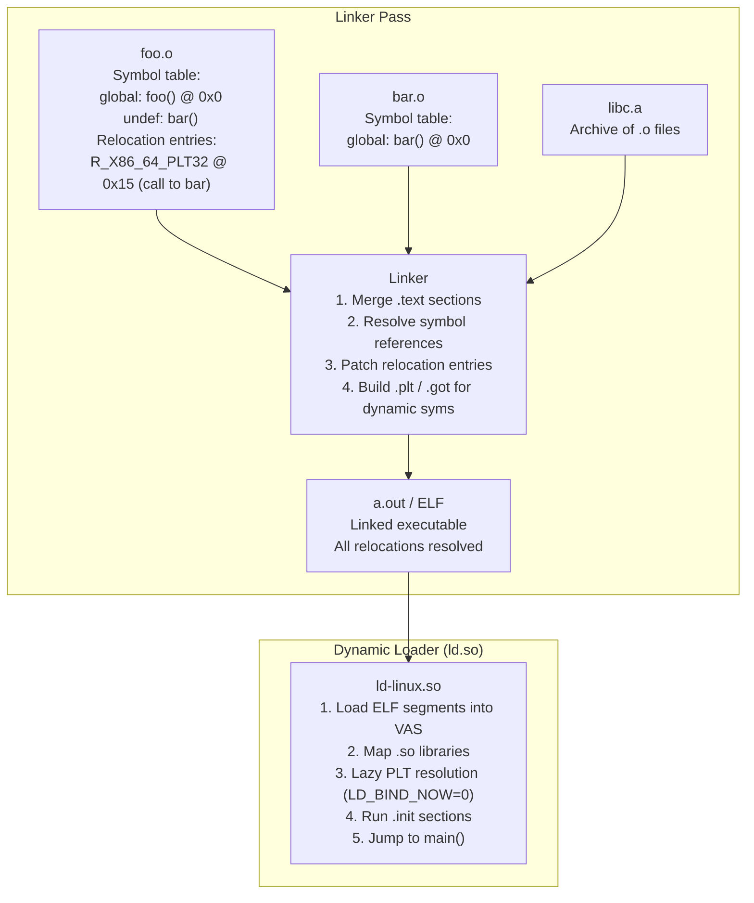

### ELF 파일 구조

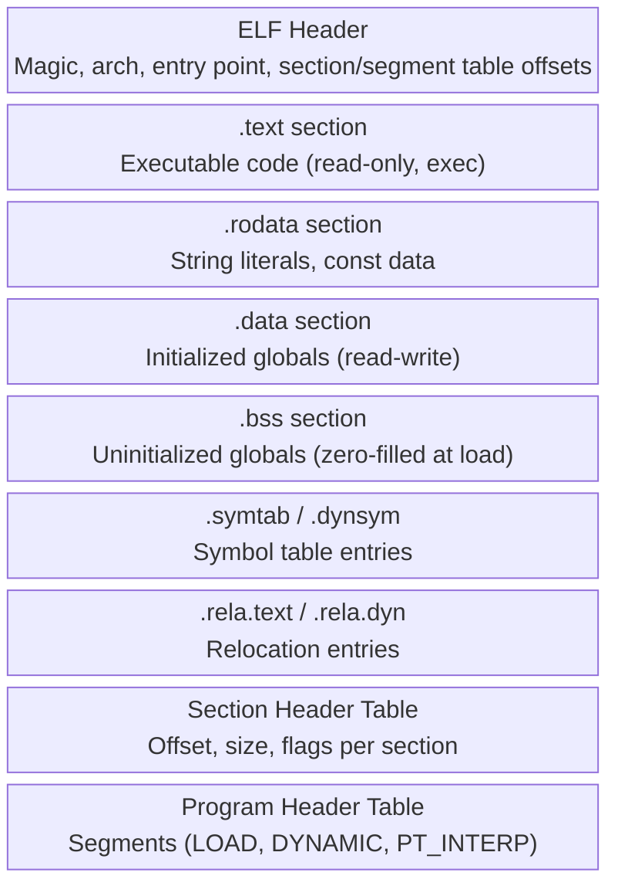

---

## 11. JIT 컴파일: 동적 코드 생성

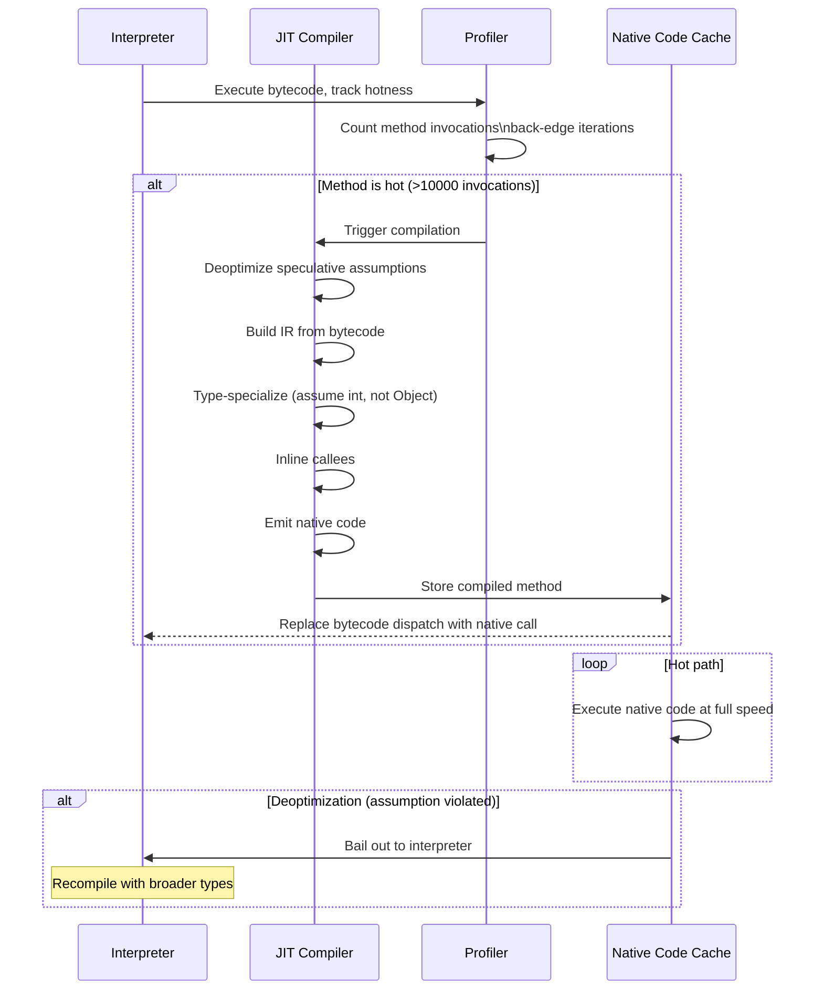

---

## 12. 언어 기능 → 컴파일러 메커니즘 매핑

| 언어 기능 | 컴파일러 메커니즘 |
|---|---|
| 변수 | 심볼 테이블 항목 + 스택 프레임 슬롯 또는 레지스터 |
| 유형 확인 | 유형 환경 + 하위 유형 격자 순회 |
| 함수 호출 | 활성화 기록(프레임), 호출 규칙(cdecl/fastcall) |
| 클로저/람다 | 클로저 레코드: 함수 ptr + 캡처된 환경 힙 할당 |
| 제네릭(C++ 템플릿) | 단일화: 컴파일 타임에 유형별로 인스턴스화 |
| 제네릭(Java/C#) | 유형 삭제: 단일 바이트코드, 런타임 캐스트 |
| 가상 파견 | vtable: 함수 포인터 배열, 동적 디스패치 |
| 예외 | 비용이 없는 테이블(DWARF .eh_frame), 던지면 풀기 |
| `async/await` | 상태 머신 변환: locals → 구조체 필드 |
| 쓰레기 수거 | Safepoint, 스택 맵, 쓰기 장벽 |
| SIMD 벡터화 | 자동 벡터화기: 루프 → `vmovups`, `vaddps` 지침 |
