# 데이터 마이닝 및 빅 데이터 내부: 내부

> 소스 합성: Hadoop MapReduce 내부, Spark RDD/DAG 실행, Flink 스트리밍, 열 저장소 압축, LSM 트리 및 데이터 마이닝 알고리즘을 다루는 데이터 마이닝 및 빅 데이터 참고서(comp 234–240, 268–290, 310, 436–438, 441, 446, 448, 453–454, 488).

---

## 1. Hadoop MapReduce — 실행 내부

```mermaid
flowchart TD
    subgraph MapReduce Pipeline
        Input["HDFS Input Files\n(128MB blocks)"]
        IS["InputSplit\n(logical split ≤ 1 block)\n→ 1 Map task per split"]
        Map["Map Tasks (parallel)\nmap(k1,v1) → list(k2,v2)\nrun on same DataNode as block\n(data locality)"]
        Buffer["In-memory Sort Buffer\n(io.sort.mb=100MB default)\nSpillThreshold=0.80\n→ sorted runs spilled to disk"]
        Combine["Combiner (optional)\nlocal reduce-like aggregation\nbefore shuffle\n→ reduces network traffic"]
        Shuffle["Shuffle + Sort\nHTTP fetch from Map outputs\n→ merge-sort by key\n(external merge sort)\nGrouped by key for Reduce"]
        Reduce["Reduce Tasks\nreduce(k2, list(v2)) → list(k3,v3)"]
        Output["HDFS Output\n(replication factor=3)"]
    end

    Input --> IS --> Map --> Buffer --> Combine --> Shuffle --> Reduce --> Output

    subgraph HDFS Block Layout
        NN["NameNode\n- fsimage: namespace tree\n- edit log: recent mutations\n- block→DataNode mapping (in-memory)\n- heartbeat every 3s\n- block report every 6h"]
        DN["DataNode × N\n- store 128MB block files\n- block scanner: CRC32 verify\n- pipeline write: client → DN1 → DN2 → DN3"]
        NN <-->|"RPC"| DN
    end
```

### MapReduce Shuffle 심층 분석

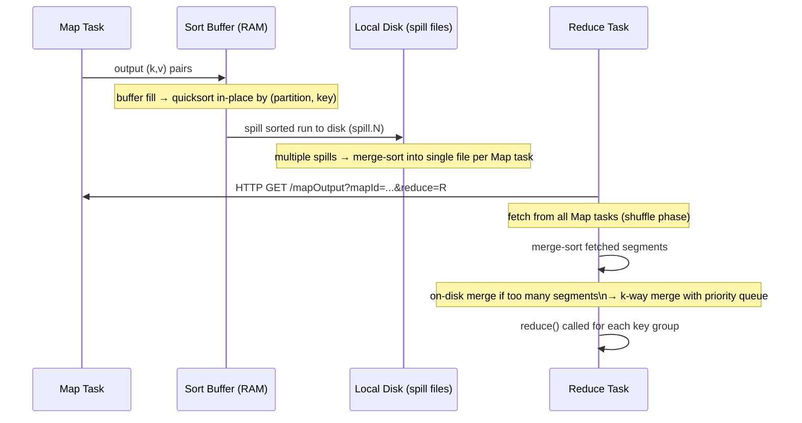

---

## 2. Apache Spark — RDD, DAG 및 실행

```mermaid
flowchart TD
    subgraph Spark Application Architecture
        Driver["Driver Process\n- SparkContext\n- DAGScheduler\n- TaskScheduler\n- BlockManagerMaster"]
        EM["Executor Manager\n(YARN/K8s ResourceManager)"]
        E1["Executor 1\n- BlockManager\n- Task threads (cores=4)\n- JVM heap + off-heap"]
        E2["Executor 2\n- BlockManager\n- Task threads"]
    end

    Driver -->|"task launch"| E1 & E2
    Driver <-->|"resource negotiation"| EM
    E1 <-->|"shuffle data"| E2

    subgraph RDD Lineage (Lazy Evaluation)
        R1["textFile('/data/log')\n(HadoopRDD)"]
        R2["filter(line => line.contains('ERROR'))\n(FilteredRDD)"]
        R3["map(line => (line.split(' ')(0), 1))\n(MappedRDD)"]
        R4["reduceByKey(_ + _)\n(ShuffledRDD)\n← STAGE BOUNDARY (shuffle)"]
        R5["collect()\n← ACTION → triggers execution"]
        R1 --> R2 --> R3 --> R4 --> R5
    end
```

### DAG 스케줄러 — 단계 분할

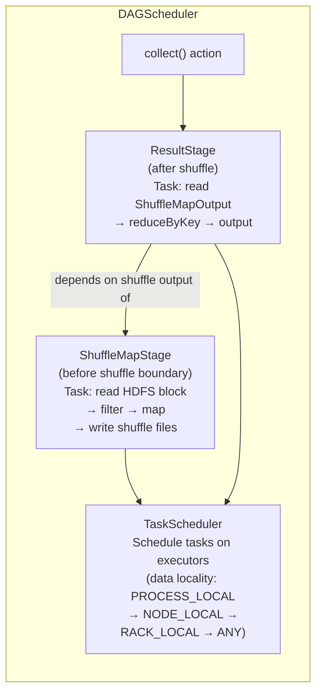

### 셔플 내부(정렬 기반)

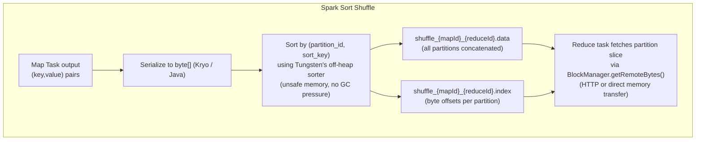

---

## 3. Spark Tungsten — 오프힙 바이너리 형식

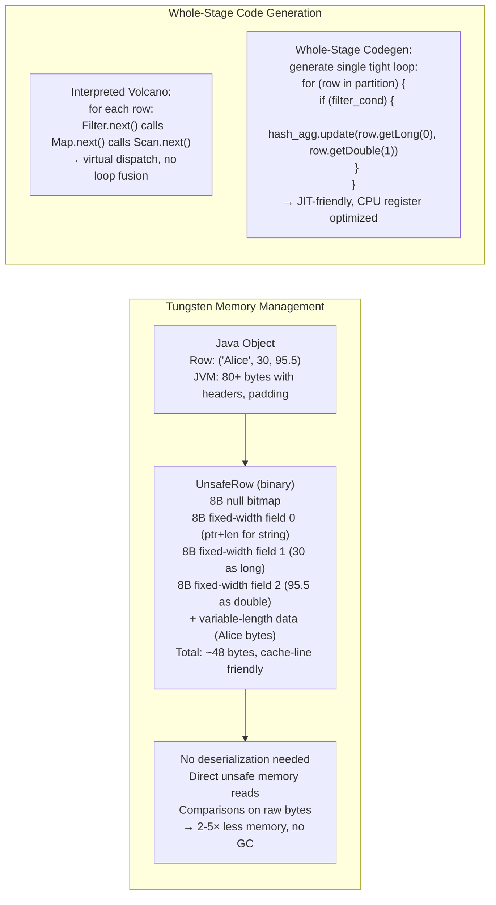

---

## 4. Apache Flink — 스트리밍 실행 내부

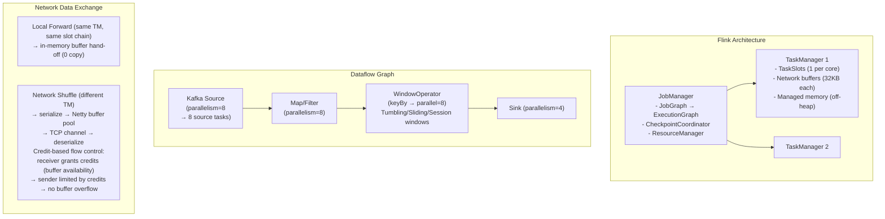

### Flink 체크포인트 - Chandy-Lamport 알고리즘

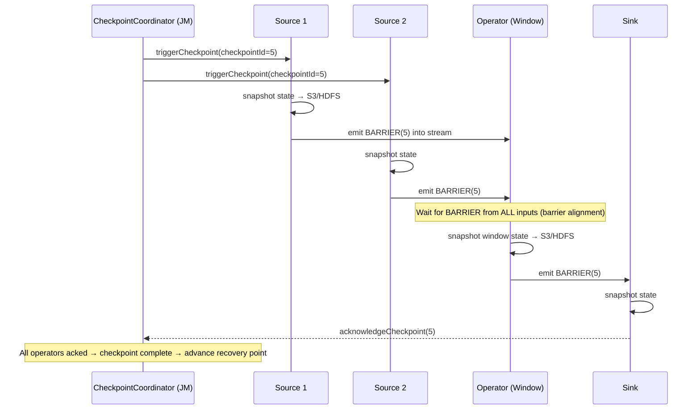

---

## 5. LSM 트리 - 경로 내부 쓰기

```mermaid
flowchart TD
    subgraph LSM-Tree (RocksDB / Cassandra)
        Write["Write: PUT(key, value)"]
        WAL["WAL (Write-Ahead Log)\nappend-only, sequential write\n→ crash recovery"]
        Memtable["MemTable\n(in-memory sorted structure\nRed-Black tree or SkipList)\nwrite + read: O(log n)"]
        Immutable["Immutable MemTable\n(flipped when MemTable full ~64MB)\n→ being flushed to L0"]
        L0["L0 SSTable files\n(sorted within file\nbut keys can overlap between L0 files)\n→ 4–8 files before compaction trigger"]
        L1["L1 SSTables\n(total size ~256MB\nnon-overlapping key ranges)"]
        L2["L2 SSTables\n(total size ~2.56GB)"]
        Ln["L_n ...\n(10× size amplification per level)"]
    end

    Write --> WAL & Memtable
    Memtable --> Immutable --> L0 --> L1 --> L2 --> Ln

    subgraph Compaction (Leveled)
        Pick["Pick overlapping SSTable from L_i\nand all overlapping SSTables from L_{i+1}"]
        Merge["k-way merge (sorted iterators)\nremove tombstones (if past TTL)\ndedup: newer version wins"]
        Write2["Write new sorted SSTable to L_{i+1}\ndelete old files (atomic manifest update)"]
        Pick --> Merge --> Write2
    end
```

### SSTable 블룸 필터 + 인덱스

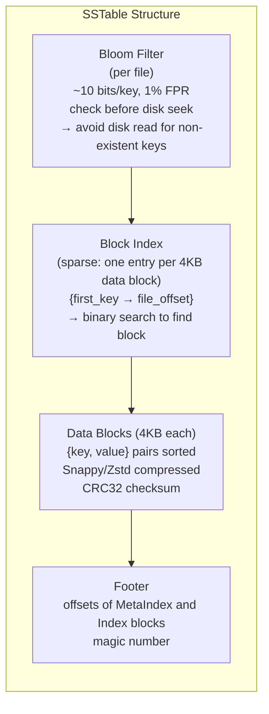

---

## 6. 열 저장소 — 압축 및 벡터화된 실행

```mermaid
flowchart LR
    subgraph Column Storage (Parquet / ORC)
        Row["Row-oriented:\n[id=1, name=Alice, age=30, score=95.5]\n[id=2, name=Bob, age=25, score=87.0]\n→ read all columns even if only 'score' needed"]
        Col["Column-oriented:\nid_col:   [1,2,3,4,...]\nname_col: [Alice,Bob,Carol,...]\nage_col:  [30,25,28,...]\nscore_col:[95.5,87.0,92.3,...]\n→ read only 'score_col' for aggregation"]
    end

    subgraph Parquet Encoding Schemes
        Plain["Plain encoding:\n[30, 25, 28, 30, 25]\n(4 bytes each)"]
        DeltaEnc["Delta encoding:\nfirst=30, deltas=[−5,+3,+2,−5]\n(variable-length int → 2× smaller)"]
        RLE["Run-Length Encoding (RLE):\n[30, 30, 30, 30, 25, 25]\n→ {val=30, run=4}, {val=25, run=2}\n(highly repetitive cols: status, country)"]
        Dict["Dictionary encoding:\n{0:Alice, 1:Bob, 2:Carol}\nname_col=[0,1,2,0,1,...]\n(low-cardinality strings: 10× smaller)"]
    end
    Plain --> DeltaEnc & RLE & Dict
```

### 벡터화된 쿼리 실행

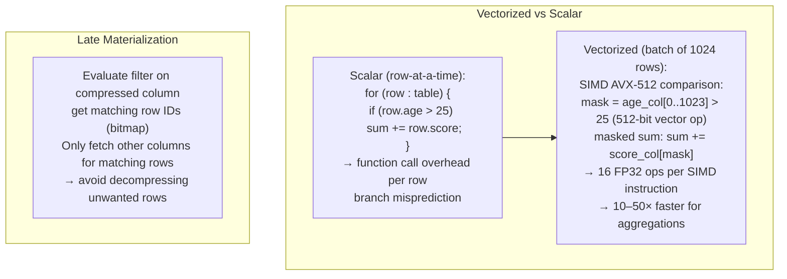

---

## 7. 빈번한 항목 집합 마이닝 - Apriori & FP-Growth

```mermaid
flowchart TD
    subgraph Apriori Algorithm
        D["Transaction database\nT1: {milk, bread, beer}\nT2: {milk, bread}\nT3: {bread, beer, diapers}"]
        C1["C1 (candidate 1-itemsets):\n{milk:2, bread:3, beer:2, diapers:1}"]
        L1["L1 (freq 1-itemsets, minSup=2):\n{milk:2, bread:3, beer:2}"]
        C2["C2 (candidate 2-itemsets from L1):\n{milk,bread}, {milk,beer}, {bread,beer}"]
        L2["L2 (freq 2-itemsets):\n{milk,bread:2}, {bread,beer:2}"]
        Prune["Anti-monotone pruning:\nif {milk,beer,bread} has subset {milk,beer} not freq\n→ prune (all subsets must be frequent)"]
    end
    D --> C1 --> L1 --> C2 --> L2 --> Prune

    subgraph FP-Growth (no candidate generation)
        FPTree["FP-Tree:\ncompressed prefix tree\nheader table → linked list per item\nTwo DB scans: 1. freq items 2. build tree"]
        ConditionalDB["Conditional Pattern Base:\nfor each freq item β:\n  extract all paths to β\n  form conditional FP-tree\n  mine recursively"]
        FPTree --> ConditionalDB
    end
```

---

## 8. K-평균 군집화 — Lloyd의 알고리즘 내부

```mermaid
flowchart TD
    subgraph K-Means Iteration
        Init["Initialize k centroids\n(K-means++: D² weighted sampling\n→ spread-out initialization)"]
        Assign["Assignment step:\nfor each point x_i:\n  c(x_i) = argmin_k ‖x_i - μ_k‖²\n(nearest centroid)\nO(n·k·d) per iteration"]
        Update["Update step:\nμ_k = (1/|C_k|) Σ_{x∈C_k} x\n(mean of assigned points)"]
        Converge["Convergence:\ncentroids change < ε\nor max_iter reached\nObjective: minimize inertia\n= Σ_i min_k ‖x_i - μ_k‖²"]
    end
    Init --> Assign --> Update --> Converge
    Update -->|"not converged"| Assign

    subgraph Distributed K-Means (Spark MLlib)
        Partitions["Partitions: data distributed across executors"]
        LocalSum["Local aggregation:\neach partition sums points per cluster\n→ (cluster_id, sum_vector, count)"]
        GlobalReduce["Driver reduces partial sums:\nμ_k = Σ(local_sum_k) / Σ(local_count_k)"]
        Broadcast["Broadcast new centroids to all executors"]
        Partitions --> LocalSum --> GlobalReduce --> Broadcast --> LocalSum
    end
```

---

## 9. 연관 규칙 마이닝 - 신뢰도 및 상승도

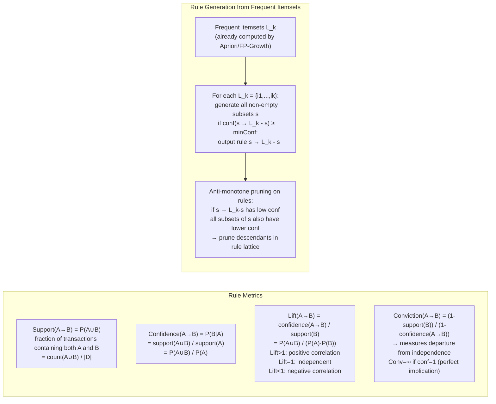

---

## 10. 스트리밍 데이터 - 저장소 샘플링 및 최소 카운트 스케치

```mermaid
flowchart TD
    subgraph Reservoir Sampling (Vitter's Algorithm R)
        Stream["Infinite stream x_1, x_2, ..., x_n, ..."]
        Reservoir["Reservoir R[1..k]\n(k randomly selected items)"]
        Process["For each new item x_i (i > k):\n  j = random(1, i)\n  if j ≤ k:\n    R[j] = x_i  (replace with prob k/i)\n→ each item has equal probability k/i of being in reservoir\n→ uniform random sample without knowing stream length"]
        Stream --> Reservoir --> Process
    end

    subgraph Count-Min Sketch (Frequency Estimation)
        Sketch["Data structure:\nw×d array of counters\n(e.g. w=2000, d=5)"]
        Hash["d independent hash functions h_1,...,h_d\n(pairwise independent)"]
        Update["Update(x, count):\nfor i in 1..d:\n  sketch[i][h_i(x)] += count"]
        Query["Query(x):\nreturn min_i sketch[i][h_i(x)]\n→ overestimate (hash collisions add to count)\nbut never underestimate\nError: ε = e/w, δ = e^(-d)\n(ε-approximate with prob 1-δ)"]
        Sketch --> Hash --> Update & Query
    end
```

---

## 11. HDFS 쓰기 경로 — 3× 복제 파이프라인

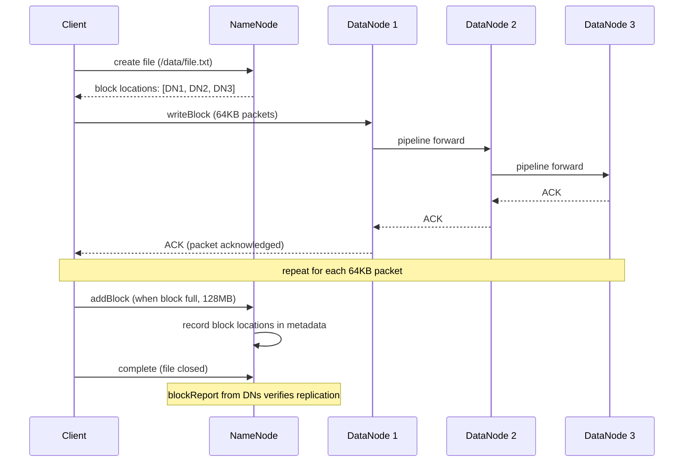

---

## 12. 데이터 웨어하우스 — 스타 스키마 및 쿼리 최적화

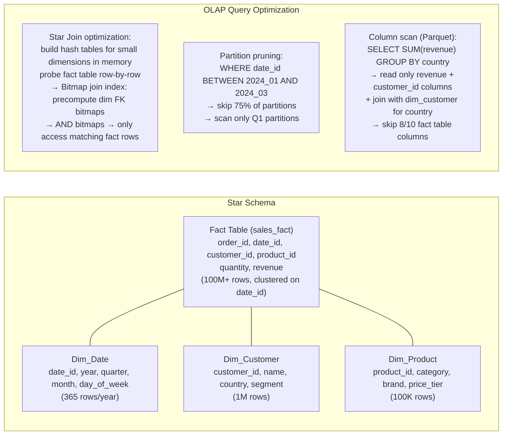

---

## 13. PageRank — 반복 그래프 계산

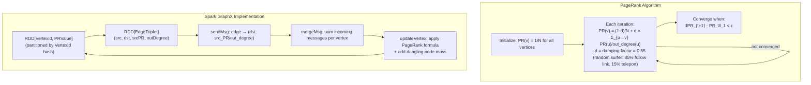

---

## 14. 성능 수치

```mermaid
block-beta
  columns 2
  block:hadoop_perf["Hadoop MapReduce"]:1
    h1["Map task startup: ~1–2s (JVM launch)"]
    h2["Shuffle I/O: bottleneck for large jobs"]
    h3["Sort buffer: io.sort.mb=100–512MB per task"]
    h4["Typical job: minutes to hours"]
  end
  block:spark_perf["Apache Spark"]:1
    s1["Task startup: ~10ms (JVM reuse)"]
    s2["In-memory cache: 10–100× faster than disk"]
    s3["Shuffle: ~50–200ms for 100M rows"]
    s4["Tungsten off-heap: 2–5× less memory than Java objs"]
  end
  block:lsm_perf["LSM-Tree (RocksDB)"]:1
    l1["Write: ~100K–1M ops/sec (sequential WAL)"]
    l2["Point read: ~100–500K ops/sec"]
    l3["Compaction write amp: 10–30× leveled"]
    l4["Bloom filter FPR: 1% at 10 bits/key"]
  end
  block:col_perf["Column Store"]:1
    c1["Scan 1B rows, 1 column: ~1–10s (Parquet+Spark)"]
    c2["Dictionary encoding: 10× compression for strings"]
    c3["SIMD vectorized filter: 50–200M rows/sec per core"]
    c4["Late materialization: 5–10× vs row scan"]
  end
```

---

## 주요 내용

- **MapReduce 셔플**은 주요 I/O 비용입니다. 결합기는 로컬 사전 집계를 수행하여 네트워크 바이트를 줄입니다. Spill 파일은 Reduce 전에 외부 k-way 병합을 사용하여 병합 정렬됩니다.
- **Spark DAG**는 셔플 경계에서 단계로 분할됩니다. 단계 내의 작업은 완전히 파이프라인됩니다(연산자 간 직렬화 없음). 텅스텐 오프힙 행으로 GC 일시중지 방지
- **LSM-Tree**는 읽기 증폭을 희생하면서 무작위 쓰기를 순차 I/O(MemTable → WAL → 정렬된 SSTable 파일)로 변환하여 높은 쓰기 처리량을 달성합니다(여러 레벨을 확인해야 함).
- SSTable의 **블룸 필터**는 포인트 쿼리 누락을 O(레벨) 대신 O(1) I/O로 만듭니다. 키당 10비트는 ~1%의 거짓 긍정 비율을 제공합니다.
- **열 저장소 + 사전 인코딩**은 카디널리티가 낮은 열(국가, 상태, 범주)에 가장 효과적입니다. 단조롭게 증가하는 타임스탬프에 대한 델타 인코딩; 반복되는 값에 대한 RLE
- **FP-Growth**는 압축된 접두사 트리를 구축하고 조건부 데이터베이스를 반복적으로 마이닝하여 Apriori의 기하급수적인 후보 생성을 방지합니다. 밀도가 높은 데이터 세트의 경우 훨씬 더 빠릅니다.
- **Flink 체크포인트**는 Chandy-Lamport 장벽 주입을 사용합니다. 장벽은 데이터 흐름 그래프를 통해 흐릅니다. 모든 입력의 장벽이 도착하면 운영자는 상태를 스냅샷합니다(정렬된 체크포인트).
