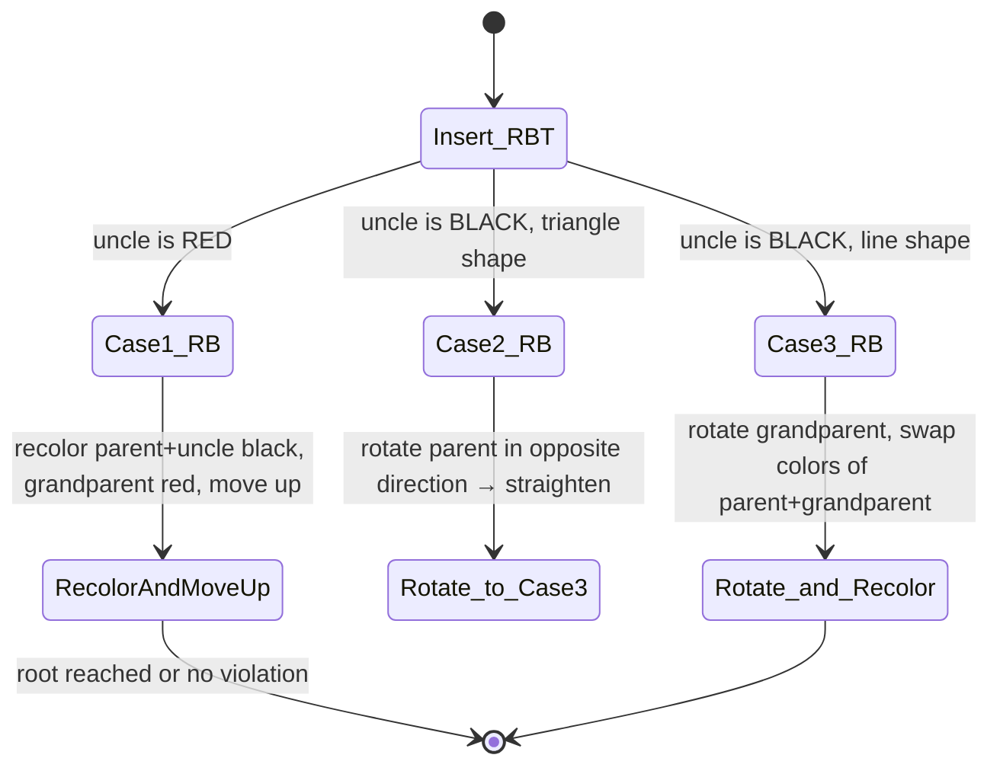
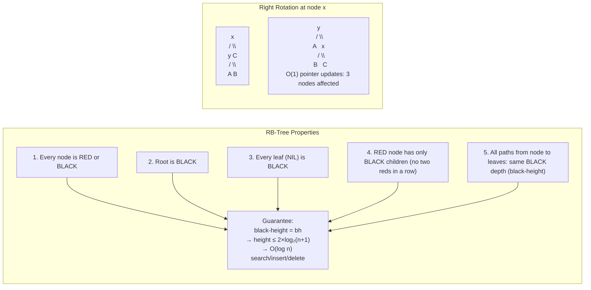
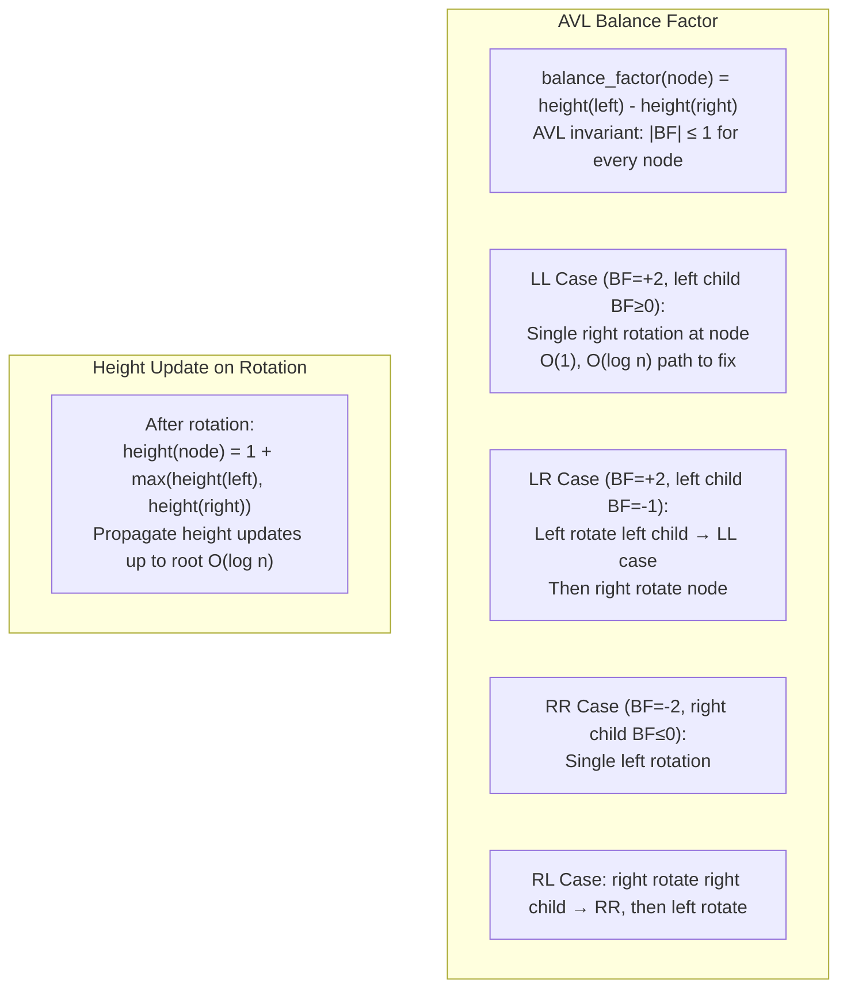
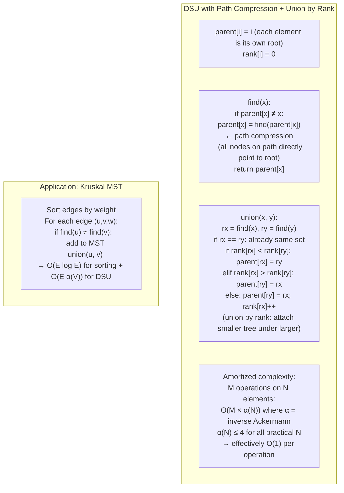
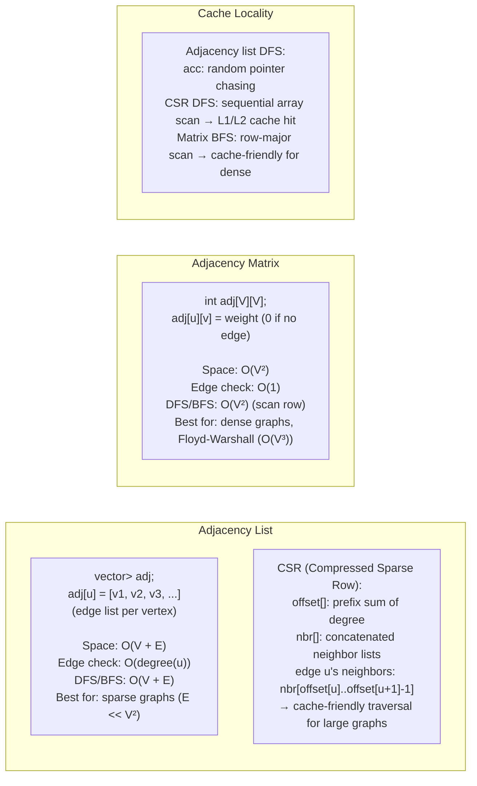

# 데이터 구조 내부: 내부

> 소스 합성: 모든 주요 데이터 구조에 대한 메모리 레이아웃, 포인터 메커니즘, 캐시 동작, 상각 복잡성 및 알고리즘 불변성을 다루는 데이터 구조 참고서(comp 180–186, 189, 191–192, 213, 241–243).

---

## 1. 동적 배열 — 상각 성장 메커니즘

```mermaid
flowchart TD
    subgraph Dynamic Array (std::vector / ArrayList)
        Initial["Initial: capacity=1, size=0\n[_]"]
        Push1["push(A): size=1, cap=1\n[A]"]
        Push2["push(B): size>cap\n→ allocate cap×2=2, copy A\n[A, B] cap=2"]
        Push3["push(C): size>cap\n→ allocate cap×2=4, copy A,B\n[A, B, C, _] cap=4"]
        Push4["push(D):\n[A, B, C, D] cap=4, no alloc"]
        Push5["push(E): size>cap\n→ allocate cap×2=8, copy A,B,C,D\n[A,B,C,D,E,_,_,_] cap=8"]
    end

    subgraph Amortized Cost Analysis
        Total["n pushes total cost:\n- copies triggered: 1+2+4+...+n/2 = n-1 (geometric series)\n- each element copied ≤ log₂n times\nTotal work = O(n) → O(1) amortized per push"]
        Memory["Memory layout:\ncontiguous heap allocation\ncache-line friendly (64B = 16 ints)\niteraton = sequential cache hits"]
    end
```

---

## 2. 연결 목록 — 메모리 및 포인터 해부

```mermaid
flowchart LR
    subgraph Singly Linked List Node Layout
        Node1["Node@0x1000:\n[data: int 'A' | next: 0x1040]"]
        Node2["Node@0x1040:\n[data: int 'B' | next: 0x10A0]"]
        Node3["Node@0x10A0:\n[data: int 'C' | next: NULL]"]
        Head["head → 0x1000"]
        Node1 --> Node2 --> Node3
    end

    subgraph Cache Behavior
        CacheLine["CPU cache line: 64 bytes\nArray traversal: 1 cache miss / 16 ints\nLinked list traversal: 1 cache miss / node\n(pointer chasing: unpredictable addresses)\n→ 10–100× slower for traversal vs array"]
        Prefetch["Hardware prefetcher:\ndetects sequential access → prefetch\nLinked list: random pointer → no prefetch benefit"]
    end

    subgraph XOR Linked List (memory saving)
        XOR["Each node stores: prev XOR next\nTraversal: next = prev XOR node.both\nSave 1 pointer per node (8 bytes)\nbut: no arbitrary pointer arithmetic → rarely used"]
    end
```

---

## 3. 해시 테이블 - 충돌 해결 및 조사

```mermaid
flowchart TD
    subgraph Chaining (Java HashMap)
        HT["Array of buckets (capacity=16, load_factor=0.75)\nbucket[i] = linked list (or tree) of entries\nhash(key) = key.hashCode() ^ (key.hashCode() >>> 16)\nbucket_index = hash & (capacity-1)"]
        Chain["Bucket 3: [Entry{k1,v1}] → [Entry{k2,v2}] → null\n(same hash bucket → chain grows)"]
        Tree["Treeify threshold=8:\nchain length ≥ 8 → convert to Red-Black Tree\ntable.length must be ≥ 64\n→ O(n) chain → O(log n) tree lookup"]
        Resize["Resize at size > capacity × 0.75:\nnewCapacity = 2 × capacity\nrehash all entries (OR with new bit)\nbuckets either stay or move by exactly oldCapacity"]
    end

    subgraph Open Addressing (Linear Probing)
        LP["Lookup(key):\ni = hash(key) % capacity\nwhile table[i] ≠ null and table[i].key ≠ key:\n  i = (i + 1) % capacity  ← linear probe\nDelete: use TOMBSTONE marker\n(can't just null: breaks probe chain)"]
        Cluster["Primary clustering:\nconsecutive filled slots form clusters\n→ probe length grows with load\n→ cache-friendly BUT clusters degrade O(n) worst case"]
        Robin["Robin Hood hashing:\ntrack probe distance (PSL) per entry\non insert: if new PSL > existing PSL → displace existing\n→ max probe length bounded: variance reduced"]
    end

    subgraph Double Hashing
        DH["i = (hash1(key) + j × hash2(key)) % capacity\nhash2(key) = R - (key % R), R = prime < capacity\n→ eliminates primary clustering\n→ but non-sequential memory access (cache miss)"]
    end
```

---

## 4. 이진 검색 트리 — 구조적 특성

```mermaid
flowchart TD
    subgraph BST Invariant
        Root2["Root: 50"]
        L1["30"]
        R1["70"]
        L2["20"]
        L3["40"]
        R2["60"]
        R3["80"]
        Root2 --> L1 & R1
        L1 --> L2 & L3
        R1 --> R2 & R3
        Note1["Invariant:\n∀ node n:\n  left subtree keys < n.key\n  right subtree keys > n.key\nSearch/insert/delete: O(h)\nh = O(n) unbalanced, O(log n) balanced"]
    end

    subgraph BST Delete — 3 Cases
        Case1["Case 1: no children\nremove leaf, set parent.child = null"]
        Case2["Case 2: one child\nbypass node: parent.child = node.child"]
        Case3["Case 3: two children\nfind in-order successor (min of right subtree)\nswap key/value into node\ndelete successor (now Case 1 or 2)"]
    end
```

---

## 5. 레드-블랙 트리 — 회전 및 재조정





---

## 6. AVL 트리 - 균형 요소 및 회전



---

## 7. B-트리 — 온디스크 구조

```mermaid
flowchart TD
    subgraph B-Tree of Order t (min degree)
        Root3["Root: [20, 40]\n(2 keys, 3 children)"]
        N1["[5, 10, 15]\n(leaf, 3 keys)"]
        N2["[25, 30]\n(leaf)"]
        N3["[45, 50, 60]\n(leaf)"]
        Root3 --> N1 & N2 & N3

        Props["Properties (order t):\n- Each node: t-1 ≤ keys ≤ 2t-1 (root: 1 ≤ keys)\n- Each internal node: t ≤ children ≤ 2t\n- All leaves at same depth\n- t=500 → each node fits 1 disk block (4KB)\n  → tree height h = O(log_t n)\n  → for n=10^9, t=500: h=3 (3 disk reads!)"]
    end

    subgraph B-Tree Split (insert overflow)
        Full["Node has 2t-1 keys (full)"]
        Split["Split at median key index t:\n- median key promoted to parent\n- left child: keys[0..t-2]\n- right child: keys[t..2t-2]\n- Parent gains 1 key + 1 child ptr\n→ if parent also full: split propagates up"]
        Full --> Split
    end
```

---

## 8. 힙 — 배열 표현 및 Heapify

```mermaid
flowchart LR
    subgraph Min-Heap Array Layout
        Arr["Array: [10, 15, 20, 17, 25, 30, 22]\nIndex:  [0,   1,   2,   3,   4,   5,   6]\n\nParent(i) = (i-1)/2\nLeft(i) = 2i+1\nRight(i) = 2i+2"]
        Tree["Tree view:\n        10\n       /  \\\n      15   20\n     / \\ / \\\n   17 25 30 22"]
        Props2["Min-heap property:\nparent ≤ children (for all nodes)\nRoot = minimum element\nExtract-min: O(log n)\nInsert: O(log n)\nBuild-heap (heapify all): O(n)"]
    end

    subgraph Heapify-Down (after extract-min)
        Step1["Replace root with last element\n→ [22, 15, 20, 17, 25, 30]"]
        Step2["Sift down:\n22 > 15 (smaller child) → swap\n→ [15, 22, 20, 17, 25, 30]"]
        Step3["22 > 17 → swap\n→ [15, 17, 20, 22, 25, 30]\n(heap property restored)"]
    end
```

---

## 9. 건너뛰기 목록 - 확률적 균형 조정

```mermaid
flowchart LR
    subgraph Skip List Structure
        L3["Level 3: -∞ ────────────────────────── 50 ── +∞"]
        L2["Level 2: -∞ ────── 20 ─────────── 50 ── 70 ── +∞"]
        L1["Level 1: -∞ ── 10 ── 20 ── 30 ── 50 ── 70 ── 90 ── +∞"]
        L0["Level 0: -∞ ── 10 ── 15 ── 20 ── 30 ── 40 ── 50 ── 70 ── 90 ── +∞"]
    end

    subgraph Search(35) path
        S1["Start at L3: -∞, next=50 > 35 → drop to L2"]
        S2["L2: -∞, next=20 < 35 → move; next=50 > 35 → drop to L1"]
        S3["L1: 20, next=30 < 35 → move; next=50 > 35 → drop to L0"]
        S4["L0: 30, next=40 > 35 → NOT FOUND"]
        S1 --> S2 --> S3 --> S4
        Complexity["Search: O(log n) expected\nInsert: flip coin per level (p=0.5), O(log n) expected\nSpace: O(n log n) expected\nUsed in: Redis sorted sets (ZADD/ZRANGE)"]
    end
```

---

## 10. Trie — 문자열 접두사 작업

```mermaid
flowchart TD
    subgraph Trie Structure
        Root4["Root (no char)"]
        A["a"]
        P["p"]
        Ap["p → 'app'*"]
        Ape["e → 'ape'*"]
        An["n → 'and'*"]
        D["d"]
        Root4 --> A & P
        A --> P & An
        P --> Ap & Ape
        An --> D
        Note2["* = terminal node (is_end=true)\nNode: char c, is_end bool, children[26] (alphabet)\nSpace: O(ALPHABET × max_depth × n) — can be large\nAlternative: hash map for children (sparse)"]
    end

    subgraph Patricia Trie (Compressed)
        P1["app → single edge labeled 'app'\n(no intermediate single-child nodes)\n→ O(n) nodes vs O(n×len) naive trie\n→ used in IP routing (routing table LPM)"]
    end

    subgraph Trie Operations Complexity
        Ops["Insert: O(len)\nSearch: O(len)\nPrefix search: O(len + results)\nDelete: O(len)\n(len = string length — independent of n!)"]
    end
```

---

## 11. 서로소 집합 합집합(Union-Find)



---

## 12. 세그먼트 트리 - 범위 쿼리 내부

```mermaid
flowchart TD
    subgraph Segment Tree (Range Sum)
        Array["Array: [3, 1, 4, 1, 5, 9, 2, 6]"]
        Tree3["Tree (1-indexed):\n[31, 9, 22, 4, 5, 14, 8, 3,1, 4,1, 5,9, 2,6]\nNode i → left=2i, right=2i+1, parent=i/2\nNode covers range [l, r]"]
        Build["Build: O(n)\nfor i = n..1: tree[i] = tree[2i] + tree[2i+1]"]
        Query["Query sum [l,r]: O(log n)\ncollect O(log n) disjoint covering nodes"]
        Update3["Point update: O(log n)\nupdate leaf → propagate up O(log n) parents"]
    end

    subgraph Lazy Propagation (Range Update)
        Lazy["Lazy tag: pending range update\nPush down before accessing children:\nif lazy[node] ≠ 0:\n  apply lazy[node] to children\n  clear lazy[node]\n→ Range update O(log n) instead of O(n log n)"]
    end
```

---

## 13. 그래프 표현 - 인접 목록과 행렬



---

## 14. 메모리 사용량 및 성능 요약

```mermaid
block-beta
  columns 2
  block:lookup["Lookup Performance"]:1
    l1["Array (index): O(1), cache-line hit"]
    l2["Hash table (avg): O(1), but cache miss on chain"]
    l3["BST (balanced): O(log n), pointer chase"]
    l4["Skip list: O(log n) expected, multiple levels"]
  end
  block:insert_del["Insert/Delete"]:1
    i1["Array (end): O(1) amortized"]
    i2["Array (middle): O(n) shift"]
    i3["Linked list (with ptr): O(1)"]
    i4["Red-Black / AVL: O(log n) + O(1) rotations"]
  end
  block:memory["Memory Overhead per Element"]:1
    m1["Array: 0 extra bytes (contiguous)"]
    m2["Linked list: 8B next pointer (+ heap header ~16B)"]
    m3["Hash table: load factor × array size overhead"]
    m4["RB-Tree node: color bit + 3 pointers = ~32B extra"]
  end
  block:special["Special Structures"]:1
    sp1["Segment tree: 4n array (bit twiddling)"]
    sp2["DSU: 2n arrays (parent + rank)"]
    sp3["Bloom filter: m bits, k hashes (0 false negatives)"]
    sp4["Skip list: O(n log n) expected space"]
  end
```



---

## 주요 내용

- **동적 배열 상각 O(1)** 푸시는 용량이 두 배로 늘어나 사본 수가 기하학적 계열로 제한됨을 의미하기 때문에 작동합니다(총 사본 ≤ 2n).
- **해시 테이블 연결과 개방형 주소 지정**: 연결은 높은 부하율을 더 잘 처리합니다. 개방형 주소 지정(로빈 후드/선형 프로브)은 캐시 지역성이 더 우수하지만 삭제 시 주의가 필요합니다(삭제 표시).
- **Red-Black 트리**는 색상을 사용하여 대략적인 균형을 인코딩합니다(완전 BST 대비 최대 2배 높이). 삽입/삭제당 O(1) 회전 vs AVL의 O(log n) 회전
- **B-트리 노드 크기**는 디스크 블록/OS 페이지(4KB 또는 16KB)와 일치하도록 조정됩니다. 각 I/O는 수백 개의 키가 있는 하나의 노드를 가져옵니다. 10억 레코드 인덱스의 경우 트리 높이는 3-4 이하로 유지됩니다.
- Redis의 **건너뛰기 목록**은 기하학적으로 감소하는 확률로 각 노드가 여러 정렬된 연결 목록에 참여하도록 하여 O(log n) 범위 쿼리를 달성합니다. 균형 잡힌 BST보다 구현이 더 간단합니다.
- **세그먼트 트리 지연 전파**는 각 노드에 보류 중인 태그를 저장하여 범위 업데이트를 연기합니다. 하위 노드에 액세스할 때만 푸시되고 범위 업데이트는 O(log n)으로 유지됩니다.
- **경로 압축 + 순위별 결합을 사용한 Union-Find**는 역 Ackermann 함수로 인해 작업당 거의 O(1)을 달성합니다. 트리 높이는 실질적으로 4로 제한됩니다.
