# 데이터베이스 시스템 내부: 내부

> 다음에서 합성됨: Elmasri & Navathe *Fundamentals of Database Systems* 6판, Korotkevitch *Pro SQL Server Internals* 2판, MySQL 데이터베이스 설계 참조 및 지원 comp(85/230/305-322) 데이터베이스 참조.

---

## 1. 스토리지 엔진 아키텍처 — 페이지, 익스텐트 및 버퍼 풀

모든 관계형 데이터베이스는 **페이지 기반** 추상화 계층을 통해 스토리지를 관리합니다. 페이지 구조를 이해하는 것은 모든 성능 분석의 기초입니다.

### InnoDB 페이지 레이아웃(기본값 16KB)

```
+------------------+ offset 0
| File Header      | 38 bytes: page type, LSN, space_id, page_no, checksum
+------------------+
| Page Header      | 56 bytes: slot count, free space, garbage ptr, level
+------------------+
| Infimum Record   | virtual lower bound record (fixed)
+------------------+
| User Records     | actual row data (grows toward free space)
|   ↓              |
+------------------+
| Free Space       | unallocated area between records and directory
|   ↑              |
+------------------+
| Page Directory   | 2-byte slots, each points to record (grows upward)
| (Slot Array)     | binary searchable: O(log n) slot scan
+------------------+
| File Trailer     | 8 bytes: LSN checksum verification
+------------------+ offset 16383
```

페이지 유형: `FIL_PAGE_INDEX`(B+트리 노드), `FIL_PAGE_UNDO_LOG`, `FIL_PAGE_INODE`, `FIL_PAGE_IBUF_BITMAP`, `FIL_PAGE_TYPE_SYS`, `FIL_PAGE_BLOB`.

### 버퍼 풀 아키텍처

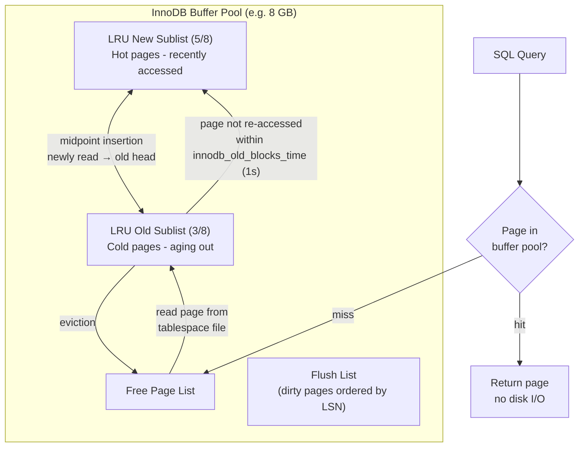

**이중 쓰기 버퍼**: 더티 페이지를 테이블스페이스로 플러시하기 전에 InnoDB는 이를 이중 쓰기 버퍼(2MB, 128페이지)에 순차적으로 씁니다. 이는 충돌 중에 부분 페이지 쓰기(찢어진 페이지)로부터 보호합니다. 페이지 체크섬이 실패하면 복구는 이중 쓰기에서 읽습니다.

---

## 2. B+Tree 인덱스 내부

### 노드 구조 및 분할 알고리즘

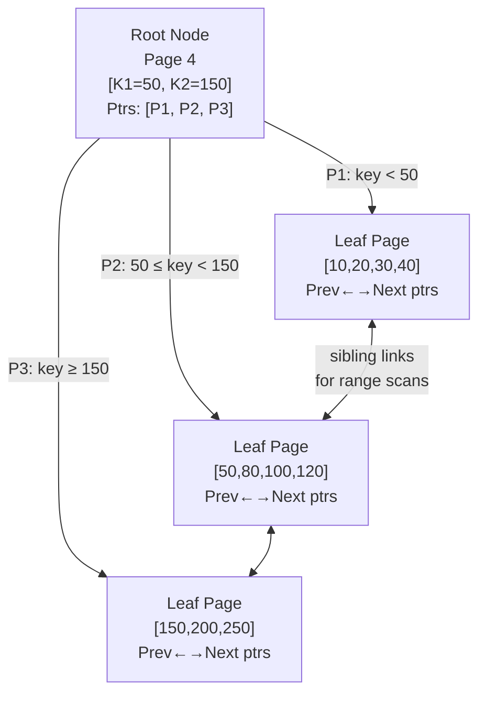

### INSERT 시 페이지 분할

리프 페이지가 용량에 도달하면(업데이트 공간을 남겨두기 위한 채우기 비율 ~69%):

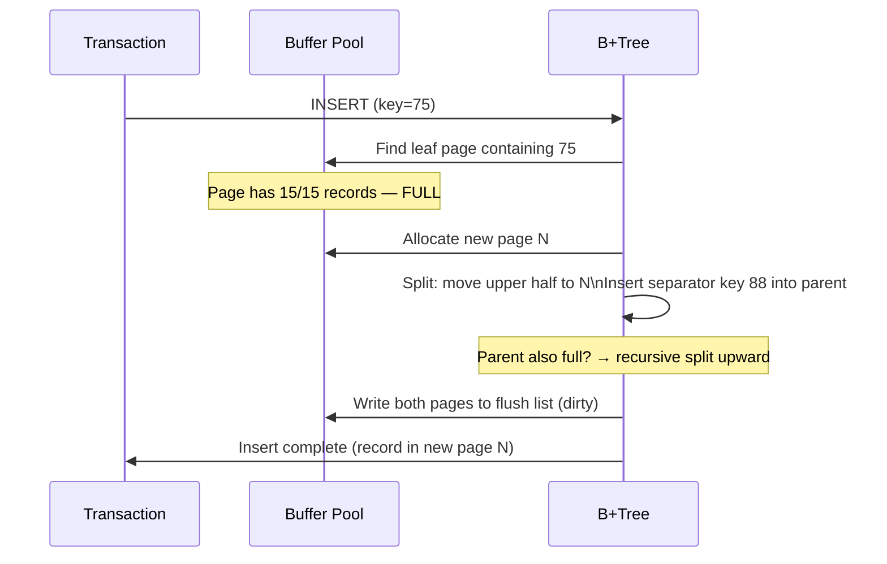

**클러스터형 인덱스**(InnoDB 기본 키): B+Tree 리프에 저장된 전체 행입니다. 물리적 주문 = PK 주문. 조각화는 무작위 PK 삽입 시 발생합니다(UUID PK = 최악의 경우).

**보조 색인**: 리프는 `(secondary_key, primary_key)`을 저장합니다. 포인트 조회: 보조 인덱스 B+Tree → PK 값 → 클러스터형 인덱스 B+Tree(2개의 B+Tree 순회 = "북마크 조회").

### 인덱스 채우기 비율 및 조각화

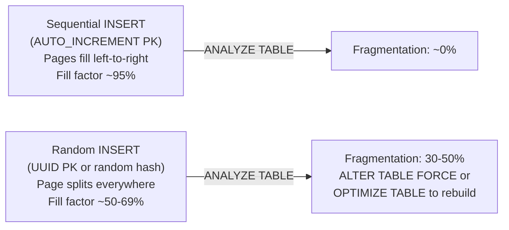

---

## 3. InnoDB MVCC — 실행 취소 로그 체인

MVCC(Multi-Version Concurrency Control)를 사용하면 리더가 작성자를 차단하지 않습니다. 모든 행 버전은 실행 취소 로그를 통해 연결됩니다.

### 행 버전 체인

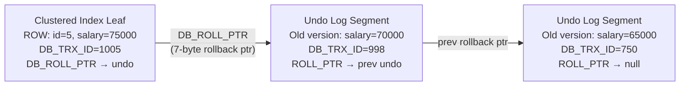

### 읽기 보기 메커니즘

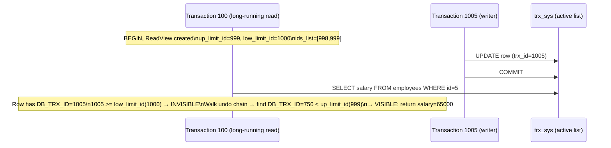

**스레드 제거**: 백그라운드 스레드(`srv_purge_coordinator_thread`)는 활성 ReadView에 로그가 필요하지 않은 경우 실행 취소 로그를 정리합니다. 장기 실행 트랜잭션은 제거를 방지합니다. → 실행 취소 테이블스페이스가 무제한으로 커집니다(전형적인 `ibdata1` 팽창 문제).

---

## 4. 트랜잭션 로그(WAL) 및 충돌 복구

### 미리 쓰기 로깅 프로토콜

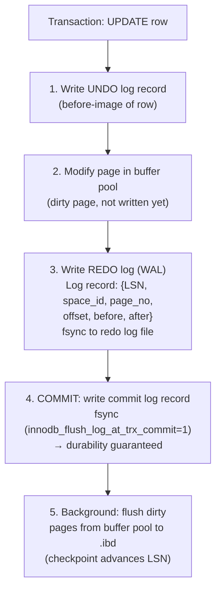

**LSN(Log Sequence Number)**: 리두 로그에 대한 바이트 오프셋을 단조롭게 증가시킵니다. 모든 페이지 헤더는 `FIL_PAGE_LSN` = 마지막 수정 LSN을 저장합니다. `page_LSN < checkpoint_LSN`이 있는 페이지는 내구성이 보장됩니다.

### 충돌 복구 — ARIES 알고리즘

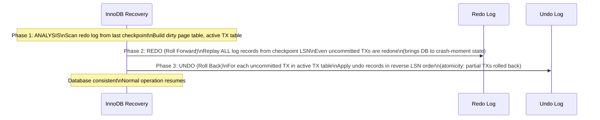

---

## 5. 쿼리 실행 파이프라인

### 쿼리 수명 주기

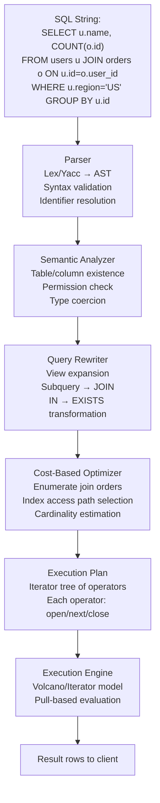

### 비용 기반 최적화 도구 — 지수 선택

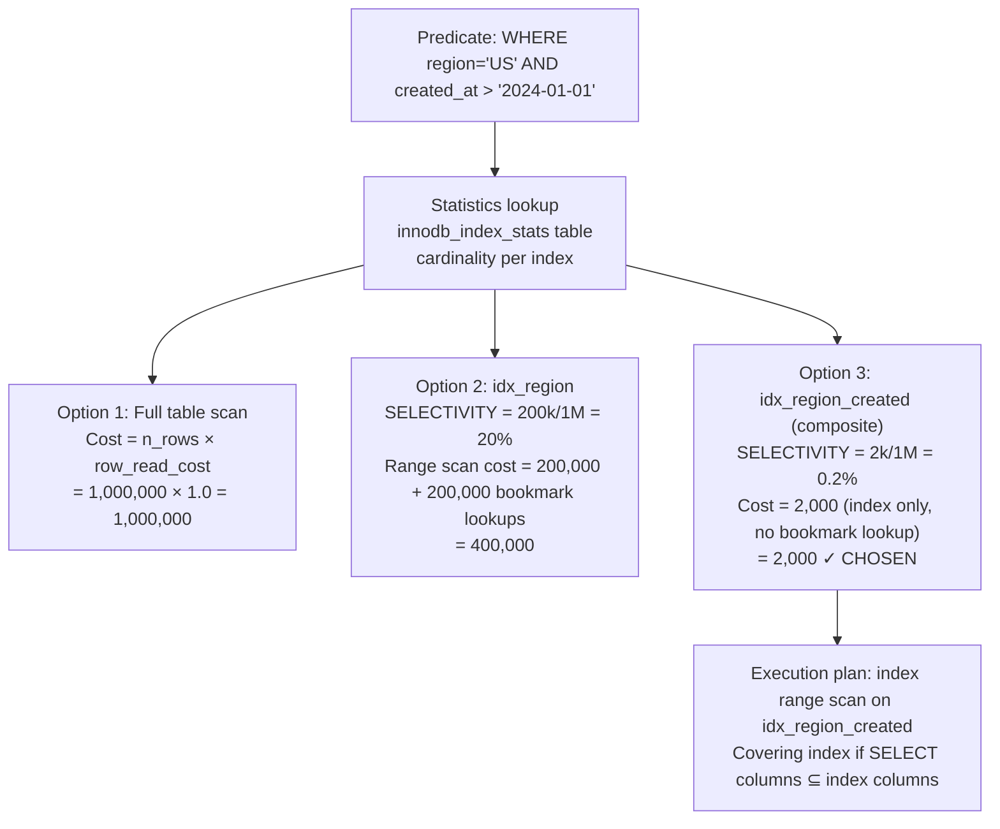

### 화산 반복자 모델

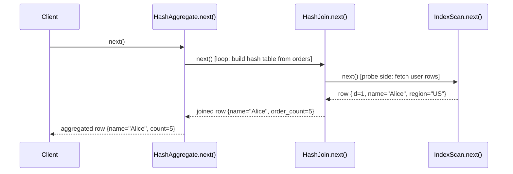

**해시 조인 내부**: 빌드 단계에서는 더 작은 테이블을 메모리 내 해시 테이블(`hash(join_key) → bucket → row`)로 읽습니다. 프로브 단계는 더 큰 테이블을 읽고, 조인 키를 해시하고, 버킷을 프로브합니다. 해시 테이블이 `join_buffer_size`을 초과하면 → 디스크로 유출됩니다(파티션을 통한 그레이스 해시 조인).

---

## 6. SQL Server 저장소 내부(Pro SQL Server 내부)

### 데이터 페이지(8KB)

```
+-------------------+ 0
| Page Header       | 96 bytes: pageID, type, freeCount, slotCount, nextPage, prevPage
+-------------------+
| Row 0             | Variable-length: null bitmap + fixed cols + var-length ptr array + var data
| Row 1             |
| ...               |
| Row N             |
+-------------------+
| Free Space        |
+-------------------+
| Row Offset Array  | 2 bytes per row, grows from bottom
| [N offset]        | slot[i] = byte offset of row i within page
+-------------------+ 8191
```

### 행 구조(가변 길이)

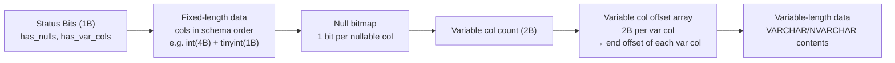

**전달된 레코드**: UPDATE가 행 크기를 페이지 용량 이상으로 늘리면 행이 새 페이지로 이동됩니다. 원래 슬롯은 8바이트 전달 포인터를 갖습니다. 힙 스캔은 전달 포인터를 따르므로 성능이 저하됩니다. 수정: `ALTER TABLE REBUILD`(클러스터형 인덱스)는 전달된 레코드를 제거합니다.

### SQL Server 잠금 계층 구조

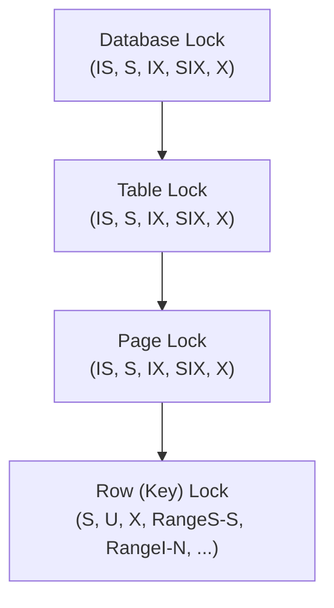

**잠금 에스컬레이션**: SQL Server는 잠금 수가 트랜잭션당 ~5000을 초과하는 경우 메모리 오버헤드를 줄이기 위해 행/페이지 잠금을 테이블 잠금으로 에스컬레이션합니다. 차단을 유발할 수 있습니다. `ALTER TABLE ... SET (LOCK_ESCALATION = DISABLE)`로 비활성화하세요.

**NOLOCK 힌트 / READ UNCOMMITTED**: 공유 잠금을 획득하지 않고 페이지를 읽습니다 → 더티 읽기가 가능합니다(커밋되지 않은 데이터, 팬텀 행, 비행 중에 롤백된 데이터도 확인).

---

## 7. 트랜잭션 격리 수준 및 이상 방지

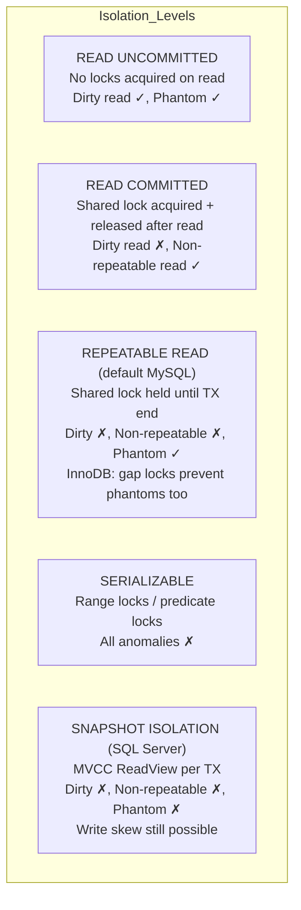

**간격 잠금(InnoDB RR)**: 레코드 앞의 간격을 잠가서 INSERT가 범위에 들어가는 것을 방지합니다. `WHERE id BETWEEN 10 AND 20`인 경우 해당 범위의 모든 간격에 대한 간격 잠금이 동시 INSERT를 방지합니다. 전체 직렬화 가능 격리 없이 팬텀을 제거합니다.

**교착 상태 감지**: 각 잠금 관리자는 "대기 그래프"를 유지합니다. 백그라운드 스레드는 DFS(주기 감지)를 실행합니다. 주기가 발견되면 피해자 선택: 가장 작은 트랜잭션(실행 취소 로그 크기 기준)이 롤백됩니다. `INFORMATION_SCHEMA.INNODB_TRX`에 교착 상태 정보가 기록되었습니다.

---

## 8. 인덱스 유형 및 액세스 패턴

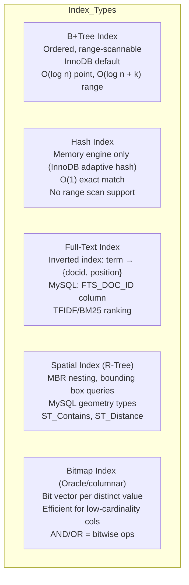

### 커버링 인덱스 - 북마크 조회 제거

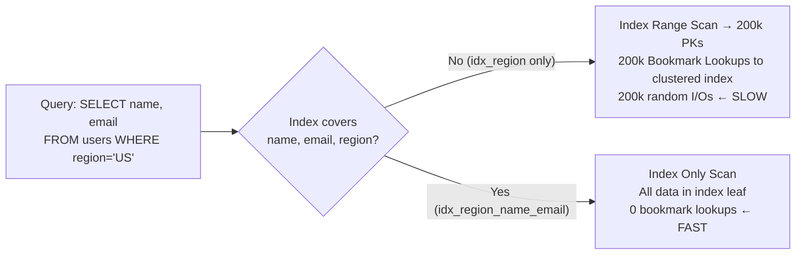

---

## 9. 조인 알고리즘 - 메모리 및 CPU 경로

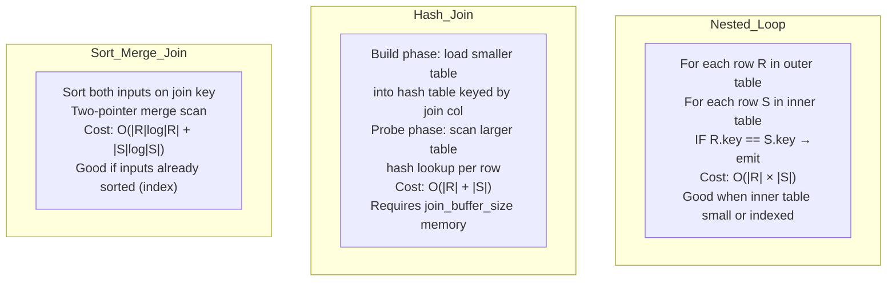

**중첩 루프 차단**(MySQL 8.0 이전): `join_buffer_size` 청크로 외부 테이블을 읽고, 청크당 한 번씩 내부 테이블을 스캔합니다. 내부 테이블 읽기를 `|outer|`에서 `|outer| / buffer_chunk_size`로 줄입니다.

**해시 방지 조인**(NOT IN / NOT EXISTS의 경우): 하위 쿼리 결과에서 해시 세트를 구축합니다. 각 프로브 행에 대해 일치하는 해시가 없는 경우에만 내보냅니다.

---

## 10. 쓰기 경로 - 체크포인트 및 Redo 로그 주기

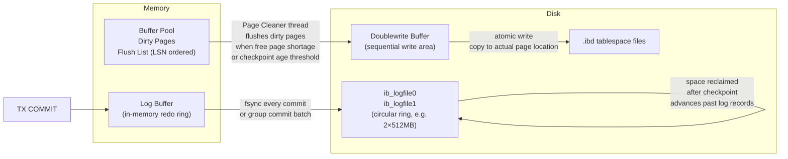

**체크포인트 기간**: `innodb_log_file_size × 2 × 0.75` = 강제 플러시 전 최대 더티 데이터. 리두 로그가 가득 차면(체크포인트 기간 = 로그 크기) 체크포인트가 완료되는 동안 모든 쓰기가 STALL됩니다. 증상: 오류 로그에 "InnoDB: page_cleaner: 1000ms 의도한 루프에 5000ms가 걸렸습니다."

---

## 11. 내부 파티셔닝

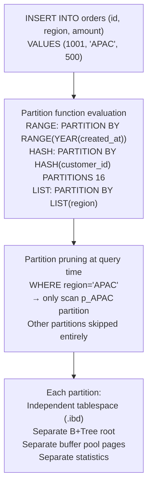

파티션 정리에는 WHERE 절에 **파티션 열의 조건자**가 필요합니다. 정리하지 않으면 모든 파티션이 스캔됩니다. 파티션되지 않은 테이블보다 나쁩니다(내려갈 B+트리 루트가 더 많음). 파티션 키는 모든 고유/기본 키의 일부여야 합니다.

---

## 12. 열 저장소와 행 저장소 내부

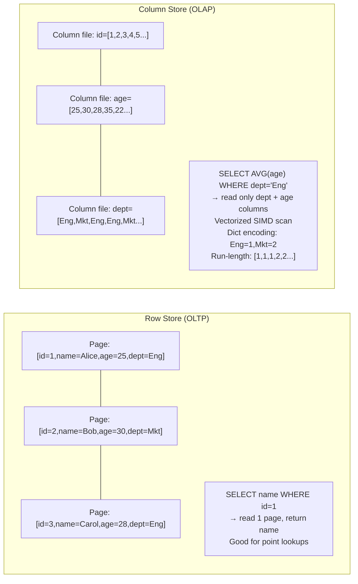

**사전 인코딩**: 문자열 열 값을 정수 코드로 바꿉니다. `dept` 열은 `uint8` 배열, 사전: `{0: "Engineering", 1: "Marketing"}`로 저장됩니다. 카디널리티가 낮은 열의 경우 압축 비율은 10-100x입니다.

**벡터화된 실행**: SIMD(AVX-256: 명령어당 8 × 32비트 연산)를 사용하여 한 번에 1024개 행을 처리합니다. 열형 레이아웃을 사용하면 메모리에 연속된 한 열의 모든 값 → CPU 프리페치가 효율적이며 L1/L2 캐시가 활용됩니다.

---

## 데이터베이스 성능 수치 참조

| 운영 | 이노DB | SQL 서버 | 메모 |
|-----------|--------|------------|-------|
| 버퍼 풀 적중 | ~100ns | ~100ns | DRAM 액세스 |
| NVMe SSD에서 페이지 읽기 | ~50μs | ~50μs | 순차: ~10 µs |
| B+트리포인트 조회(3레벨) | 3 × 50μs = 150μs | 비슷한 | 캐시는 가장 많은 비용을 절약할 수 있습니다 |
| 전체 테이블 스캔(1M 행) | 0.5~5초 | 비슷한 | I/O 대역폭에 따라 다름 |
| 해시 조인(2 × 1M 행) | 1~10초 | 비슷한 | 메모리가 없으면 디스크로 유출 |
| 인덱스 재구축(1억 행) | 10~60분 | 비슷한 | 온라인 재구축: 더 길어짐 |
| 체크포인트 플러시 스톨 | 0~5초 | 0~5초 | 로그 파일 크기를 통해 조정 가능 |
| 행 잠금 획득 | ~1μs | ~1μs | 메모리 내 해시 조회 |
| 교착상태 감지 | ~1ms | ~1ms | DFS 주기 감지 |

---

## 요약 - 데이터 흐름 맵

```mermaid
flowchart TD
    SQL["SQL Query arrives"] --> PARSE["Parse → AST"]
    PARSE --> OPT["Cost-based optimizer\nStatistics → access path"]
    OPT --> EXEC["Iterator execution tree\nVolcano pull model"]
    EXEC --> BP["Buffer Pool lookup\n(page granularity)"]
    BP -->|"miss"| DISK["Disk read\n.ibd page → buffer pool"]
    BP -->|"hit"| ROW["Row extraction\nslot array → row offset\nnull bitmap → field values"]
    ROW -->|"MVCC"| UNDO["Undo chain walk\nReadView visibility check"]
    UNDO --> RESULT["Return row to iterator"]
    
    WRITE["DML: INSERT/UPDATE/DELETE"] --> UNDOW["Write undo log"]
    UNDOW --> MODP["Modify buffer pool page\n(dirty)"]
    MODP --> REDOW["Append redo log record"]
    REDOW --> COMMIT["COMMIT → fsync redo log"]
    COMMIT --> BGFLUSH["Background: page cleaner\nflushes dirty pages"]
```

모든 바이트의 전체 수명 주기: SQL 텍스트 → AST → 비용 추정 계획 → 반복자 풀 → 버퍼 풀 페이지 → MVCC 실행 취소 체인 → 필드 바이트. 쓰기 시: 실행 취소 로그(이미지 전) → 더티 페이지(메모리 내) → 다시 실행 로그(WAL, 내구성) → .ibd로 백그라운드 플러시. WAL 보장은 기반입니다. 실제 데이터 페이지가 디스크에 있는지 여부에 관계없이 다시 실행 로그가 fsync되는 순간 데이터는 내구성이 있습니다.
