# DevOps 및 Linux 내부: 내부

> 합성: comp(36/103-178) DevOps, Linux 관리, CI/CD, 쉘 스크립팅, Ansible, Terraform, 모니터링 및 Wieers *Ansible for DevOps*, Morris *Infrastructure as Code*, Turnbull *The Docker Book*, 모니터링/경고 스택 및 전체 Linux 시스템 관리 커리큘럼을 포함한 인프라 자동화 참조.

---

## 1. Linux Systemd 내부 — 유닛 활성화 그래프

systemd는 최신 Linux에서 PID 1입니다. 종속성 해결 및 소켓 활성화를 통해 서비스 시작을 병렬화하고 순차적 SysV 초기화 스크립트를 대체합니다.

### 단위 의존성 그래프 및 활성화

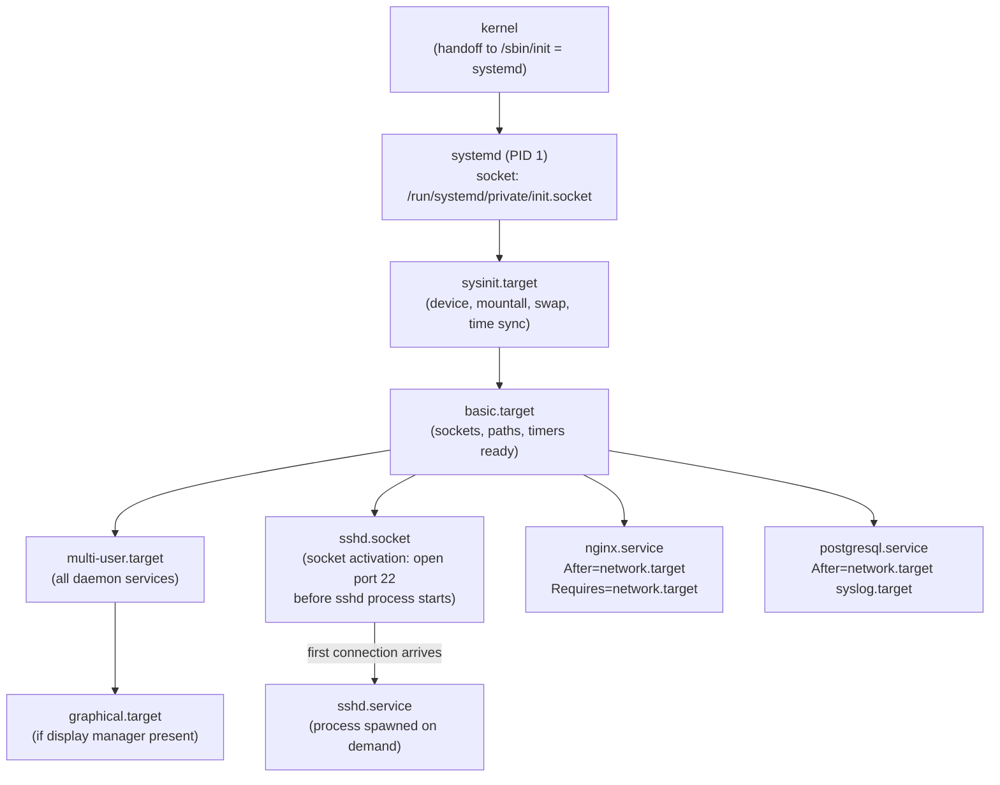

**소켓 활성화**: systemd는 서비스를 시작하기 전에 청취 소켓(`bind()`, `listen()`)을 생성합니다. 서비스는 `SD_LISTEN_FDS`를 통해 미리 열린 파일 설명자를 상속합니다. 서비스가 준비될 때까지 커널 백로그에 연결 대기열이 있습니다. 다시 시작하는 동안 연결이 끊겼습니다.

### Cgroup 통합 — 리소스 제어

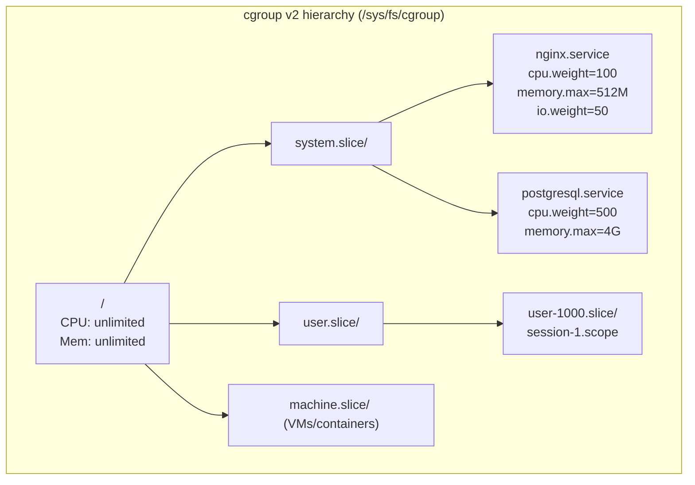

systemd는 각 서비스를 cgroup 슬라이스에 매핑합니다. `systemctl set-property nginx.service CPUQuota=50%` → `50000 100000`을 cgroup의 `cpu.max` 파일에 기록 → 커널 CFS 대역폭 컨트롤러가 할당량을 적용합니다.

---

## 2. Linux 패키지 관리 내부

### RPM/DNF — 거래 처리

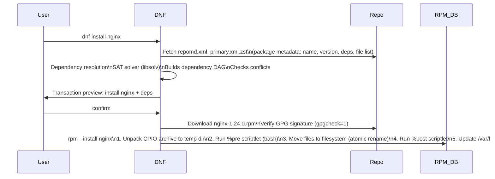

**RPM CPIO 아카이브**: `.rpm` = 리드(매직) + 서명(헤더+페이로드를 통한 MD5/GPG) + 헤더(메타데이터 태그) + 페이로드(CPIO 아카이브, xz/zstd 압축). CPIO의 각 파일에는 경로, 크기, 모드, uid/gid, 체크섬이 있습니다.

### APT/dpkg — 종속성 해결

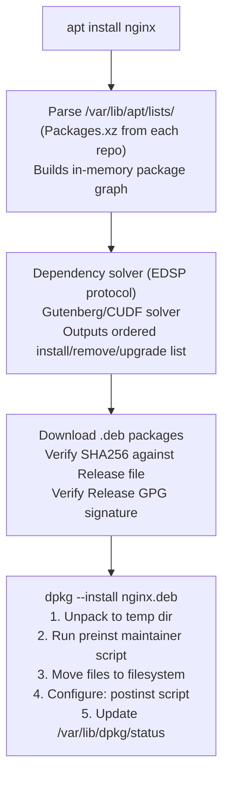

---

## 3. Ansible 내부 — 작업 실행 엔진

### 제어 흐름 및 모듈 실행

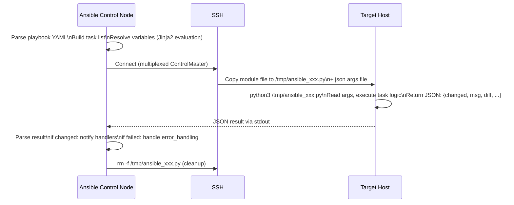

**Mitogen 백엔드**(2-3배 더 빠름): 작업당 Python 스크립트를 복사하는 대신 Mitogen은 SSH를 통해 대상에서 Python 인터프리터를 한 번 포크하고 이를 플레이의 모든 작업에 재사용합니다. 작업당 Python 시작(~50ms) 및 파일 복사 오버헤드를 절약합니다.

**사실 수집**: `setup` 모듈은 `facter`과 유사한 시스템 검사를 실행합니다. `/proc`, `dmidecode`, `ip addr`, `df`, `uname`을 읽고 → JSON 사실 dict를 반환 → `hostvars[hostname]`에 저장됩니다.

### Ansible에서 Jinja2 템플릿 렌더링

```
Variable precedence (lowest to highest):
role defaults → inventory file vars → inventory group_vars → inventory host_vars
→ playbook group_vars → playbook host_vars → host facts
→ play vars → task vars → extra vars (-e) → registered vars
```

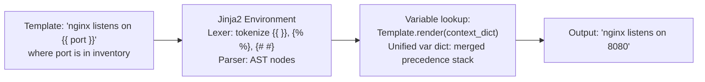

---

## 4. Terraform 상태 및 계획 내부

### 코드형 인프라 — 상태 머신

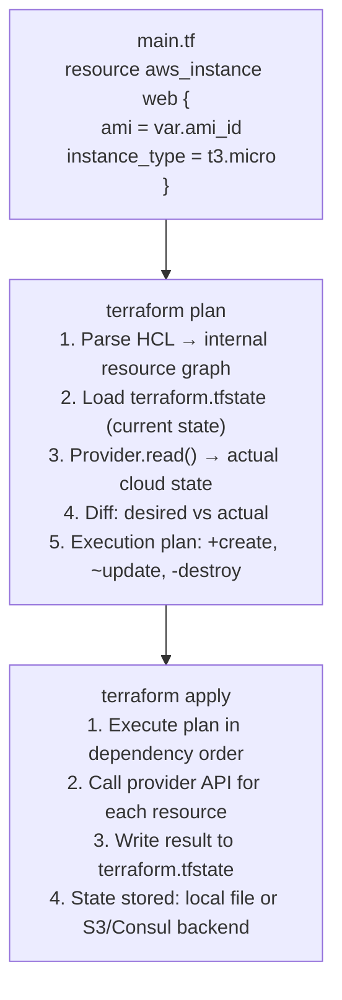

**상태 잠금**: S3 백엔드는 분산 잠금을 위해 DynamoDB 테이블을 사용합니다. `terraform apply`은 잠금을 획득 → 실행 → 해제합니다. 동일한 인프라에 대한 동시 적용을 방지합니다(분할 브레인 위험).

**리소스 그래프**: `depends_on` + 암시적 참조를 통해 종속성이 해결되었습니다. `aws_db_instance.db` 참조 `aws_vpc_subnet.private.id` → DB 이전에 서브넷이 생성되어야 합니다. Terraform은 독립적인 리소스 작업을 병렬화합니다.

---

## 5. CI/CD 파이프라인 내부

### Jenkins 파이프라인 실행 모델

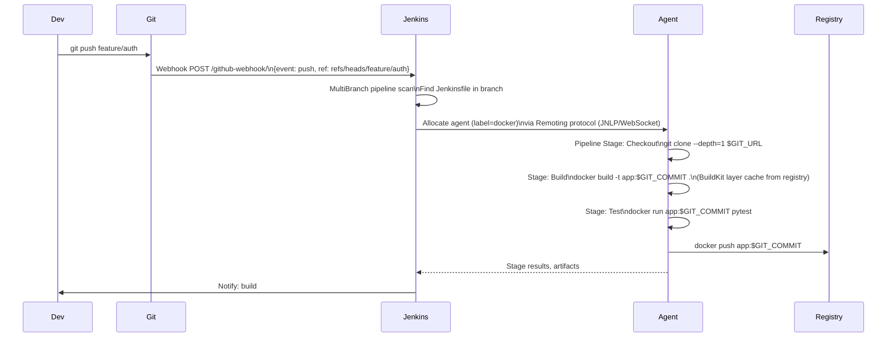

**선언적 파이프라인 YAML → Groovy**: Jenkins DSL이 Groovy 스크립트로 구문 분석되었습니다. `pipeline {}`, `stages {}`, `steps {}`는 `WorkflowScript`에 대한 메서드 호출입니다. 각 단계는 에이전트 작업 영역 디렉터리에서 실행됩니다. 단계별로 범위가 지정된 환경 변수입니다.

---

## 6. Linux 프로세스 및 신호 내부

### fork()/exec() 구현 세부 사항

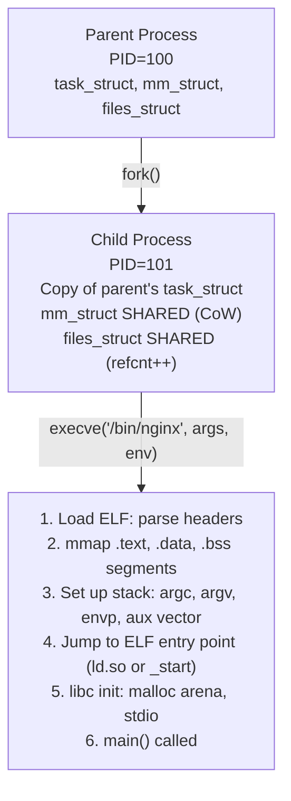

**CoW(기록 시 복사)**: fork() 이후 상위 및 하위 모두 동일한 물리적 페이지를 공유합니다(읽기 전용으로 표시됨). 공유 페이지에 처음 쓸 때: 페이지 오류 → 커널이 새 페이지를 할당하고, 콘텐츠를 복사하고, 쓰기 프로세스를 위해 PTE를 다시 매핑합니다. 실제로 수정된 페이지만 복제됩니다.

### 신호 전달

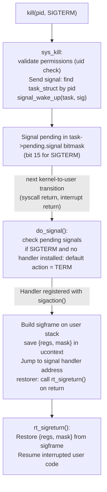

**신호 마스크**: `sigprocmask(SIG_BLOCK, &set, NULL)`은 `task->blocked` 비트마스크를 설정합니다. `task->blocked`에 보류 중인 신호는 차단이 해제될 때까지 연기됩니다. `SIGKILL` 및 `SIGSTOP`은(는) 차단하거나 잡을 수 없습니다.

---

## 7. Linux 셸 내부 — Bash 실행

### 명령 구문 분석 및 확장 순서

```mermaid
flowchart TD
    A["Input: echo \"Hello $USER, $(date)\" > /tmp/out.txt"]
    A --> B["Tokenization:\nReserved words, operators, words\nQuote removal context tracking"]
    B --> C["Parsing: command tree\n{simple_cmd echo, args [...], redirect stdout}"]
    C --> D["Expansion (in order):\n1. Brace expansion: {a,b}c → ac bc\n2. Tilde: ~/foo → /home/user/foo\n3. Parameter: $USER → 'alice'\n4. Command subst: $(date) → fork+exec date\n5. Arithmetic: $((1+2)) → 3\n6. Word splitting on IFS=\\t\\n (after unquoted expansions)\n7. Glob/pathname: *.txt → file list\n8. Quote removal: strip remaining quotes"]
    D --> E["Execute: fork()+execve('echo', args)\nRedirect: open('/tmp/out.txt', O_WRONLY|O_CREAT|O_TRUNC)\ndup2(fd, STDOUT_FILENO)\nexecve('echo', ['echo', 'Hello alice, Thu Feb ...'], envp)"]
```

**파이프 내부**: `cmd1 | cmd2` → `pipe(fds)` → 두 하위 항목 포크 → 하위 1: `dup2(fds[1], 1)`(쓰기 종료 → 표준 출력) → `execve(cmd1)` → 하위 2: `dup2(fds[0], 0)`(읽기 종료 → 표준 입력) → `execve(cmd2)`. 커널 파이프 버퍼: 64KB(`fcntl(fd, F_SETPIPE_SZ, n)`을 통해 조정 가능)

---

## 8. Linux 모니터링 스택 - Prometheus/Grafana 내부

### 측정항목 수집 아키텍처

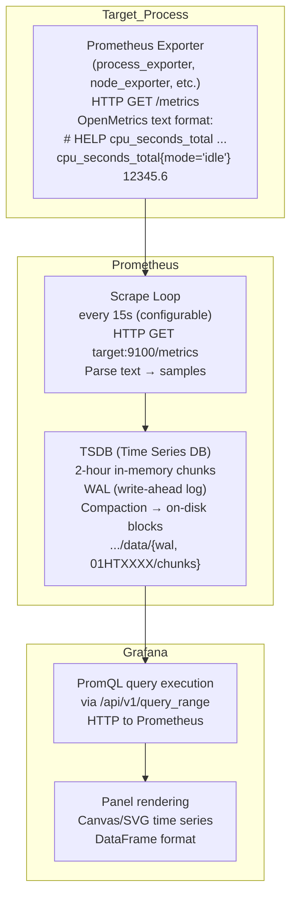

### TSDB 청크 형식

```
Chunk (2-hour window for one time series):
Header: encoding=XOR_FLOAT64, num_samples
Sample 0: t0=unix_ms, v0=float64 (raw)
Sample 1: Δt1=(t1-t0), Δv using XOR delta-of-delta encoding
...
Compression: typically 1.37 bytes/sample vs 16 bytes raw
```

**XOR 델타 인코딩**(Gorilla 압축): 첫 번째 샘플: 전체 64비트 부동 소수점. 후속 샘플: 이전 값과 XOR. XOR=0(동일한 값)인 경우: 1비트. 그렇지 않은 경우: 제어 비트 + XOR 유효 비트. 천천히 변화하는 측정항목에 대해 10~100배 압축을 달성합니다.

---

## 9. 로그 파이프라인 내부 — Fluentd/ELK 스택

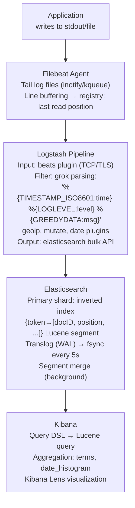

**Logstash grok**: 명명된 정규식 패턴입니다. `%{TIMESTAMP_ISO8601:time}`은 복잡한 날짜/시간 정규식으로 확장됩니다. Java 패턴으로 컴파일되었습니다. 일치 → 명명된 그룹 추출 → 이벤트 맵에 추가 → 다음 필터로 전달합니다.

---

## 10. 인프라 자동화 — 패커 및 불변 이미지

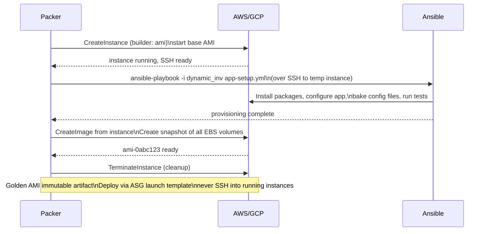

**불변 인프라**: 모든 종속성과 함께 AMI가 한 번만 구워졌습니다. Auto Scaling 그룹은 AMI에서 인스턴스를 시작합니다. 배포 시: 새 AMI → 시작 템플릿 업데이트 → 롤링 교체(이전 인스턴스가 종료되고 새로 시작됨). 구성 드리프트가 없으며 배포가 재현 가능합니다.

---

## 11. Linux 성능 분석 - 성능 및 eBPF

### 성능 샘플링 내부

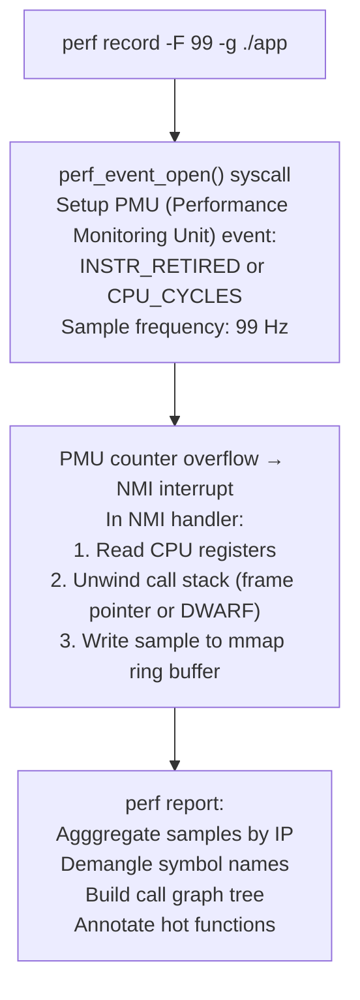

### eBPF — 모듈 없는 커널 확장

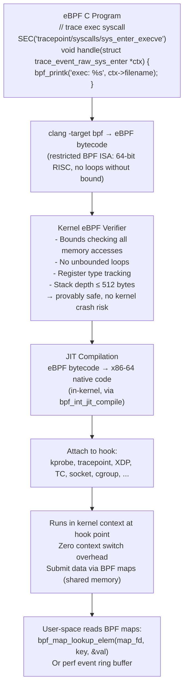

**XDP(eXpress Data Path)**: SK_BUFF 할당 전 NIC 드라이버의 수신 기능에 연결된 eBPF 프로그램입니다. 회선 속도(100GbE에서 최대 140Mpps)로 패킷을 삭제/리디렉션/통과할 수 있습니다. DDoS 완화, 로드 밸런싱(Cloudflare, Facebook)에 사용됩니다.

---

## 12. 컨테이너 런타임 - runc 및 OCI 내부

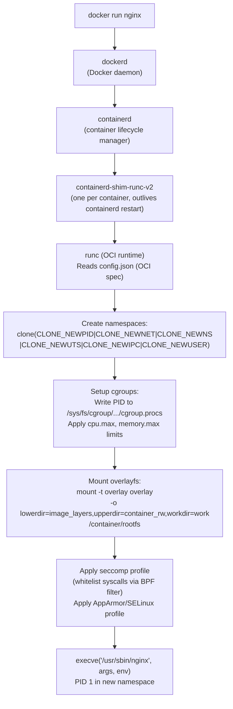

**overlayfs 쓰기 경로**: 컨테이너 파일 시스템에 대한 모든 쓰기 → 쓰기는 `upperdir`에만 적용됩니다. `lowerdir`의 원본 이미지 레이어는 수정되지 않았습니다. `diff`: upperdir을 아무것도 아닌 것과 비교합니다 = 컨테이너별 변경 사항만 비교합니다. 이를 통해 효율적인 레이어 캐싱(동일한 이미지를 사용하여 모든 컨테이너에서 공유되는 기본 레이어)이 가능합니다.

---

## DevOps 성능 수치 참조

| 운영 | 시간 | 메모 |
|-----------|------|-------|
| systemd 장치 시작(비어 있음) | ~50-200ms | 프로세스 생성 + D-Bus 알림 |
| Ansible 작업(SSH + Python) | ~500ms-2s | 작업별 오버헤드 |
| Ansible 작업(Mitogen) | ~50-200ms | 지속적인 Python 연결 |
| Terraform 계획(100개 리소스) | 5~30초 | 공급자 API 호출 |
| Docker 이미지 빌드(레이어 캐시) | ~1~5초 | 변경된 레이어만 다시 작성됨 |
| Docker 이미지 빌드(콜드) | 30초~5분 | 전체 종속성 설치 |
| 컨테이너 시작(콜드 이미지 풀) | 10~60초 | 이미지 레이어 다운로드 |
| 컨테이너 시작(캐시됨) | ~0.5-2초 | overlayfs 설정 + execve |
| eBPF 프로그램 로드+확인 | ~1~100ms | 검증기 복잡성 |
| 성능 기록 오버헤드 | ~1-5% CPU | 99Hz 샘플링 |
| 프로메테우스 긁힌 | ~1-10ms | HTTP + 텍스트 구문 분석 |
| Elasticsearch 인덱스 쓰기 | ~1~50ms | Translog + 세그먼트 쓰기 |
| 젠킨스 파이프라인 시작 | ~2-10초 | 에이전트 할당 + 작업 공간 설정 |
