# 분산 시스템 내부: 합의, 내결함성 및 데이터 일관성

> 내부적으로: 분산 시스템이 신뢰할 수 없는 네트워크 전반에서 합의를 달성하고, 오류를 허용하고, 일관성을 유지하는 방법(정확한 데이터 흐름, 메시지 프로토콜, 상태 시스템 및 수학적 보장).

---

## 1. 근본적인 문제: 부분적인 실패

구성 요소가 원자적으로 실패(충돌 = 중지)되는 단일 시스템과 달리 분산 시스템은 **부분 오류**를 경험합니다. 즉, 일부 노드는 작동하고 일부는 작동하지 않으며, 네트워크 파티션이 구성 요소를 분할하고, 메시지가 순서에 맞지 않게 도착하거나 전혀 도착하지 않습니다.

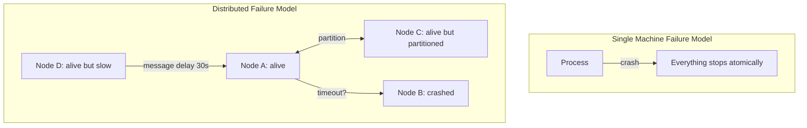

과제: **노드 A의 관점에서 보면 노드 B 충돌은 매우 느리게 응답하는 노드 B와 구별할 수 없습니다.** 시간 초과는 유일한 감지 메커니즘이지만 최대 메시지 지연을 알지 못하면 올바른 시간 초과를 선택하는 것은 불가능합니다.

### 두 장군 문제(불가능)

어떤 프로토콜도 두 당사자가 신뢰할 수 없는 채널을 통해 합의에 도달한다고 보장할 수 없습니다. 이는 **입증된 불가능**입니다. 모든 확인 메시지 자체에는 무한한 확인이 필요합니다.

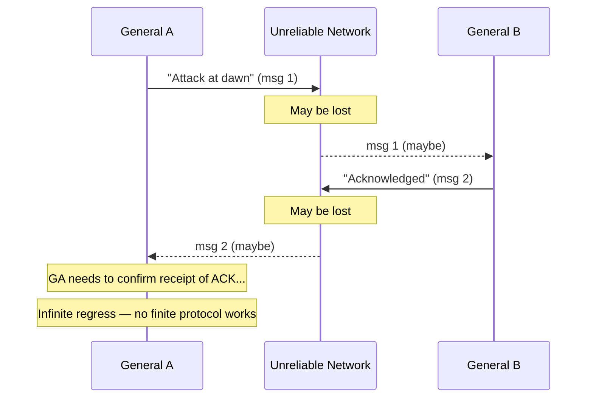

---

## 2. CAP 정리: 희생해야 하는 것

Brewer의 CAP 정리(Gilbert & Lynch에 의해 공식적으로 입증됨): 분산 시스템은 다음 세 가지를 동시에 보장할 수 없습니다.
- **C** — 일관성: 모든 읽기에는 가장 최근 쓰기가 표시됩니다.
- **A** — 가용성: 모든 요청은 응답을 받습니다.
- **P** — 파티션 허용 오차: 네트워크 분할에도 불구하고 시스템이 작동합니다.

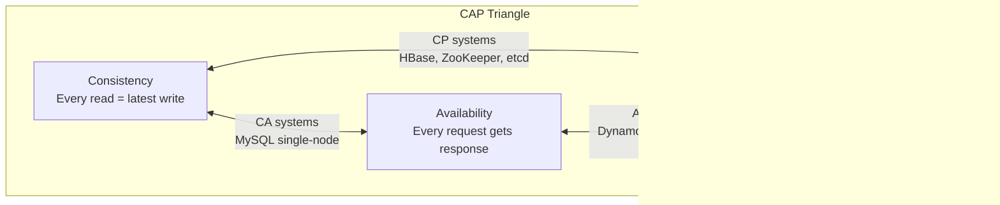

**실제로 P가 협상 불가능한 이유**: 네트워크 파티션이 발생합니다. 당신은 그들을 용인해야합니다. 파티션이 발생할 때 실제 선택은 **CP 대 AP**입니다.

- **CP**: 파티션이 복구될 때까지 쓰기 거부(오류 반환) → 일관성은 있지만 사용할 수 없음
- **AP**: 파티션 양쪽에서 쓰기 허용 → 사용 가능하지만 서로 다른 상태

---

## 3. 합의: Paxos 내부 역학

Paxos는 노드 장애에도 불구하고 합의(단일 값에 대한 합의)를 달성합니다. 세 가지 역할: **제안자**, **수락자**, **학습자**.

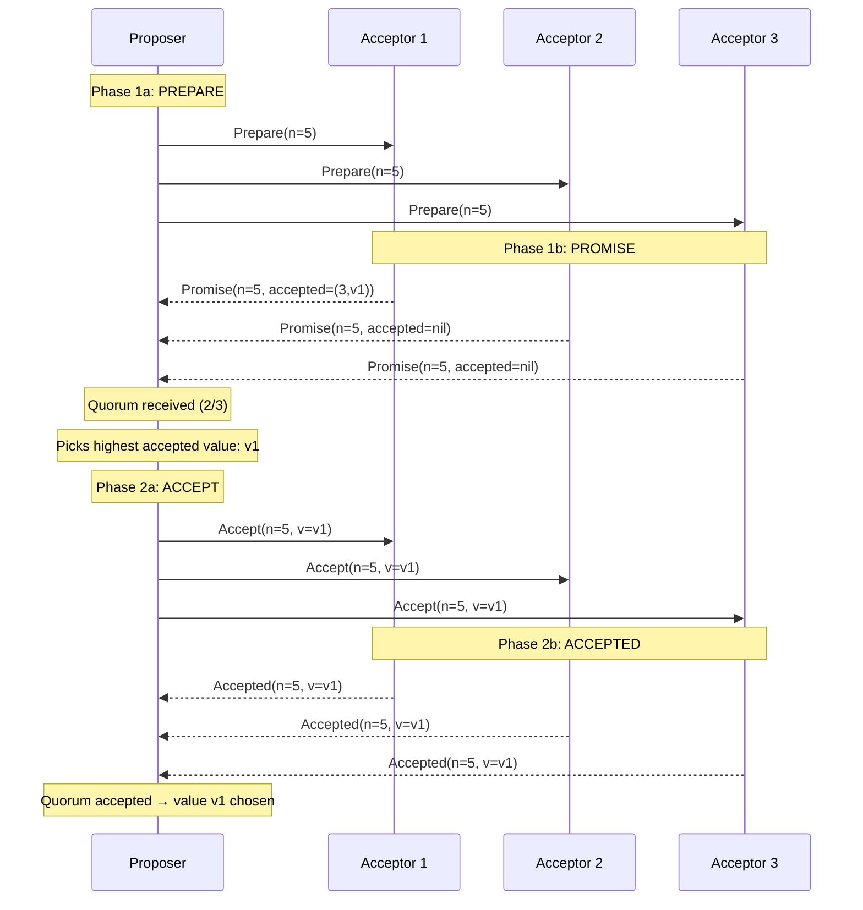

### Paxos 투표용지 번호 불변

각 Acceptor는 `(maxPromised, acceptedBallot, acceptedValue)`을 저장합니다. 불변성:
- 수락자는 **결코** 투표용지에 대해 약속하지 않음 ≤ 해당 maxPromised
- 수락자는 **절대** 투표용지를 수락하지 않습니다. ≤ maxPromised
- 이전 라운드에서 어떤 값이 승인된 경우 제안자는 **반드시** 해당 값을 제안해야 합니다.

이를 통해 쿼럼에서 값이 선택되면 향후 Paxos 라운드에서 다른 값을 선택할 수 없습니다.

---

## 4. 뗏목: 이해할 수 있는 합의

Raft는 합의를 리더 선택, 로그 복제, 안전이라는 세 가지 하위 문제로 분해합니다.

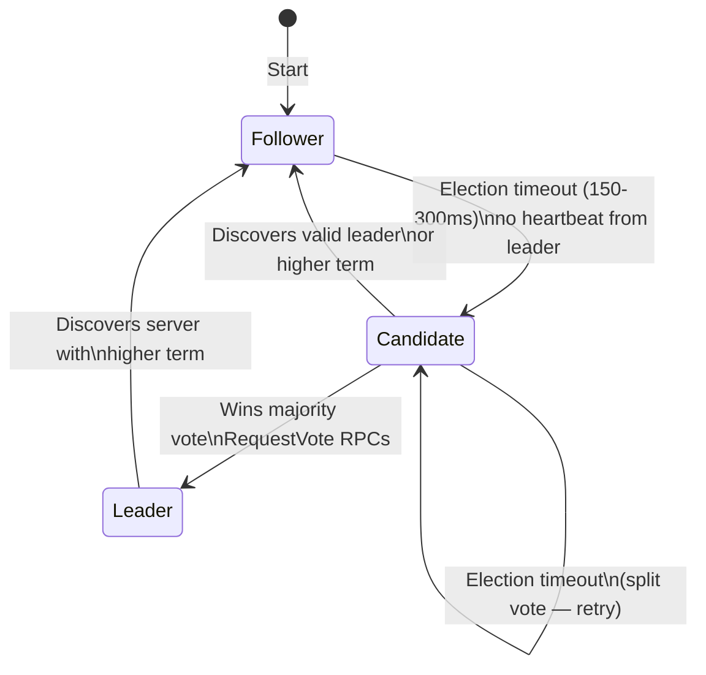

### Raft 로그 복제 내부 흐름

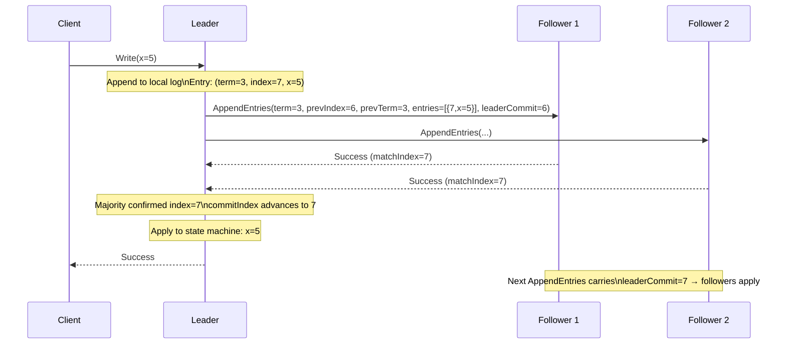

### 뗏목 안전: 로그 일치 속성

Raft를 안전하게 만드는 두 가지 불변성:
1. **선거 안전**: 임기당 최대 1명의 지도자
2. **로그 일치**: 두 개의 로그에 동일한 항목(색인, 용어)이 포함된 경우 이전 항목은 모두 동일합니다.

AppendEntries의 **prevIndex/prevTerm** 검사는 로그 일치를 시행합니다. 팔로어는 prevIndex에 prevTerm과 일치하는 항목이 없는 경우 거부합니다.

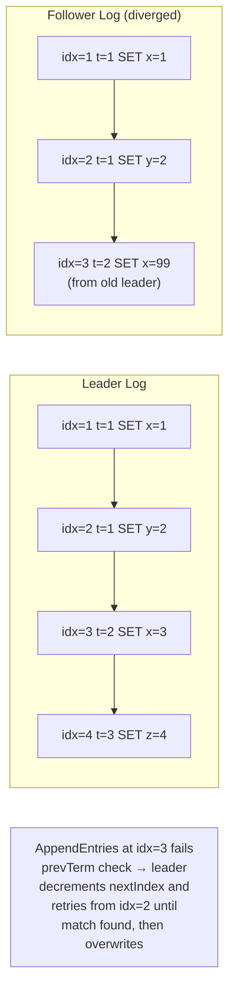

---

## 5. 분산 트랜잭션: 2단계 커밋(2PC)

2PC는 여러 노드(샤드/데이터베이스)에 걸쳐 원자적 커밋을 조정합니다.

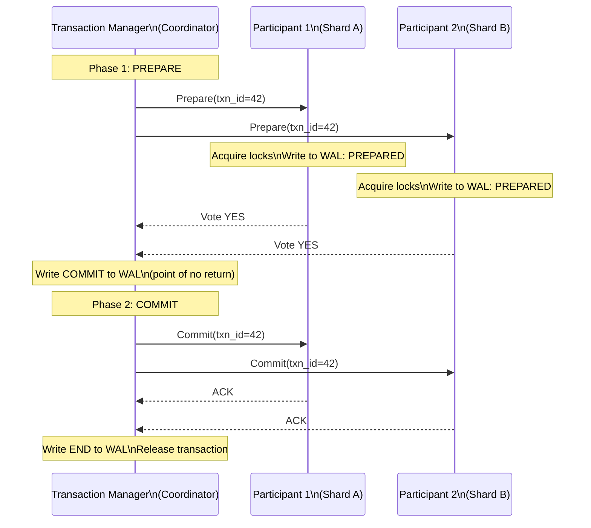

### 2PC 장애 시나리오 및 WAL 복구

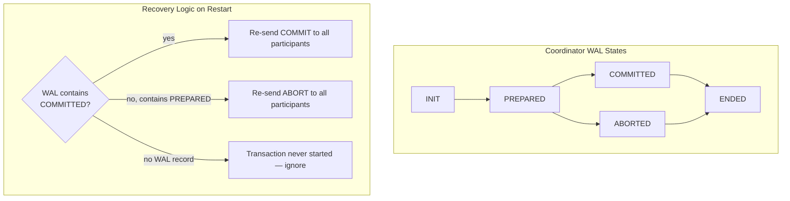

**2PC의 아킬레스 건 — 차단**: COMMIT를 작성한 후 참가자에게 보내기 전에 코디네이터가 충돌하는 경우 참가자는 **무기한 차단**됩니다. 즉, 잠금을 유지하지만 코디네이터의 결정 없이는 커밋하거나 중단할 수 없습니다. **3PC**(3단계 커밋)는 차단을 줄이기 위해 사전 커밋 단계를 추가하지만 네트워크 파티션에서 이를 제거하지는 않습니다.

---

## 6. MVCC: 다중 버전 동시성 제어 내부

MVCC(PostgreSQL, MySQL InnoDB, CockroachDB에서 사용)는 각 행의 여러 버전을 유지 관리하여 판독기와 기록기가 서로를 차단하지 않도록 합니다.

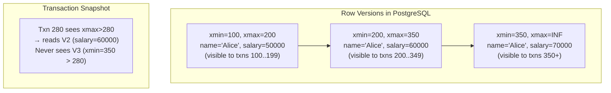

### MVCC 읽기 경로

각 트랜잭션은 시작 시 **스냅샷**을 받습니다: `(xmin, xmax, active_xids[])`. 다음과 같은 경우 행 버전이 표시됩니다.
- `row.xmin <= snapshot.xmax`(스냅샷 이전에 생성됨)
- `row.xmin`이(가) `active_xids[]`에 없음(작성자가 커밋됨)
- `row.xmax > snapshot.xmin` 또는 `row.xmax`은(는) `active_xids[]`에 있습니다(아직 삭제되지 않음).

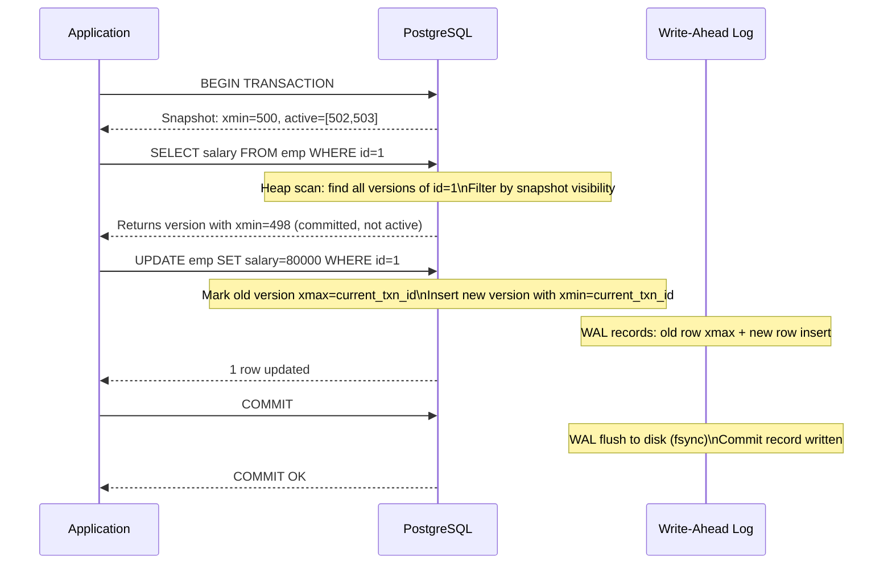

---

## 7. 벡터 클럭 및 인과관계 추적

벡터 클록은 동기화된 클록 없이도 분산 시스템에서 **이전에 발생한 일** 관계를 추적합니다.

```mermaid
flowchart LR
    subgraph "Node A"
        A1["A:[1,0,0]\nWrite x=1"]
        A2["A:[2,0,0]\nSend msg to B"]
        A3["A:[3,2,0]\nReceive from B\nmerge: max([2],[1,2,0])=[3,2,0]"]
    end
    subgraph "Node B"
        B1["B:[1,1,0]\nReceive from A\nA's clock:[2,0,0] → merge=[2,1,0]"]
        B2["B:[2,2,0]\nWrite y=5"]
        B3["B:[3,3,0]\nSend msg to A"]
    end
    A2 -->|send [2,0,0]| B1
    B3 -->|send [3,3,0]| A3
```

**충돌 감지**: 벡터 클록이 다른 벡터 클록을 지배하지 않는 경우 두 이벤트가 동시에 발생합니다(다른 이벤트보다 먼저 발생하지 않음).
- `A=[2,1,0]` 대 `B=[1,2,0]` → 동시 → 충돌 → 병합 필요

**DynamoDB**는 벡터 시계("버전 벡터"라고 함)를 사용하여 쓰기 충돌을 감지하고 해결을 위해 충돌하는 여러 버전을 애플리케이션에 반환합니다.

---

## 8. 일관된 해싱 및 분산 해시 테이블

일관된 해싱은 노드 가입/탈퇴 시 키 재매핑을 최소화합니다. 링은 동일한 해시 함수를 사용하여 키와 노드를 모두 `[0, 2^32)`에 매핑합니다.

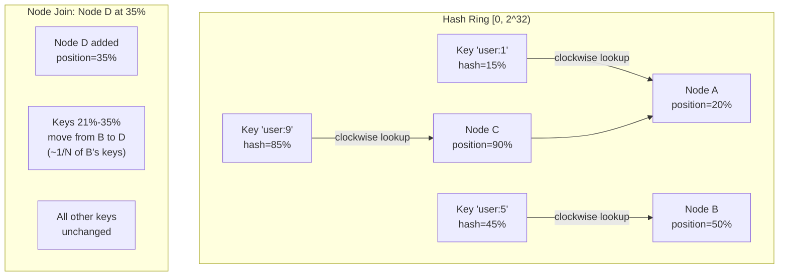

### 로드 밸런싱을 위한 가상 노드

단일 노드는 링에서 여러 위치를 얻습니다(가상 노드/vnode):

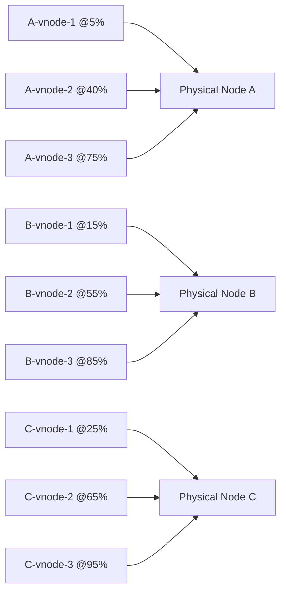

물리적 노드당 vnode가 150개인 경우 로드 불균형은 통계적으로 10% 미만입니다.

---

## 9. 최종 일관성 및 CRDT

**CRDT(충돌 없는 복제 데이터 유형)**은 복제본이 조정 없이 분기 및 병합되도록 허용하여 수학적 구성을 통한 최종 수렴을 보장합니다.

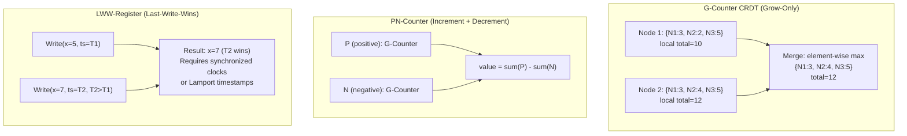

### OR-Set(관찰-제거 세트) 내부

단순한 추가/제거 세트에는 "승리 제거"와 "승 추가"가 모호합니다. OR-Set 태그는 각각 고유한 ID로 추가됩니다.

```
add("a") → {("a", uid1)}
add("a") → {("a", uid1), ("a", uid2)}
remove("a") → removes all observed uid pairs for "a"
concurrent add("a") after remove → uid3 survives (not in remove set)
```

---

## 10. 분산 추적: 범위 전파 내부

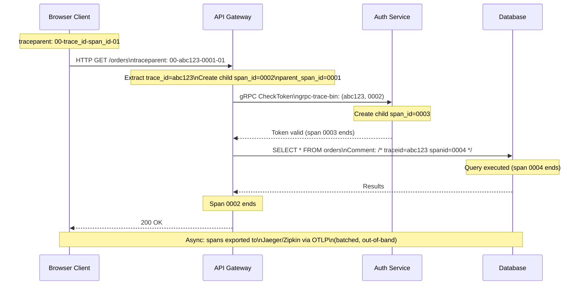

**샘플링 결정 전파**: `traceparent` 플래그 바이트는 샘플링 결정을 인코딩합니다. 루트 범위가 샘플링(확률적, 1%)을 결정하면 모든 다운스트림 서비스는 해당 결정을 **상속**합니다. 이렇게 하면 부분 추적이 아닌 완전한 추적이 보장됩니다.

---

## 11. 가십 프로토콜: 전염병 정보 유포

Gossip(Cassandra, Consul, Redis Cluster에서 사용)은 O(log N) 라운드로 정보를 퍼뜨립니다.

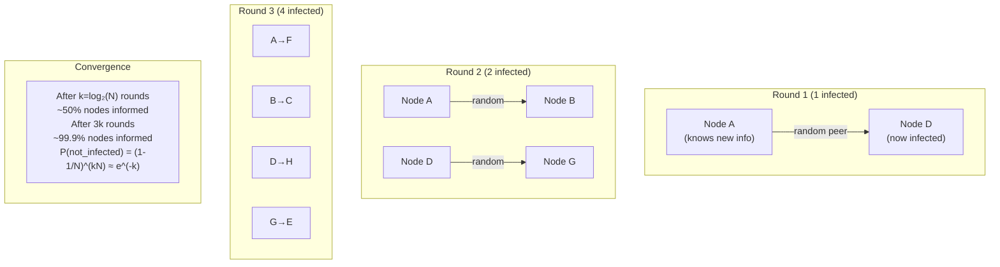

### Phi 발생 실패 감지기(Cassandra)

바이너리 활성/비활성 대신 phi 오류 감지기는 하트비트의 도착 간 시간을 기반으로 **의심 수준 ψ**을 출력합니다.

```
φ(t) = -log₁₀(P_later(t - t_last))
```

여기서 `P_later`은(는) 과거 도착 간 시간의 가우스 모델을 고려하여 `t` 시간 이후에 다음 하트비트가 도착할 확률입니다. Φ=1 → 90% 실패 신뢰도. Φ=8 → 99.999999%.

---

## 12. 선형성 vs 직렬성

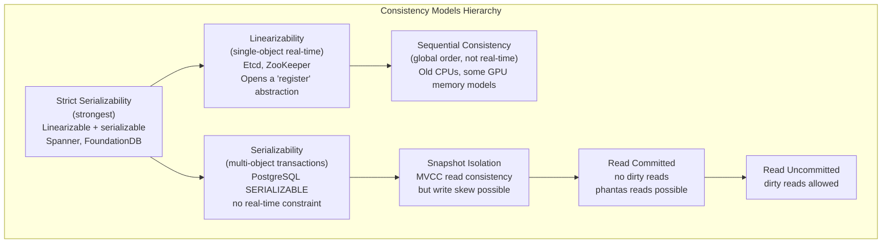

**쓰기 왜곡 예(SI 허용, 직렬화 방지)**:
- Txn A는 "2명의 의사가 통화 중"이라고 읽습니다. → 한 명은 통화를 중단할 수 있다고 결정합니다.
- Txn B는 "2명의 의사가 통화 중"이라고 읽습니다. → 한 명은 통화를 중단할 수 있다고 결정합니다.  
- 둘 다 커밋 → 통화 중인 의사 0명(불변 위반)
- SI에서: 두 가지 모두 통과(각각 상대방이 쓰기 전에 일관된 스냅샷을 읽음)
- 직렬화 가능: 하나가 중단됨(직렬화 충돌이 감지됨)

---

## 13. Google Spanner: TrueTime 및 외부 일관성

Spanner는 제한된 시간 불확실성을 제공하는 GPS + 원자 시계 하드웨어를 사용하여 **외부 일관성**(전 세계적으로 엄격한 직렬화 가능성)을 달성합니다.

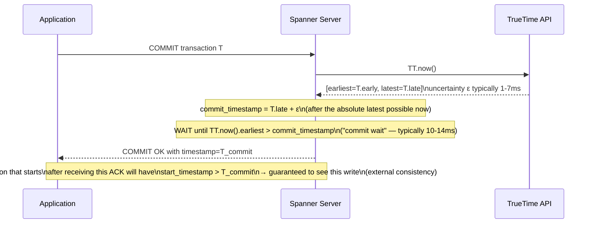

**커밋 대기**는 외부 일관성의 대가입니다. Spanner는 현재 커밋 이전의 타임스탬프로 향후 트랜잭션이 시작되지 않도록 TrueTime 불확실성 간격으로 COMMIT 확인을 의도적으로 지연합니다.

---

## 14. 파티션 복구: 머클 트리를 이용한 안티엔트로피

네트워크 파티션이 복구된 후 복제본은 분산된 데이터를 조정해야 합니다. 머클 트리는 이를 효율적으로 만듭니다.

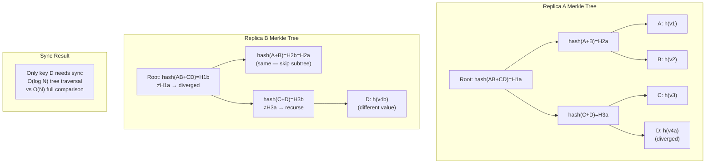

Cassandra는 **수리** 작업에 Merkle 트리를 사용합니다. 각 노드는 토큰 범위의 머클 트리를 구축합니다. 트리 비교는 조정이 필요한 분기된 리프 노드(개별 키 또는 키 범위)를 식별합니다.

---

## 15. 분산 잠금 서비스: Chubby/etcd 내부

```mermaid
sequenceDiagram
    participant C1 as Client 1
    participant C2 as Client 2
    participant E as etcd Cluster
    participant L as Lease Manager

    Note over C1: Acquire distributed lock
    C1->>E: PUT /locks/resource-x\nvalue=client1-id\nLease TTL=10s (CreateLease first)
    Note over E: Raft consensus: replicate to majority
    E-->>C1: OK, lease_id=42, revision=100

    C2->>E: PUT /locks/resource-x (try)
    Note over E: Key already exists
    E-->>C2: Key exists — watch for DELETE

    Note over C1: C1 must keepalive lease
    loop every 5s
        C1->>E: LeaseKeepAlive(lease_id=42)
        E-->>C1: TTL renewed
    end

    Note over C1: C1 crashes (no more keepalive)
    Note over E: Lease 42 expires after 10s\nKey /locks/resource-x deleted
    E-->>C2: Watch event: DELETE revision=101
    C2->>E: PUT /locks/resource-x\nvalue=client2-id, new lease
    E-->>C2: OK — lock acquired
```

**펜싱 토큰**: 개정 번호(100, 101...)는 **펜싱 토큰**이며 단조롭게 증가합니다. C1은 모든 다운스트림 작업에서 개정 100을 사용합니다. 잠금이 만료되고 C2가 수정 버전 101을 받으면 수정 버전 101을 본 후 수정 버전 100이 포함된 C1 요청을 본 모든 다운스트림 서비스는 **거부**합니다(오래된 요청 감지).

---

## 요약: 주요 분산 시스템 속성

| 부동산 | 메커니즘 | 비용 |
|---|---|---|
| 합의 | Paxos/Raft(쿼럼 쓰기) | 읽기용 RTT 1개, 쓰기용 RTT 2개 |
| 외부 일관성 | TrueTime 커밋 대기 | 10~14ms 지연 시간 바닥 |
| 최종 일관성 | CRDT 병합/가십 | 조정 없음, 충돌 가능 |
| 분산형 트랜잭션 | 2PC 코디네이터 | 코디네이터 실패 시 차단 |
| 인과관계 추적 | 벡터 시계 | O(N) 시계 크기 |
| 결함 감지 | 피 발생/심장박동 | 느린 네트워크의 거짓 긍정 위험 |
| 파티션 수리 | 머클 트리 반엔트로피 | 트리 계산을 위한 백그라운드 CPU/IO |
| 분산 잠금 | etcd 임대 + 펜싱 | 충돌 시 임대 만료 대기 시간 |
