# Docker 및 Kubernetes 내부: 내부

> 소스 합성: Docker 엔진 아키텍처, 컨테이너 런타임 내부, Kubernetes 제어 플레인 역학 및 네트워크/스토리지 하위 시스템을 다루는 컨테이너 오케스트레이션 참고서(comp 244, 380, 398–417).

---

## 1. 컨테이너 런타임 아키텍처

### `docker run`에서 프로세스까지

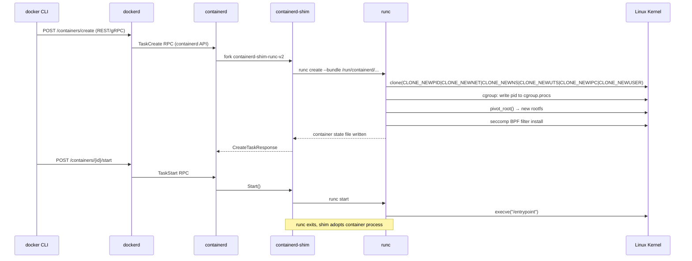

### OCI 번들 레이아웃

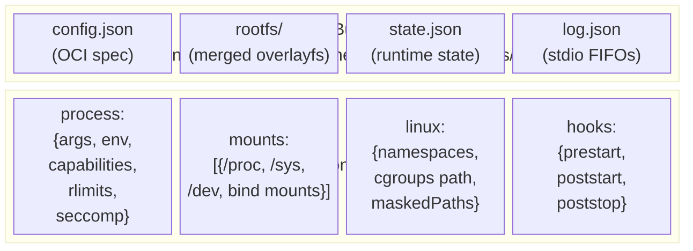

---

## 2. 네임스페이스 및 Cgroup 내부

### Linux 네임스페이스 — 각각의 격리 대상

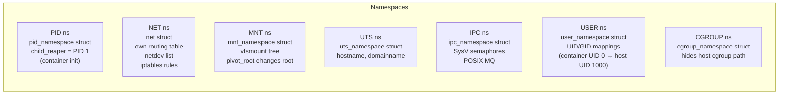

### cgroup v2 리소스 제어

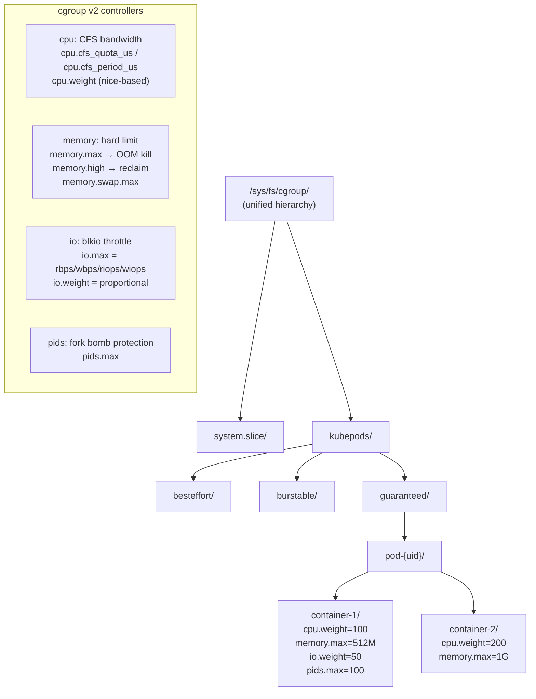

---

## 3. OverlayFS - 컨테이너 이미지 레이어

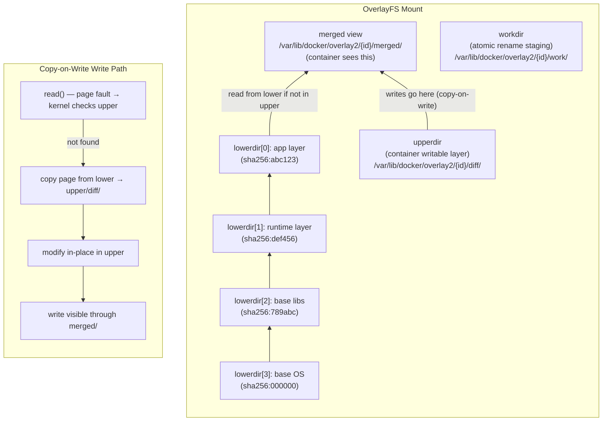

### 이미지 레이어 저장소

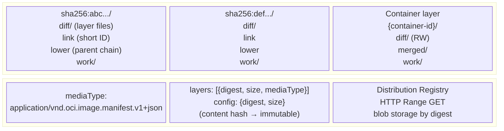

---

## 4. 컨테이너 네트워킹 - CNI 내부

### veth 쌍 + 브리지(Docker 브리지/플란넬 VXLAN)

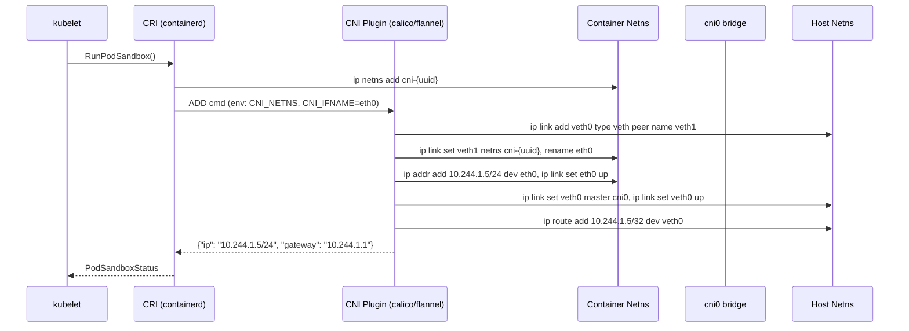

### 노드 간 패킷 흐름(VXLAN 오버레이)

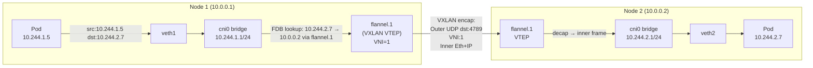

---

## 5. 쿠버네티스 아키텍처 - 컨트롤 플레인 내부

### 구성요소 상호작용 맵

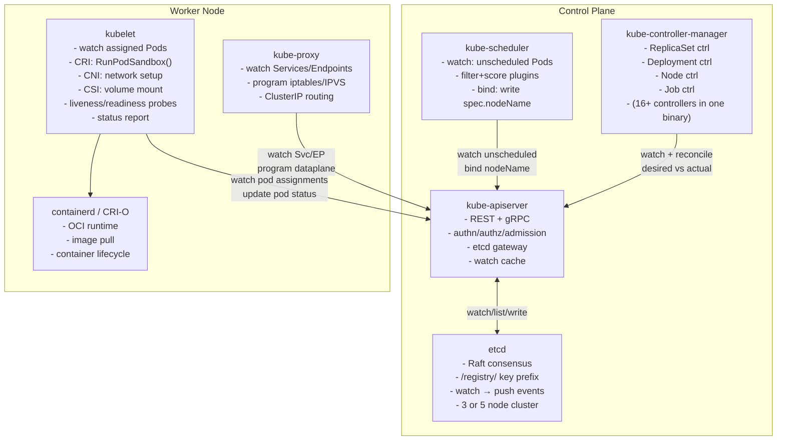

### etcd Raft 쓰기 경로

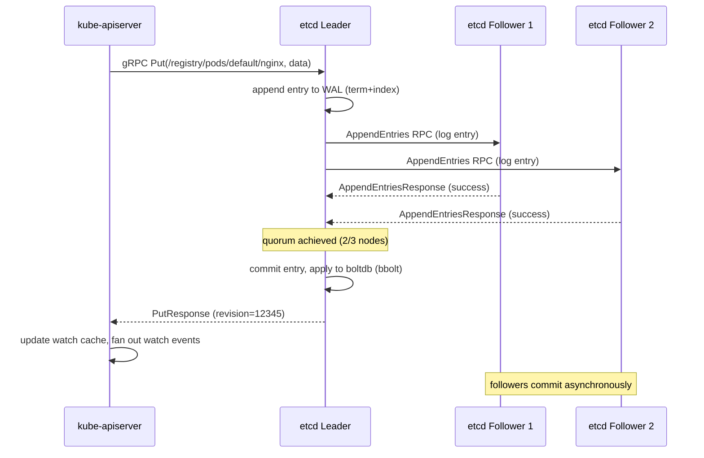

---

## 6. 포드 수명 주기 - 상태 머신

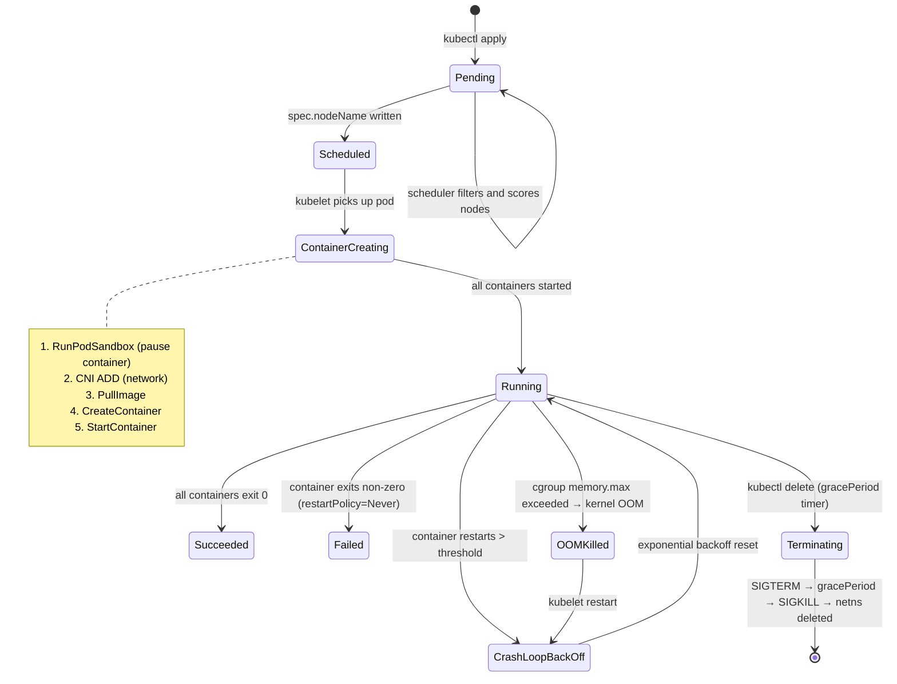

---

## 7. kube-scheduler — 필터 + 점수 파이프라인

```mermaid
flowchart TD
    Watch["Watch: unscheduled Pod\n(spec.nodeName == \"\")"]
    Queue["PriorityQueue\n(sorted by Priority class)"]
    Snapshot["Cluster Snapshot\n(cached node/pod state)"]

    Filter["Filter Plugins (run in parallel per node)"]
    F1["NodeUnschedulable\n(node.spec.unschedulable)"]
    F2["NodeResourcesFit\n(cpu/mem requests vs allocatable)"]
    F3["NodeAffinity\n(requiredDuringScheduling)"]
    F4["PodTopologySpread\n(zone/host spread constraints)"]
    F5["TaintToleration\n(node taints vs pod tolerations)"]
    F6["VolumeBinding\n(PVC → PV affinity)"]

    Score["Score Plugins (0–100 per node)"]
    S1["LeastAllocated\n(prefer underutilized nodes)"]
    S2["NodeAffinity\n(preferred weights)"]
    S3["InterPodAffinity\n(co-location scoring)"]
    S4["ImageLocality\n(image already pulled?)"]

    Bind["Bind: write spec.nodeName via API"]

    Watch --> Queue --> Snapshot
    Snapshot --> Filter
    Filter --> F1 & F2 & F3 & F4 & F5 & F6
    F1 & F2 & F3 & F4 & F5 & F6 -->|"feasible nodes"| Score
    Score --> S1 & S2 & S3 & S4
    S1 & S2 & S3 & S4 -->|"weighted sum → top node"| Bind
```

---

## 8. kube-proxy — 서비스 → 포드 패킷 라우팅

### iptables 모드(기본값)

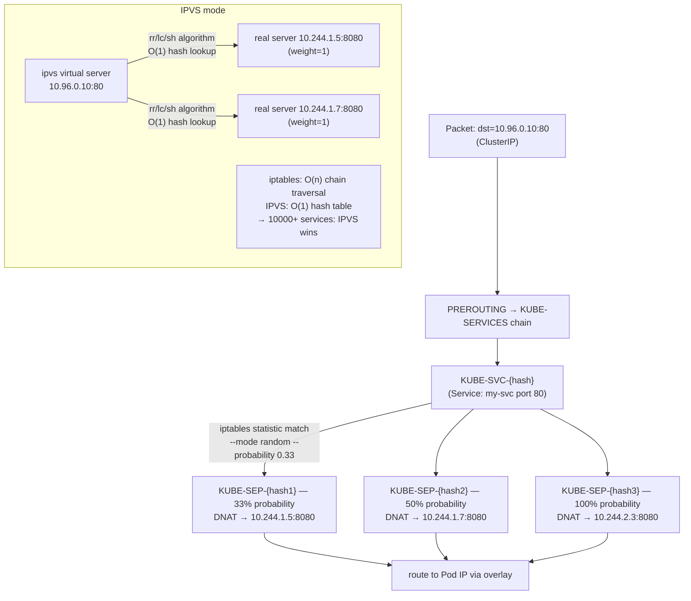

---

## 9. 수평형 포드 자동 크기 조정기 - 제어 루프

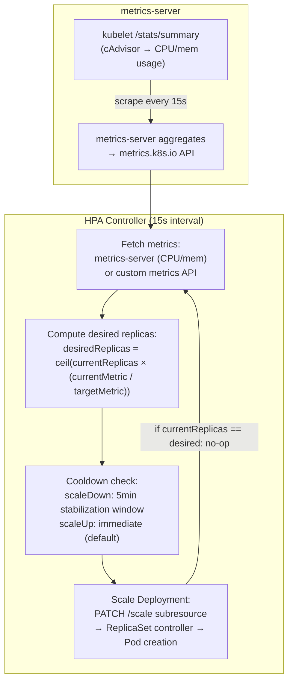

---

## 10. 영구 볼륨 — CSI 드라이버 내부

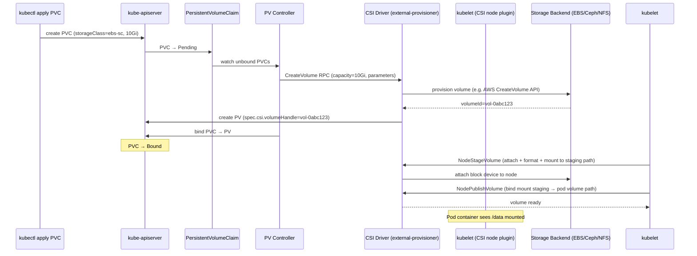

---

## 11. Kubernetes RBAC — 권한 부여 내부

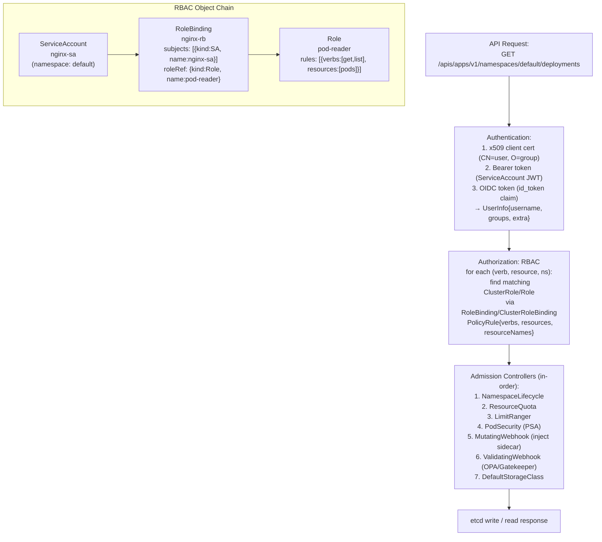

---

## 12. StatefulSet — 순차적 배포 내부

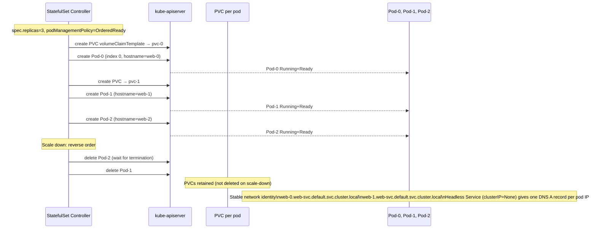

---

## 13. Docker BuildKit — 레이어 캐시 내부

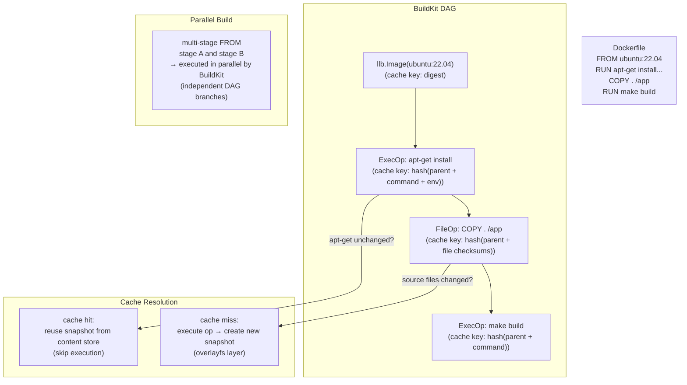

---

## 14. Kubernetes 네트워크 정책 - eBPF / iptables 시행

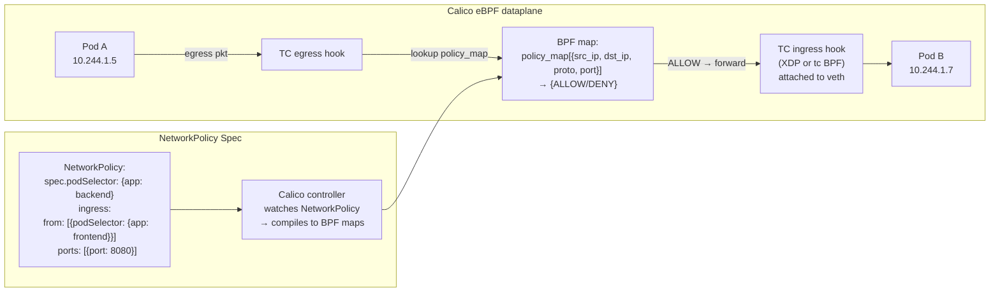

---

## 15. 성능 특성 요약

```mermaid
block-beta
  columns 2
  block:startup["Container Startup Latency"]:1
    s1["runc create + start: ~100–300ms"]
    s2["Image pull (cached): 0ms"]
    s3["Image pull (1GB, 1Gbps): ~8s"]
    s4["Pod ready (pre-pulled): ~500ms–2s"]
  end
  block:net["Network Overhead"]:1
    n1["veth pair: ~5μs additional latency"]
    n2["VXLAN overhead: +50 bytes/pkt, ~10μs"]
    n3["iptables: O(n) rules; 10k svcs → ms delay"]
    n4["IPVS: O(1) hash; 10k svcs → μs"]
  end
  block:sched["Scheduler Throughput"]:1
    sc1["kube-scheduler: ~1000 pods/sec\n(single-threaded bind)"]
    sc2["Filter: parallel goroutine per node"]
    sc3["Score: parallel goroutine per node"]
    sc4["Preemption: O(pods × nodes)"]
  end
  block:etcd_perf["etcd Performance"]:1
    e1["Write latency: ~1–5ms (fsync WAL)"]
    e2["Read (linearizable): ~1ms"]
    e3["Watch fanout: ~10k watchers/obj"]
    e4["Recommended: <8GB data, SSD required"]
  end
```

---

## 주요 내용

- **runc**는 6개의 네임스페이스 플래그로 `clone()`을 호출하는 OCI 런타임입니다. Containerd-shim은 runc 종료 후에도 유지되어 컨테이너 프로세스 수명 주기를 소유합니다.
- **OverlayFS** 쓰기 중 복사는 하위 계층의 모든 파일에 먼저 쓰기를 수행하면 전체 inode가 `upperdir`에 복사됨을 의미합니다. 대용량 파일에는 일회성 복사 패널티가 발생합니다.
- **etcd Raft**에는 모든 쓰기에 대해 쿼럼(⌊n/2⌋+1)이 필요합니다. 3노드 클러스터는 1개의 오류를 허용합니다. 모든 k8s 상태는 이 경로를 통해 직렬화됩니다.
- **kube-scheduler filter/score**는 노드당 병렬 고루틴으로 플러그인 체인을 실행합니다. 바인딩은 유일한 직렬 단계입니다.
- **kube-proxy iptables 모드** 확장성이 좋지 않음: n 서비스에 대한 O(n) 체인 순회; IPVS는 O(1) 조회를 위해 커널 해시 테이블을 사용합니다.
- **CSI 볼륨**에는 포드당 3개의 RPC가 필요합니다. ControllerPublishVolume(연결), NodeStageVolume(스테이징으로 포맷/마운트), NodePublishVolume(포드에 바인딩 마운트)
- **HPA**는 원하는 = ceil(현재 × 실제/목표)를 계산합니다. 안정화 창은 폭증하는 측정항목의 스래싱을 방지합니다.
