# 기능적 프로그래밍 내부: 람다 미적분학, 유형 시스템 및 런타임 메커니즘

> 내부 내용: 클로저가 메모리 내 환경을 캡처하는 방법, Haskell의 지연 평가가 썽크 체인을 구축하는 방법, 모나드가 돌연변이 없이 스레드 상태를 유지하는 방법, Hindley-Milner 유형 추론 알고리즘이 작동하는 방법 — 정확한 힙 레이아웃, 축소 전략 및 함수형 프로그래밍 뒤에 있는 표시 의미.

---

## 1. 람다 미적분학: 기초

람다 미적분학은 모든 기능적 언어의 기본이 되는 계산 모델입니다. 세 가지 구성:

```
e ::= x          (variable)
    | λx.e       (abstraction: function)  
    | e₁ e₂      (application: call function)
```

### 베타 감소: 함수 적용 메커니즘

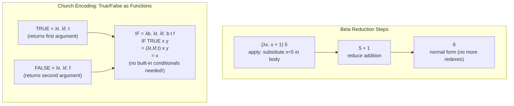

**합류(Church-Rosser 정리)**: 축소 순서에 관계없이 표현식이 정규 형식을 가지면 모든 축소 경로가 동일한 정규 형식에 도달합니다. 이는 게으른 평가를 정당화합니다. 필요한 경우에만 축소하고 항상 동일한 결과를 얻습니다.

---

## 2. 메모리에서의 클로저 표현

클로저 = 함수 코드 포인터 + 캡처된 환경(힙 할당)

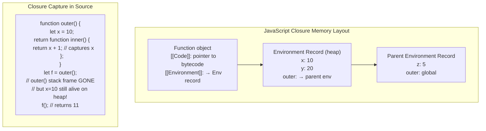

### 스택 vs 힙: 이스케이프 분석

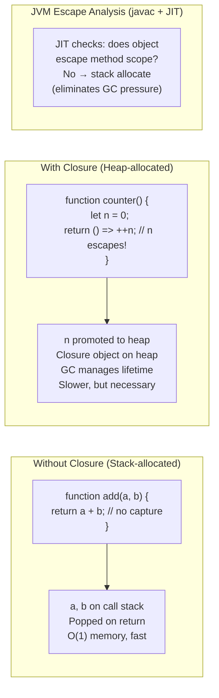

---

## 3. 하스켈 지연 평가: 썽크 메커니즘

Haskell은 **엄격하지 않습니다**: 표현식은 해당 값이 필요할 때까지 평가되지 않습니다. 평가되지 않은 표현식은 **썽크**입니다. 즉, 평가를 기다리는 힙 할당 클로저입니다.

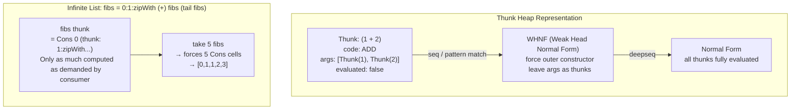

### 썽크 공유(그래프 축소)

Haskell은 **그래프 감소**를 사용합니다. 공유 썽크는 첫 번째 평가 후 해당 값으로 업데이트되어 재계산을 방지합니다.

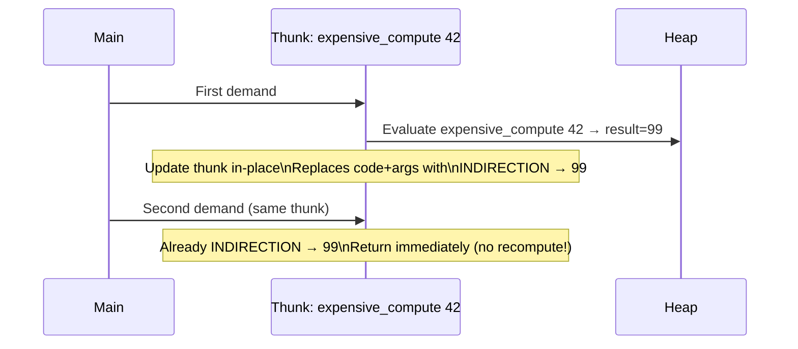

### 게으른 축적으로 인한 공간 누수

```
-- BAD: builds up n thunks before summing
sum [1..1000000]
= 1 + (2 + (3 + ... (999999 + 1000000)...))
-- Stack overflow or O(N) heap

-- GOOD: foldl' forces accumulator at each step
import Data.List (foldl')
foldl' (+) 0 [1..1000000]
-- Strict accumulator: O(1) heap
```

---

## 4. Hindley-Milner 유형 추론 알고리즘 W

HM은 **통합**을 사용하여 주석 없이 유형을 추론합니다.

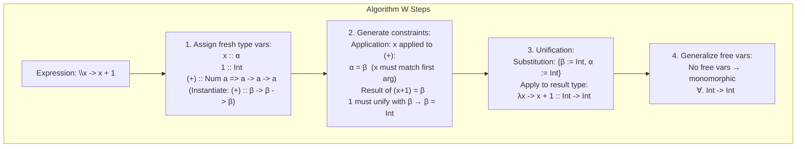

### 다형성 유형 추론

```haskell
-- id :: a -> a  (inferred, not annotated)
id x = x
-- Fresh type var: x :: α, body :: α → infer id :: α -> α
-- Generalize: id :: ∀a. a -> a

-- map :: (a -> b) -> [a] -> [b]
map f [] = []
map f (x:xs) = f x : map f xs
-- Algorithm W infers this automatically from pattern matching
```

---

## 5. 모나드: 돌연변이 없는 시퀀싱 효과

모나드는 다음을 포함하는 유형 생성자 `M`입니다.
- `return :: a -> M a`(랩 값)
- `(>>=) :: M a -> (a -> M b) -> M b` (바인드/체인)

세 가지 법칙을 충족합니다.
1. `return a >>= f  ≡  f a` (왼쪽 신원)
2. `m >>= return    ≡  m` (올바른 신원)
3. `(m >>= f) >>= g  ≡  m >>= (λx -> f x >>= g)`(연관성)

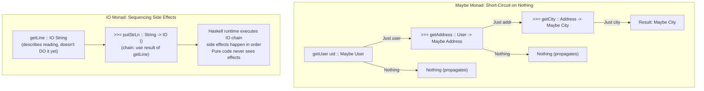

### 상태 모나드: 전역 변수가 없는 스레딩 상태

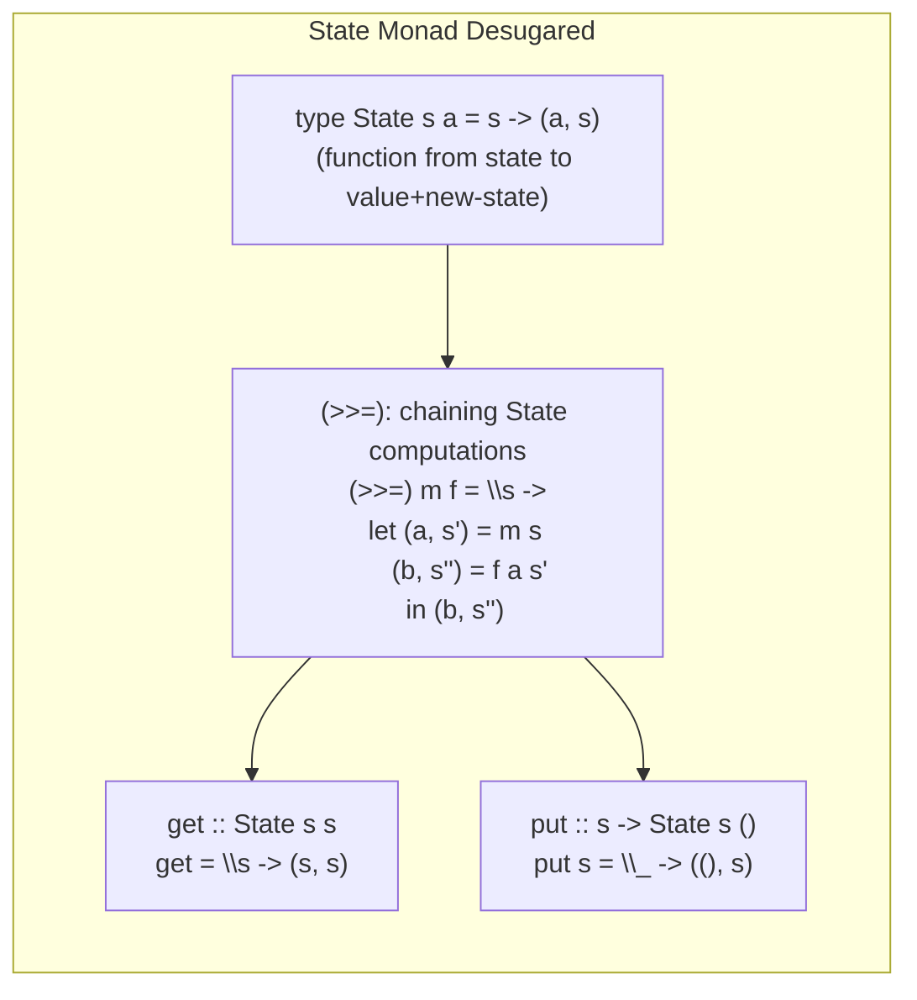

변경할 수 있는 전역 상태가 없습니다. 상태 값은 명시적 인수로 함수 호출을 통해 **스레딩**되어 각 단계에서 변환됩니다.

---

## 6. 대수적 데이터 유형 및 패턴 일치 컴파일

```haskell
data Tree a = Leaf | Node (Tree a) a (Tree a)

-- Pattern match compiles to jump table / decision tree
insert :: Ord a => a -> Tree a -> Tree a
insert x Leaf         = Node Leaf x Leaf
insert x (Node l v r)
  | x < v    = Node (insert x l) v r
  | x > v    = Node l v (insert x r)
  | otherwise = Node l v r
```

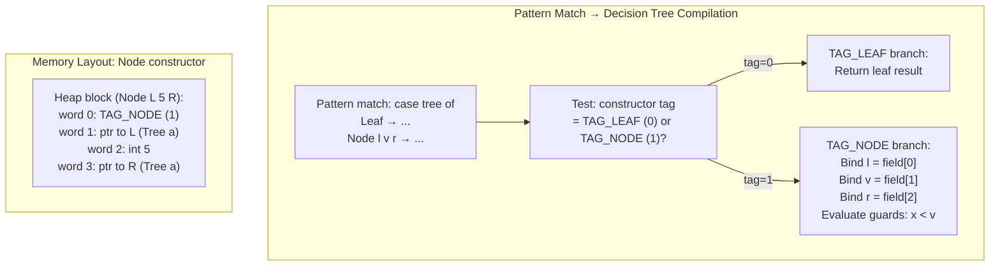

---

## 7. 순수하게 기능적인 데이터 구조: 영속적 불변 트리

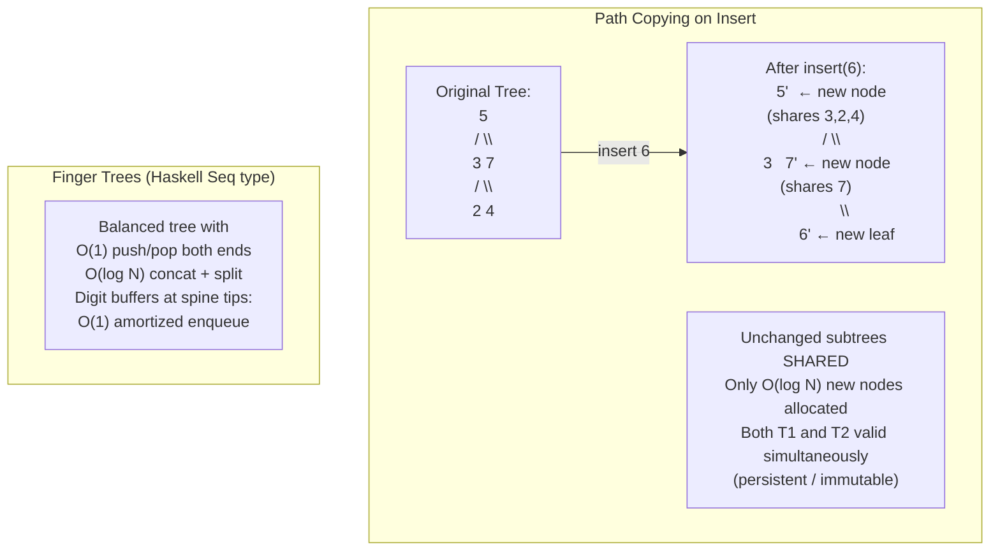

---

## 8. 코드의 범주 이론 개념

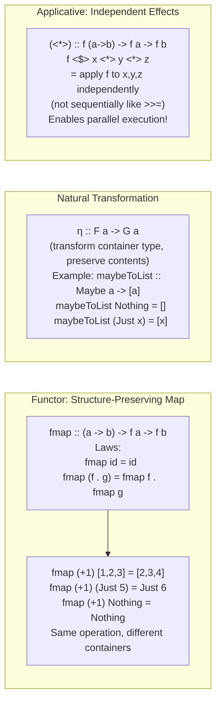

---

## 9. STM: 소프트웨어 트랜잭션 메모리 내부

Haskell의 STM은 잠금 없이 구성 가능한 원자 블록을 제공합니다.

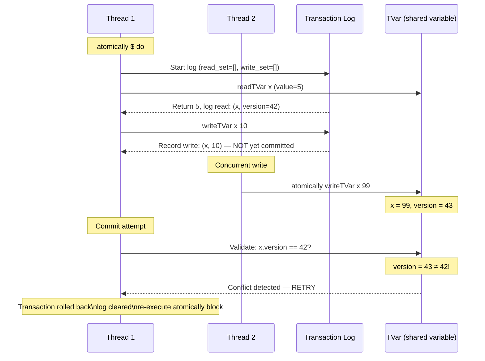

**교착 상태 없음**: STM은 낙관적 동시성을 사용합니다. 즉, 트랜잭션 실행 중에 잠금을 획득하지 않고 커밋 시에만 획득합니다. 트랜잭션은 **순수**(커밋할 때까지 관찰 가능한 부작용이 없음)이므로 재시도는 안전합니다.

---

## 10. 기능적 반응형 프로그래밍: 신호 그래프 내부

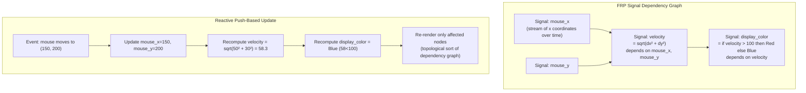

---

## 11. 테일 콜 최적화: 스택 프레임 제거

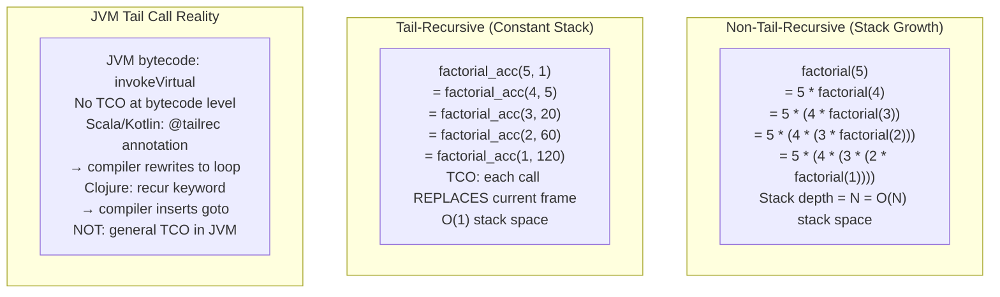

---

## 12. 효과 시스템과 무료 모나드

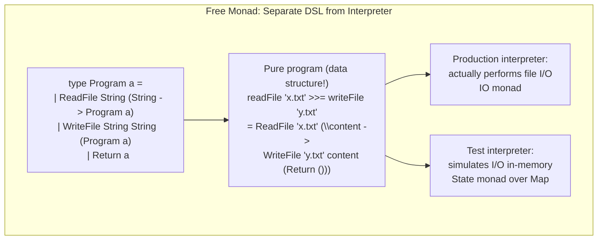

**확장 가능한 효과(Eff)**: `Eff` 모나드는 호출 사이트에서 대수 효과 처리기를 사용하여 모나드 변환기 스택 없이 여러 효과 유형(Reader, Writer, State, Exception)을 결합할 수 있도록 무료 모나드를 일반화합니다.

---

## 요약: FP 핵심 메커니즘

| 개념 | 런타임 메커니즘 | 주요 속성 |
|---|---|---|
| 폐쇄 | 힙 할당 환경 레코드 | 스택 수명 이후의 변수 캡처 |
| 게으른 썽크 | 힙 포인터 + 내부 업데이트 | 한 번 평가하고, 메모하고, 무한 구조 활성화 |
| HM 유형 추론 | 통일+대체 | O(n log n) 추론, 주석이 필요하지 않음 |
| 영구 데이터 구조 | 경로 복사 + 구조 공유 | O(log N) 업데이트, 이전 버전 보존 |
| 모나드 | 래핑된 유형에 대한 함수 구성 | 효과를 사용한 시퀀싱, 구성 가능 |
| STM | 낙관적 동시성 + 트랜잭션 로그 | 교착 상태 없음, 구성 가능한 원자 블록 |
| 총소유비용 | 현재 스택 프레임 바꾸기(goto) | 꼬리 재귀 알고리즘을 위한 O(1) 스택 |
| 패턴 매칭 | 태그 확인 + 필드 추출 + 가드 | 효율적인 의사결정 트리로 컴파일 |
