# Java 내부: 내부

> 다음에서 합성됨: Bloch *Effective Java* 3판, Oaks & Wong *Java Performance* 2판, Evans & Verburg *The Well-Grounded Java Developer*, Goetz *Java Concurrency in Practice* 및 comp(21/207-212/215-223/241/305/311/326/346/455/457) 자바 참조.

---

## 1. JVM 아키텍처 — 실행을 위한 클래스 로딩

### JVM 런타임 영역

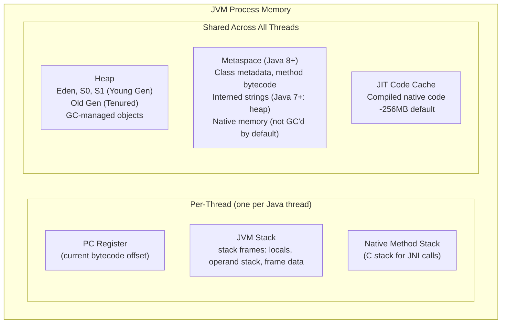

### 클래스 로딩 라이프사이클

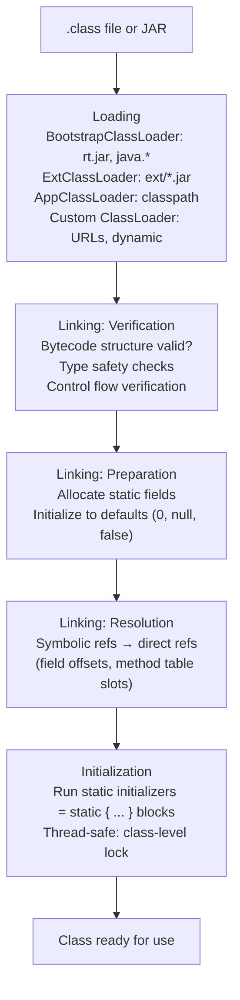

**상위 위임 모델**: ClassLoader는 자신의 경로를 검색하기 전에 먼저 상위에 묻습니다. 클래스 대체 공격을 방지합니다(`java.lang.String`을 섀도우할 수 없음). 의도적으로 중단될 수 있습니다(예: OSGi, Tomcat의 WebAppClassLoader는 웹앱 클래스를 먼저 로드합니다).

---

## 2. JVM 스택 프레임 레이아웃

```
Stack Frame for method: int compute(int x, int y)
+---------------------------+
| Local Variable Array      |
|  [0] = this (instance)    |  (only for instance methods)
|  [1] = x (int arg)        |
|  [2] = y (int arg)        |
|  [3] = temp local int     |
+---------------------------+
| Operand Stack             |  LIFO, max depth from .class Code attr
|  (grows as opcodes push)  |
+---------------------------+
| Frame Data                |
|  constant_pool ref        |  → runtime constant pool of class
|  method return address    |  → caller's PC after return
|  exception table ptr      |  → [start_pc, end_pc, handler_pc, catch_type]
+---------------------------+
```

---

## 3. JIT 컴파일 — 계층형 컴파일

### 실행 계층(Java 8+ HotSpot)

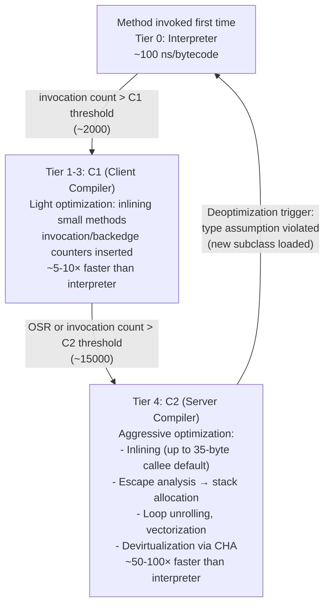

### 이스케이프 분석 - 힙 할당 제거

```java
// This code:
void process() {
    Point p = new Point(1, 2);   // escapes? NO — only used locally
    int sum = p.x + p.y;
    return sum;
}

// After escape analysis + scalar replacement:
void process() {
    int p_x = 1;   // Point fields promoted to stack scalars
    int p_y = 2;   // No heap allocation!
    int sum = p_x + p_y;
    return sum;
}
```

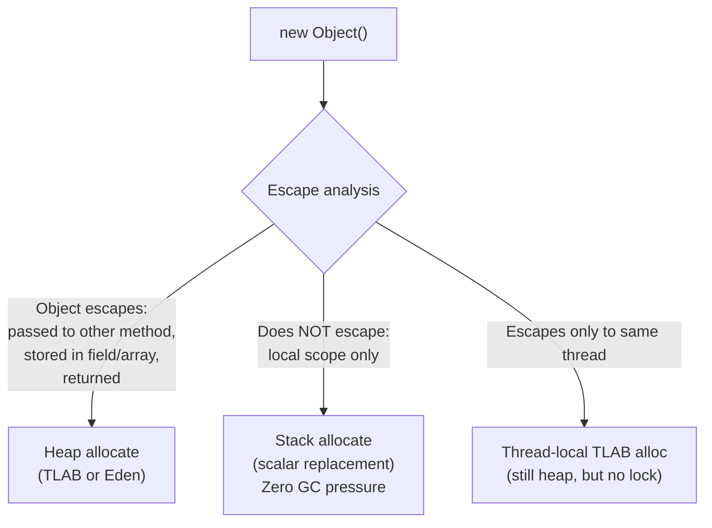

---

## 4. 가비지 컬렉션 — 세대별 GC

### 세대를 통한 객체 수명주기

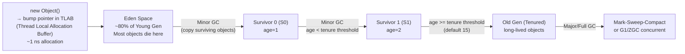

### TLAB — 스레드-로컬 할당 버퍼

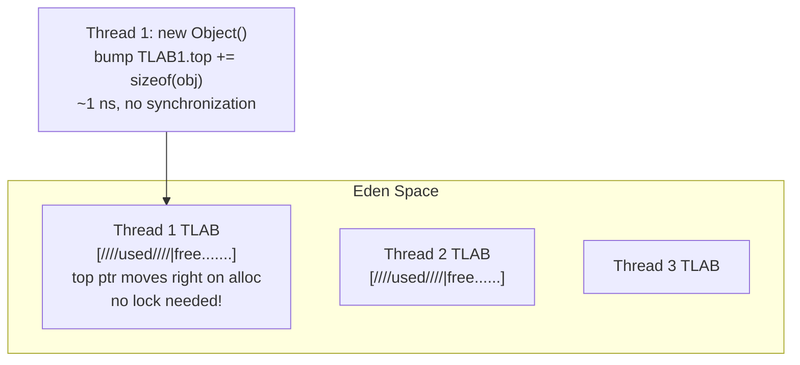

TLAB가 채워지는 경우: 스레드는 Eden.top의 CAS를 통해 Eden에서 새 TLAB를 요청합니다. 마이너 GC는 전체 Eden+Survivor를 매우 빠르게 회수합니다(라이브 객체만 복사되고, 죽은 객체는 버려짐).

### G1 GC 아키텍처

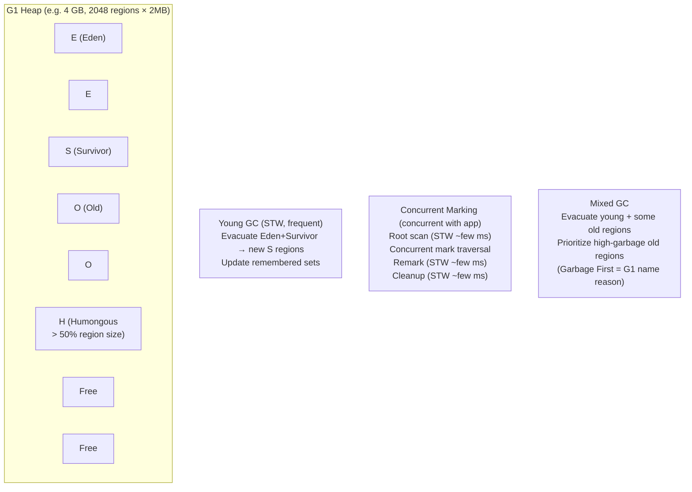

**기억 세트(RSet)**: 각 지역은 다른 지역이 해당 지역에 대한 참조를 보유하고 있는지 추적합니다. Young GC 동안 전체 힙 스캔을 피합니다. Old→young 포인터를 찾기 위해 Young 영역의 RSet만 스캔합니다.

---

## 5. JMM(Java 메모리 모델) — 발생 전

### JMM 규칙

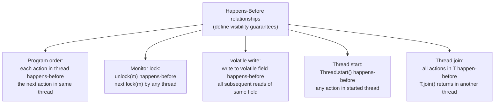

### 휘발성 — 하드웨어의 역할

```java
// Writer thread:
volatile int flag = 0;
data = 42;           // regular store — may buffer in store buffer
flag = 1;            // volatile store → StoreStore + StoreLoad fence on x86
                     // = MFENCE instruction (ensures store buffer flushed)

// Reader thread:
while(flag == 0) {}  // volatile load → LoadLoad + LoadStore fence
int x = data;        // guaranteed to see 42
```

x86(TSO): 휘발성 로드 = 일반 로드. 휘발성 저장소 = `LOCK XCHG` 또는 `MFENCE`. ARM: 둘 다에 대해 `DMB SY`(완전 배리어).

---

## 6. Java 스레드 및 모니터 내부

### 객체 헤더 및 잠금 상태

```
Object header (64-bit JVM, without compressed oops):
+--[mark word: 8 bytes]--+--[klass pointer: 8 bytes (4 with CompressedOops)]--+

Mark word states:
Unlocked:     [hash:31 | 0 | age:4 | 0 | 01]
Biased:       [thread_id:54 | epoch:2 | age:4 | 1 | 01]
Lightweight:  [stack_lock_ptr:62 | 00]
Heavyweight:  [monitor_ptr:62 | 10]
GC mark:      [...              | 11]
```

### 에스컬레이션 경로 잠금

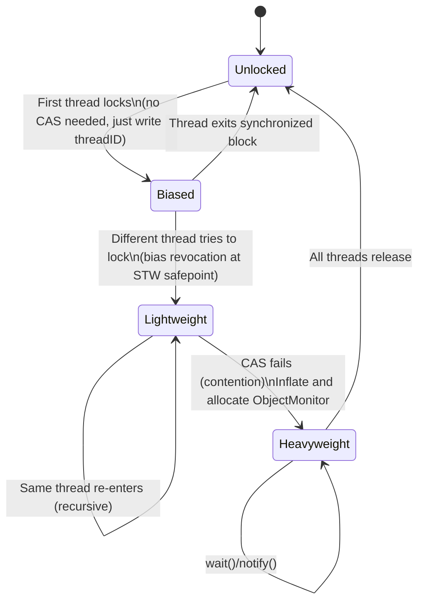

**ObjectMonitor**(헤비급):
```c
class ObjectMonitor {
    void*   _owner;          // owning thread
    jint    _count;          // recursive lock depth
    jint    _waiters;        // threads in wait()
    ObjectWaiter* _WaitSet;  // circular list of waiting threads
    ObjectWaiter* _EntryList; // threads waiting to acquire lock
};
```

`wait()`: 잠금을 해제하고 스레드를 `_WaitSet`로 이동하고 스레드를 주차합니다(OS 수준 `pthread_cond_wait`). `notify()`: 하나의 스레드를 `_WaitSet`에서 `_EntryList`로 이동합니다. `notifyAll()`: 모두 이동합니다.

---

## 7. Java 컬렉션 - 내부 데이터 구조

### HashMap 내부(Java 8+)

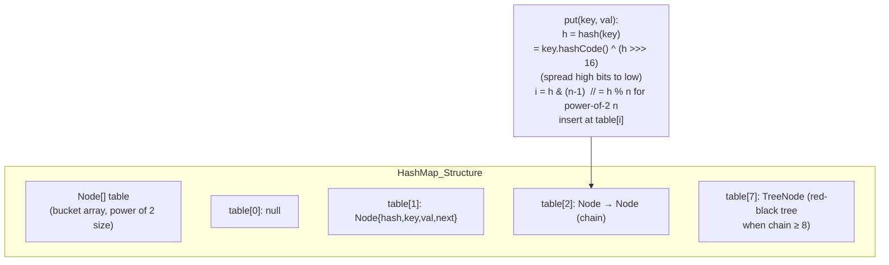

**트리화**: 버킷 체인 길이 ≥ 8 AND table.length ≥ 64인 경우 체인이 TreeNode(레드-블랙 트리)로 변환됩니다. O(n) 최악의 경우 → O(log n). 크기가 6 이하로 떨어지면 트리화되지 않습니다.

**부하 계수 0.75**: 크기 조정 임계값 = 용량 × 0.75. 메모리와 충돌 확률의 균형을 맞춥니다. 0.75 로드에서 균일한 해시 분포 하에서 예상되는 체인 길이는 0-1입니다.

### ConcurrentHashMap(자바 8)

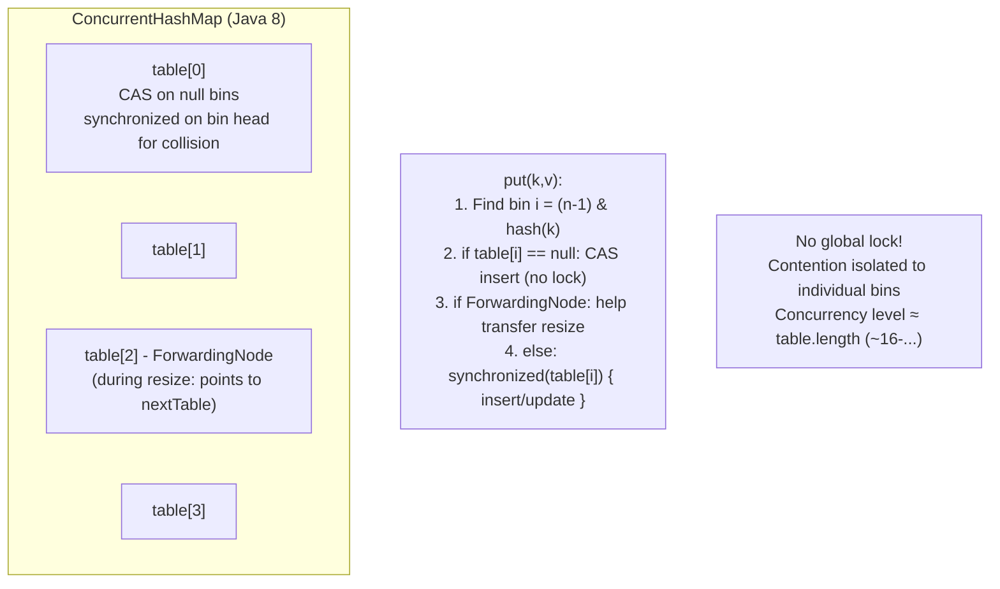

`size()`은 대략적인 개수를 반환합니다. 정확한 개수는 `CounterCell[]`(LongAdder와 같은 스트라이프 카운터)을 사용하여 동시 증가 중에 단일 카운터에 대한 경합을 방지합니다.

---

## 8. Java 직렬화 및 반사 내부

### 리플렉션 메서드 호출 경로

```java
Method m = Foo.class.getDeclaredMethod("bar", int.class);
m.invoke(fooInstance, 42);
```

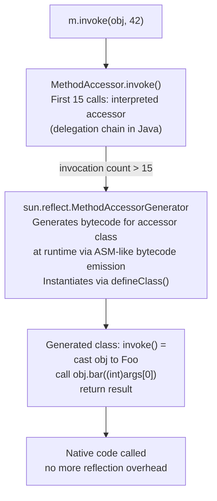

반사 오버헤드: 처음 15회 호출 ~500ns. JIT 컴파일된 접근자 생성 후: ~5-10ns(가상 호출과 비교 가능) `MethodHandles.lookup().findVirtual()` → MethodHandle → 리플렉션보다 더 예측 가능한 JIT 최적화.

---

## 9. JVM Safepoint 및 Stop-The-World

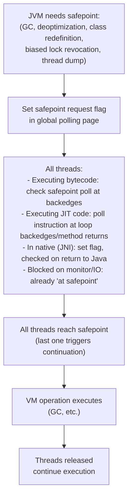

**Time-to-safepoint(TTSP)**: 모든 스레드가 안전 지점에 도달하는 데 걸리는 시간입니다. 장기 실행 JNI 코드, safepoint 폴링이 없는 긴밀한 루프(JDK 10 루프 스트립 마이닝 이전) 또는 TLAB의 대규모 객체 할당은 TTSP를 확장할 수 있습니다. 증상: `Application time: 0.0`에 이어 대규모 GC 일시중지가 발생합니다.

---

## 10. Java NIO 및 Direct ByteBuffer

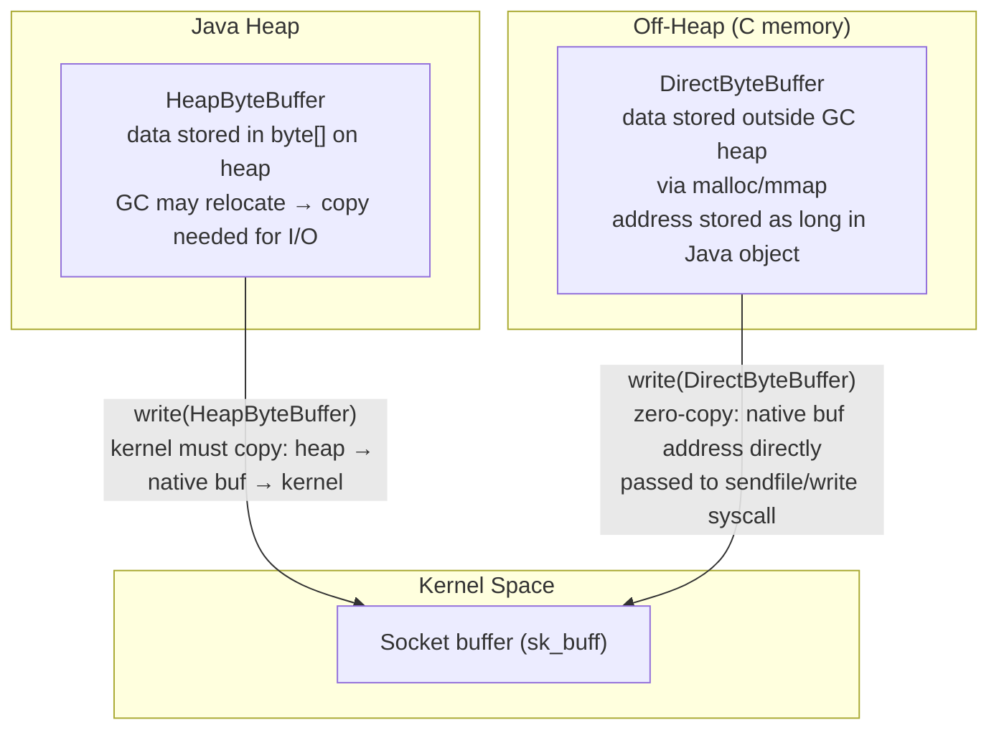

C의 `ByteBuffer.allocateDirect(n)` → `Unsafe.allocateMemory(n)` → `malloc(n)`. 주소는 `DirectByteBuffer`에 `long address`로 저장됩니다. GC는 이를 재배치할 수 없습니다(힙 외부). `DirectByteBuffer` GC'd → `Cleaner`(PhantomReference) 콜백이 `free()`을 호출하면 해제됩니다.

**메모리 매핑된 파일** (`FileChannel.map()`): `mmap()` syscall → JVM 프로세스 주소 공간에 직접 매핑된 페이지 → OS 페이지 캐시에 액세스하는 DirectByteBuffer를 통한 제로 복사 읽기/쓰기.

---

## 11. 문자열 인터닝과 압축 문자열

### 문자열 표현(Java 9+ 컴팩트 문자열)

```java
// Java 9+: String uses byte[] + coder field
class String {
    byte[] value;     // LATIN1: 1 byte/char; UTF16: 2 bytes/char
    byte coder;       // 0=LATIN1, 1=UTF16
    int hash;         // cached hashCode (0 = not computed)
}
// "hello" → value=[104,101,108,108,111], coder=0 (LATIN1)
// "日本語" → value=[...UTF16 bytes...], coder=1
```

**문자열 풀**(인턴 문자열): 메타스페이스의 해시 테이블(Java 7+: 힙). `String.intern()`은 풀에 문자열을 추가합니다. 문자열 리터럴은 클래스 로드 시 자동으로 인턴됩니다.

```mermaid
flowchart LR
    A["String literal \"hello\"\nin bytecode (ldc opcode)"] --> B["JVM string pool lookup\n(hash → bucket → compare)"]
    B -->|"found"| C["Return existing interned\nString object reference"]
    B -->|"not found"| D["Add to pool\nReturn new String reference"]
```

---

## 12. JVM 시작 및 ClassData 공유(CDS)

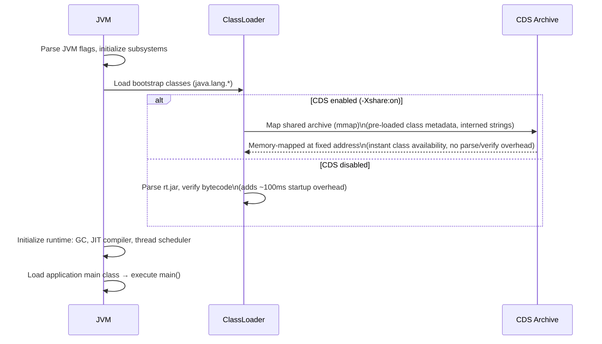

**AppCDS(애플리케이션 클래스-데이터 공유)**: 애플리케이션 클래스도 보관합니다. 시작 시간 감소: 일반적인 Spring Boot 앱의 경우 20-50%. GraalVM 네이티브 이미지는 이를 더욱 발전시켜 전체 앱을 네이티브 바이너리로 컴파일하여 JVM 시작을 완전히 제거합니다.

---

## JVM 성능 수치

| 운영 | 시간 | 메모 |
|-----------|------|-------|
| TLAB 객체 할당 | ~1ns | 범프 포인터, 잠금 없음 |
| Eden 할당(TLAB 없음) | ~10ns | Eden.top의 CAS |
| 마이너 GC(영) | 1~50ms | Young의 살아있는 물체에 비례 |
| G1 혼합 GC 일시중지 | 50-200ms | -XX:MaxGCPauseMillis에 따라 다름 |
| 전체 GC(기존 CMS) | 500ms~30초 | 힙 크기에 비례 |
| ZGC/셰넌도어 일시 중지 | <1~10ms | 동시 마킹 |
| 가상 메소드 호출 | ~5-10ns | vtable 파견 |
| 인터페이스 메소드 호출 | ~10-20ns | itable 검색 |
| 단형 JIT 호출 | ~0-1ns | 인라인 |
| 동기화된 블록(경합 없음) | ~5-20ns | 편향되거나 얇은 잠금 |
| 동기화된 블록(경합) | ~1~10μs | OS 뮤텍스 + 컨텍스트 스위치 |
| Thread.start() | ~50~200μs | OS 스레드 생성 |
| 클래스 로딩(콜드) | ~1~50ms | 구문 분석 + 확인 + 초기화 |
| 반사 호출(처음 15x) | ~500ns | 통역 |
| 반사 호출(팽창 후) | ~5-10ns | JIT 컴파일된 접근자 |
