# 마이크로서비스 내부: 내부

> 소스 합성: 서비스 메시, API 게이트웨이, 서비스 간 통신, 분산 추적, 서비스 검색 및 탄력성 패턴을 다루는 마이크로서비스 참조 서적(comp 107, 112, 147–151, 163–164, 370).

---

## 1. 서비스 메시 아키텍처 - 데이터 플레인과 제어 플레인

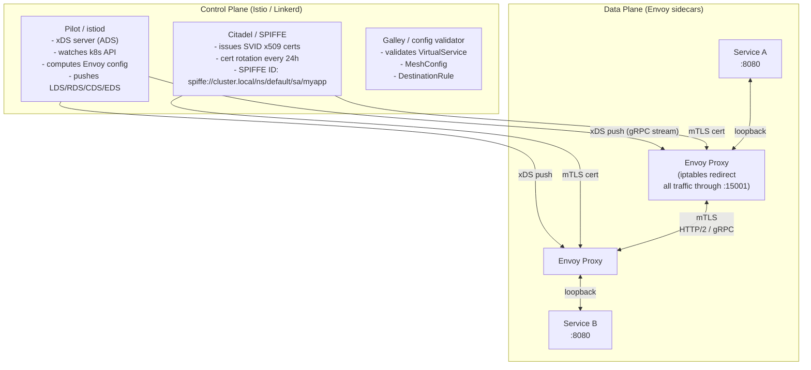

### iptables 트래픽 차단

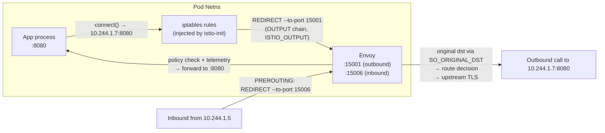

---

## 2. Envoy xDS — 동적 구성 프로토콜

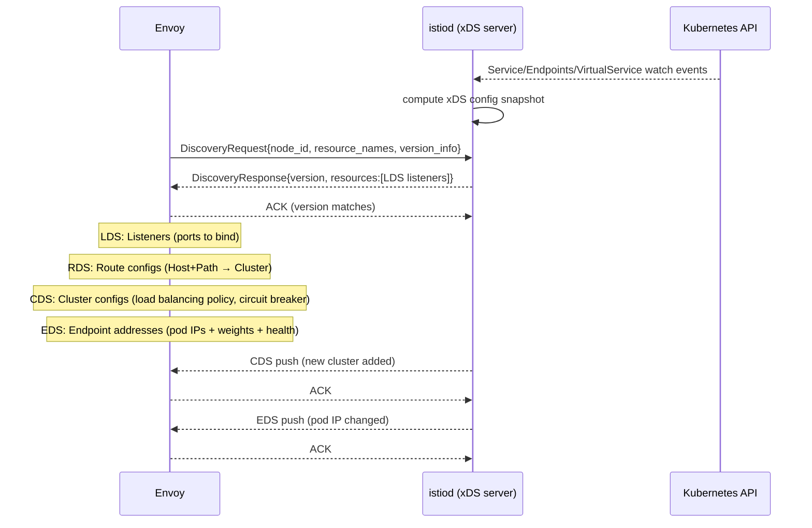

---

## 3. API 게이트웨이 - 요청 처리 파이프라인

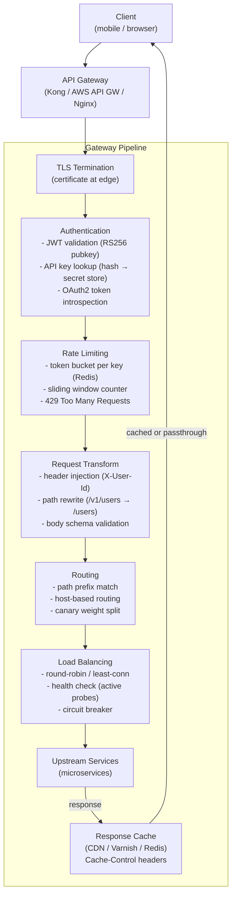

### 토큰 버킷 속도 제한기 내부

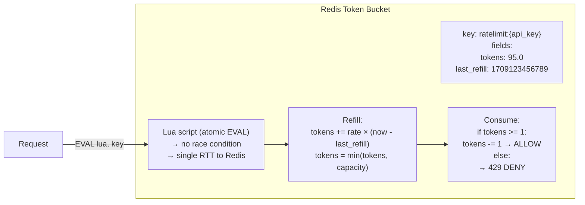

---

## 4. 서비스 검색 — 클라이언트측 vs 서버측

```mermaid
flowchart TD
    subgraph Client-Side Discovery (Eureka / Consul)
        SvcA["Service A"]
        Registry["Service Registry\n(Consul / Eureka)\nhealth-checked store\nof {name → [ip:port]}"]
        SvcB_1["Service B instance 1\n10.244.1.5:8080"]
        SvcB_2["Service B instance 2\n10.244.1.7:8080"]
        LB_Client["Client-side LB\n(Ribbon / gRPC client LB)\nround-robin / p2c"]

        SvcA -->|"1. lookup service-b"| Registry
        Registry -->|"2. return [10.244.1.5, 10.244.1.7]"| SvcA
        SvcA --> LB_Client
        LB_Client -->|"3. pick instance"| SvcB_1
    end

    subgraph Server-Side Discovery (Kubernetes Service)
        SvcC["Service C"]
        ClusterIP["ClusterIP 10.96.0.10:80\n(kube-proxy iptables DNAT)"]
        SvcD_1["Service D pod 1"]
        SvcD_2["Service D pod 2"]
        SvcC -->|"connect ClusterIP"| ClusterIP
        ClusterIP -->|"random DNAT"| SvcD_1 & SvcD_2
    end

    subgraph Consul Internal
        Agent["consul agent\n(local sidecar)"]
        Server["consul server\n(Raft cluster)"]
        HCheck["health check:\nHTTP GET /health → 200?\nTCP connect?\nScript output?"]
        Agent -->|"gossip protocol\n(SWIM)\nfailure detection"| Server
        Agent --> HCheck
    end
```

---

## 5. gRPC 내부 — 전송 및 프로토콜 버퍼

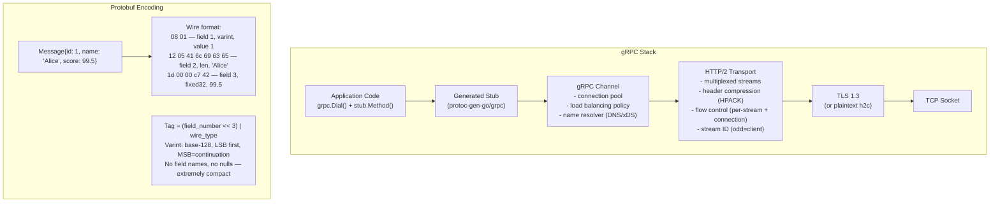

### gRPC 스트리밍 — 역압 흐름

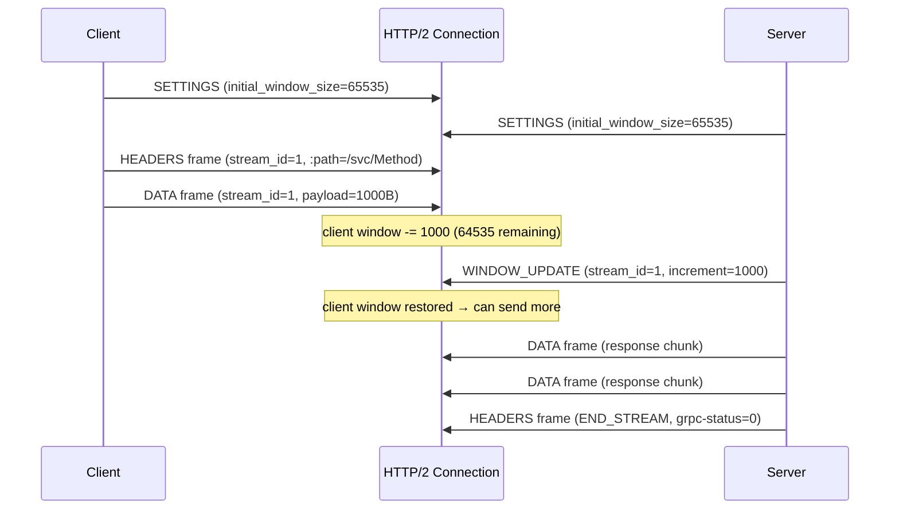

---

## 6. 분산 추적 — OpenTelemetry 내부

```mermaid
flowchart TD
    subgraph Trace Propagation
        Req["HTTP Request\nW3C Trace Context headers:\ntraceparent: 00-{traceId}-{spanId}-01\ntracestate: vendor-specific"]
        SvcA["Service A\n- extract context\n- start span (spanId=aaaa)\n- inject into outbound headers"]
        SvcB["Service B\n- extract parent spanId=aaaa\n- start child span (spanId=bbbb)\n- record attributes+events"]
        SvcC["Service C\n- child span (spanId=cccc)"]

        Req --> SvcA -->|"HTTP with traceparent"| SvcB -->|"gRPC metadata"| SvcC
    end

    subgraph OTLP Export Pipeline
        SDK["OTel SDK\n- Tracer → start/end spans\n- SpanProcessor (BatchSpanProcessor)\n- in-memory ring buffer"]
        Collector["OTel Collector\n- receives OTLP (gRPC/HTTP)\n- tail sampling processor\n- batch exporter"]
        Backend["Jaeger / Zipkin / Tempo\n- trace storage\n- span index\n- dependency graph"]
        SDK -->|"OTLP gRPC (async batch)"| Collector
        Collector -->|"Jaeger Thrift / OTLP"| Backend
    end

    subgraph Span Data Model
        Span["Span {\n  traceId: 128-bit\n  spanId: 64-bit\n  parentSpanId: 64-bit\n  name: 'GET /users'\n  kind: CLIENT/SERVER/PRODUCER/CONSUMER\n  startTime, endTime (UnixNano)\n  attributes: {http.method, http.status_code}\n  events: [{name, timestamp, attrs}]\n  status: OK / ERROR\n}"]
    end
```

---

## 7. 회로 차단기 - 상태 머신 내부

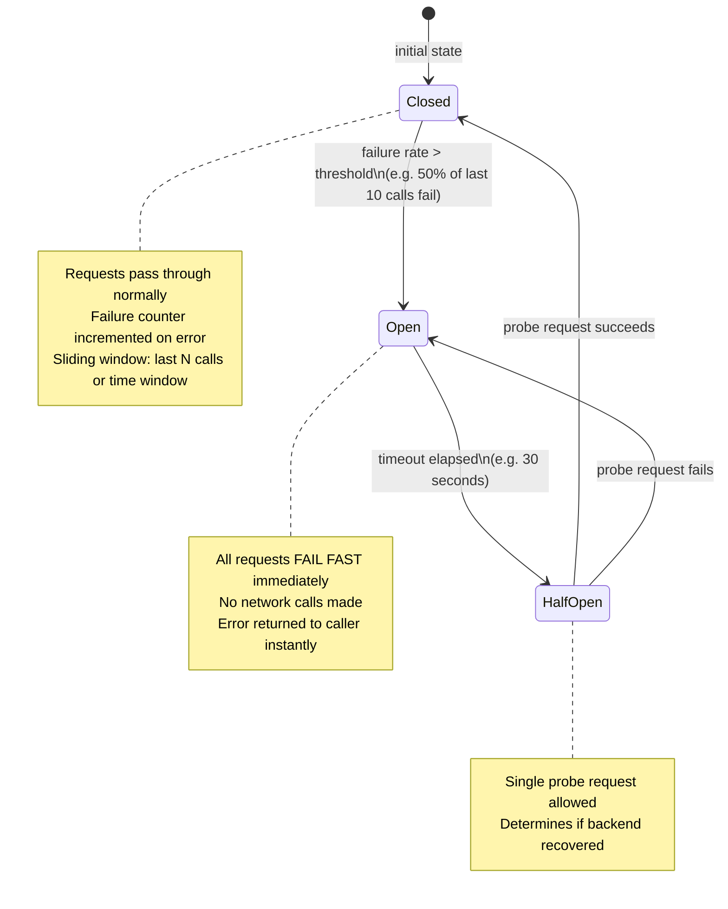

### Resilience4j 슬라이딩 윈도우

```mermaid
flowchart LR
    subgraph Count-Based Window (size=10)
        W["Ring buffer [F,S,F,S,S,F,S,S,S,F]\n(F=fail, S=success)\nfailureRate = count(F)/10 = 40%"]
        Threshold["threshold=50% → CLOSED (below threshold)"]
    end
    subgraph Time-Based Window (5 seconds)
        T["Epoch buckets (1 per second):\n[t-5: 3F 7S]\n[t-4: 1F 4S]\n[t-3: 5F 2S]\n[t-2: 2F 8S]\n[t-1: 4F 6S]\naggregated failureRate = 15/42 = 36%"]
    end
    subgraph Bulkhead
        B["Semaphore bulkhead:\nmaxConcurrentCalls=10\nmaxWaitDuration=0ms\n→ immediate rejection if saturated\n(isolates one service from starving others)"]
    end
```

---

## 8. 사가 패턴 - 분산 트랜잭션 내부

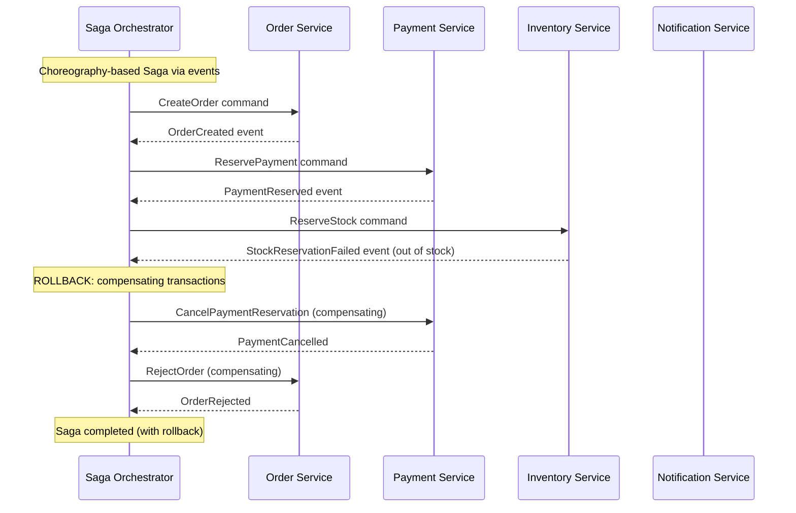

### 사가 vs 2PC 비교

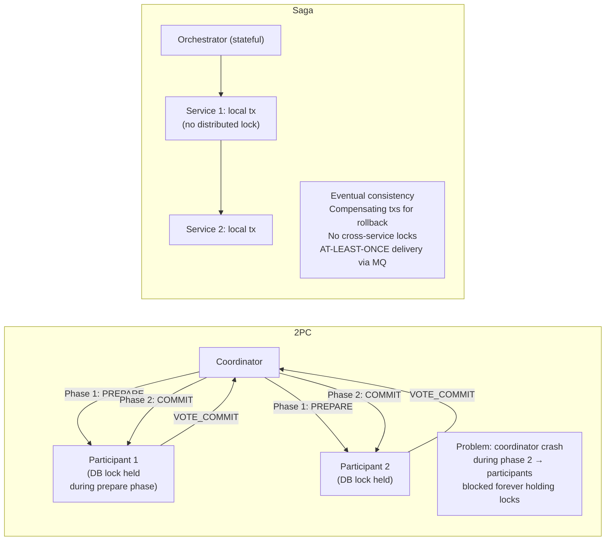

---

## 9. 이벤트 중심 마이크로서비스 — 발신함 패턴

```mermaid
flowchart TD
    subgraph Service A (Order)
        Tx["DB Transaction\n(single local tx)"]
        Orders["orders table\nINSERT order_id=123"]
        Outbox["outbox table\nINSERT {event_type=OrderCreated,\npayload=JSON,\nstatus=PENDING}"]
        Tx --> Orders
        Tx --> Outbox
    end

    subgraph Outbox Relay
        Poller["Debezium CDC\n(read WAL/binlog)\nor polling thread\n→ reads PENDING outbox rows"]
        MQ["Message Broker\n(Kafka / RabbitMQ)\npublish OrderCreated event"]
        Mark["UPDATE outbox SET status=PUBLISHED"]
    end

    subgraph Service B (Inventory)
        Consumer["Kafka consumer\nidempotency check:\n(event_id already processed?)"]
        Idempotency["processed_events table\n(event_id → UNIQUE constraint)"]
        InventoryUpdate["UPDATE inventory\n(reserve stock)"]
    end

    Outbox --> Poller --> MQ --> Consumer
    Consumer --> Idempotency
    Idempotency -->|"not seen → process"| InventoryUpdate
    Poller --> Mark
```

---

## 10. CQRS — 명령 쿼리 책임 분리

```mermaid
flowchart LR
    subgraph Write Side (Commands)
        Cmd["Command: CreateOrder{userId, items}"]
        Handler["CommandHandler\n- validate business rules\n- apply domain events\n- save to EventStore (append-only)"]
        EventStore["Event Store\n(append-only log)\nOrderCreated\nOrderShipped\nOrderCancelled"]
        EventBus["Event Bus (Kafka)\n→ fan out to projections"]
    end

    subgraph Read Side (Queries)
        Projection1["Order Summary\nProjection\n→ PostgreSQL read model\n(denormalized for fast SELECT)"]
        Projection2["User Orders\nProjection\n→ Redis cache\n(precomputed list)"]
        Query["Query: GetOrder{orderId}\n→ read from projection DB\n(no event replay needed)"]
    end

    Cmd --> Handler --> EventStore --> EventBus
    EventBus --> Projection1 & Projection2
    Query --> Projection1

    subgraph Event Sourcing Replay
        Replay["Rebuild projection:\nreplay ALL events from EventStore\n→ recompute state\n(snapshot every N events\n→ replay from snapshot)"]
    end
```

---

## 11. 상태 확인 및 활동성 내부

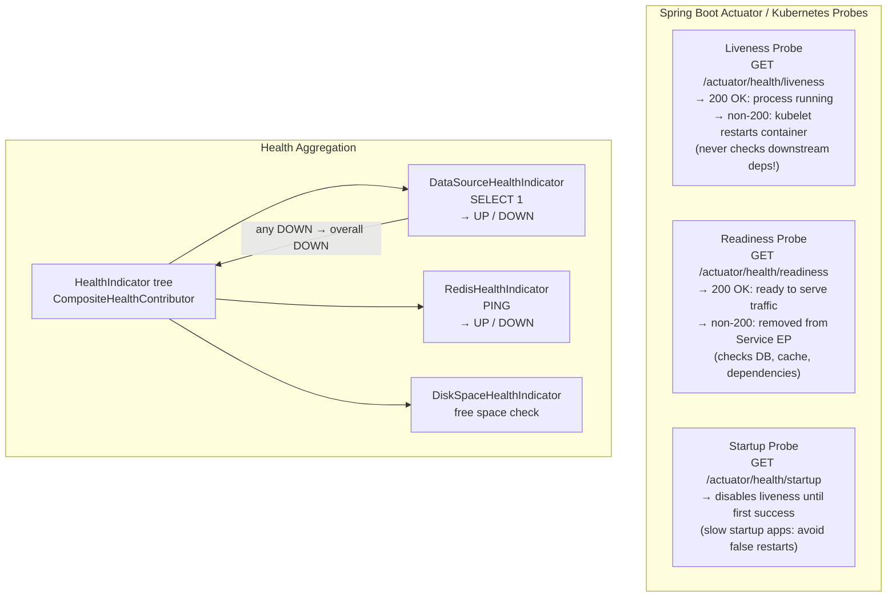

---

## 12. 서비스 메시 mTLS - 인증서 수명 주기

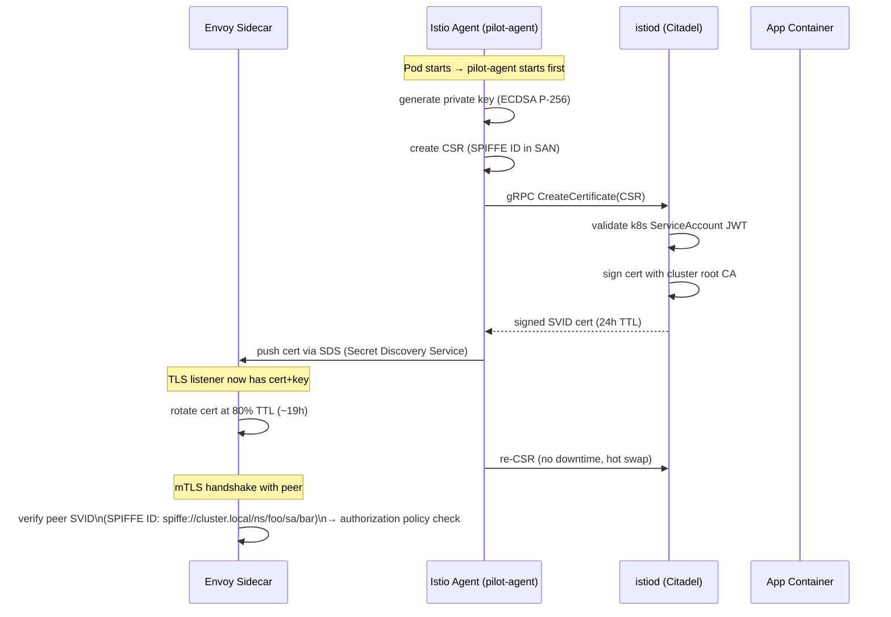

---

## 13. 성능 및 오버헤드 요약

```mermaid
block-beta
  columns 2
  block:sidecar["Sidecar Proxy Overhead"]:1
    s1["CPU: ~0.5–2% per request (Envoy)"]
    s2["Memory: ~50–100MB per sidecar"]
    s3["Latency: +0.3–1ms p50 (local loopback)"]
    s4["p99 latency: +2–5ms (mTLS handshake amortized)"]
  end
  block:discovery["Service Discovery Latency"]:1
    d1["Consul health check: 10s interval default"]
    d2["DNS TTL: 5–30s (stale pods visible)"]
    d3["k8s Endpoints update: ~1–5s after pod ready"]
    d4["xDS push to Envoy: ~1–3s after EP change"]
  end
  block:grpc["gRPC vs REST"]:1
    g1["Protobuf encoding: 3–10x smaller than JSON"]
    g2["HTTP/2 multiplexing: 1 TCP conn, N streams"]
    g3["gRPC streaming: server push (no polling)"]
    g4["gRPC latency: ~10–50% lower than REST/JSON"]
  end
  block:saga["Saga Overhead"]:1
    sa1["Outbox polling: 100ms–1s delay (CDC faster)"]
    sa2["Compensating tx: idempotency check O(1) with index"]
    sa3["Event store replay: O(events) — snapshot every 100 events"]
    sa4["2PC lock hold: entire prepare+commit round trip"]
  end
```

---

## 주요 내용

- **Envoy 차단**은 iptables `REDIRECT`(`TPROXY` 아님)을 사용합니다. 모든 트래픽 경로는 로컬 호스트 포트 15001/15006을 통해 이루어집니다. `SO_ORIGINAL_DST`는 실제 대상을 복구합니다.
- **xDS 푸시 프로토콜**은 delta-xDS 스트림을 사용하므로 변경된 리소스만 전송됩니다. Envoy는 각 버전에 대해 ACK를 보냅니다. NACK 롤백
- **Protobuf varint 인코딩**은 대부분의 필드에 대해 필드 번호 + 연결 유형을 단일 바이트로 압축합니다. 일반적인 메시지는 동등한 JSON보다 3~10배 작습니다.
- **회로 차단기 반 개방**은 정확히 하나의 프로브 요청을 허용합니다. 다른 모든 요청은 프로브가 성공할 때까지 여전히 빠른 실패 상태를 유지합니다.
- **Saga 보상 트랜잭션**은 멱등성이 있어야 합니다. 오케스트레이터는 재시도 시 명령을 다시 보낼 수 있습니다(Kafka에서 한 번 이상 전달).
- **Outbox 패턴**은 동일한 로컬 트랜잭션에서 DB 쓰기 + 이벤트 게시 원자성을 만들어 정확히 한 번만 전달되도록 보장합니다. Debezium CDC는 거의 0에 가까운 오버헤드로 WAL을 읽습니다.
- **CQRS 프로젝션**은 이벤트 저장소 재생에서 다시 작성됩니다. N 이벤트마다 스냅샷을 생성하면 재생 시간이 O(모든 이벤트)에서 O(스냅샷 이후 이벤트)로 단축됩니다.
